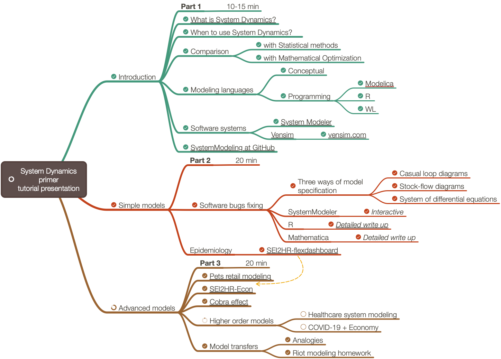

# System dynamics: a primer
**[Data Science Study Group: South Florida Meetup](https://www.meetup.com/Data-Science-Study-Group-South-Florida/events/270274812/)**   
2020-06-17   
**Tutorial presentation**

## In brief

In this tutorial presentation we are going to:

1. Discuss the modeling and evolution of different dynamic systems, like:
   - Pets retail
   - Coronavirus propagation and related disease
   - Economy recession cycles

2. Overview classic compartmental models in epidemiology

3. Discuss the theory behind the System Dynamics approach using simple examples

4. Discus philosophical, scientific, and mathematical justifications

5. Describe [System Dynamics'](https://en.wikipedia.org/wiki/System_dynamics) 
approaches of modeling in general

The presentation can be seen as an introduction to System Dynamics: we are going to progress from simple models to more complicated ones.

Our focus is on the modeling strategy and techniques and how they can be implemented using different programming languages and software systems. 

Most of the examples used to illustrate the theoretical concepts and practical aspects will have graphics visualizations. 
The more important examples will have interactive interfaces.

Here is a mind-map that shows presentation's structure:

## References

### Software

\[VSI1\] Ventana Systems, Inc., [Vensim](http://vensim.com).

\[WRI1\] Wolfram Research, Inc., [Wolfam System Modeler](https://www.wolfram.com/system-modeler/).

### Articles, books

\[Wk1\] Wikipedia entry, [System Dynamics](https://en.wikipedia.org/wiki/System_dynamics).

\[Wk2\] Wikipedia entry, [Modelica](https://en.wikipedia.org/wiki/Modelica).

\[JF1\] Jay Forrester,
[Counterintuitive behavior of social systems](https://ocw.mit.edu/courses/sloan-school-of-management/15-988-system-dynamics-self-study-fall-1998-spring-1999/readings/behavior.pdf), 
(1971), Technology Review 73(3): 52–68

\[BC1\] Lucia Breierova, Mark Choudhari,
[An Introduction to Sensitivity Analysis](https://ocw.mit.edu/courses/sloan-school-of-management/15-988-system-dynamics-self-study-fall-1998-spring-1999/readings/sensitivityanalysis.pdf), 
(1996), Massachusetts Institute of Technology.

\[JD1\] Jim Duggan, 
[System Dynamics Modeling with R](https://www.springer.com/gp/book/9783319340418), 
2016, Springer.

### Repositories

\[JD2\] Jim Duggan, 
["SDMR"](https://github.com/JimDuggan/SDMR), 
2016, 
[GitHub](https://github.com/JimDuggan).   
(Resources for text book "System Dynamics Modeling with R".)
 
\[AAr1\] Anton Antonov, 
[Pets retail dynamics](../../Projects/Pets-retail-dynamics), 
2020,
[SystemModeling at GitHub](https://github.com/antononcube/SystemModeling).
 
\[AAr2\] Anton Antonov, 
[Coronavirus propagation dynamics](../../Projects/Coronavirus-propagation-dynamics), 
2020,
[SystemModeling at GitHub](https://github.com/antononcube/SystemModeling).
 
