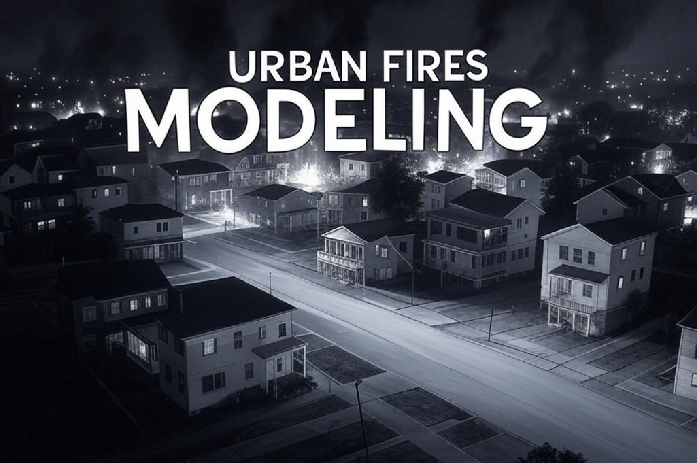
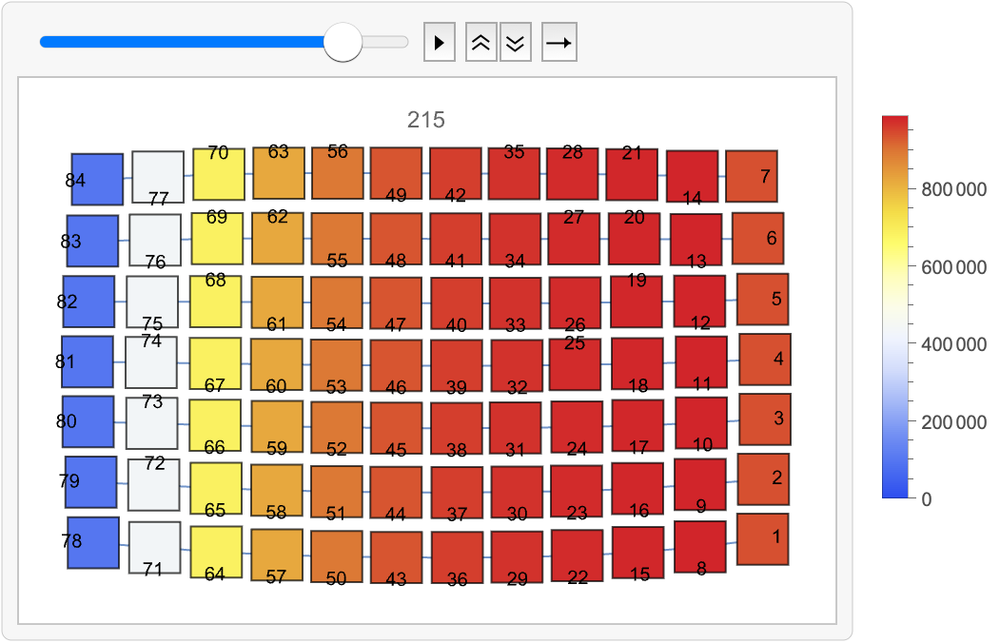
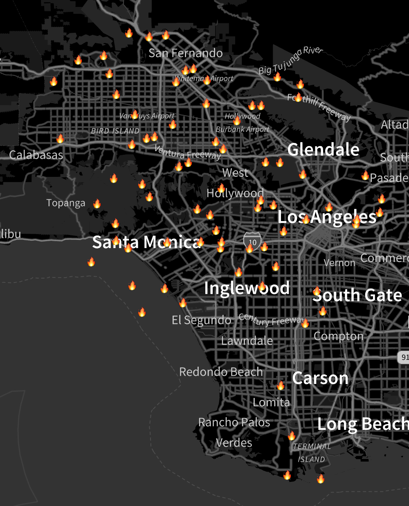
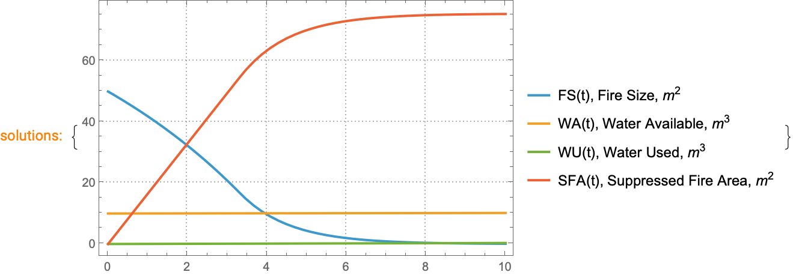
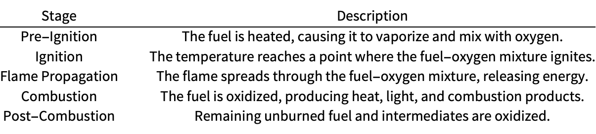
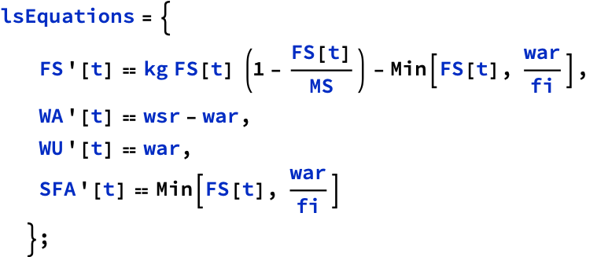
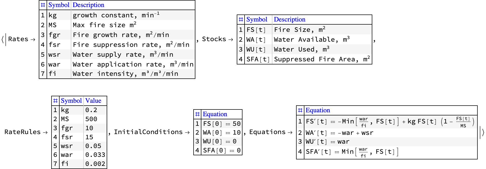
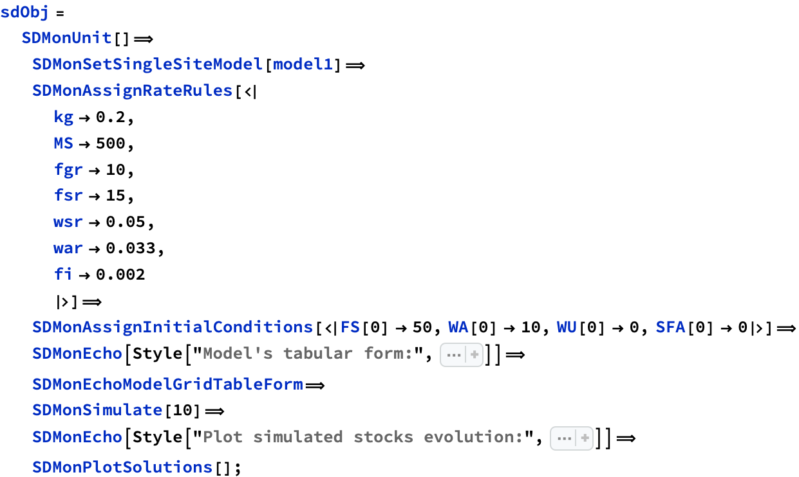
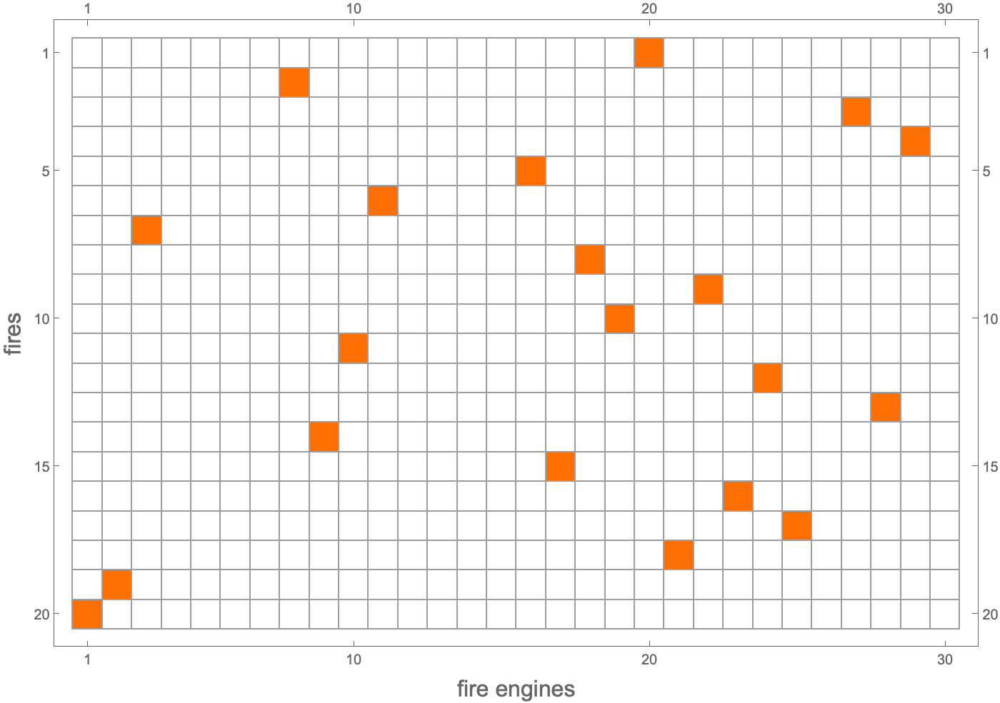

---

# Modeling of Urban Fires

Data Science Study Group, South Florida
*March 2025*

**Anton Antonov**



---

## Abstract

In this presentation we discuss the modeling and simulation of urban fires.

First, we briefly examine the problem domain:  
• What are the "ingredients" of a large urban fire?
• What are the components of an urban firefighting system?

Second, we outline a few methodologies for modeling of urban fires.

Then we present two System Dynamics models: one for the actual, physical propagation of fires,
the other for macro-scale long term firefighting. 

Finally, we examine in more detail simulations with those models and discuss their calibration.
(Using “real life” data.)

The application of Large Language Models (LLMs) to the modeling process is also discussed.

Managing expectations: Work in progress! 

---

## Quick demos

### Urban fire propagation



### Firefighting system



#### Plot simulated stocks evolution:



---

## Who am I?

- MSc Mathematics (General Algebra)

- MSc Computer Science (Databases)

- PhD Applied Mathematics (Large-Scale Air Pollution Models)

- Former Kernel Developer of Mathematica

    - aka Wolfram Language

- Over 30 years of numerical and applied mathematics in industrial settings

... And why am I telling you this...

---

## Big picture: Decision making


---

## Modeling paradigms

- [System Dynamics](https://en.wikipedia.org/wiki/System_dynamics)

- [Agent Based Modeling](https://en.wikipedia.org/wiki/Agent-based_model)

- Cellular Automata

---

## System Dynamics primer

A [SystemModeler](https://www.wolfram.com/system-modeler/graphical-system-modeling/) demo.

---

## Fire theory

### Modes of energy transfer


Give a list of the basic modes of energy transfer work during fire.

> The basic modes of energy transfer during a fire include:
>
> 1. Conduction: This is the transfer of heat through a material without the movement of the material itself. In a fire, heat can be conducted through solid materials such as metal beams or walls.
> 
> 2. Convection: This involves the transfer of heat by the movement of fluids (liquids or gases). In a fire, hot air and gases rise, creating currents that transfer heat to other areas.
>
> 3. Radiation: This is the transfer of energy through electromagnetic waves. In a fire, heat can be radiated from the flames to nearby objects, even through a vacuum.
>
> These modes of energy transfer work together to spread heat and sustain the combustion process in a fire. If you need more detailed information or specific examples, feel free to ask!

### The stages of combustion


List the stages of combustion in table.

> Combustion is a complex chemical process that can be broken down into several stages. Here's a table that summarizes the typical stages of combustion: 
> 
> Each stage involves specific chemical and physical changes, and the efficiency of combustion depends on factors like temperature, pressure, and the fuel-to-air ratio. If you have any specific questions about these stages or need further details, feel free to ask!

---

## Analogy with [compartmental models in Epidemiology](https://en.wikipedia.org/wiki/Compartmental_models_in_epidemiology)


---

## Fire propagation simulation

### Visual aids

#### Exposure and susceptibility


#### Houses as fuel field


### Notebooks

- 

- 

---

## Single fire engine fire fighting model

```mathematica
aStocks = <|
    FS[t] -> "Fire Size, \!\(\*SuperscriptBox[\(m\), \(2\)]\)", 
    WA[t] -> "Water Available, \!\(\*SuperscriptBox[\(m\), \(3\)]\)", 
    WU[t] -> "Water Used, \!\(\*SuperscriptBox[\(m\), \(3\)]\)", 
    SFA[t] -> "Suppressed Fire Area, \!\(\*SuperscriptBox[\(m\), \(2\)]\)" 
   |>;
```

```mathematica
aRates = <|
    kg -> "growth constant, \!\(\*SuperscriptBox[\(min\), \(-1\)]\)", 
    MS -> "Max fire size \!\(\*SuperscriptBox[\(m\), \(2\)]\)", 
    fgr -> "Fire growth rate, \!\(\*SuperscriptBox[\(m\), \(2\)]\)/min", 
    fsr -> "Fire suppression rate, \!\(\*SuperscriptBox[\(m\), \(2\)]\)/min",
    wsr -> "Water supply rate, \!\(\*SuperscriptBox[\(m\), \(3\)]\)/min", 
    war -> "Water application rate, \!\(\*SuperscriptBox[\(m\), \(3\)]\)/min",
    fi -> "Water intensity, m³/m²/min" 
   |>;
```

```mathematica
aRateRules = <|
    kg -> 0.2, 
    MS -> 500, 
    fgr -> 10, 
    fsr -> 15, 
    wsr -> 0.05, 
    war -> 0.033, 
    fi -> 0.002 
   |>;
```

```mathematica
lsInitConds = {FS[0] == 50, WA[0] == 10, WU[0] == 0, SFA[0] == 0};
```



```mathematica
model1 = <|
    "Rates" -> aRates, 
    "Stocks" -> aStocks, 
    "RateRules" -> aRateRules, 
    "InitialConditions" -> lsInitConds, 
    "Equations" -> lsEquations 
   |>;
```

Display the model in tabular format:

```mathematica
ModelGridTableForm[model1]
```






---

## [Ergodicity principle](https://en.wikipedia.org/wiki/Ergodic_hypothesis)

Replacing space averages with time averages. (And vice versa.)

A good way to cheat...

---

## Multiple fire engines 

- What are the goals?

    - Say, strain on the water supply system

- Optimized or inline simulation?

- Using Geo-proximity 

- Matching fire engines to fires

    - I.e. jobs to workers




---

## Future plans

- More extensive LLM support

- Complete urban fire simulation packages

- Calibration with real data

- Implementation of “classical” models

- Proper propagation model

---

## References

### Articles, books, courses

[PA1] Patricia L. Andrews, ["The Rothermel Surface Fire Spread Model and Associated Developments: A Comprehensive Explanation"](https://www.fs.usda.gov/rm/pubs_series/rmrs/gtr/rmrs_gtr371.pdf) , (2018), [Forest Service, United States Department of Agriculture](https://www.fs.usda.gov) .

[RR1] Richard C. Rothermel, [A mathematical model for predicting fire spread in wildland fuels](https://research.fs.usda.gov/treesearch/32533) , (1972), Res. Pap. INT-115. Ogden, UT: U.S. Department of Agriculture, Forest Service, Intermountain Forest and Range Experiment Station. 40 p.

[DF1] Don Falk, [RNR 355 Introduction to Wildland Fire](https://cales.arizona.edu/classes/rnr355/schedule.htm), School of Natural Resources Class Schedule, Fall 2011.

### Packages, paclets, repositories

[AAp1] Anton Antonov, [Epidemiological modeling](https://resources.wolframcloud.com/PacletRepository/resources/AntonAntonov/EpidemiologicalModeling) , (2023), [Wolfram Language Paclet Repository](https://resources.wolframcloud.com/PacletRepository/) .

[AAp2] Anton Antonov, [Monadic System Dynamics](https://resources.wolframcloud.com/PacletRepository/resources/AntonAntonov/MonadicSystemDynamics/) , (2023), [Wolfram Language Paclet Repository](https://resources.wolframcloud.com/PacletRepository/) .

[AAr1] Anton Antonov, [Epidemiologic Compartmental Modeling Monad R package](https://github.com/antononcube/ECMMon-R) , (2020-2021), [GitHub/antononcube](https://github.com/antononcube) .

[AAr2] Anton Antonov, [SystemModeling](https://github.com/antononcube/SystemModeling) , (2020-2025), [GitHub/antononcube](https://github.com/antononcube) .

### Videos

[AAv1] Anton Antonov, ["Simple Economic Extension of Compartmental Epidemiological Models"](https://www.youtube.com/watch?v=C-sjXQiPE7s) , (2020), [YouTube/@WolframResearch](https://www.youtube.com/@WolframResearch) .

[AAv2] Anton Antonov, ["Coronavirus propagation modeling, useR! Boston April 2020"](https://www.youtube.com/watch?v=X8MgHG0SWtE) , (2020), [YouTube/@AAA4prediction](https://www.youtube.com/@AAA4prediction) .

[AAv3] Anton Antonov, ["Upgrading Epidemiological Models into War Models"](https://www.youtube.com/watch?v=852vMS_6Qaw) , (2024), [YouTube/@WolframResearch](https://www.youtube.com/@WolframResearch) .