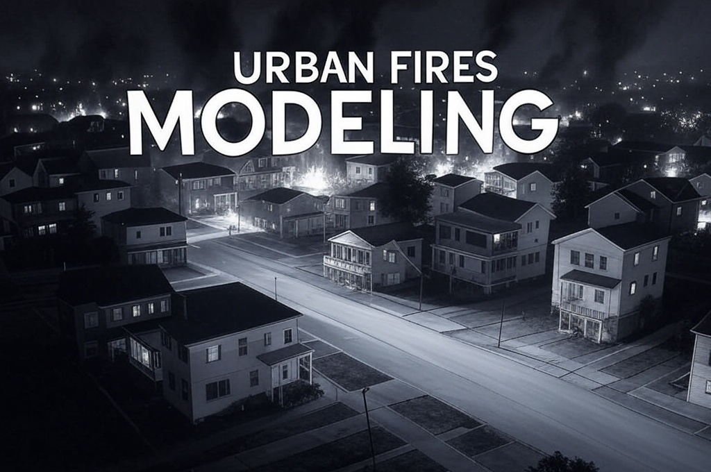
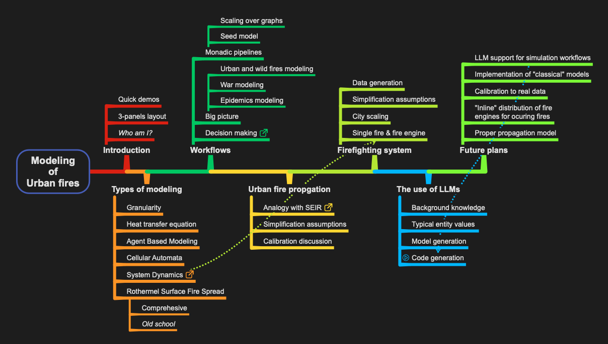

# Modeling of Urban Fires

----

## _ABSTRACT_

In this presentation we discuss the modeling and simulation of urban fires.

First, we briefly examine the problem domain: 
- What are the "ingredients" of a large urban fire?
- What are the components of an urban firefighting system?

Second, we outline a few methodologies for modeling of urban fires.

Then we present two System Dynamics models: one for the actual, physical propagation of fires,
the other for macro-scale long term firefighting. 

Finally, we examine in more detail simulations with those models and discuss their calibration.
(Using "real life" data.)

The application of Large Language Models (LLMs) to the modeling process is also discussed. 

⚠️ Here is the **Markdown version of the presentation notebook** : [Modeling-of-Urban-Fires.md](./Modeling-of-Urban-Fires.md)

-----

## Outline

-----

## Modeling

- [Modeling Urban Fires and Firefighting Resources](./Modeling-Urban-Fires-and-Firefighting-Resources.md)
- [System dynamics modeling](./System-dynamics-modeling.md)

-----

## References

### Articles, books, sites

[PA1] Patricia L. Andrews,
["The Rothermel Surface Fire Spread Model and Associated Developments: A Comprehensive Explanation"](https://www.fs.usda.gov/rm/pubs_series/rmrs/gtr/rmrs_gtr371.pdf),
(2018),
[Forest Service, United States Department of Agriculture](https://www.fs.usda.gov).

[RR1] Richard C. Rothermel,
[A mathematical model for predicting fire spread in wildland fuels](https://research.fs.usda.gov/treesearch/32533),
(1972),
Res. Pap. INT-115. Ogden, UT: U.S. Department of Agriculture,
Forest Service, Intermountain Forest and Range Experiment Station. 40 p.

### Packages, paclets, repositories

[AAp1] Anton Antonov,
[Epidemiological modeling](https://resources.wolframcloud.com/PacletRepository/resources/AntonAntonov/EpidemiologicalModeling),
(2023),
[Wolfram Language Paclet Repository](https://resources.wolframcloud.com/PacletRepository/).

[AAp2] Anton Antonov,
[Monadic System Dynamics](https://resources.wolframcloud.com/PacletRepository/resources/AntonAntonov/MonadicSystemDynamics/),
(2023),
[Wolfram Language Paclet Repository](https://resources.wolframcloud.com/PacletRepository/).

[AAr2] Anton Antonov,
[Epidemiologic Compartmental Modeling Monad R package](https://github.com/antononcube/ECMMon-R),
(2020-2021),
[GitHub/antononcube](https://github.com/antononcube).

[AAr1] Anton Antonov,
[SystemModeling](https://github.com/antononcube/SystemModeling),
(2020-2025),
[GitHub/antononcube](https://github.com/antononcube).

### Videos

[AAv1] Anton Antonov,
["Simple Economic Extension of Compartmental Epidemiological Models"](https://www.youtube.com/watch?v=C-sjXQiPE7s),
(2020),
[YouTube/@WolframResearch](https://www.youtube.com/@WolframResearch).

[AAv2] Anton Antonov,
["Coronavirus propagation modeling, useR! Boston April 2020"](https://www.youtube.com/watch?v=X8MgHG0SWtE),
(2020),
[YouTube/@AAA4prediction](https://www.youtube.com/@AAA4prediction).

[AAv3] Anton Antonov,
["Upgrading Epidemiological Models into War Models"](https://www.youtube.com/watch?v=852vMS_6Qaw),
(2024),
[YouTube/@WolframResearch](https://www.youtube.com/@WolframResearch).

