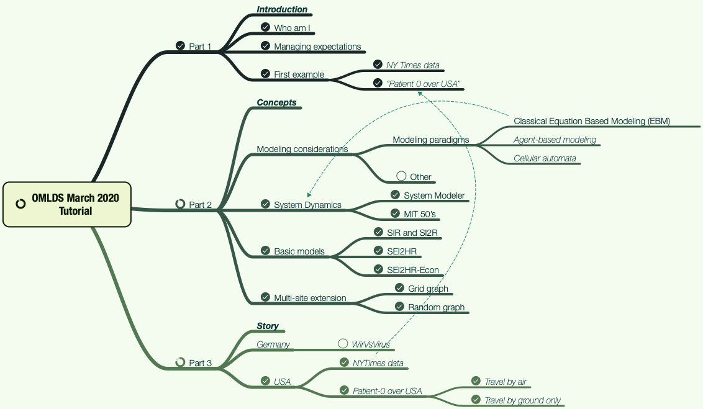

# Coronavirus propagation modeling tutorial presentation, OMLDS March 2020

The presentation abstract heavily borrowed descriptions and plans from a similar presentation
to be given for the 
[useR! Boston Meetup in April](../UseR!-Meetup-Boston-2020).

This presentation was almost entirely based on frameworks, simulations, and graphics made with
[Mathematica](https://www.wolfram.com/mathematica).
For some parts 
[Wolfram System Modeler](https://www.wolfram.com/system-modeler/) 
was used. 

Here is the (main) presentation mind-map:

(Note that mind-map's PDF has hyperlinks.)

The presentation was given online (because of COVID-19) using Zoom. 
The [maximum number of people registered, 100](https://www.meetup.com/Orlando-MLDS/events/269445903/).
(Many were "first timers.") Nearly 60 showed up (and stayed throughout.) 

Here is a link to the video recording: https://youtu.be/odcoi9stYuY .

## References

### General

\[CDC1\] https://www.cdc.gov/coronavirus/2019-ncov .

\[WRI1\] Wolfram Research, Inc.
["Resources For Novel Coronavirus COVID-19"](https://community.wolfram.com/groups/-/m/t/1872608), 
(2020)
[Community.wolfram.com](https://community.wolfram.com/). 

### Articles, blog posts

\[AA1\] Anton Antonov, 
["Coronavirus propagation modeling considerations"](https://github.com/antononcube/SystemModeling/blob/master/Projects/Coronavirus-propagation-dynamics/Documents/Coronavirus-propagation-modeling-considerations.md), 
(2020), 
[SystemModeling at GitHub](https://github.com/antononcube/SystemModeling).

\[AA2\] Anton Antonov, 
["Basic experiments workflow for simple epidemiological models"](https://github.com/antononcube/SystemModeling/blob/master/Projects/Coronavirus-propagation-dynamics/Documents/Basic-experiments-workflow-for-simple-epidemiological-models.md), 
(2020), 
[SystemModeling at GitHub](https://github.com/antononcube/SystemModeling).

\[AA3\] Anton Antonov, 
["Scaling of Epidemiology Models with Multi-site Compartments"](https://github.com/antononcube/SystemModeling/blob/master/Projects/Coronavirus-propagation-dynamics/Documents/Scaling-of-epidemiology-models-with-multi-site-compartments.md),
(2020), 
[SystemModeling at GitHub](https://github.com/antononcube/SystemModeling).

### Videos

[AAv1] Anton Antonov, 
[COVID19 Epidemic Modeling: Compartmental Models](https://www.youtube.com/watch?v=LRs9rYCXIzs),
(2020),
[Wolfram YouTube channel](https://www.youtube.com/channel/UCJekgf6k62CQHdENWf2NgAQ)
. 

[AAv2] Anton Antonov, 
[Scaling of Epidemiology Models with Multi-site Compartments](https://www.youtube.com/watch?v=b8oCNjRI0gY),
(2020),
[Wolfram YouTube channel](https://www.youtube.com/channel/UCJekgf6k62CQHdENWf2NgAQ)
. 

[AAv3] Anton Antonov, 
[Simple Economic Extension of Compartmental Epidemiological Models](https://www.youtube.com/watch?v=C-sjXQiPE7s),
(2020),
[Wolfram YouTube channel](https://www.youtube.com/channel/UCJekgf6k62CQHdENWf2NgAQ)
. 

[DZv1] Diego Zviovich, 
[Geo-spatial-temporal COVID-19 Simulations and Visualizations Over USA](https://www.youtube.com/watch?v=Kjk-sYlg-U0),
(2020),
[Wolfram YouTube channel](https://www.youtube.com/channel/UCJekgf6k62CQHdENWf2NgAQ)
. 