# Моделирование COVID-19 над Ботсваной

**COVID-19 simulations over Botswana**

Антон Антонов
[MathematicaForPrediction at WordPress](https://mathematicaforprediction.wordpress.com)
[SystemModeling at GitHub](https://github.com/antononcube/SystemModeling)
April 2020
June 2023

## Введение

В этом блокноте мы используем данные Ботсваны для моделирования распространения COVID-19. 
Представленная модель является минимально жизнеспособным вычислительным приложением для моделирования и аналитики.
Цель этого приложения - облегчить многократное выполнение с различными сценариями развития событий.
Целевым конечным пользователем является президентская целевая группа COVID-19 в Ботсване.


## Многоуровневый подход


## Основные моменты пространственной модели

### Слой популяций

1. Модель одного сайта 

    1. Модель с несколькими сайтами	

1.  Подготовка данных

1. Ввод и подготовка данных

1. Визуализация данных:

    1. Гистограммы

    1. Хекстильная гистограмма

    1. Хекстильбины

    1.  Социальные сети

    1. График WhattsStrogratz

        1.  График сообщества

    1.  График соседей

### Уровень мобильности

1. Дорожная мобильность

1. Воздушная мобильность

1. Железнодорожная мобильность

1. Пантонная мобильность 


## Данные по Ботсване

Данные о городах Ботсваны и их населении были получены с помощью функции CitiData системы Mathematica.

```mathematica
dsBotswanaCityRecords = ResourceFunction["ImportCSVToDataset"]["https://raw.githubusercontent.com/antononcube/SystemModeling/master/Data/dfBotswanaCityRecords.csv"]
```

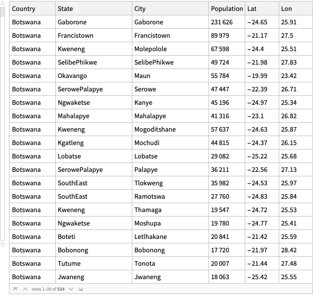

#### Сводка данных

```mathematica
ResourceFunction["RecordsSummary"][dsBotswanaCityRecords]
```

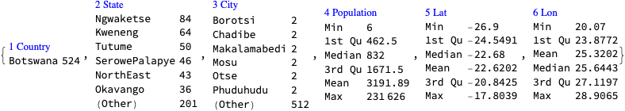

## Подготовка данных

### Население

Подготовьте данные о городе в виде пар "координаты-значения" (ассоциации):

```mathematica
aPopulations = Association@Map[{#Lon, #Lat} -> #Population &, Normal[dsBotswanaCityRecords]];
```

```mathematica
aPopulations[[1 ;; 3]]

(*<|{25.91, -24.65} -> 231626, {27.5, -21.17} -> 89979, {25.51, -24.4} -> 67598|>*)
```

Установите число зараженных 22 в месте Габороне:

```mathematica
aInfected = AssociationThread[Keys[aPopulations], 0];
aInfected = Join[aInfected, <|{25.91`, -24.65`} -> 16, {27.5`, -21.17`} -> 1, {25.51, -24.4} -> 5|>];
```

Один погибший (в Габороне):

```mathematica
aDead = AssociationThread[Keys[aPopulations], 0];
aDead = Join[aDead, <|{25.91`, -24.65`} -> 1|>];
```

### Количество больничных мест

Общая численность населения из данных по городу, полученных выше:

```mathematica
Total[aPopulations]

(*1646528*)
```

Общая численность населения из базы данных CountryData:

```mathematica
CountryData["Botswana", "Population"]
```

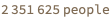

```mathematica
(*aHospitalBeds=Association@Map[{#Longitude,#Latitude}->#["Hospital Beds"]&,Normal@aBWADatasets["Stocks"][Select[NumberQ[#["Hospital Beds"]]&]]]*)
```

```mathematica
aHospitalBeds = <|{28.428`, -21.9814`} -> 38.`, {27.5`, -21.17`} -> 589.`, {25.91`, -24.65`} -> 681.`, {21.6482`, -21.6961`} -> 96.`, {25.4319`, -25.4742`} -> 58.`, {22.1549`, -19.3562`} -> 34.`, {25.2541`, -20.2112`} -> 50.`, {25.55`, -25.42`} -> 55.`, {25.5629`, -25.347`} -> 167.`, {25.15`, -17.81`} -> 33.`, {25.5859`, -21.4096`} -> 24.`, {25.68`, -25.22`} -> 472.`, {26.48`, -22.95`} -> 320.`, {27.4167`, -20.6667`} -> 55.`, {23.4181`, -19.9953`} -> 340.`, {25.8108`, -24.5551`} -> 146.`, {27.7514`, -21.8811`} -> 55.`, {26.2305`, -24.197`} -> 181.`, {25.51`, -24.4`} -> 346.`, {25.4023`, -21.312`} -> 106.`, {27.1147`, -22.5515`} -> 75.`, {25.864`, -24.8706`} -> 163.`, {24.3995`, -21.03`} -> 42.`, {27.529`, -23.0308`} -> 56.`, {27.83`, -21.98`} -> 172.`, {26.71`, -22.39`} -> 370.`, {25.5326`, -24.6664`} -> 61.`, {22.4113`, -26.0208`} -> 57.`, {27.4`, -21.33`} -> 44.`, {21.7495`, -23.9931`} -> 70.`, {25.331`, -24.2438`} -> 42.`|>;
```


## Картографирование страны Ботсвана

```mathematica
GeoHistogram[KeyMap[Reverse, aPopulations], Quantity[112, "Kilometers"]]
```

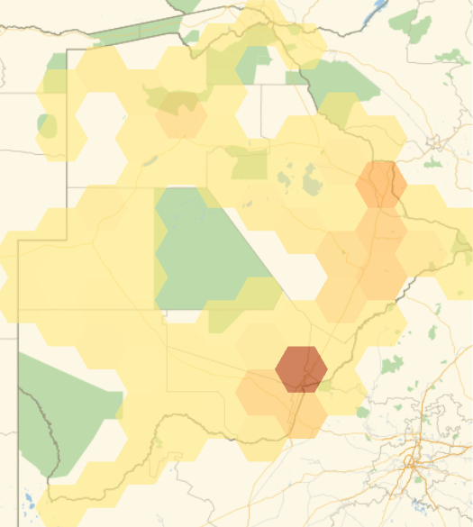

```mathematica
Show[{HextileHistogram[aPopulations, 1, PlotRange -> All], Graphics[MapIndexed[Text[#2[[1]], #1] &, Sort@Keys@HextileBins[Keys[aPopulations], 1, "PolygonKeys" -> False]]]}]
```

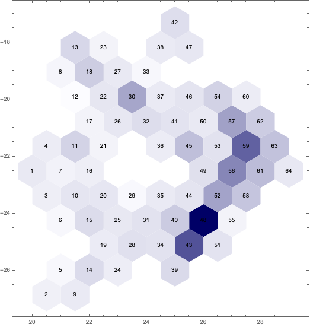

## Применение эпидемиологических моделей к слоям населения и мобильности

### SIR Модель

```mathematica
ModelGridTableForm[SIRModel[t]]
```

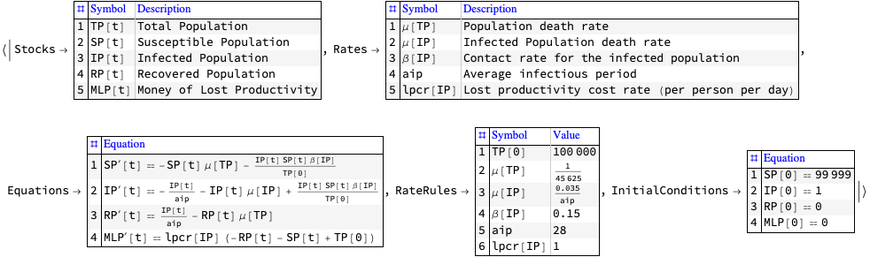

### SEI2HR (Наша адаптация модели SEIR)

```mathematica
SEI2HRModel[t]
```

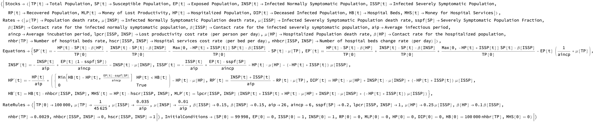

```mathematica
ModelGridTableForm[SEI2HRModel[t]]
```

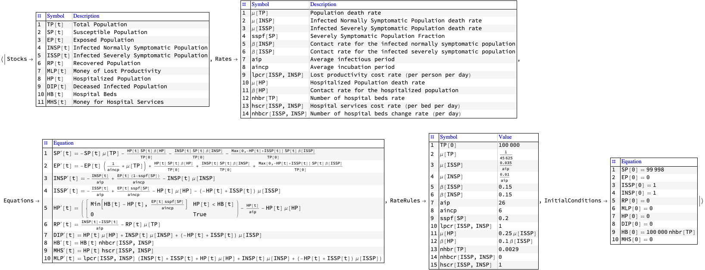

## Модель одного объекта

```mathematica
modelSEI2HREcon = SEI2HREconModel[t, "InitialConditions" -> True, "RateRules" -> True,"TotalPopulationRepresentation" -> "AlgebraicEquation"];
```

```mathematica
modelSEI2HREcon // ModelGridTableForm
```

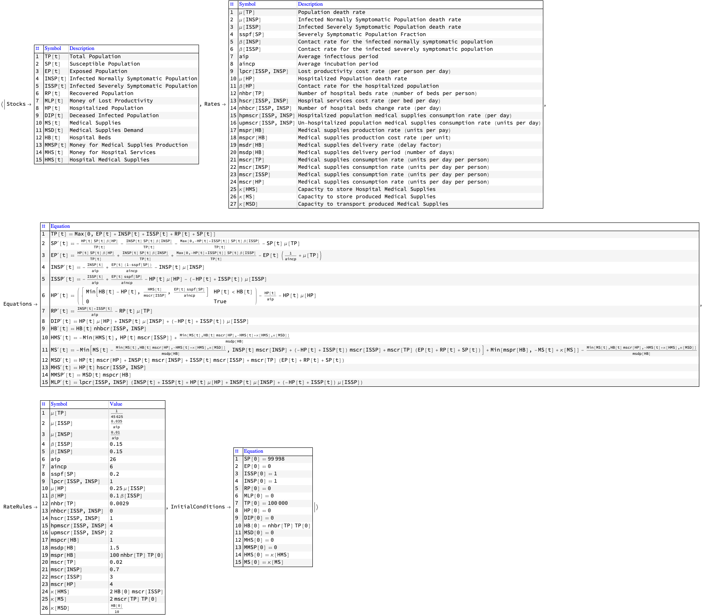

## Данные по настройке (один сайт)

### Установка всей Ботсваны (все объекты объединены вместе)

```mathematica
Total[aPopulations]

(*1646528*)
```

```mathematica
population = QuantityMagnitude[CountryData["Botswana", "Population"]]

(*2351625*)
```

```mathematica
numberOfHospitalBeds = Total[aHospitalBeds]

(*4998.*)
```

```mathematica
numberOfInfected = Total[aInfected]

(*22*)
```

```mathematica
numberOfDead = Total[aDead]

(*1*)
```

### Установка только для Габороне

Мы знаем, что Габороне - самый большой город:

```mathematica
TakeLargest[aPopulations, 1]

(*<|{25.91, -24.65} -> 231626|>*)
```

```mathematica
population = First@TakeLargest[aPopulations, 1]

(*231626*)
```

```mathematica
numberOfHospitalBeds = aHospitalBeds[First@Keys[TakeLargest[aPopulations, 1]]]

(*681.*)
```

```mathematica
numberOfInfected = aInfected[First@Keys[TakeLargest[aPopulations, 1]]]

(*16*)
```

```mathematica
numberOfDead = aDead[First@Keys[TakeLargest[aPopulations, 1]]]

(*1*)
```

### Установка для Большого Габороне (сайт)

Взяв за основу многосайтовую модель, в которой есть Габороне:

```mathematica
aCityData = Association@Map[{#Lon, #Lat} -> {#City, #Population} &, Normal[dsBotswanaCityRecords]];
```

```mathematica
aPolygonToData2 = HextileBins[aCityData, 1, "AggregationFunction" -> (Prepend[##, {"Total", Total[(##)[[All, 2]]]}] &)];
Length[aPolygonToData2]

(*64*)
```

```mathematica
pos = First[Position[Values[aPolygonToData2], "Gaborone", \[Infinity]]]

(*{1, 2, 1}*)
```

```mathematica
aPolygonToData2[[Sequence @@ Rest[pos]]]

(*{"Total", 195468}*)
```

```mathematica
Values[aPolygonToData2][[First@pos]]

(*{{"Total", 516904}, {"Gaborone", 231626}, {"Molepolole", 67598}, {"Mogoditshane", 57637}, {"Mochudi", 44815}, {"Tlokweng", 35982}, {"Gabane", 14842}, {"Kopong", 9320}, {"Metsimotlhaba", 5544}, {"Lentsweletau", 4992}, {"MmopaneLands", 793}, {"Bokaa", 5765}, {"MogoditshaneBotswanaDefenceForce", 3787}, {"Oodi", 3728}, {"Morwa", 2696}, {"Rasesa", 2461}, {"Modipane", 2626}, {"Malolwane", 2567}, {"Gaphatshwa", 1678}, {"Artisia", 1871}, {"Nkoyaphiri", 1578}, {"Matebeleng", 1279}, {"Pilane", 1277}, {"MogoditshaneLands", 1165}, {"Botlhapatlou", 1013}, {"Gamodubu", 954}, {"Dumadumane", 865}, {"Mmanoko", 845}, {"Tawana", 781}, {"Galekgatshwane", 719}, {"Mononyane", 718}, {"Mahetlwe", 655}, {"Mmokolodi", 647}, {"Seherelela", 560}, {"Kgaphamadi", 544}, {"Kweneng", 460}, {"Mmamashia", 412}, {"MalotwanaSiding", 384}, {"Medie", 364}, {"Kamenakwe", 341}, {"Dikgonye", 234}, {"Gakgatla", 234}, {"Mogonono", 223}, {"Dikwididi", 225}, {"Ditshukudu", 99}}*)
```

```mathematica
population = %[[1, 2]]

(*516904*)
```

```mathematica
KeySelect[aHospitalBeds, RegionMember[Keys[aPolygonToData2][[First@pos]], #] &]

(*<|{25.91, -24.65} -> 681., {25.8108, -24.5551} -> 146., {26.2305, -24.197} -> 181., {25.51, -24.4} -> 346.|>*)
```

```mathematica
numberOfHospitalBeds = Total[%]

(*1354.*)
```

```mathematica
numberOfInfected = aInfected[First@Keys[TakeLargest[aPopulations, 1]]]

(*16*)
```

```mathematica
numberOfDead = aDead[First@Keys[TakeLargest[aPopulations, 1]]]

(*1*)
```


## Установите начальные условия и значения скорости (один сайт)

```mathematica
modelSEI2HREcon = SetInitialConditions[modelSEI2HREcon, <|TP[0] -> population, HB[0] -> numberOfHospitalBeds, INSP[0] -> numberOfInfected, DIP[0] -> 1, SP[0] -> population - (numberOfDead + numberOfInfected)|>];
```

Назначение общих значений тарифов:

```mathematica
modelSEI2HREcon = 
   SetRateRules[modelSEI2HREcon, 
    <|mspr[HB] -> 10^6, msdp[HB] -> 0.1, mscr[TP] -> 1, mscr[ISSP] -> 1, mscr[INSP] -> 1, mscr[HP] -> 1, \[Kappa][HMS] -> 10^6, \[Kappa][MS] -> 10^6, \[Kappa][MSD] -> 10^6, 
     \[Beta][ISSP] -> 0.5*Piecewise[{{1, t < qsd}, {qcrf, qsd <= t <= qsd + ql}}, 1], 
     \[Beta][INSP] -> 0.5*Piecewise[{{1, t < qsd}, {qcrf, qsd <= t <= qsd + ql}}, 1], 
     qsd -> 60, 
     ql -> 8*7, 
     qcrf -> 0.25, 
     \[Mu][TP] -> 0.006406/365, 
     \[Mu][ISSP] -> 0.0005/aip, 
     \[Mu][INSP] -> 0.0005/aip, 
     \[Mu][HP] -> 0.1*\[Mu][ISSP] 
    |>];
```


## Интерфейс (один сайт)

```mathematica
opts = {PlotRange -> All, PlotLegends -> None, PlotTheme -> "Detailed", PerformanceGoal -> "Speed", ImageSize -> 400};
lsPopulationKeys = {TP, SP, EP, ISSP, INSP, HP, RP, DIP, HB};
lsSuppliesKeys = {MS, MSD, HMS};
lsMoneyKeys = {MHS, MLP, MMSP};
Manipulate[
  DynamicModule[{modelLocal = modelSEI2HREcon, aStocks = modelSEI2HREcon["Stocks"], aSolLocal = aParSol, lsPopulationPlots, lsMoneyPlots, lsSuppliesPlots}, 
   
   modelLocal = SetRateRules[modelLocal, <|aincp -> aincpM, aip -> aipM, sspf[SP] -> sspfM, \[Beta][HP] -> crhpM, qsd -> qsdM, ql -> qlM, qcrf -> qcrfM, nhbr[TP] -> nhbrM/1000, nhbcr[ISSP, ISNP] -> nhbcrM, mspr[HB] -> msprM, msdp[HB] -> msdpM|>]; 
   aSolLocal = Association[ModelNDSolve[modelLocal, {t, ndays}][[1]]];
   
   lsPopulationPlots = 
    Quiet@ParametricSolutionsPlots[
      aStocks, 
      KeyTake[aSolLocal, Intersection[lsPopulationKeys, displayPopulationStocks]], 
      None, ndays, 
      "LogPlot" -> popLogPlotQ, "Together" -> popTogetherQ, "Derivatives" -> popDerivativesQ, "DerivativePrefix" -> "\[CapitalDelta]", opts, Epilog -> {Gray, Dashed, Line[{{qsdM, 0}, {qsdM, 1.5*population}}], Line[{{qsdM + qlM, 0}, {qsdM + qlM, 1.5*population}}]}]; 
   
   lsSuppliesPlots = 
    If[Length[KeyDrop[aSolLocal, Join[lsPopulationKeys, lsMoneyKeys]]] == 0, {}, 
    (*ELSE*) 
     Quiet@ParametricSolutionsPlots[
       aStocks, 
       KeyTake[KeyDrop[aSolLocal, Join[lsPopulationKeys, lsMoneyKeys]], displaySupplyStocks], 
       None, ndays, 
       "LogPlot" -> supplLogPlotQ, "Together" -> supplTogetherQ, "Derivatives" -> supplDerivativesQ, "DerivativePrefix" -> "\[CapitalDelta]", opts] 
    ]; 
   
   lsMoneyPlots = 
    Quiet@ParametricSolutionsPlots[
      aStocks, 
      KeyTake[aSolLocal, Intersection[lsMoneyKeys, displayMoneyStocks]], 
      None, ndays, 
      "LogPlot" -> moneyLogPlotQ, "Together" -> moneyTogetherQ, "Derivatives" -> moneyDerivativesQ, "DerivativePrefix" -> "\[CapitalDelta]", opts]; 
   
   Multicolumn[Join[lsPopulationPlots, lsSuppliesPlots, lsMoneyPlots],nPlotColumns, Dividers -> All, FrameStyle -> GrayLevel[0.8]], 
   SaveDefinitions -> True 
  ], 
  {{ndays, 365, "Number of days"}, 1, 365, 1, Appearance -> {"Open"}}, 
  Delimiter, 
  {{aincpM, 6., "Average incubation period (days)"}, 1, 60., 1, Appearance -> {"Open"}}, 
  {{aipM, 21., "Average infectious period (days)"}, 1, 60., 1, Appearance -> {"Open"}}, 
  {{sspfM, 0.2, "Severely symptomatic population fraction"}, 0, 1, 0.025, Appearance -> {"Open"}}, 
  {{crhpM, 0.1, "Contact rate of the hospitalized population"}, 0, 30,0.1, Appearance -> {"Open"}}, 
  Delimiter, 
  {{qsdM, 55, "Quarantine start days"}, 0, 365, 1, Appearance -> {"Open"}}, 
  {{qlM, 8*7, "Quarantine length (in days)"}, 0, 120, 1, Appearance -> {"Open"}}, 
  {{qcrfM, 0.25, "Quarantine contact rate fraction"}, 0, 1, 0.01, Appearance -> {"Open"}}, 
  Delimiter, 
  {{nhbrM, 2.9, "Number of hospital beds rate (per 1000 people)"}, 0, 100, 0.1, Appearance -> {"Open"}}, 
  {{nhbcrM, 0, "Number of hospital beds change rate"}, -0.5, 0.5, 0.001, Appearance -> {"Open"}}, 
  {{msprM, 200, "Medical supplies production rate"}, 0, 50000, 10, Appearance -> {"Open"}}, 
  {{msdpM, 1.2, "Medical supplies delivery period"}, 0, 10, 0.1, Appearance -> {"Open"}}, 
  Delimiter, 
  {{displayPopulationStocks, lsPopulationKeys, "Population stocks to display:"}, lsPopulationKeys, ControlType -> TogglerBar}, 
  {{popTogetherQ, True, "Plot populations together"}, {False, True}}, 
  {{popDerivativesQ, False, "Plot populations derivatives"}, {False, True}}, 
  {{popLogPlotQ, False, "LogPlot populations"}, {False, True}}, 
  Delimiter, 
  {{displaySupplyStocks, lsSuppliesKeys, "Supplies stocks to display:"}, lsSuppliesKeys, ControlType -> TogglerBar}, 
  {{supplTogetherQ, True, "Plot supplies functions together"}, {False,True}}, 
  {{supplDerivativesQ, False, "Plot supplies functions derivatives"}, {False, True}}, 
  {{supplLogPlotQ, True, "LogPlot supplies functions"}, {False, True}}, 
  Delimiter, 
  {{displayMoneyStocks, lsMoneyKeys, "Money stocks to display:"}, lsMoneyKeys, ControlType -> TogglerBar}, 
  {{moneyTogetherQ, True, "Plot money functions together"}, {False, True}}, 
  {{moneyDerivativesQ, False, "Plot money functions derivatives"}, {False, True}}, 
  {{moneyLogPlotQ, True, "LogPlot money functions"}, {False, True}}, 
  {{nPlotColumns, 1, "Number of plot columns"}, Range[5]}, 
  ControlPlacement -> Left, ContinuousAction -> False]
```

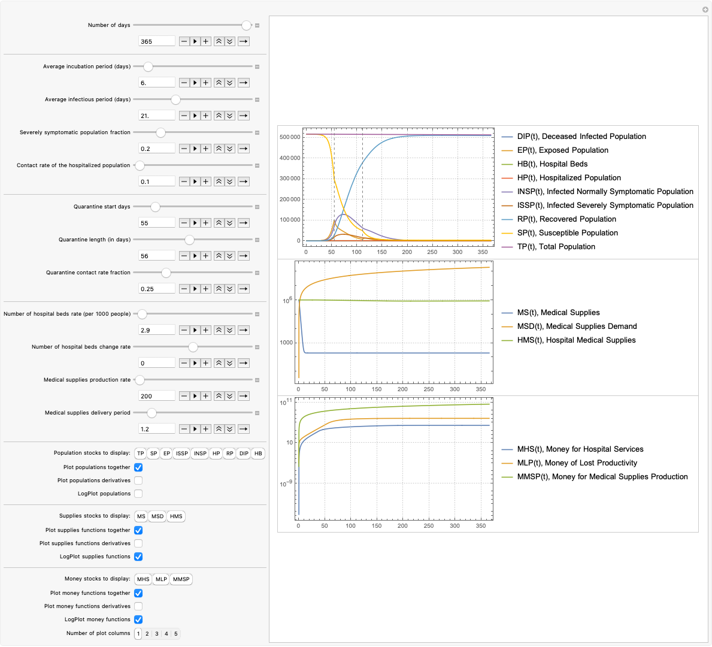


## "Посевная" модель (многосайтовая)

В этом разделе мы создаем модель "затравки", которая копируется на все ячейки.

Здесь мы создаем объект модели:

```mathematica
model1 = SEI2HREconModel[t, "InitialConditions" -> True, "RateRules" -> True,"TotalPopulationRepresentation" -> "AlgebraicEquation"];
```

В дополнение к классической эпидемиологической компартментной модели SIR [Wk1, HH1], выбранная посевная модель имеет население "Hospitalized Population" и ограничивающие запасы ресурсов "Hospital Beds" и "Medical Supplies", [AA6, AA7]:

```mathematica
Magnify[KeyTake[ModelGridTableForm[model1], {"Stocks", "Rates"}], 0.6]
```

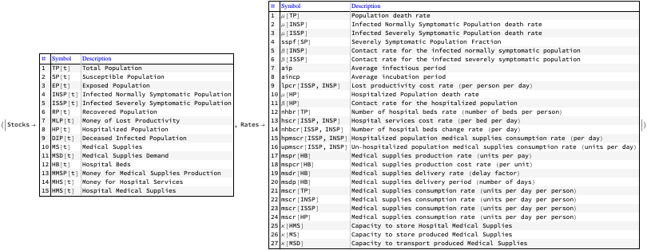

### Стандартные значения

Вот ставки по умолчанию для основной модели:

```mathematica
aDefaultPars = <|
    aip -> 26, 
    aincp -> 5, 
    \[Beta][ISSP] -> 0.5, 
    \[Beta][INSP] -> 0.5, 
    \[Beta][HP] -> 0.01, 
    \[Mu][ISSP] -> 0.035/aip, 
    \[Mu][INSP] -> 0.01/aip, 
    nhbr[TP] -> 100/1000, 
    lpcr[ISSP, INSP] -> 1, 
    hscr[ISSP, INSP] -> 1 
   |>;
```

### Уровень карантинных сценариев

```mathematica
aQuarantineRates = <|\[Beta][ISSP] -> 0.15, \[Beta][INSP] -> 0.15, \[Beta][HP] -> 0.01|>;
```


## Уровень мобильности

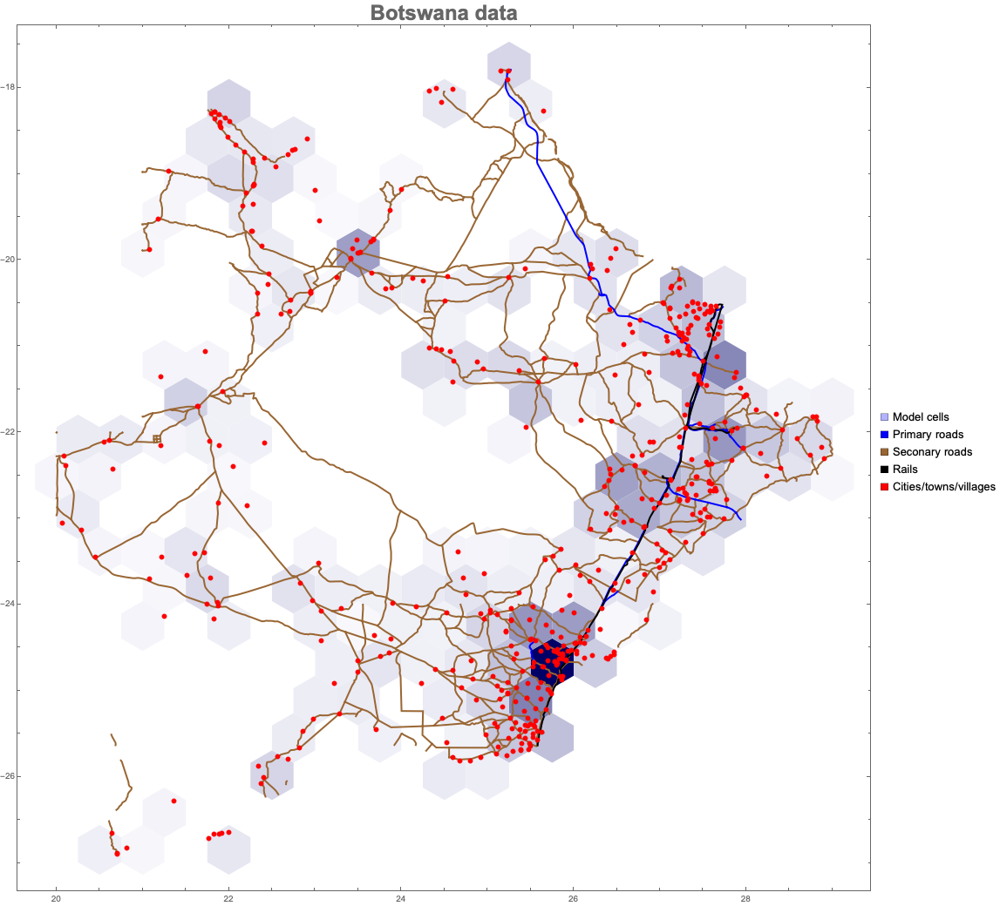


## Моделирование (многосайтовое)

### Параметры

```mathematica
cellRadius = 1; (*Geo degrees*)
```

```mathematica
imgSize = Medium;
```

### Установка модели посевного материала

```mathematica
ecmBWA = 
   ECMMonUnit[]\[DoubleLongRightArrow]
    ECMMonSetSingleSiteModel[model1]\[DoubleLongRightArrow]
    ECMMonEcho[Style["Set default and quarantine rates in the single-site model:", Bold, Purple]]\[DoubleLongRightArrow]
    ECMMonAssignRateRules[Join[aDefaultPars, aQuarantineRates]]\[DoubleLongRightArrow]
    ECMMonEcho[Style["Show the single-site model tabulated form:", Bold, Purple]]\[DoubleLongRightArrow]
    ECMMonEchoFunctionContext[Magnify[KeyTake[ModelGridTableForm[#singleSiteModel], {"InitialConditions", "RateRules"}], 0.6] &];
```


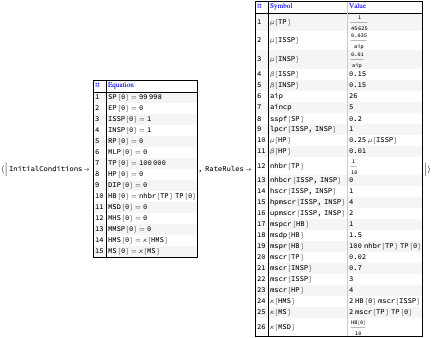

### Расширить модель семян и задать начальные условия

```mathematica
ecmBWA = 
   ecmBWA\[DoubleLongRightArrow]
    ECMMonMakePolygonGrid[Keys[aPopulations], cellRadius, "BinningFunction" -> HextileBins]\[DoubleLongRightArrow]
    ECMMonEcho[Style["Show the commuting graph:", Bold, Purple]]\[DoubleLongRightArrow]
    ECMMonEchoFunctionContext[ToGraph[#grid] &]\[DoubleLongRightArrow]
    ECMMonExtendByGrid[aPopulations, 0.01]\[DoubleLongRightArrow]
    ECMMonAssignInitialConditions[aPopulations, "Total Population", "Default" -> 0]\[DoubleLongRightArrow]
    ECMMonAssignInitialConditions[DeriveSusceptiblePopulation[aPopulations, aInfected, aDead], "Susceptible Population", "Default" -> 0]\[DoubleLongRightArrow]
    ECMMonAssignInitialConditions[<||>, "Exposed Population", "Default" -> 0]\[DoubleLongRightArrow]
    ECMMonAssignInitialConditions[aInfected, "Infected Normally Symptomatic Population", "Default" -> 0]\[DoubleLongRightArrow]
    ECMMonAssignInitialConditions[aDead, "Infected Normally Symptomatic Population", "Default" -> 0]\[DoubleLongRightArrow]
    ECMMonAssignInitialConditions[<||>, "Infected Severely Symptomatic Population", "Default" -> 0]\[DoubleLongRightArrow]
    ECMMonAssignInitialConditions[aHospitalBeds, "Hospital Beds", "Default" -> 0];
```


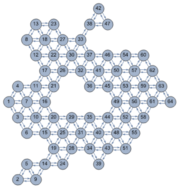

### Начертить начальные условия

```mathematica
Association@KeyValueMap[#1 -> ecmBWA\[DoubleLongRightArrow]ECMMonPlotGridHistogram[#2, PlotLabel -> #1, "ShowDataPoints" -> False, "Echo" -> False, ColorFunction -> "TemperatureMap", Epilog -> {PointSize[0.01], Pink, Point[Keys[Select[#2, # > 0 &]]]}, ImageSize -> imgSize, PlotRange -> Map[MinMax[#] + {-1, 1} &, Transpose[Keys[aPopulations]]]]\[DoubleLongRightArrow]ECMMonTakeValue &, <|"Total populations" -> aPopulations, "Infected" -> aInfected, "Dead" -> aDead, "Hospital beds" -> aHospitalBeds|>]
```

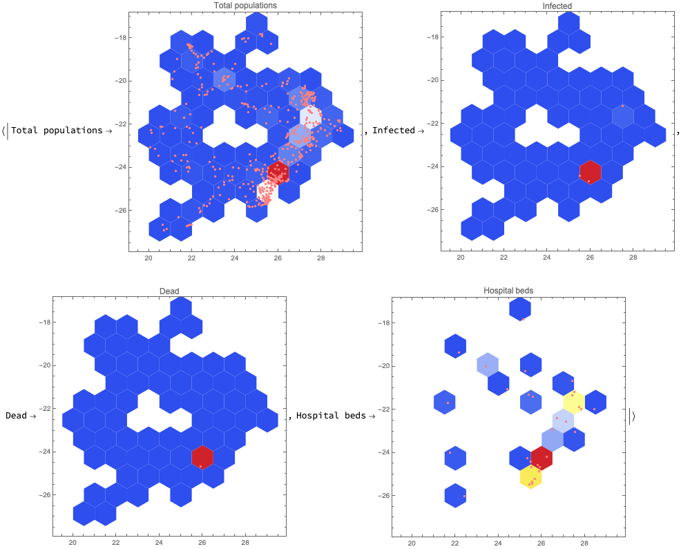

### Симуляция

```mathematica
ecmBWA = 
   ecmBWA\[DoubleLongRightArrow]
    ECMMonEcho[Style["Simulate:", Bold, Purple]]\[DoubleLongRightArrow]
    ECMMonSimulate[365]\[DoubleLongRightArrow]
    ECMMonEcho[Style["Show global population simulation results:", Bold, Purple]]\[DoubleLongRightArrow]
    ECMMonPlotSolutions[__ ~~ "Population", 365];
```


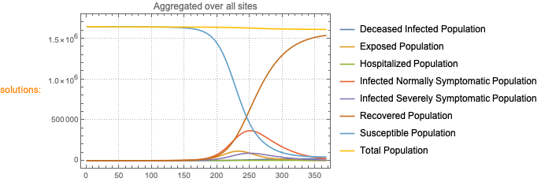


## Результаты симуляции

### Итоговые результаты моделирования

```mathematica
ecmBWA\[DoubleLongRightArrow]ECMMonPlotSolutions[__ ~~ "Population", 365, ImageSize -> Large, PlotTheme -> "Web", GridLines -> All];
```

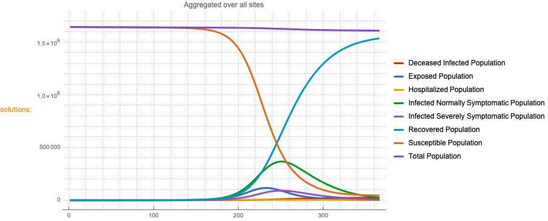

### Избранные сайты

Здесь мы строим графики для ячеек симуляции с самыми крупными городами:

```mathematica
ecmBWA\[DoubleLongRightArrow]
   ECMMonEcho[Style["Show site simulation results for Gaborone and Francistown areas:", Bold, Purple]]\[DoubleLongRightArrow]
   ECMMonPlotSiteSolutions[{48, 59}, __ ~~ "Population", 365, ImageSize -> 500, PlotTheme -> "Web", GridLines -> All]\[DoubleLongRightArrow]
   ECMMonEcho[Style["Show deceased and hospitalzed populations results for Gaborone and Francistown areas:", Bold, Purple]]\[DoubleLongRightArrow]
   ECMMonPlotSiteSolutions[{48, 59}, {"Deceased Infected Population", "Hospitalized Population", "Hospital Beds"}, 300, ImageSize -> 500, PlotTheme -> "Web", GridLines -> All];
```


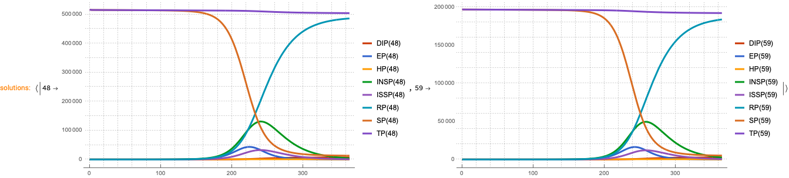


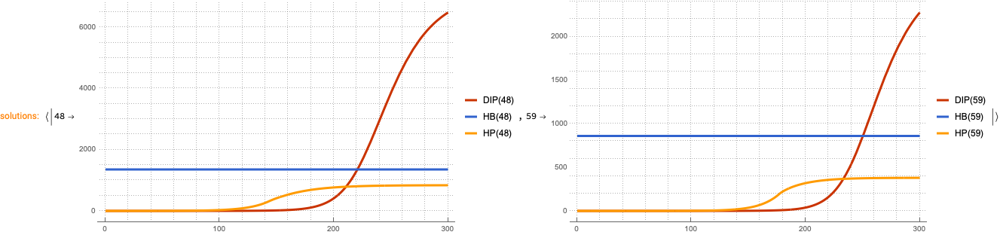

### Только госпитализированное население

Обратите внимание, что кривая госпитализированного населения (HP) "пытается" выглядеть так же, как и кривая инфицированного населения с тяжелыми симптомами (ISSP), но из-за ограничения по количеству койко-мест 

```mathematica
ecmBWA\[DoubleLongRightArrow]
   ECMMonPlotSiteSolutions[{48, 59}, {"Hospitalized Population"}, 300,ImageSize -> Large, PlotTheme -> "Web", GridLines -> All];
```

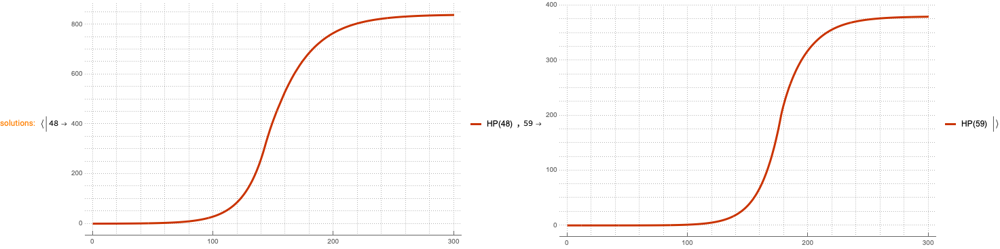

### Умершее зараженное население

```mathematica
res = ecmBWA\[DoubleLongRightArrow]ECMMonGetSolutionValues["Deceased Infected Population", 365]\[DoubleLongRightArrow]ECMMonTakeValue;
res = KeyDrop[#[[-1]] & /@ res[[1]], "Times"];
Total[res]

(*22471.7*)
```

```mathematica
ResourceFunction["RecordsSummary"][Values@res]
```

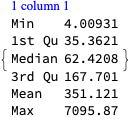

### 2D и 3D вместе

```mathematica
Clear[GraphValues3D];
GraphValues3D[aCells_?AssociationQ, modelHexGermany_?EpidemiologyFullModelQ, focusStocksArg_ : (_String | {_String ..}), aSolHexGermany_?AssociationQ, maxTime_?NumberQ, normalizeQ : (True | False)] := 
   Block[{focusStocks = Flatten[{focusStocksArg}], aSolVertexVals, aSolVertexVals2, aSolVertexVals3}, 
    aSolVertexVals = EvaluateSolutionsOverGraphVertexes[modelHexGermany, focusStocks, aSolHexGermany, {0, maxTime}]; 
    aSolVertexVals = KeyDrop[aSolVertexVals, "Times"]; 
    If[normalizeQ, 
     aSolVertexVals2 = Map[#/Max[#] &, aSolVertexVals], 
     aSolVertexVals2 = aSolVertexVals 
    ]; 
    aSolVertexVals3 = Association[KeyValueMap[Function[{k, v}, k -> Map[Append[aCells[k]["Center"], #] &, v]],aSolVertexVals2]] 
   ];
a3DVals = 
   Association@
    Map[# -> GraphValues3D[(ecmBWA\[DoubleLongRightArrow]ECMMonTakeGrid)["Cells"], ecmBWA\[DoubleLongRightArrow]ECMMonTakeMultiSiteModel, {#}, ecmBWA\[DoubleLongRightArrow]ECMMonTakeSolution, 365, False] &, {"Total Population", "Recovered Population", "Hospitalized Population", "Infected Normally Symptomatic Population", "Infected Severely Symptomatic Population", "Deceased Infected Population"}];
a2DVals = Total[Values[#][[All, All, 3]]] & /@ a3DVals;
opts = {ImageSize -> Medium, PlotTheme -> "Detailed", PlotRange -> All};
Manipulate[
  Grid[{{
     ListPlot3D[Transpose[Values[a3DVals[focus3DPopulation]]][[i]], PlotLabel -> focus3DPopulation, BoxRatios -> {1, 1, 0.6}, opts], 
     ListLinePlot[
      If[MemberQ[focus2DPopulations, All], a2DVals, KeyTake[a2DVals, focus2DPopulations]], 
      PlotLabel -> "Aggregated over all geo-sites", 
      PlotLegends -> If[MemberQ[focus2DPopulations, All], Keys[a2DVals], focus2DPopulations], 
      Epilog -> {Red, Dashed, Line[{{i, -0.1*Max[a2DVals]}, {i, 1.3*Max[a2DVals]}}]}, 
      opts] 
    }}, 
   Dividers -> All, FrameStyle -> GrayLevel[0.8] 
  ], 
  {{i, 160, "time (days):"}, 1, 365, 1, Appearance -> "Open"}, 
  {{focus3DPopulation, "Infected Severely Symptomatic Population", "focus population (3D):"}, Keys[a3DVals], ControlType -> Setter}, 
  {{focus2DPopulations, {All}, "focus population(s) (2D):"}, Append[Keys[a3DVals], All], ControlType -> TogglerBar}, 
  SaveDefinitions -> True 
 ]
```

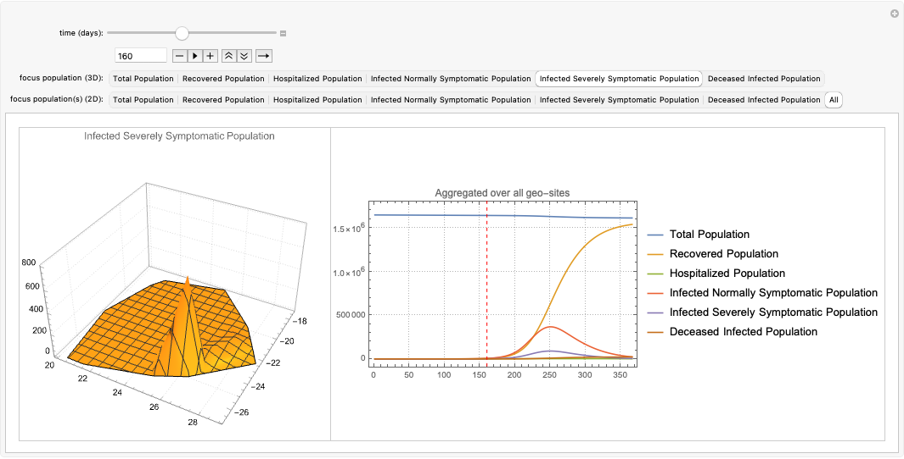


## Пояснения

Вот популяции в клетках:

```mathematica
ecmBWA\[DoubleLongRightArrow]ECMMonPlotGridHistogram[aPopulations, Epilog -> {Red, PointSize[0.01], Point[Keys[aPopulations]]}, PlotRange -> All];
```

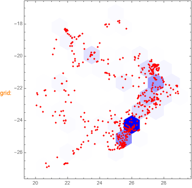

Мы выбрали радиус ячейки равным 1 градусу, потому что так удобнее и последовательнее выводить схемы перемещений. Вот пример с более точной сеткой, где мы получаем несвязные области:

```mathematica
HextileHistogram[aPopulations, 1, ColorFunction -> (Blend[{Lighter[Blue, 0.8`], Darker[Blue, 0.6`]}, #1] &), Epilog -> {Red, PointSize[0.005], Point[Keys[aPopulations]]}, PlotRange -> All]
```

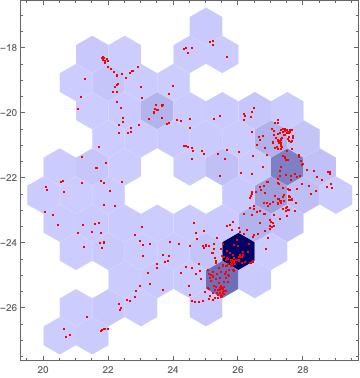

```mathematica
Histogram[Log10@Values[HextileBins[aPopulations, 1]], "Log", PlotTheme -> "Detailed", FrameLabel -> {"Population Size", "Nbr Cells"}]
```

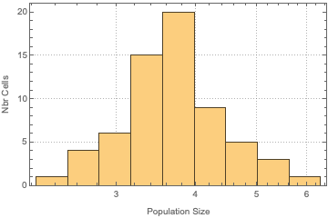

```mathematica
HextileHistogram[aPopulations, 1, "AggregationFunction" -> Log10@*N@*Total, ColorFunction -> "TemperatureMap", Epilog -> {Blue, PointSize[0.005], Point[Keys[aPopulations]]}, PlotRange -> All]
```

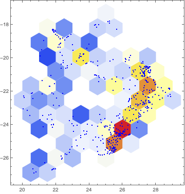

```mathematica
ToGraph[MakePolygonGrid[Keys[aPopulations], 1]]
```

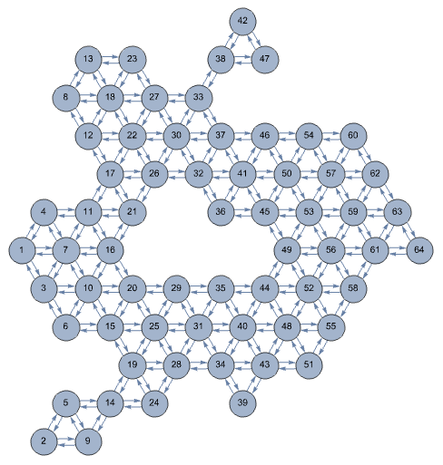


### Социальные сети

Агентное моделирование (ABM) больше подходит для отслеживания отдельных лиц.

Требуются подробные данные. 

(ABM концептуально проста, но требует гораздо больше сбора, обработки и вычислительных ресурсов).

Мы будем применять ABM для моделирования повседневной жизни людей. Куда они ходят, как они путешествуют, что они делают, какие торговые центры, магазины, рестораны, бары.

```mathematica
SeedRandom[124];
grRandom = RandomGraph[WattsStrogatzGraphDistribution[200, 0.15], VertexLabels -> "Name"];
grRandom
```

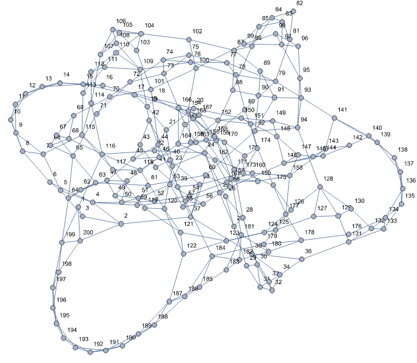


```mathematica
CommunityGraphPlot[grRandom]
```

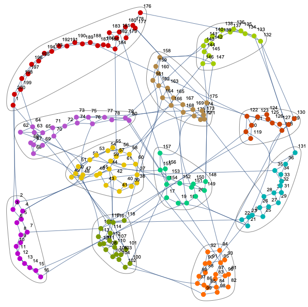


```mathematica
Manipulate[
  HighlightGraph[grRandom, NeighborhoodGraph[grRandom, 193, i], ImageSize -> 800], 
  {{i, 3, "step"}, 0, 10, 1, Appearance -> "Open"}]
```

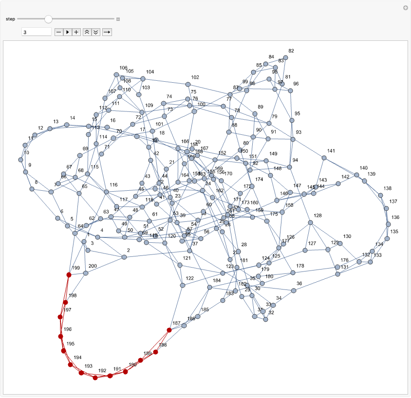


## Ссылки

### Статьи

[Wk1] Wikipedia entry, ["Compartmental models in epidemiology"](https://en.wikipedia.org/wiki/Compartmental_models_in_epidemiology).

[Wl2] Wikipedia entry, ["Coronavirus disease 2019"](https://en.wikipedia.org/wiki/Coronavirus_disease_2019).

[HH1] Herbert W. Hethcote (2000). ["The Mathematics of Infectious Diseases"](http://leonidzhukov.net/hse/2014/socialnetworks/papers/2000SiamRev.pdf). SIAM Review. 42 (4): 599–653. Bibcode:2000SIAMR..42..599H. doi:10.1137/s0036144500371907.

[BC1] Lucia Breierova,  Mark Choudhari,  [An Introduction to Sensitivity Analysis](https://ocw.mit.edu/courses/sloan-school-of-management/15-988-system-dynamics-self-study-fall-1998-spring-1999/readings/sensitivityanalysis.pdf), (1996), Massachusetts Institute of Technology.

[AA1] Anton Antonov, ["Coronavirus propagation modeling considerations"](https://github.com/antononcube/SystemModeling/blob/master/Projects/Coronavirus-propagation-dynamics/Documents/Coronavirus-propagation-modeling-considerations.md), (2020), [SystemModeling at GitHub](https://github.com/antononcube/SystemModeling).

[AA2] Anton Antonov, ["Basic experiments workflow for simple epidemiological models"](https://github.com/antononcube/SystemModeling/blob/master/Projects/Coronavirus-propagation-dynamics/Documents/Basic-experiments-workflow-for-simple-epidemiological-models.md), (2020), [SystemModeling at GitHub](https://github.com/antononcube/SystemModeling).

[AA3] Anton Antonov, ["Scaling of Epidemiology Models with Multi-site Compartments"](https://github.com/antononcube/SystemModeling/blob/master/Projects/Coronavirus-propagation-dynamics/Documents/Scaling-of-epidemiology-models-with-multi-site-compartments.md), (2020), [SystemModeling at GitHub](https://github.com/antononcube/SystemModeling).

[AA4] Anton Antonov, ["WirVsVirus hackathon multi-site SEI2R over a hexagonal grid graph"](https://github.com/antononcube/SystemModeling/blob/master/Projects/Coronavirus-propagation-dynamics/Documents/WirVsVirus-hackathon-Multi-site-SEI2R-over-a-hexagonal-grid-graph.md), (2020), [SystemModeling at GitHub](https://github.com/antononcube/SystemModeling).

[AA5] Anton Antonov, ["NY Times COVID-19 data visualization"](https://github.com/antononcube/SystemModeling/blob/master/Projects/Coronavirus-propagation-dynamics/Documents/NYTimes-COVID-19-data-visualization.md), (2020), [SystemModeling at GitHub](https://github.com/antononcube/SystemModeling).

[AA6] Anton Antonov, ["SEI2HR model with quarantine scenarios"](https://github.com/antononcube/SystemModeling/blob/master/Projects/Coronavirus-propagation-dynamics/Documents/SEI2HR-model-with-quarantine-scenarios.md)[, ](https://github.com/antononcube/SystemModeling/blob/master/Projects/Coronavirus-propagation-dynamics/Documents/Scaling-of-epidemiology-models-with-multi-site-compartments.md)(2020), [SystemModeling at GitHub](https://github.com/antononcube/SystemModeling).

[AA7] Anton Antonov, ["SEI2HR-Econ model with quarantine and supplies scenarios"](https://github.com/antononcube/SystemModeling/blob/master/Projects/Coronavirus-propagation-dynamics/Documents/SEI2HR-Econ-model-with-quarantine-and-supplies-scenarios.md), (2020), [SystemModeling at GitHub](https://github.com/antononcube/SystemModeling).

### Репозитории, пакеты

[WRI1] Wolfram Research, Inc., ["Epidemic Data for Novel Coronavirus COVID-19"](https://www.wolframcloud.com/obj/resourcesystem/published/DataRepository/resources/Epidemic-Data-for-Novel-Coronavirus-COVID-19), [WolframCloud](https://www.wolframcloud.com).

[WRI2] Wolfram Research Inc., [USA county records](https://github.com/antononcube/SystemModeling/blob/master/Data/dfUSACountyRecords.csv), (2020), [System Modeling at GitHub](https://github.com/antononcube/SystemModeling).

[NYT1] The New York Times, [Coronavirus (Covid-19) Data in the United States](https://github.com/nytimes/covid-19-data), (2020), GitHub.

[AAr1] Anton Antonov, [Coronavirus propagation dynamics project](https://github.com/antononcube/SystemModeling/tree/master/Projects/Coronavirus-propagation-dynamics), (2020), [SystemModeling at GitHub](https://github.com/antononcube/SystemModeling).

[AAp1] Anton Antonov, ["Epidemiology models Mathematica package"](https://github.com/antononcube/SystemModeling/blob/master/Projects/Coronavirus-propagation-dynamics/WL/EpidemiologyModels.m), (2020), [SystemModeling at GitHub](https://github.com/antononcube/SystemModeling).

[AAp2] Anton Antonov, ["Epidemiology models modifications Mathematica package"](https://github.com/antononcube/SystemModeling/blob/master/Projects/Coronavirus-propagation-dynamics/WL/EpidemiologyModelModifications.m), (2020), [SystemModeling at GitHub](https://github.com/antononcube/SystemModeling).

[AAp3] Anton Antonov, ["Epidemiology modeling visualization functions Mathematica package"](https://github.com/antononcube/SystemModeling/blob/master/Projects/Coronavirus-propagation-dynamics/WL/EpidemiologyModelingVisualizationFunctions.m), (2020), [SystemModeling at GitHub](https://github.com/antononcube/SystemModeling).

[AAp4] Anton Antonov, ["System dynamics interactive interfaces functions Mathematica package"](https://github.com/antononcube/SystemModeling/blob/master/WL/SystemDynamicsInteractiveInterfacesFunctions.m), (2020), [SystemModeling at GitHub](https://github.com/antononcube/SystemModeling).

[AAp5] Anton Antonov, ["Multi-site model simulation Mathematica package"](https://github.com/antononcube/SystemModeling/blob/master/Projects/Coronavirus-propagation-dynamics/WL/MultiSiteModelSimulation.m), (2020), [SystemModeling at GitHub](https://github.com/antononcube/SystemModeling).

[AAp6] Anton Antonov, ["Monadic Epidemiology Compartmental Modeling Mathematica package"](https://github.com/antononcube/SystemModeling/blob/master/Projects/Coronavirus-propagation-dynamics/WL/MonadicEpidemiologyCompartmentalModeling.m), (2020), [SystemModeling at GitHub](https://github.com/antononcube/SystemModeling).

## Загрузить пакеты

```mathematica
If[Length[DownValues[ECMMonGetSolutionValues]] == 0, Import["https://raw.githubusercontent.com/antononcube/SystemModeling/master/Projects/Coronavirus-propagation-dynamics/WL/MonadicEpidemiologyCompartmentalModeling.m"]; 
 ]
```