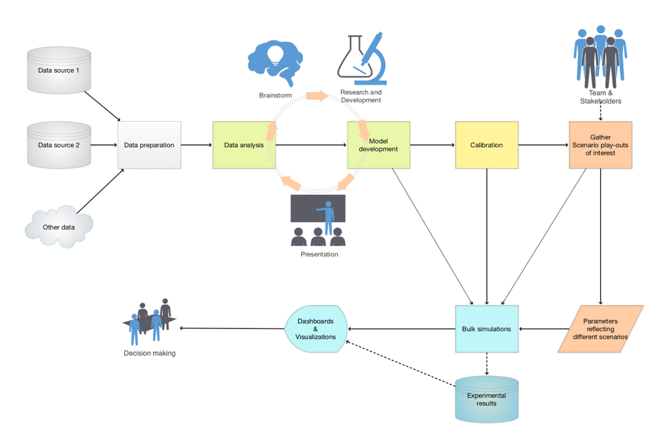
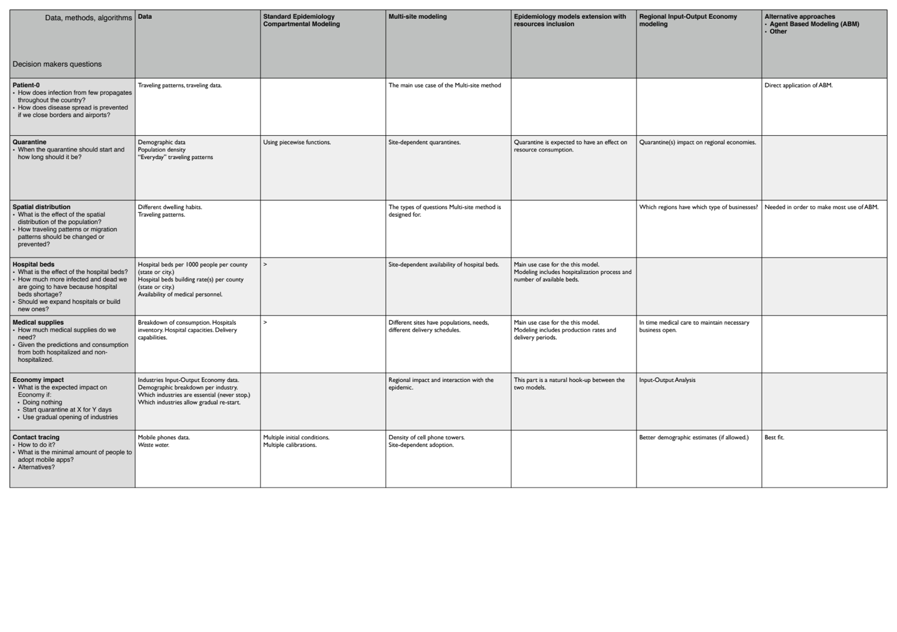
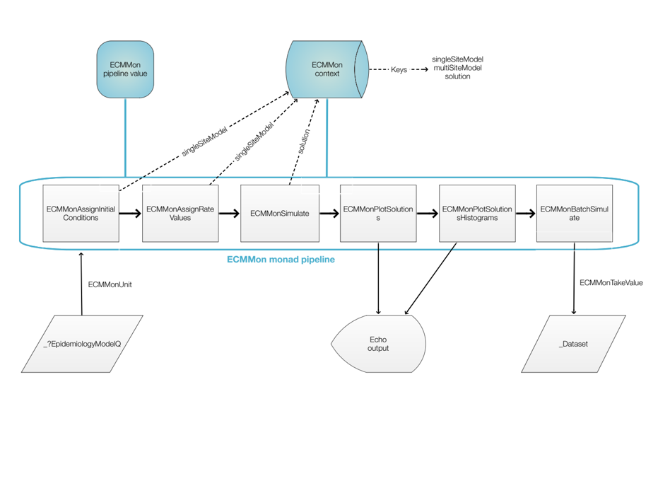

# Динамические системы

**Расширение и улучшение эпидемиологических моделей**

**Wolfram Language — Летняя Конференция в Санкт-Петербурге, 1-2 июня 2023 года**

Антон Антонов   
[MathematicaForPrediction at GitHub](https://github.com/antononcube/MathematicaForPrediction)   
[MathematicaForPrediction at WordPress](https://mathematicaforprediction.wordpress.com)   

---

## Кто Я?

Работал в компании Wolfram Research Inc, большой поклонник и пользователь системы Mathematica (более 25 лет).

`NIntegrate`, `NSum`, `Total`, `Norm`, и другие... 

Я занимался фреймворками для численных вычислений, теперь я занимаюсь (специализированным) анализом данных и фреймворками для машинного обучения.

Также занимаюсь разговорными агентами.

### Образование, работа

- Магистр математики, общая алгебра.

    - Университет Русе, Болгария.

- Магистр компьютерных наук, базы данных.

    - Университет Русе, Болгария.

- Доктор философии в области прикладной математики, крупномасштабное моделирование загрязнения воздуха.

    - Датский технический университет, Дания

- Бывший разработчик ядра системы Mathematica, 2001-2008 гг.

    - Wolfram Research, Inc.

- В настоящее время работает "старшим специалистом по данным".

    - Accendo Data LLC

---

## Структура (элементы) презентации

"... оказалась я в испугу разыграл классический дебют"

- Что самое важное / интересное ?

- Общая картина

- Презентация сделана с точки зрения программной инженерии

    - Монады

    - Тестирование (unit tests)

    - [WL паклетс](https://resources.wolframcloud.com/PacletRepository/)

- Использование искусственного интеллекта для построения моделей [системной динамики](https://ru.wikipedia.org/wiki/Системная_динамика)

- Аналогии [между другими](https://github.com/antononcube/SystemModeling) моделями [системной динамики](https://ru.wikipedia.org/wiki/Системная_динамика)

- Морфологический анализ

---

## Что самое важное?

- Гео-пространственное временное эпидемиологическое моделирование

- Программная монада для моделей системной динамики

- Использование большого количества WL для решения реальных жизненных проблем

---

## Реакции к других докладов

- Использование [RStudio's/Posit's Shiny ](https://antononcube.shinyapps.io/SEI2HR-flexdashboard/)вместо Mathematica

- Взаимодействие с JavaScript - создание графики путем перевода кода WL в D3.js

- Моделирование жонглирования гирями

- PaLM вместо OpenAI

- Распространение ключевых слов и понятий в WL

- Проектирование на случай провала (Design to fail)

- Приготовил вместо СД-доклад

---

## Общая картина

Разработка моделей и принятие решений



---

## Морфологический анализ

[Link](https://github.com/antononcube/SystemModeling/blob/master/Presentations/R-Ladies-Miami-Meetup-May-2020/Presentaion-aids/04-Morphological-Analysis-of-COVID-19-Decision-Maker-Questions.pdf)



---

## Программная монада



```mathematica
ECMMonUnit[SEI2HRModel[t]]⟹
   ECMMonAssignInitialConditions[<|SP[0] -> 100000|>]⟹
   ECMMonAssignInitialConditions[<|INSP[0] -> 0|>]⟹
   ECMMonAssignInitialConditions[<|ISSP[0] -> 1|>]⟹
   ECMMonAssignRateRules[<|\[Beta][INSP] -> 0.56|>]⟹
   ECMMonAssignRateRules[<|\[Beta][ISSP] -> 0.58|>]⟹
   ECMMonAssignRateRules[<|\[Beta][HP] -> 0.1|>]⟹
   ECMMonSimulate["MaxTime" -> 240]⟹
   ECMMonPlotSolutions["Stocks" -> __ ~~ "Population"];
```

---

## Эпидемиологическое моделирование

### 

### [Германия](https://mathematicaforprediction.wordpress.com/2020/03/24/wirvsvirus-2020-hackathon-participation/)

### 

### 

---

## Расширения (планы на будущее)

- 

- 

- Разговорные агенты на [Болгарском](https://github.com/antononcube/Raku-DSL-Bulgarian) и [Русском](https://github.com/antononcube/Raku-DSL-Russian)
