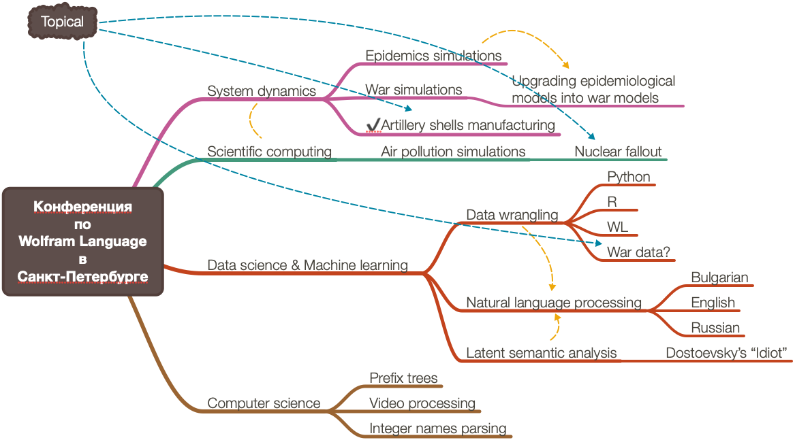
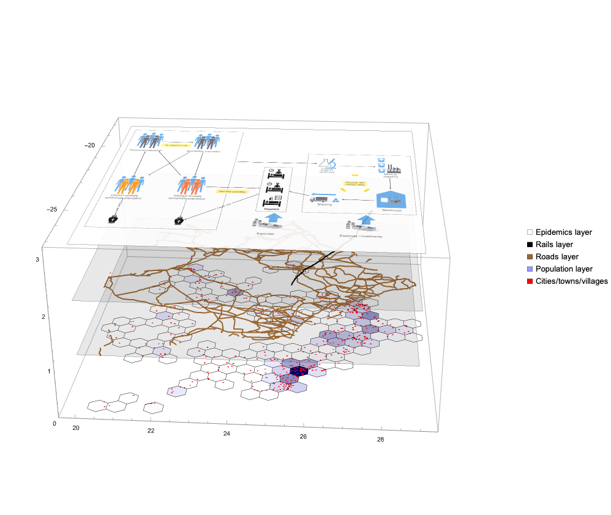

# Wolfram Language conference in St. Petersburg
### **June, 1-2, 2023**

Two weeks ago (June 1st and 2nd) I participated in the Wolfram Language conference in St. Petersburg, Russia.
Here are the corresponding announcements:

- ["Конференция по Wolfram Language в Санкт-Петербурге"](https://pikabu.ru/story/konferentsiya_po_wolfram_language_v_sanktpeterburge_10203980)
- ["Wolfram Language — Летняя Конференция в Санкт-Петербурге 2023"](https://habr.com/ru/news/732252/)

The conference was co-organized by [Kiril Belov](https://community.wolfram.com/web/kirillbelovtest) and Petr Genadievich Tenishev.

Here is a mind-map of the potential presentations Kiril and I discussed:

## System dynamics presentation

I presented
["Динамические системы : Расширение и улучшение эпидемиологических моделей"](./Markdown/Dynamic-systems-and-extensions-Russian.md).
(in English: "Dynamics systems: extending and improving epidemiological models".)

The main presentation slides had a dozen supplements:
- [Diagrams](./Diagrams)
- NLP and AI utilization demos notebook
- [Geo-spatial simulations of COVID-19 over Botswana notebook](./Markdown/COVID-19-simulations-over-Botswana-2023-Russian.md). 

## Making two presentations 

Interestingly, I first prepared a Latent Semantic Analysis (LSA) talk, but then found out
that the organizers listed another talk I discussed with them, on extending dynamic systems models. 
(The later one is the first we discussed, so, it was my "fault" that I wanted to talk about LSA.)

Here are the presentation notebooks for LSA in 
[English](./Notebooks/LSA-workflows-English.nb) and 
[Russian](./Notebooks/LSA-workflows-Russian.nb).

## Some afterthoughts

- Тhe conference was very "strong", my presentation was the "weakest."
  - With "strong" I refer to the content and style of the presentations.
- This was also the first scientific presentation I gave in Russian.
I also got a [participation diploma](./Diagrams/Diplom.jpeg).
- I used [PaLMMode](https://resources.wolframcloud.com/PacletRepository/resources/AntonAntonov/PaLMMode/) 
and [NLPTemplateEngine](https://resources.wolframcloud.com/PacletRepository/resources/AntonAntonov/NLPTemplateEngine/) 
to demonstrate generation of epidemiological modeling code.
- Preparing for the conference reminded me of some the COVID-19 modeling hackathons I participated in.
  - E.g. ["WirVsVirus"](https://mathematicaforprediction.wordpress.com/2020/03/24/wirvsvirus-2020-hackathon-participation/).
- I prepared the initial models of artillery shells manufacturing, but much more work has to be done
in order to have a meaningful article or presentation. (Hopefully, I am finishing that soon.)

------

## References

### Articles, posts, presentations

[AA1] Антон Антонов,
["Динамические системы : Расширение и улучшение эпидемиологических моделей"](./Markdown/Dynamic-systems-and-extensions-Russian.md).

[AA2] Антон Антонов,
["COVID-19 modeling over Botswana"](./Markdown/COVID-19-simulations-over-Botswana-2023-Russian.md),

[AA3] Anton Antonov,
["WirVsVirus 2020 hackathon participation"](https://mathematicaforprediction.wordpress.com/2020/03/24/wirvsvirus-2020-hackathon-participation/),
(2020),
[MathematicaForPrediction at WordPress](https://mathematicaforprediction.wordpress.com).

### Videos

*TBD..*