# Basic experiments workflow for simple epidemiological models

Anton Antonov  
[MathematicaForPrediction at WordPress](https://mathematicaforprediction.wordpress.com)  
[SystemModeling at GitHub](https://github.com/antononcube/SystemModeling)  
March 2020  

## Introduction

The primary purpose of this notebook is to give a “stencil workflow” for simulations using the packages in the project ["Coronavirus simulation dynamics"](https://github.com/antononcube/SystemModeling/tree/master/Projects/Coronavirus-propagation-dynamics), [AAr1].

The model in this notebook -- SEI2R -- differs from [the classical SEIR model](https://en.wikipedia.org/wiki/Compartmental_models_in_epidemiology) with the following elements:

1. Two separate infected populations: one is "severely symptomatic", the other is "normally symptomatic"

2. The monetary equivalent of lost productivity due to infected or died people is tracked.

**Remark:** We consider the coronavirus propagation models as instances of the more general [System Dynamics (SD)](https://en.wikipedia.org/wiki/System_dynamics) models.

**Remark:** The SEI2R model is a modification of the classic epidemic model SEIR, [Wk1].

**Remark:** The interactive interfaces in the notebook can be used for attempts to calibrate SEI2R with real data. (For example, data for the [2019–20 coronavirus outbreak](https://en.wikipedia.org/wiki/2019–20_coronavirus_outbreak), [WRI1].)

### Workflow

1. Get one of the classical epidemiology models.

1. Extend the equations of model if needed or desired.

1. Set relevant initial conditions for the populations.

1. Pick model parameters to be adjust and “play with.”

1. Derive parametrized solutions of model’s system of equations (ODE’s or DAE’s.)

    1. Using the parameters of the previous step.

1. Using an interactive interface experiment with different values of the parameters.

    1. In order to form “qualitative understanding.”

1. Get real life data.

    1. Say, for the 2019-20 coronavirus outbreak.

1.  Attempt manual or automatic calibration of the model.

    1. This step will most likely require additional data transformations and programming.

    1. Only manual calibration is shown in this notebook.

## Load packages of the framework

The epidemiological models framework used in this notebook is implemented in the packages [AAp1, AAp2]; the interactive plots functions are from the package [AAp3].

```mathematica
Import["https://raw.githubusercontent.com/antononcube/SystemModeling/\
master/Projects/Coronavirus-propagation-dynamics/WL/\
EpidemiologyModelModifications.m"]
Import["https://raw.githubusercontent.com/antononcube/SystemModeling/\
master/WL/SystemDynamicsInteractiveInterfacesFunctions.m"]
```

## Getting the model code

Here we take the SEI2R model implemented in the package ["EpidemiologyModels.m"](https://github.com/antononcube/SystemModeling/blob/master/Projects/Coronavirus-propagation-dynamics/WL/EpidemiologyModels.m), [AAp1]:

```mathematica
modelSI2R = 
  SEI2RModel[t, "InitialConditions" -> True, 
   "RateRules" -> True];
```

We can show a tabulated visualization of the model using the function ModelGridTableForm from [AAp1]:

```mathematica
ModelGridTableForm[modelSI2R]
```

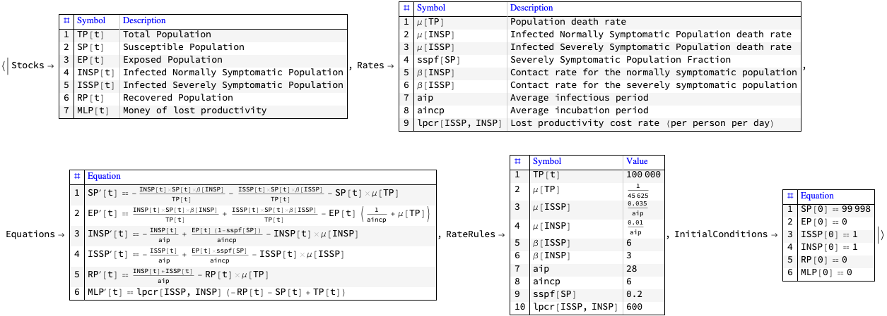

## Model extensions and new models

The framework implemented with the packages [AAp1, AAp2, AAp3] can be utilized using custom made data structures that follow the structure of the models in [AAp1].

Of course, we can also just extend the models from [AAp1]. In this section we show how SEI2R can be extended in two ways:

1. By adding a birth rate added to the Susceptible Population equation (the birth rate is not included by default)

1. By adding a new equation for the infected deceased population.

### Adding births term

Here are the equations of SEI2R (from [AAp1]):

```mathematica
ModelGridTableForm[KeyTake[modelSI2R, "Equations"]]
```

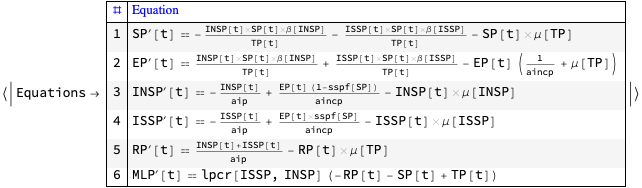

Here we find the position of the equation that corresponds to “Susceptible Population”:

```mathematica
pos = EquationPosition[modelSI2R["Equations"], 
  First@GetPopulationSymbols[modelSI2R, "Susceptible Population"]]

(*1*)
```

Here we make the births term using a birth rate that is the same as the death rate:

```mathematica
birthTerm = 
 GetPopulations[modelSI2R, 
    "Total Population"][[1]]*
  GetRates[modelSI2R, 
    "Population death rate"][[1]]

(*TP[t] \[Mu][TP]*)
```

Here we add the births term to the equations of new model

```mathematica
modelSI2RNew = modelSI2R;
modelSI2RNew["Equations"] = 
  ReplacePart[
   modelSI2R["Equations"], {1, 2} -> 
    modelSI2R["Equations"][[1, 
      2]] + birthTerm];
```

Here we display the equations of the new model:

```mathematica
ModelGridTableForm[KeyTake[modelSI2RNew, "Equations"]]
```

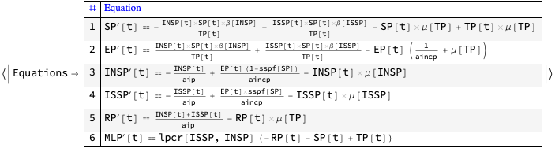

### Adding infected deceased population equation

Here we add new population, equation, and initial condition that allow for tracking the deaths because of infection:  

```mathematica
AppendTo[modelSI2R["Equations"], 
  IDP'[t] == \[Mu][INSP]*INSP[t] + \[Mu][ISSP]*ISSP[t]];
AppendTo[modelSI2R["Stocks"], 
  IDP[t] -> "Infected Deceased Population"];
AppendTo[modelSI2R["InitialConditions"], IDP[0] == 0];
```

Here is how the model looks like:

```mathematica
ModelGridTableForm[KeyTake[modelSI2R, "Equations"]]
```

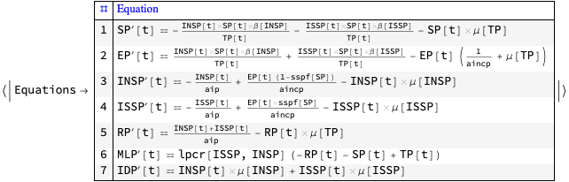

## Parameters and actual simulation equations code

Here are the parameters we want to experiment with (or do calibration with):

```mathematica
lsFocusParams = {aincp, aip, sspf[SP], \[Beta][ISSP], \[Beta][INSP]};
```

Here we set custom rates and initial conditions:

```mathematica
population = 58160000/400;
modelSI2R = SetRateRules[modelSI2R, <|TP[t] -> population|>];
modelSI2R = 
  SetInitialConditions[
   modelSI2R, <|SP[0] -> population - 1, ISSP[0] -> 0, 
    INSP[0] -> 1|>];
```

Here is the system of ODE’s we use with to do *parametrized* simulations:

```mathematica
lsActualEquations = 
  Join[modelSI2R["Equations"] //. 
    KeyDrop[modelSI2R["RateRules"], lsFocusParams], 
   modelSI2R["InitialConditions"]];
ResourceFunction["GridTableForm"][List /@ lsActualEquations]
```

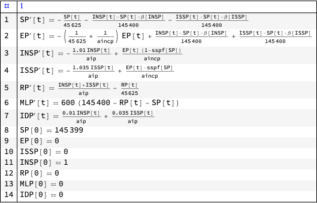

## Simulation

Straightforward simulation for one year with using ParametricNDSolve :

```mathematica
aSol =
 Association@Flatten@
   ParametricNDSolve[lsActualEquations, 
    Head /@ Keys[modelSI2R["Stocks"]], {t, 0, 365}, lsFocusParams]
```

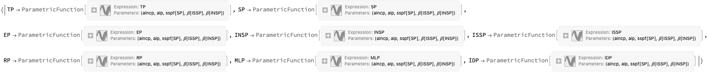

(The advantage having parametrized solutions is that we can quickly compute simulation results with new parameter values without solving model’s system of ODE’s; see the interfaces below.)

## Interactive interface

```mathematica
opts = {PlotRange -> All, PlotLegends -> None, 
   PlotTheme -> "Detailed", PerformanceGoal -> "Speed", 
   ImageSize -> 300};
lsPopulationKeys = GetPopulationSymbols[modelSI2R, __ ~~ "Population"];
lsEconKeys = {MLP};
Manipulate[
 DynamicModule[{lsPopulationPlots, lsEconPlots, lsRestPlots},
  
  lsPopulationPlots =
   ParametricSolutionsPlots[
    modelSI2R["Stocks"],
    KeyTake[aSol, lsPopulationKeys],
    {aincp, aip, spf, crisp, criap}, ndays,
    "LogPlot" -> popLogPlotQ, "Together" -> popTogetherQ, 
    "Derivatives" -> popDerivativesQ, 
    "DerivativePrefix" -> "\[CapitalDelta]", opts];
  
  lsEconPlots =
   ParametricSolutionsPlots[
    modelSI2R["Stocks"],
    KeyTake[aSol, lsEconKeys],
    {aincp, aip, spf, crisp, criap}, ndays,
    "LogPlot" -> econLogPlotQ, "Together" -> econTogetherQ, 
    "Derivatives" -> econDerivativesQ, 
    "DerivativePrefix" -> "\[CapitalDelta]", opts];
  
  lsRestPlots =
   ParametricSolutionsPlots[
    modelSI2R["Stocks"],
    KeyDrop[aSol, Join[lsPopulationKeys, lsEconKeys]],
    {aincp, aip, spf, crisp, criap}, ndays,
    "LogPlot" -> econLogPlotQ, "Together" -> econTogetherQ, 
    "Derivatives" -> econDerivativesQ, 
    "DerivativePrefix" -> "\[CapitalDelta]", opts];
  
  Multicolumn[Join[lsPopulationPlots, lsEconPlots, lsRestPlots], 
   nPlotColumns, Dividers -> All, 
   FrameStyle -> GrayLevel[0.8]]
  ],
 {{aincp, 12., "Average incubation period (days)"}, 1, 60., 1, 
  Appearance -> {"Open"}},
 {{aip, 21., "Average infectious period (days)"}, 1, 100., 1, 
  Appearance -> {"Open"}},
 {{spf, 0.2, "Severely symptomatic population fraction"}, 0, 1, 0.025,
   Appearance -> {"Open"}},
 {{crisp, 6, 
   "Contact rate of the infected severely symptomatic population"}, 0,
   30, 0.1, Appearance -> {"Open"}},
 {{criap, 3, 
   "Contact rate of the infected normally symptomatic population"}, 0,
   30, 0.1, Appearance -> {"Open"}},
 {{ndays, 90, "Number of days"}, 1, 365, 1, 
  Appearance -> {"Open"}},
 {{popTogetherQ, True, "Plot populations together"}, {False, True}},
 {{popDerivativesQ, False, "Plot populations derivatives"}, {False, 
   True}},
 {{popLogPlotQ, False, "LogPlot populations"}, {False, True}},
 {{econTogetherQ, False, "Plot economics functions together"}, {False,
    True}},
 {{econDerivativesQ, False, 
   "Plot economics functions derivatives"}, {False, True}},
 {{econLogPlotQ, False, "LogPlot economics functions"}, {False, True}},
 {{nPlotColumns, 1, "Number of plot columns"}, Range[5]},
 ControlPlacement -> Left, ContinuousAction -> False]
```

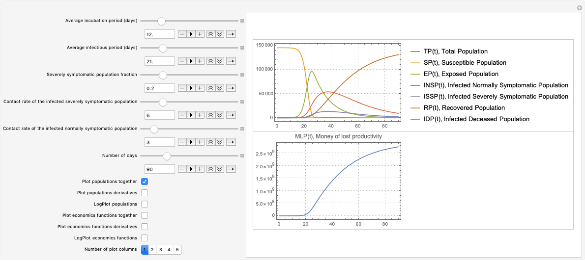

## Calibration over real data

It is important to calibrate these kind of models with real data, or at least to give a serious attempt to such a calibration. If the calibration is “too hard” or “impossible” that would indicate that the model is not that adequate. (If adequate at all.)

The calibration efforts can be (semi-)automated using special model-to-data goodness of fit functions and a minimization procedure. (See for example, [AA2].)

In this section we just attempt to calibrate SEI2R over real data taken from [WRI1] using a specialized interactive interface.

### Real data

Here is COVID-19 data taken from [WRI1] for the Chinese province Hubei:

```mathematica
aRealData = <|"RecoveredCases" -> {28, 28, 31, 
     32, 42, 45, 80, 88, 90, 141, 168, 295, 386, 522, 633, 817, 1115, 
     1439, 1795, 2222, 2639, 2686, 3459, 4774, 5623, 6639, 7862, 9128,
      10337, 11788, 11881, 15299, 15343, 16748, 18971, 20969, 23383, 
     26403, 28993, 31536, 33934, 36208, 38557, 40592, 42033, 43500, 
     45235}, "Deaths" -> {17, 17, 24, 40, 52, 76, 125, 125, 162, 
     204, 249, 350, 414, 479, 549, 618, 699, 780, 871, 974, 1068, 
     1068, 1310, 1457, 1596, 1696, 1789, 1921, 2029, 2144, 2144, 2346,
      2346, 2495, 2563, 2615, 2641, 2682, 2727, 2761, 2803, 2835, 
     2871, 2902, 2931, 2959, 2986}, 
   "Infected" -> {399, 399, 494, 689, 964, 1302, 3349, 3341, 
     4651, 5461, 6736, 10532, 12722, 15677, 18483, 20677, 23139, 
     24881, 26965, 28532, 29659, 29612, 43437, 48175, 49030, 49847, 
     50338, 50633, 49665, 48510, 48637, 46439, 46395, 45044, 43252, 
     41603, 39572, 36829, 34617, 32610, 30366, 28174, 25904, 23972, 
     22628, 21207, 19486}|>;
```

The total population in Hubei is

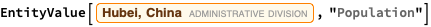


But we have to use a fraction of that population in order to produce good fits. That can be justified with the conjecture that the citizens of Hubei are spread out and it is mostly one city (Wuhan) where the outbreak is.

The real data have to be padded with a certain number of 0’s related to the infectious and incubation periods in order to make good fits. Such padding is easy to justify: if we observe recovered people that means that they passed through the incubation and infectious periods.

### Calibration interactive interface

In this interface we put the Infected Severely Symptomatic Population (ISSP) to zero. That way it is easier to compare the real data with the simulated results (and pick parameter values that give close fits.)
Also note that since SEI2R is simple in this interface the system is always solved.

```mathematica
Clear[PadRealData];
PadRealData[aData : Association[ (_String -> _?VectorQ) ..], 
   incubationPeriod_?IntegerQ, infectiousPeriod_?IntegerQ] :=
  
  Block[{},
   Join[ConstantArray[0, incubationPeriod + infectiousPeriod], #] & /@
     aData
   ];
```

```mathematica
opts = {PlotRange -> All, PlotLegends -> None, 
   PlotTheme -> "Detailed", PerformanceGoal -> "Speed", 
   ImageSize -> 300};
Manipulate[
 DynamicModule[{modelSI2R = modelSI2R, lsActualEquations, aSol, 
   lsPopulationPlots, lsEconPlots, lsRestPlots},
  
  modelSI2R = SetRateRules[modelSI2R, <|TP[t] -> population|>];
  modelSI2R = 
   SetInitialConditions[
    modelSI2R, <|SP[0] -> population - 1, ISSP[0] -> 0, 
     INSP[0] -> 1|>];
  lsActualEquations = 
   Join[modelSI2R["Equations"] //. 
     KeyDrop[modelSI2R["RateRules"], lsFocusParams], 
    modelSI2R["InitialConditions"]];
  aSol =
   Association@Flatten@
     ParametricNDSolve[
      lsActualEquations, {SP, EP, INSP, RP, IDP}, {t, 0, 365}, 
      lsFocusParams];
  
  lsPopulationPlots =
   ParametricSolutionsPlots[
    modelSI2R["Stocks"],
    KeyTake[aSol, GetPopulationSymbols[modelSI2R, __ ~~ "Population"]],
    {aincp, aip, 0, criap, criap}, ndays, "Together" -> True, 
    opts];
  
  Show[lsPopulationPlots[[1]], 
   ListPlot[
    PadRealData[aRealData, Round[aincp + padOffset], 
     Round[aip + padOffset]], PlotStyle -> {Blue, Black, Red}]]
  ],
 {{population, 58160000/600, "Population"}, 58160000/1000, 58160000, 
  10000, Appearance -> {"Open"}},
 {{padOffset, 0, "real data padding offset"}, -100, 100, 1, 
  Appearance -> {"Open"}},
 {{aincp, 6, "Average incubation period (days)"}, 1, 60, 1, 
  Appearance -> {"Open"}},
 {{aip, 32, "Average infectious period (days)"}, 1, 100, 1, 
  Appearance -> {"Open"}},
 {{criap, 0.8, 
   "Contact rate of the infected normally symptomatic population"}, 0,
   30, 0.1, Appearance -> {"Open"}},
 {{ndays, 90, "Number of days"}, 1, 365, 1, 
  Appearance -> {"Open"}},
 ControlPlacement -> Left, ContinuousAction -> False]
```

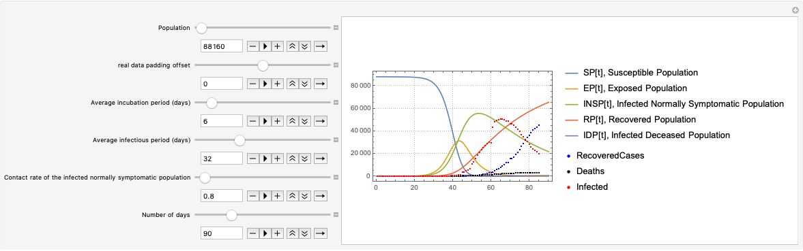

### Maybe good enough parameters

```mathematica
DynamicModule[{aincp = 6, aip = 32, criap = 0.8, ndays = 90, 
  padOffset = -8, population = 78160}, 
 DynamicModule[{modelSI2R = modelSI2R, lsActualEquations, aSol, 
   lsPopulationPlots, lsEconPlots, lsRestPlots}, 
  modelSI2R = 
   SetRateRules[modelSI2R, Association[TP[t] -> population]]; 
  modelSI2R = 
   SetInitialConditions[modelSI2R, 
    Association[SP[0] -> population - 1, ISSP[0] -> 0, 
     INSP[0] -> 1]]; 
  lsActualEquations = 
   Join[modelSI2R["Equations"] //.\[VeryThinSpace]KeyDrop[
      modelSI2R["RateRules"], lsFocusParams], 
    modelSI2R["InitialConditions"]]; 
  aSol = Association[
    Flatten[ParametricNDSolve[
      lsActualEquations, {SP, EP, INSP, RP, IDP}, {t, 0, 365}, 
      lsFocusParams]]]; 
  lsPopulationPlots = 
   ParametricSolutionsPlots[modelSI2R["Stocks"], 
    KeyTake[aSol, 
     GetPopulationSymbols[modelSI2R, __ ~~ "Population"]], {aincp, 
     aip, 0, criap, criap}, ndays, "Together" -> True, opts]; 
  Show[lsPopulationPlots[[1]], 
   ListPlot[
    PadRealData[aRealData, Round[aincp + padOffset], 
     Round[aip + padOffset]], PlotStyle -> {Blue, Black, Red}]]]]
```

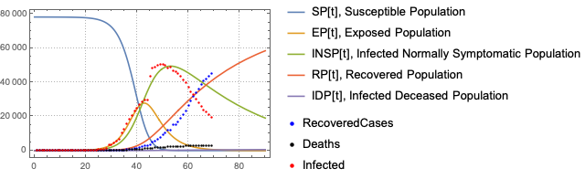

Basic reproduction number:


```
(*25.5966*)
```

```mathematica
DynamicModule[{aincp = 5, aip = 26, criap = 2.3, ndays = 90, 
  padOffset = -14, population = 75000}, 
 DynamicModule[{modelSI2R = modelSI2R, lsActualEquations, aSol, 
   lsPopulationPlots, lsEconPlots, lsRestPlots}, 
  modelSI2R = 
   SetRateRules[modelSI2R, Association[TP[t] -> population]]; 
  modelSI2R = 
   SetInitialConditions[modelSI2R, 
    Association[SP[0] -> population - 1, ISSP[0] -> 0, 
     INSP[0] -> 1]]; 
  lsActualEquations = 
   Join[modelSI2R["Equations"] //.\[VeryThinSpace]KeyDrop[
      modelSI2R["RateRules"], lsFocusParams], 
    modelSI2R["InitialConditions"]]; 
  aSol = Association[
    Flatten[ParametricNDSolve[
      lsActualEquations, {SP, EP, INSP, RP, IDP}, {t, 0, 365}, 
      lsFocusParams]]]; 
  lsPopulationPlots = 
   ParametricSolutionsPlots[modelSI2R["Stocks"], 
    KeyTake[aSol, 
     GetPopulationSymbols[modelSI2R, __ ~~ "Population"]], {aincp, 
     aip, 0, criap, criap}, ndays, "Together" -> True, opts]; 
  Show[lsPopulationPlots[[1]], 
   ListPlot[
    PadRealData[aRealData, Round[aincp + padOffset], 
     Round[aip + padOffset]], PlotStyle -> {Blue, Black, Red}]]]]
```

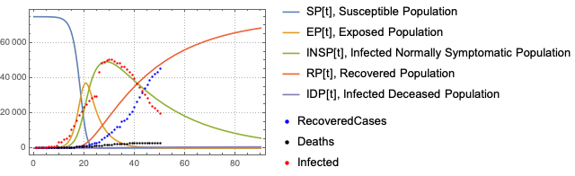

Basic reproduction number:

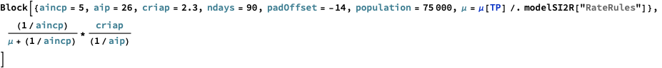

```
(*59.7934*)
```

## References

### Articles

[Wk1] Wikipedia entry, ["Compartmental models in epidemiology"](https://en.wikipedia.org/wiki/Compartmental_models_in_epidemiology).

[HH1] Herbert W. Hethcote (2000). ["The Mathematics of Infectious Diseases"](http://leonidzhukov.net/hse/2014/socialnetworks/papers/2000SiamRev.pdf). SIAM Review. 42 (4): 599–653. Bibcode:2000SIAMR..42..599H. doi:10.1137/s0036144500371907.

[AA1] Anton Antonov, ["Coronavirus propagation modeling considerations"](https://github.com/antononcube/SystemModeling/blob/master/Projects/Coronavirus-propagation-dynamics/Documents/Coronavirus-propagation-modeling-considerations.md), (2020), [SystemModeling at GitHub](https://github.com/antononcube/SystemModeling).

[AA2] Anton Antonov, [Answer of "Model calibration with phase space data"](https://mathematica.stackexchange.com/a/190295/34008), (2019), [Mathematica StackExchage](https://mathematica.stackexchange.com).

### Repositories & packages

[WRI1] Wolfram Research, Inc., ["Epidemic Data for Novel Coronavirus COVID-19"](https://www.wolframcloud.com/obj/resourcesystem/published/DataRepository/resources/Epidemic-Data-for-Novel-Coronavirus-COVID-19), [WolframCloud](https://www.wolframcloud.com).

[AAr1] Anton Antonov, [Coronavirus propagation dynamics project](https://github.com/antononcube/SystemModeling/tree/master/Projects/Coronavirus-propagation-dynamics), (2020), [SystemModeling at GitHub](https://github.com/antononcube/SystemModeling).

[AAp1] Anton Antonov, ["Epidemiology models Mathematica package"](https://github.com/antononcube/SystemModeling/blob/master/Projects/Coronavirus-propagation-dynamics/WL/EpidemiologyModels.m), (2020), [SystemsModeling at GitHub](https://github.com/antononcube/SystemModeling).

[AAp2] Anton Antonov, ["Epidemiology models modifications Mathematica package"](https://github.com/antononcube/SystemModeling/blob/master/Projects/Coronavirus-propagation-dynamics/WL/EpidemiologyModelModifications.m), (2020), [SystemsModeling at GitHub](https://github.com/antononcube/SystemModeling).

[AAp3] Anton Antonov, ["System dynamics interactive interfaces functions Mathematica package"](https://github.com/antononcube/SystemModeling/blob/master/WL/SystemDynamicsInteractiveInterfacesFunctions.m), (2020), [SystemsModeling at GitHub](https://github.com/antononcube/SystemModeling).
