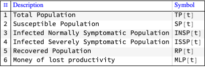
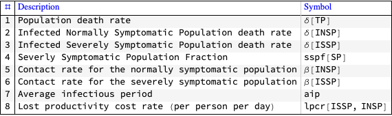
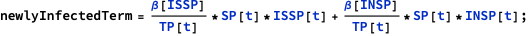
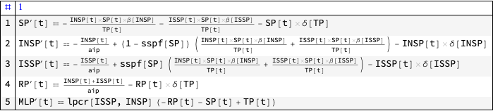
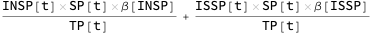
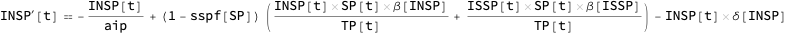
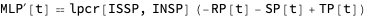
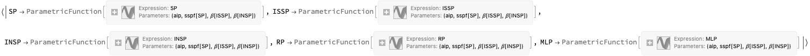
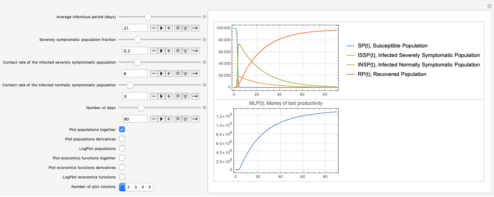

# Coronavirus propagation SIR model

Anton Antonov   
[MathematicaForPrediction at WordPress](https://mathematicaforprediction.wordpress.com)  
[SystemModeling at GitHub](https://github.com/antononcube/SystemModeling)   
March 2020

## Introduction

The [compartmental epidemiology SIR model](https://en.wikipedia.org/wiki/Compartmental_models_in_epidemiology) is the simplest core model to initiate the model(s) described and worked with in the notebook ["Simple Coronavirus propagation dynamics model"](Simple-Coronavirus-propagation-dynamics-model.nb).

The primary purpose of this notebook is to introduce both a discipline and workflow of specification, design, and experimenting with these kind of models. 

**Remark:** We consider the coronavirus propagation models as instances of the more general [System Dynamics (SD)](https://en.wikipedia.org/wiki/System_dynamics) models.

**Remark:** The SIR model is a classic epidemic model.

The model in this notebook differs from the classical SIR model with the following elements:

1. Two separate infected populations: one is "severely symptomatic", the other is "normally symptomatic"

2. The monetary equivalent of lost productivity due to infected or died people is tracked.

### Workflow outline

The model design workflow used in this notebook has the following steps. 

1. Get sufficiently familiar with the problem domain.

1. Come up with SD stocks, rates, (and loops.)

1. Write down dictionaries for the stocks and rates.

1. Write down the system of ODE’s.

1. Iteratively refine, extend, or review steps 2, 3, 4.

    1. There are dedicated articles and books on just these steps.

1. Search, obtain, or otherwise come up with meaningful initial values for the stocks.

1. Search, obtain, or otherwise come up with meaningful values for the rates.

1. Determine parameters in the system of ODE’s to focus on in order to investigate the behavior of the modeled system.

1. Visualize the stocks evolutions with respect to different values of the focus parameters.

    1. Use interactive interfaces for better impressions.

1. Make sensitivity analysis plots.

    1. In order to see the effects of a given parameter or a set of parameters.

1. Calibrate the model to fit observed data.

    1. This is an important step that is also optional if only qualitative results about the modeled system are of interest.

## Load packages

For the interactive plots we use the functions in the package [AAp1].

```mathematica
Import["https://raw.githubusercontent.com/antononcube/SystemModeling/master/WL/SystemDynamicsInteractiveInterfacesFunctions.m"]
```

## Model design

The description of the [SIR model](https://en.wikipedia.org/wiki/Compartmental_models_in_epidemiology) can be found in [Wk1, HH1]. 
The assumptions of the SIR model considered in this notebook can be found in [AA1]. 

## Model dictionary

In this section we make the **model dictionary** that is used in the mathematical model formulation. We use SD’s paradigm of stocks, rates.

### Stocks

```mathematica
aStocks = <|
   "Total Population" -> TP[t],
   "Susceptible Population" -> SP[t],
   "Infected Normally Symptomatic Population" -> INSP[t],
   "Infected Severely Symptomatic Population" -> ISSP[t],
   "Recovered Population" -> RP[t],
   "Money of lost productivity" -> MLP[t]
   |>;
```

### Rates

```mathematica
aRates = <|
   "Population death rate" -> 𝛿[TP],
   "Infected Normally Symptomatic Population death rate" -> 𝛿[INSP],
   "Infected Severely Symptomatic Population death rate" -> 𝛿[ISSP],
   "Severly Symptomatic Population Fraction" -> sspf[SP],
   "Contact rate for the normally symptomatic population" -> 𝛽[INSP],
   "Contact rate for the severely symptomatic population" -> 𝛽[ISSP],
   "Average infectious period" -> aip,
   "Lost productivity cost rate (per person per day)" -> lpcr[ISSP, INSP]
   |>;
```

### Tabulation

```mathematica
ResourceFunction["GridTableForm"][List @@@ Normal[aStocks], 
 TableHeadings -> {"Description", "Symbol"}]
```


```mathematica
ResourceFunction["GridTableForm"][List @@@ Normal[aRates], 
 TableHeadings -> {"Description", "Symbol"}]
```



## Model equations

In this section we specify and explain the equations of the modified [SIR model](https://en.wikipedia.org/wiki/Compartmental_models_in_epidemiology).

### Equations

In this sub-section we present the equations. (The corresponding rationale / explanations are given in the next sub-section.)



```mathematica
lsEquations = {
   SP'[t] == -newlyInfectedTerm - 𝛿[TP]*SP[t],
   INSP'[t] == (1 - sspf[SP])*newlyInfectedTerm - (1/aip)* INSP[t] - 𝛿[INSP]*INSP[t],
   ISSP'[t] == sspf[SP]*newlyInfectedTerm - (1/aip)*ISSP[t] - 𝛿[ISSP]* ISSP[t],
   RP'[t] == (1/aip)*(ISSP[t] + INSP[t]) - 𝛿[TP]*RP[t],
   MLP'[t] == lpcr[ISSP, INSP]*(TP[t] - RP[t] - SP[t])
   };
ResourceFunction["GridTableForm"][List /@ lsEquations]
```



### Equations explanations

#### Newly infected term

Since the newly infected population is going to participate in different Right Hand Sides (RHS) of the model equations we define it separately:

```mathematica
newlyInfectedTerm
```



We have two separate terms: one for the normally symptomatic infected population, the other for the severely symptomatic infected population. 
Each of these populations has its own contact rate, $\beta [\text{INSP}]$ and $\beta [\text{ISSP}]$ respectively.

#### Infected normally symptomatic population

One of the finds for the Coronavirus is that $\approx 20$% of the infected are severely symptomatic. 
This reflected in the parameter $\text{sspf}[\text{SP}]$; we multiple the newly infected by $1-\text{sspf}[\text{SP}]$ to obtain the normally symptomatic. 
The normally infected recover after average infectious period (aip) or with a certain rate $1/\text{aip}$. Note that aip the same for both normally and severely infected.
Further we subtract the number of infected that are going to die.

```mathematica
INSP'[t] == (1 - sspf[SP])*newlyInfectedTerm - (1/aip)*INSP[t] - 𝛿[INSP]*INSP[t]
```



#### Infected severely symptomatic population

The description of this equation is analogous to the description for “Infected normally symptomatic population” equation.

#### Recovered population

The recovered population is obtained from:
1. The average recover period (or rate) and the normally and severely symptomatic populations
2. The number of expected to die recovered.

#### Money from lost productivity

We have a simple monitoring stock $\text{MLP}[t]$ that shows the amount of money lost due to people being infected or dead because of infections. 
We assume that both the susceptible and the recovered are productive, and infected do not work. 
Hence, if we subtract the susceptible and recovered from the total population and multiply the result with appropriate loss rate we can the value for $\text{MLP}[t]$. 

```mathematica
MLP'[t] == lpcr[ISSP, INSP]*(TP[t] - RP[t] - SP[t])
```



## Simulations

### Parameters

The death rates and the average infectious period were obtained by World Wide Web searches. 
The contact rates $\beta [\_]$ and the lost productivity cost rate are completely heuristic.

```mathematica
aRateRules = <|
   TP[t] -> 100000,
   𝛿[TP] -> (800/10^5)/365,
   𝛿[ISSP] -> 0.035/aip,
   𝛿[INSP] -> 0.01/aip,
   𝛽[ISSP] -> 6,
   𝛽[INSP] -> 3,
   aip -> 4*7,
   sspf[SP] -> 0.2,
   lpcr[ISSP, INSP] -> 600
   |>;
```

### Equations with the actual parameters

To be used for parametric equation solving:

```mathematica
lsFocusParams = {aip, sspf[SP], 𝛽[ISSP], 𝛽[INSP]};
aParametricRateRules = KeyDrop[aRateRules, lsFocusParams];
```

```mathematica
lsActualEquations =
  Join[lsEquations /. Normal[aParametricRateRules],
   {
    SP[0] == (TP[t] /. aRateRules) - 2,
    ISSP[0] == 1,
    INSP[0] == 1,
    RP[0] == 0,
    MLP[0] == 0
    }];
```

### Solution

Here we solve a parametric system of ODE’s:

```mathematica
aSol =
 Association@Flatten@
   ParametricNDSolve[
    lsActualEquations, {SP, ISSP, INSP, RP, MLP}, {t, 0, 365}, 
    lsFocusParams]
```



## Interactive Plots

```mathematica
opts = {PlotRange -> All, PlotLegends -> None, 
   PlotTheme -> "Detailed", PerformanceGoal -> "Speed", 
   ImageSize -> 300};
lsPopulationKeys = {SP, ISSP, INSP, RP};
lsEconKeys = {MLP};
Manipulate[
 DynamicModule[{lsPopulationPlots, lsEconPlots, lsRestPlots},
  
  lsPopulationPlots =
   ParametricSolutionsPlots[
    aStocks,
    KeyTake[aSol, lsPopulationKeys],
    {aip, spf, crisp, criap}, ndays,
    "LogPlot" -> popLogPlotQ, "Together" -> popTogetherQ, 
    "Derivatives" -> popDerivativesQ, 
    "DerivativePrefix" -> "\[CapitalDelta]", opts];
  
  lsEconPlots =
   ParametricSolutionsPlots[
    aStocks,
    KeyTake[aSol, lsEconKeys],
    {aip, spf, crisp, criap}, ndays,
    "LogPlot" -> econLogPlotQ, "Together" -> econTogetherQ, 
    "Derivatives" -> econDerivativesQ, 
    "DerivativePrefix" -> "\[CapitalDelta]", opts];
  
  lsRestPlots =
   ParametricSolutionsPlots[
    aStocks,
    KeyDrop[aSol, Join[lsPopulationKeys, lsEconKeys]],
    {aip, spf, crisp, criap}, ndays,
    "LogPlot" -> econLogPlotQ, "Together" -> econTogetherQ, 
    "Derivatives" -> econDerivativesQ, 
    "DerivativePrefix" -> "\[CapitalDelta]", opts];
  
  Multicolumn[Join[lsPopulationPlots, lsEconPlots, lsRestPlots], 
   nPlotColumns, Dividers -> All, 
   FrameStyle -> GrayLevel[0.8]]
  ],
 {{aip, 21., "Average infectious period (days)"}, 1, 60., 1, Appearance -> {"Open"}},
 {{spf, 0.2, "Severely symptomatic population fraction"}, 0, 1, 0.025, Appearance -> {"Open"}},
 {{crisp, 6, "Contact rate of the infected severely symptomatic population"}, 0, 30, 0.1, Appearance -> {"Open"}},
 {{criap, 3, "Contact rate of the infected normally symptomatic population"}, 0, 30, 0.1, Appearance -> {"Open"}},
 {{ndays, 90, "Number of days"}, 1, 365, 1, Appearance -> {"Open"}},
 {{popTogetherQ, True, "Plot populations together"}, {False, True}},
 {{popDerivativesQ, False, "Plot populations derivatives"}, {False, True}},
 {{popLogPlotQ, False, "LogPlot populations"}, {False, True}},
 {{econTogetherQ, False, "Plot economics functions together"}, {False, True}},
 {{econDerivativesQ, False, "Plot economics functions derivatives"}, {False, True}},
 {{econLogPlotQ, False, "LogPlot economics functions"}, {False, True}},
 {{nPlotColumns, 2, "Number of plot columns"}, Range[5]},
 ControlPlacement -> Left, ContinuousAction -> False]
```



## References

[Wk1] Wikipedia entry, ["Compartmental models in epidemiology"](https://en.wikipedia.org/wiki/Compartmental_models_in_epidemiology).

[HH1] Herbert W. Hethcote (2000). ["The Mathematics of Infectious Diseases"](http://leonidzhukov.net/hse/2014/socialnetworks/papers/2000SiamRev.pdf). SIAM Review. 42 (4): 599–653. Bibcode:2000SIAMR..42..599H. doi:10.1137/s0036144500371907.

[AAr1] Anton Antonov, [Coronavirus propagation dynamics project](https://github.com/antononcube/SystemModeling/tree/master/Projects/Coronavirus-propagation-dynamics), (2020), [SystemModeling at GitHub](https://github.com/antononcube/SystemModeling).

[AAp1] Anton Antonov, ["System dynamics interactive interfaces functions Mathematica package"](https://github.com/antononcube/SystemModeling/blob/master/WL/SystemDynamicsInteractiveInterfacesFunctions.m), (2020), [SystemsModeling at GitHub](https://github.com/antononcube/SystemModeling).

[AA1] Anton Antonov, ["Coronavirus propagation modeling considerations"](https://github.com/antononcube/SystemModeling/blob/master/Projects/Coronavirus-propagation-dynamics/Documents/Coronavirus-propagation-modeling-considerations.md), (2020), [SystemModeling at GitHub](https://github.com/antononcube/SystemModeling).
