# Epidemiology Compartmental Modeling Monad

**Version 0.8**

Anton Antonov   
[MathematicaForPrediction at WordPress](https://mathematicaforprediction.wordpress.com)   
[SystemModeling at GitHub](https://github.com/antononcube/SystemModeling)  
April 2020   
July 2020   
October 2020   
December 2020  

## Introduction

In this document we describe the design and demonstrate the implementation of a (software programming) monad, [Wk1], for Epidemiology Compartmental Modeling (ECM) workflows specification and execution. The design and implementation are done with Mathematica / Wolfram Language (WL).

Monad’s name is “ECMMon”, which stands for “**E**pidemiology **C**ompartmental **M**odeling **Mon**ad”, and its monadic implementation is based on the State monad package [“StateMonadCodeGenerator.m”](https://github.com/antononcube/MathematicaForPrediction/blob/master/MonadicProgramming/StateMonadCodeGenerator.m), [[AAp1](https://github.com/antononcube/MathematicaForPrediction/blob/master/MonadicProgramming/StateMonadCodeGenerator.m), [AA1](https://github.com/antononcube/MathematicaForPrediction/blob/master/MarkdownDocuments/Monad-code-generation-and-extension.md)], 
ECMMon is implemented in the package [], which relies on the packages [AAp3-AAp6]. The original ECM workflow discussed in [AA5] was implemented in [AAp7]. An R implementation of ECMon is provided by the package [[AAr2](https://github.com/antononcube/ECMMon-R)].

The goal of the monad design is to make the specification of ECM workflows (relatively) easy and straightforward by following a certain main scenarios and specifying variations over that scenario.

We use real-life COVID-19 data, The New York Times COVID-19 data, see [NYT1, AA5].

The monadic programming design is used as a [Software Design Pattern](https://en.wikipedia.org/wiki/Software_design_pattern). The LSAMon monad can be also seen as a [Domain Specific Language](https://en.wikipedia.org/wiki/Domain-specific_language) (DSL) for the specification and programming of machine learning classification workflows.  

Here is an example of using the `ECMMon` monad over a compartmental model with two types of infected populations:

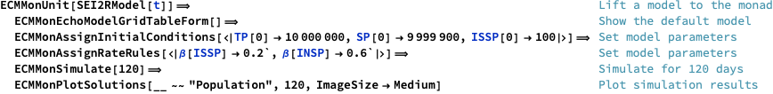

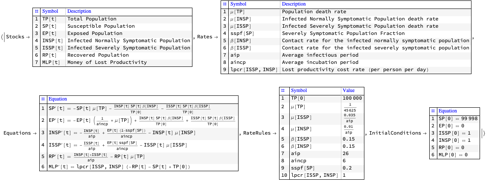

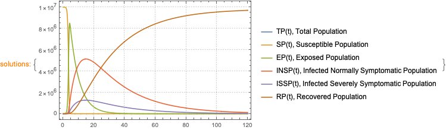

The table above is produced with the package [“MonadicTracing.m”](https://github.com/antononcube/MathematicaForPrediction/blob/master/MonadicProgramming/MonadicTracing.m), [[AAp2](https://github.com/antononcube/MathematicaForPrediction/blob/master/MonadicProgramming/MonadicTracing.m), [AA1](https://github.com/antononcube/MathematicaForPrediction/blob/master/MarkdownDocuments/Monad-code-generation-and-extension.md)], and some of the explanations below also utilize that package.

As it was mentioned above the monad `ECMMon` can be seen as a DSL. Because of this the monad pipelines made with `ECMMon` are sometimes called “specifications”.

### Contents description

The document has the following structure.

- The sections "Package load" and "Data load" obtain the needed code and data.

    - (Needed and put upfront from the [“Reproducible research”](https://en.wikipedia.org/wiki/Reproducibility#Reproducible_research) point of view.)

- The section "Design consideration" provide motivation and design decisions rationale.

- The section “Single site models” give brief descriptions of certain “seed” models that can be used in the monad.

- The section "Single-site model workflow demo", "Multi-site workflow demo” give demonstrations of  how to utilize the `ECMMon` monad .

    - Using concrete practical scenarios and “real life” data.

- The section “Batch simulation and calibration process” gives methodological preparation for the content of the next two sections.

- The section “Batch simulation workflow” and “Calibration workflow” describe how to do most important monad workflows after the model is developed.

- The section "Future plans" outlines future directions of development.

    - (The most interesting and important one is the [“conversational agent”](https://github.com/antononcube/ConversationalAgents/tree/master/Projects/TimeSeriesWorkflowsAgent) direction.)

**Remark:** One can read only the sections "Introduction", "Design consideration", “Single-site models”, and "Batch simulation and calibration process". That set of sections provide a fairly good, programming language agnostic exposition of the substance and novel ideas of this document.

## Package load

In this section we load packages used in this notebook:

```mathematica
Import["https://raw.githubusercontent.com/antononcube/SystemModeling/master/Projects/Coronavirus-propagation-dynamics/WL/MonadicEpidemiologyCompartmentalModeling.m"];
Import["https://raw.githubusercontent.com/antononcube/SystemModeling/master/Projects/Coronavirus-propagation-dynamics/WL/MultiSiteModelSimulation.m"]
Import["https://raw.githubusercontent.com/antononcube/MathematicaForPrediction/master/MonadicProgramming/MonadicTracing.m"]
Import["https://raw.githubusercontent.com/antononcube/ConversationalAgents/master/Packages/WL/ExternalParsersHookup.m"]
```

**Remark:** The import commands above would trigger some other package imports.

## Data load

In this section we ingest data using the “umbrella function” MultiSiteModelReadData from [AAp5]:

### Read data

```mathematica
AbsoluteTiming[
  aData = MultiSiteModelReadData[]; 
 ]

(*{38.8635, Null}*)
```

### Data summaries

```mathematica
ResourceFunction["RecordsSummary"] /@ aData
```

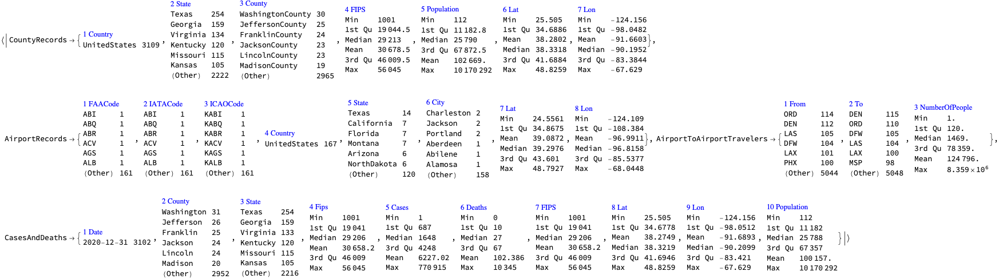

### Transform data

Here we transform the population related data in a form convenient for specifying the simulations with it:

```mathematica
aPopulations = Association@Map[{#Lon, #Lat} -> #Population &, Normal[aData["CountyRecords"]]];
aInfected = Association@Map[{#Lon, #Lat} -> #Cases &, Normal[aData["CasesAndDeaths"]]];
aDead = Association@Map[{#Lon, #Lat} -> #Deaths &, Normal[aData["CasesAndDeaths"]]];
```

### Geo-visualizations

Using the built-in function `GeoHistogram` we summarize the USA county populations, and COViD-19 infection cases and deaths:

```mathematica
Row@MapThread[GeoHistogram[KeyMap[Reverse, #1], Quantity[140, "Miles"], PlotLabel -> #2, PlotTheme -> "Scientific", PlotLegends -> Automatic, ImageSize -> Medium] &, {{aPopulations, aInfected, aDead}, {"Populations", "Infected", "Dead"}}]
```

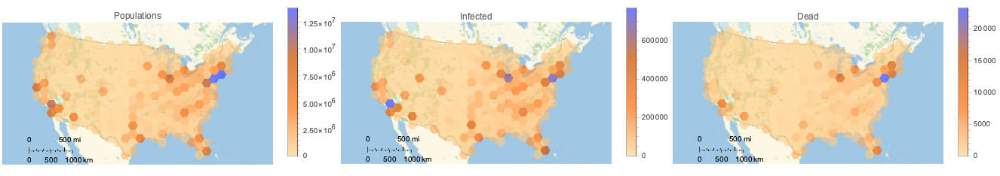

(Note that in the plots above we have to reverse the keys of the given population associations.)

Using the function `HextileHistogram` from 
[[AAp7](https://github.com/antononcube/MathematicaForPrediction/blob/master/Misc/HextileBins.m)] 
here we visualize USA county populations over a hexagonal grid with cell radius 2 degrees ($\approx 140$ miles $\approx 222$ kilometers):

```mathematica
HextileHistogram[aPopulations, 2, PlotRange -> All, PlotLegends -> Automatic, ImageSize -> Large]
```

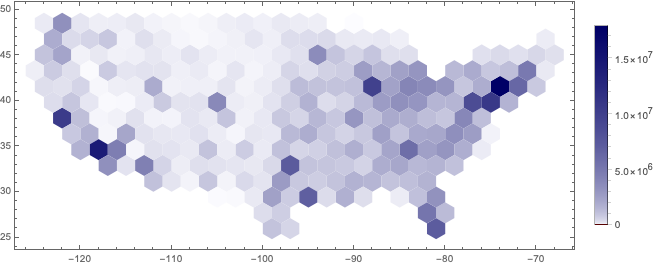

In this notebook we prefer using `HextileHistogram` because it represents the simulation data in geometrically more faithful way.

## Design considerations

### The big picture

The main purpose of the designed epidemic compartmental modeling framework (i.e. software monad) is to have the ability to do multiple, systematic simulations for different scenario play-outs over large scale geographical regions. The target end-users are decision makers at government level and researchers of pandemic or other large scale epidemic effects.

Here is a diagram that shows the envisioned big picture workflow:


### Large-scale modeling

The standard classical compartmental epidemiology models are not adequate over large geographical areas, like, countries. We design a software framework  -- the monad `ECMMon` --  that allows large scale simulations using a simple principle workflow:

1. Develop a ***single-site model*** for relatively densely populated geographical area for which the assumptions of the classical models (approximately) hold.

1. Extend the single-site model into a large-scale ***multi-site model*** using statistically derived traveling patterns; see [AA4].

1. Supply the multi-site model with appropriately prepared data.

1. Run multiple simulations to see large scale implications of different policies.

1. Calibrate the model to concrete observed (or faked) data. Go to 4. 

### Flow chart

The following flow chart visualizes the possible workflows the software monad ECMMon:  


### Two models in the monad

- An `ECMMon` object can have one or two models. One of the models is a “seed”, single-site model from [AAp1], which, if desired, is scaled into a multi-site model, [AA3, AAp2].

- Workflows with only the single-site model are supported.

    - Say, workflows for doing sensitivity analysis, [AA6, BC1]. 

- Scaling of a single-site model into multi-site is supported and facilitated. 

- Workflows for the multi-site model include preliminary model scaling steps and simulation steps.

- After the single-site model is scaled the monad functions use the multi-site model.

- The workflows should be easy to specify and read.

### Single-site model workflow

1. Make a single-site model.

1. Assign stocks initial conditions.

1. Assign rates values.

1. Simulate.

1. Plot results.

1. Go to 2.

### Multi-site model workflow

1. Make a single-site model.

1. Assign initial conditions and rates.

1. Scale the single-site model into a multi-site model.

    1. The single-site assigned rates become “global” when the single-site model is scaled.

    1. The scaling is based on assumptions for traveling patterns of the populations.

    1. There are few alternatives for that scaling:

        1. Using locations geo-coordinates

        1. Using regular grids covering a certain area based on in-habited locations geo-coordinates

        1. Using traveling patterns contingency matrices

        1. Using “artificial” patterns of certain regular types for qualitative analysis purposes

1. Enhance the multi-site traveling patterns matrix and re-scale the single site model.

    1. We might want to combine traveling patterns by ground transportation with traveling patterns by airplanes.

    1. For quarantine scenarios this might a less important capability of the monad.

        1. Hence, this an optional step.

1. Assign stocks initial conditions for each of the sites in multi-scale model.

1. Assign rates for each of the sites.

1. Simulate.

1. Plot global simulation results.

1. Plot simulation results for focus sites.

## Single-site models

We have a collection of single-site models that have different properties and different modeling goals, [AAp3, AA7, AA8]. Here is as diagram of a single-site model that includes hospital beds and medical supplies as limitation resources, [AA7]:


### SEI2HR model

In this sub-section we briefly describe the model SEI2HR, which is used in the examples below.

**Remark:** SEI2HR stands for "Susceptible, Exposed, Infected Two, Hospitalized, Recovered" (populations).

Detailed description of the SEI2HR model is given in [AA7].

#### Verbal description

We start with one infected (normally symptomatic) person, the rest of the people are susceptible. The infected people meet other people directly or get in contact with them indirectly. (Say, susceptible people touch things touched by infected.) For each susceptible person there is a probability to get the decease. The decease has an incubation period: before becoming infected the susceptible are (merely) exposed. The infected recover after a certain average infection period or die. A certain fraction of the infected become severely symptomatic. If there are enough hospital beds the severely symptomatic infected are hospitalized. The hospitalized severely infected have different death rate than the non-hospitalized ones. The number of hospital beds might change: hospitals are extended, new hospitals are build, or there are not enough medical personnel or supplies. The deaths from infection are tracked (accumulated.) Money for hospital services and money from lost productivity are tracked (accumulated.) 

The equations below give mathematical interpretation of the model description above.

#### Equations

Here are the equations of one the epidemiology compartmental models, SEI2HR, [AA7], implemented in [AAp3]:

```mathematica
ModelGridTableForm[SEI2HRModel[t], "Tooltips" -> False]["Equations"] /. {eq_Equal :> TraditionalForm[eq]}
```

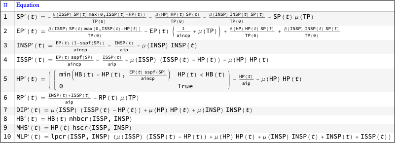

The equations for Susceptible, Exposed, Infected, Recovered populations of SEI2R are "standard" and explanations about them are found in [WK2, HH1]. For SEI2HR those equations change because of the stocks Hospitalized Population and Hospital Beds.

The equations time unit is one day. The time horizon is one year. In this document we consider COVID-19, [Wk2, AA1], hence we do not consider births.

## Single-site model workflow demo

In this section we demonstrate some of the sensitivity analysis discussed in [AA6, BC1].

Make a single-site model, SEI2HR:

```mathematica
model1 = SEI2HRModel[t, "InitialConditions" -> True, "RateRules" -> True, "TotalPopulationRepresentation" -> "AlgebraicEquation"];
```

Make an association with “default” parameters:

```mathematica
aDefaultPars = <|
    aip -> 26, 
    aincp -> 5, 
    \[Beta][ISSP] -> 0.5*Piecewise[{{1, t < qsd}, {qcrf, qsd <= t <= qsd + ql}}, 1], 
    \[Beta][INSP] -> 0.5*Piecewise[{{1, t < qsd}, {qcrf, qsd <= t <= qsd + ql}}, 1], 
    qsd -> 60, 
    ql -> 21, 
    qcrf -> 0.25, 
    \[Beta][HP] -> 0.01, 
    \[Mu][ISSP] -> 0.035/aip, 
    \[Mu][INSP] -> 0.01/aip, 
    nhbr[TP] -> 3/1000, 
    lpcr[ISSP, INSP] -> 1, 
    hscr[ISSP, INSP] -> 1 
   |>;
```

Execute the workflow multiple times with different quarantine starts:

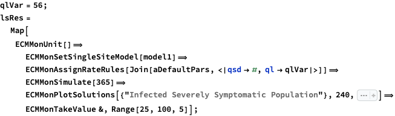

Plot the simulation solutions for “Infected Severely Symptomatic Population”:

```mathematica
Multicolumn[#[[1, 1]] & /@ lsRes, 4]
```

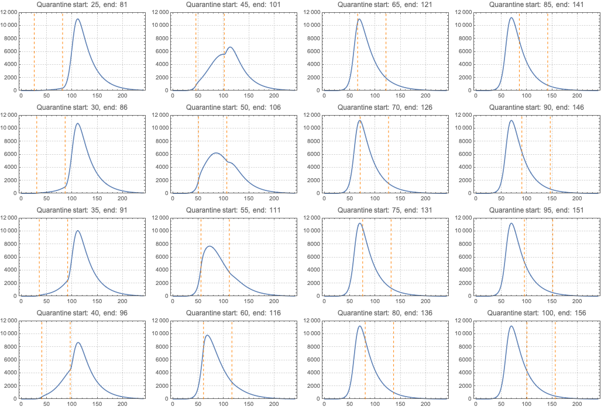

Both theoretical and computational details of the workflow above are given [AA7, AA8].

## Multi-site workflow demo

In this section we demonstrate the multi-site model workflow using COVID-19 data for USA, [WRI2, NYT1]. 

Here a “seed”, single-site model is created:

```mathematica
model1 = SEI2HRModel[t, "InitialConditions" -> True, "RateRules" -> True, "TotalPopulationRepresentation" -> "AlgebraicEquation"];
```

Here we specify a multi-site model workflow (the monadic steps are separated and described with purple print-outs):

```mathematica
ecmObj = 
   ECMMonUnit[]⟹
    ECMMonSetSingleSiteModel[model1]⟹
    ECMMonAssignRateRules[
     <|
      aip -> 26, 
      aincp -> 5, 
      \[Beta][ISSP] -> 0.5*Piecewise[{{1, t < qsd}, {qcrf, qsd <= t <= qsd + ql}}, 1], 
      \[Beta][INSP] -> 0.5*Piecewise[{{1, t < qsd}, {qcrf, qsd <= t <= qsd + ql}}, 1], 
      qsd -> 0, 
      ql -> 56, 
      qcrf -> 0.25, 
      \[Beta][HP] -> 0.01, 
      \[Mu][ISSP] -> 0.035/aip, 
      \[Mu][INSP] -> 0.01/aip, 
      nhbr[TP] -> 3/1000, 
      lpcr[ISSP, INSP] -> 1, 
      hscr[ISSP, INSP] -> 1 
     |> 
    ]⟹
    ECMMonEcho[Style["Show the single-site model tabulated form:", Bold, Purple]]⟹
    ECMMonEchoFunctionContext[Magnify[ModelGridTableForm[#singleSiteModel], 1] &]⟹
    ECMMonMakePolygonGrid[Keys[aPopulations], 1.5, "BinningFunction" -> Automatic]⟹
    ECMMonEcho[Style["Show the grid based on population coordinates:", Bold, Purple]]⟹
    ECMMonPlotGrid["CellIDs" -> True, ImageSize -> Large]⟹
    ECMMonExtendByGrid[aPopulations, 0.12]⟹
    ECMMonAssignInitialConditions[aPopulations, "Total Population", "Default" -> 0]⟹
    ECMMonAssignInitialConditions[DeriveSusceptiblePopulation[aPopulations, aInfected, aDead], "Susceptible Population", "Default" -> 0]⟹
    ECMMonAssignInitialConditions[<||>, "Exposed Population", "Default" -> 0]⟹
    ECMMonAssignInitialConditions[aInfected, "Infected Normally Symptomatic Population", "Default" -> 0]⟹
    ECMMonAssignInitialConditions[<||>, "Infected Severely Symptomatic Population", "Default" -> 0]⟹
    ECMMonEcho[Style["Show total populations initial conditions data:", Bold, Purple]]⟹
    ECMMonPlotGridHistogram[aPopulations, ImageSize -> Large, PlotLabel -> "Total populations"]⟹
    ECMMonEcho[Style["Show infected and deceased initial conditions data:", Bold,Purple]]⟹
    ECMMonPlotGridHistogram[aInfected, ColorFunction -> ColorData["RoseColors"], "ShowDataPoints" -> False, ImageSize -> Large, PlotLabel -> "Infected"]⟹
    ECMMonPlotGridHistogram[aDead, ColorFunction -> ColorData["RoseColors"], "ShowDataPoints" -> False, ImageSize -> Large, PlotLabel -> "Deceased"]⟹
    ECMMonEcho[Style["Simulate:", Bold, Purple]]⟹
    ECMMonSimulate[365]⟹
    ECMMonEcho[Style["Show global population simulation results:", Bold, Purple]]⟹
    ECMMonPlotSolutions[__ ~~ "Population", 365]⟹
    ECMMonEcho[Style["Show site simulation results for Miami and New York areas:", Bold, Purple]]⟹
    ECMMonPlotSiteSolutions[{160, 174}, __ ~~ "Population", 365]⟹
    ECMMonEcho[Style["Show deceased and hospitalzed populations results for Miami and New York areas:", Bold, Purple]]⟹
    ECMMonPlotSiteSolutions[{160, 174}, {"Deceased Infected Population", "Hospitalized Population","Hospital Beds"}, 300, "FocusTime" -> 120];
```


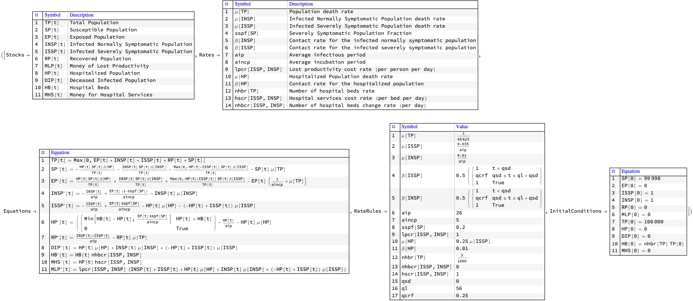


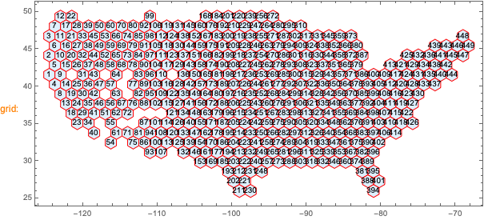


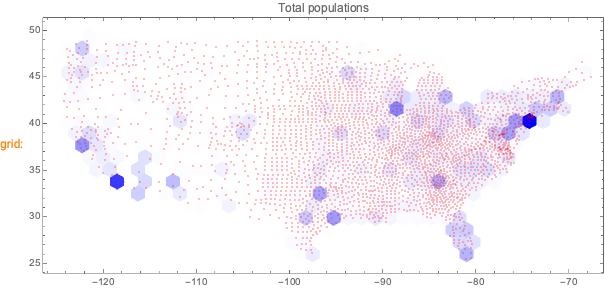


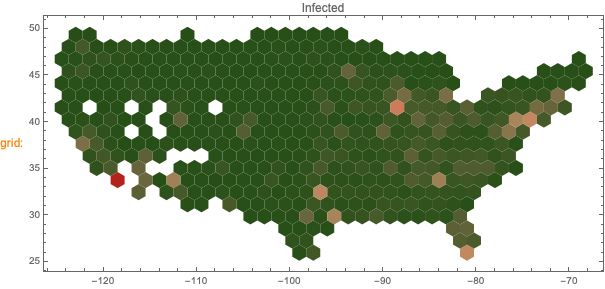

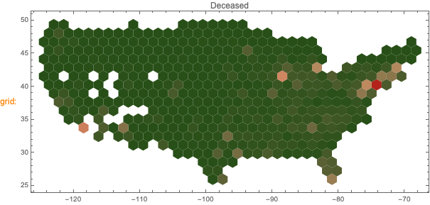


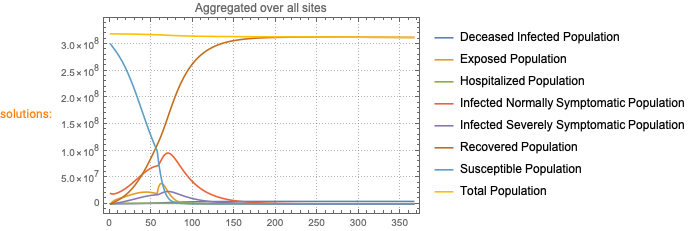


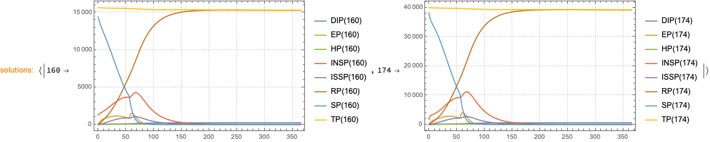


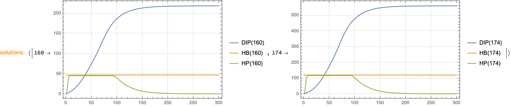

Theoretical and computational details about the multi-site workflow can be found in [AA4, AA5].

## Batch simulations and calibration processes

In this section we describe the in general terms the processes of model batch simulations and model calibration. The next two sections give more details of the corresponding software design and workflows.

### Definitions

**Batch simulation:** If given a SD model $M$, the set $P$ of parameters of $M$, and a set $B$ of sets of values $P$,  $B\text{:=}\left\{V_i\right\}$, then the set of multiple runs of $M$ over $B$ are called *batch simulation*.

**Calibration:** If given a model $M$, the set $P$ of parameters of $M$, and a set of $k$ time series $T\text{:=}\left\{T_i\right\}_{i=1}^k$ that correspond to the set of stocks $S\text{:=}\left\{S_i\right\}_{i=1}^k$ of $M$ then the process of finding concrete the values $V$ for $P$ that make the stocks $S$ to closely resemble the time series $T$ according to some metric is called *calibration* of $M$ over the ***targets*** $T$.

### Roles

- There are three types of people dealing with the models:

    - **Modeler**, who develops and implements the model and prepares it for calibration.

    - **Calibrator**, who calibrates the model with different data for different parameters.

    - **Stakeholder**, who requires different features of the model and outcomes from different scenario play-outs.

- There are two main calibration scenarios:

    - Modeler and Calibrator are the same person

    - Modeler and Calibrator are different persons

### Process

Model development and calibration is most likely going to be an iterative process.

For concreteness let us assume that the model has matured development-wise and batch simulation and model calibration is done in a (more) formal way.

Here are the steps of a well defined process between the modeling activity players described above:

1. Stakeholder requires certain scenarios to be investigated.

1. Modeler prepares the model for those scenarios.

1. Stakeholder and Modeler formulate a calibration request.

1. Calibrator uses the specifications from the calibration request to:

    1. Calibrate the model

    1. Derive model outcomes results

    1. Provide model qualitative results

    1. Provide model sensitivity analysis results

1. Modeler (and maybe Stakeholder) review the results and decides should more calibration be done.

    1. I.e. go to 3.

1. Modeler does batch simulations with the calibrated model for the investigation scenarios.

1. Modeler and Stakeholder prepare report with the results.

See the documents [AA9, AA10] have questionnaires that further clarify the details of interaction between the modelers and calibrators.

### Batch simulation vs calibration

In order to clarify the similarities and differences between batch simulation and calibration we list the following observations: 

- Each batch simulation or model calibration is done either for model development purposes or for scenario play-out studies.

- Batch simulation is used for qualitative studies of the model. For example, doing sensitivity analysis; see [BC1, AA7, AA8].

- Before starting the calibration we might want to study the “landscape” of the search space of the calibration parameters using batch simulations.

- Batch simulation is also done after model calibration in order to evaluate different scenarios,

- For some models with large computational complexity batch simulation -- together with some evaluation metric -- can be used instead of model calibration.

## Batch simulations workflow

In this section we describe the specification and execution of model batch simulations.

Batch simulations can be time consuming, hence it is good idea to

In the rest of the section we go through the following steps:

1. Make a model object

1. Batch simulate over a few combinations of parameters and show:

    1. Plots of the simulation results for all populations

    1. Plots of the simulation results for a particular population

1. Batch simulate over the Cartesian (outer) product of values lists of a selected pair of parameters and show the corresponding plots of all simulations

### Model (object) for batch simulations

Here we make a new `ECMMon` object:

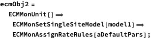

### Direct specification of combinations of parameters

#### All populations

Here we simulate the model in the object of different parameter combinations given in a list of associations:

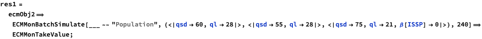

**Remark:** The stocks in the results are only stocks that are populations -- 
that is specified with the string expression pattern `___~~”Population”`.

Here is the shape of the result:

```mathematica
Short /@ res1
```


Here are the corresponding plots:

```mathematica
ListLinePlot[#, PlotTheme -> "Detailed", ImageSize -> Medium, PlotRange -> All] & /@ res1
```

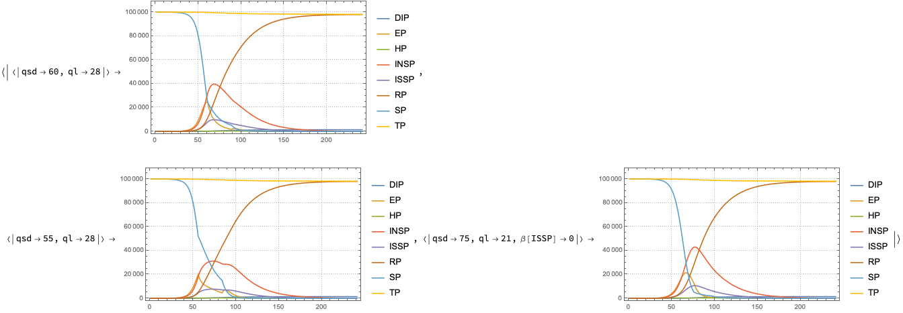

#### Focus population

We might be interested in the batch simulations results for only one, focus populations. Here is an example:

```mathematica
res2 = 
   ecmObj2⟹
    ECMMonBatchSimulate["Infected Normally Symptomatic Population", {<|qsd -> 60, ql -> 28|>, <|qsd -> 55, ql -> 28|>, <|qsd -> 75, ql -> 21, \[Beta][ISSP] -> 0|>}, 240]⟹
    ECMMonTakeValue;
```

Here is the shape of the result:

```mathematica
Short /@ res2
```

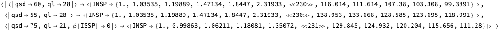

Here are the corresponding plots:

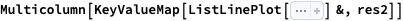

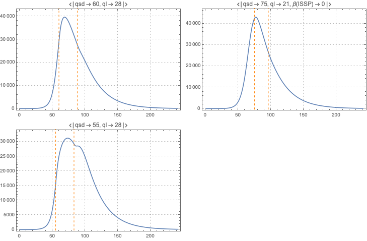

### Outer product of parameters

Instead of specifying an the combinations of parameters directly we can specify the values taken by each parameter using an association in which the keys are parameters and the values are list of values:

```mathematica
res3 = 
   ecmObj2⟹
    ECMMonBatchSimulate[__ ~~ "Population", <|qsd -> {60, 55, 75}, ql -> {28, 21}|>, 240]⟹
    ECMMonTakeValue;
```

Here is the shallow form of the results

```mathematica
Short /@ res3
```

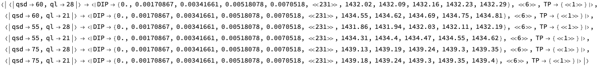

Here are the corresponding plots:

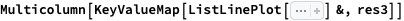


## Calibration workflow

In this section we go through the computation steps of the calibration of single-site SEI2HR model.

**Remark:** We use real data in this section, but the presented calibration results and outcome plots are for illustration purposes only. 
A rigorous study with discussion of the related assumptions and conclusions is beyond the scope of this notebook/document.

### Calibration steps

Here are the steps performed in the rest of the sub-sections of this section:

1. Ingest data for infected cases, deaths due to disease, etc.

1. Choose a model to calibrate.

1. Make the calibration targets -- those a vectors corresponding to time series over regular grids.

    1. Consider using all of the data in order to evaluate model’s applicability.

    1. Consider using fractions of the data in order to evaluate model’s ability to predict the future or reconstruct data gaps.

1. Choose calibration parameters and corresponding ranges for their values.

1. If more than one target choose the relative weight (or importance) of the targets.

1. Calibrate the model.

1. Evaluate the fitting between the simulation results and data.

    1. Using statistics and plots.

1.  Make conclusions. If insufficiently good results are obtained go to 2 or 4.

**Remark:** When doing calibration epidemiological models a team of people it is better certain to follow (rigorously) well defined procedures. See the documents: 

**Remark:** We plan to prepare have several notebooks dedicated to calibration of both single-site and multi-site models.

### USA COVID-19 data

Here data for the USA COVID-19 infection cases and deaths from [NYT1] (see [AA6] data ingestion details):

```mathematica
lsCases = {1, 1, 1, 2, 3, 5, 5, 5, 5, 6, 7, 8, 11, 11, 11, 12, 12, 12,12, 12, 13, 13, 14, 15, 15, 15, 15, 25, 25, 25, 27, 30, 30, 30, 43, 45, 60, 60, 65, 70, 85, 101, 121, 157, 222, 303, 413, 530, 725,976, 1206, 1566, 2045, 2603, 3240, 4009, 5222, 6947, 9824, 13434, 17918, 23448, 30082, 37696, 46791, 59678, 73970, 88796, 103318, 119676, 139165, 160159, 184764, 212033, 241127, 262275, 288195, 314991, 341540, 370689, 398491, 423424, 445213, 467106, 490170, 512972, 539600, 566777, 590997, 613302, 637812, 660549, 685165, 714907, 747741, 777098, 800341, 820764, 844225, 868644, 895924, 927372, 953923, 977395, 998136, 1020622, 1043873, 1069587, 1095405,1118643, 1137145, 1155671, 1176913, 1196485, 1222057, 1245777, 1267911, 1285105, 1306316, 1326559, 1349019, 1373255, 1395981, 1416682, 1436260, 1455183, 1473813, 1491974, 1513223, 1536848, 1559020, 1578876, 1600414, 1620096, 1639677, 1660303, 1688335, 1709852, 1727711, 1745546, 1763803, 1784049, 1806724, 1831494, 1855870, 1874023, 1894074, 1918373, 1943743, 1970066, 2001470, 2031613, 2057493, 2088420, 2123068, 2159633, 2199841, 2244876, 2286401, 2324563, 2362875, 2411709, 2461341, 2514500, 2573030, 2622980, 2667278, 2713656, 2767129, 2825865, 2885325, 2952393, 3012349, 3069369, 3129738, 3194944, 3263077, 3338308, 3407962, 3469137, 3529938, 3588229, 3653114, 3721574, 3790356, 3862588, 3928575, 3981476, 4039440, 4101329, 4167741, 4235717, 4303663, 4359188, 4408708, 4455340, 4507370, 4560539, 4617036, 4676822, 4730639, 4777548, 4823529, 4876038, 4929115, 4981066, 5038637, 5089258, 5130147, 5166032, 5206970, 5251824, 5297150, 5344322, 5388034, 5419494, 5458726, 5497530, 5541830, 5586297, 5631403, 5674714, 5707327, 5742814, 5786178, 5817338, 5862014, 5917466, 5958619, 5988001, 6012054, 6040456, 6073671, 6110645, 6157050, 6195893, 6228601, 6264192, 6301923, 6341145, 6385411, 6432677, 6472474, 6507345, 6560827, 6597281, 6638806, 6682079, 6734971, 6776512, 6812354, 6847745, 6889421, 6930523, 6975693, 7027692, 7073962, 7107992, 7168298, 7210171, 7261433, 7315687, 7373073, 7422798, 7466501, 7513020, 7565839, 7625285, 7688761, 7757326, 7808123, 7853753, 7916879, 7976530, 8039653, 8113165, 8193658, 8270925, 8328369, 8401001, 8473618, 8555199, 8642599, 8737995, 8814233, 8892933, 8983153, 9074711, 9182627, 9301455, 9436244, 9558668, 9659817, 9784920, 9923082, 10065150, 10222441, 10405550, 10560047, 10691686, 10852769, 11011484, 11183982, 11367840, 11561152, 11727724, 11864571, 12039323, 12213742, 12397014, 12495699, 12693598, 12838076, 12972986, 13135728, 13315143, 13516558, 13728192, 13958512, 14158135, 14325555, 14519697, 14731424, 14954596, 15174109, 15447371, 15647963, 15826415, 16020169, 16218331, 16465552, 16697862, 16941306, 17132902, 17305013, 17498382, 17694678, 17918870, 18106293, 18200349, 18410644, 18559596, 18740591, 18932346, 19157710};
```

```mathematica
lsDeaths = {0, 0, 0, 0, 0, 0, 0, 0, 0, 0, 0, 0, 0, 0, 0, 0, 0, 0, 0, 0, 0, 0, 0, 0, 0, 0, 0, 0, 0, 0, 0, 0, 0, 0, 0, 0, 0, 0, 0, 1, 3, 6, 10, 12, 12, 15, 19, 22, 26, 31, 37, 43, 50, 59, 63, 84, 106, 137, 181, 223, 284, 335, 419, 535, 694, 880, 1181, 1444, 1598, 1955, 2490, 3117, 3904, 4601, 5864, 6408, 7376, 8850, 10159, 11415,12924, 14229, 15185, 16320, 18257, 20168, 21941, 23382, 24617, 26160, 27535, 29821, 31633, 33410, 35104, 36780, 37660, 38805, 40801, 42976, 44959, 46552, 48064, 49122, 50012, 52079, 54509, 56277, 57766, 59083, 59903, 60840, 62299, 63961, 65623, 67143, 68260, 68959, 69633, 71042, 72474, 73718, 74907, 75891, 76416, 76888, 77579, 79183, 80329, 81452, 82360, 82904, 83582, 84604, 85545, 86487, 87559, 88256, 88624, 89235, 90220, 91070, 91900, 92621, 93282, 93578, 93988, 94710, 95444, 96123, 96760, 97297, 97514, 97832, 98638, 99372, 101807, 102525, 103018, 103258, 103594,104257, 104886, 105558, 106148, 106388, 106614, 106998, 107921, 108806, 109705, 110522, 111177, 111567, 111950, 112882, 113856, 114797, 115695, 116458, 116854, 117367, 118475, 119606, 120684, 121814, 122673, 123105, 124782, 126089, 127465, 128720, 130131, 131172, 131584, 132174, 133517, 134756, 135271, 136584, 137547, 138076, 138601, 140037, 141484, 142656, 143793, 144819, 145315, 145831, 147148, 148517, 149550, 150707, 151641, 152065, 152551, 153741, 154908, 156026, 157006, 157869, 158235, 158714, 159781, 160851, 161916, 162869, 163573, 163970, 164213, 164654, 165811, 166713, 167913, 168594, 168990, 169423, 170674, 171663, 172493, 173408, 174075, 174281, 174689, 175626, 176698, 177559, 178390, 179145, 179398, 179736, 180641, 181607, 182455, 183282, 183975, 184298, 184698, 185414, 186359, 187280, 188168, 188741, 189165, 189501, 190312, 191267, 192077, 192940, 193603, 193976, 194481, 195405, 196563, 197386, 198271, 199126, 199462, 199998, 200965, 201969, 202958, 203878, 204691, 205119, 205623, 206757, 208331, 209417, 210829, 211838, 212277, 212989, 214442, 215872, 217029, 218595, 219791, 220402, 221165, 222750, 224641, 226589, 228452, 229868, 230695, 231669, 233856, 236127, 237284, 238636, 239809, 240607, 241834, 244430, 247258, 250102, 252637, 254784, 255857, 257282, 260038, 263240, 266144, 268940, 271172, 272499, 274082, 277088, 280637, 283899, 286640, 289168, 290552, 292346, 295549, 298953, 301713, 302802, 304403, 305581, 307396, 310994, 314654};
```

**Remark:** The COVID-19 data was ingested from [NYT1] on 2020-12-31,

### Calibration targets

From the data we make the calibration targets association:

```mathematica
aTargets = <|{ISSP -> 0.2 lsCases, INSP -> 0.8 lsCases, DIP -> lsDeaths}|>;
```

**Remark:** Note that we split the infection cases into 20% severely symptomatic cases and 80% normally symptomatic cases.

Here is the corresponding plot:

```mathematica
ListLogPlot[aTargets, PlotTheme -> "Detailed", PlotLabel -> "Calibration targets", ImageSize -> Medium]
```

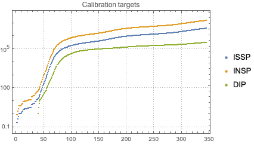

Here we prepare a smaller set of the targets data for the calibration experiments below:

```mathematica
aTargetsShort = Take[#, 170] & /@ aTargets;
```

### Model creation

```mathematica
modelSEI2HR = SEI2HRModel[t, "TotalPopulationRepresentation" -> "AlgebraicEquation"];
```

Here are the parameters we want to experiment with (or do calibration with):

```mathematica
lsFocusParams = {aincp, aip, sspf[SP], \[Beta][HP], qsd, ql, qcrf, nhbcr[ISSP, INSP], nhbr[TP]};
```

Here we set custom rates and initial conditions:

```mathematica
aDefaultPars = <|
    \[Beta][ISSP] -> 0.5*Piecewise[{{1, t < qsd}, {qcrf, qsd <= t <= qsd + ql}}, 1], 
    \[Beta][INSP] -> 0.5*Piecewise[{{1, t < qsd}, {qcrf, qsd <= t <= qsd + ql}}, 1], 
    qsd -> 60, 
    ql -> 8*7, 
    qcrf -> 0.25, 
    \[Beta][HP] -> 0.01, 
    \[Mu][ISSP] -> 0.035/aip, 
    \[Mu][INSP] -> 0.01/aip, 
    nhbr[TP] -> 3/1000, 
    lpcr[ISSP, INSP] -> 1, 
    hscr[ISSP, INSP] -> 1 
   |>;
```

**Remark:** Note the piecewise functions for $\beta [\text{ISSP}]$ and $\beta [\text{INSP}]$.

### Calibration

Here is the USA population number we use for calibration:

```mathematica
usaPopulation = QuantityMagnitude@CountryData["UnitedStates", "Population"]

(*329064917*)
```

Here is we create a `ECMMon` object that has default parameters and initial conditions assigned above:

```mathematica
AbsoluteTiming[
  ecmObj3 = 
    ECMMonUnit[]⟹
     ECMMonSetSingleSiteModel[modelSEI2HR]⟹
     ECMMonAssignInitialConditions[<|TP[0] -> usaPopulation, SP[0] -> usaPopulation - 1, ISSP[0] -> 1|>]⟹
     ECMMonAssignRateRules[KeyDrop[aDefaultPars, {aip, aincp, qsd, ql, qcrf}]]⟹
     ECMMonCalibrate[
      "Target" -> KeyTake[aTargetsShort, {ISSP, DIP}], 
      "StockWeights" -> <|ISSP -> 0.8, DIP -> 0.2|>, 
      "Parameters" -> <|aip -> {10, 35}, aincp -> {2, 16}, qsd -> {60, 120}, ql -> {20, 160}, qcrf -> {0.1, 0.9}|>, 
      DistanceFunction -> EuclideanDistance, 
      Method -> {"NelderMead", "PostProcess" -> False}, 
      MaxIterations -> 1000 
     ]; 
 ]

(*{28.0993, Null}*)
```

Here are the found parameters:

```mathematica
calRes = ecmObj3⟹ECMMonTakeValue

(*{152516., {aip -> 10., aincp -> 3.67018, qsd -> 81.7067, ql -> 111.422, qcrf -> 0.312499}}*)
```

#### Using different minimization methods and distance functions

In the monad the calibration of the models is done with `NMinimize`. 
Hence, the monad function `ECMMonCalibrate` takes all options of `NMinimize` and can do calibrations 
with the same data and parameter search space using different global minima finding methods and distance functions.

**Remark:** `EuclideanDistance` is an obvious distance function, but use others like infinity norm and sum norm. 
Also, we can use a distance function that takes parts of the data. 
(E.g. between days 50 and 150 because the rest of the data is, say, unreliable.)

### Verification of the fit

```mathematica
maxTime = Length[aTargets[[1]]];
```

```mathematica
ecmObj4 = 
   ECMMonUnit[]⟹
    ECMMonSetSingleSiteModel[modelSEI2HR]⟹
    ECMMonAssignInitialConditions[<|TP[0] -> usaPopulation, SP[0] -> usaPopulation - 1, ISSP[0] -> 1|>]⟹
    ECMMonAssignRateRules[Join[aDefaultPars, Association[calRes[[2]]]]]⟹
    ECMMonSimulate[maxTime]⟹
    ECMMonPlotSolutions[___ ~~ "Population" ~~ ___, maxTime, ImageSize -> Large, LogPlot -> False];
```

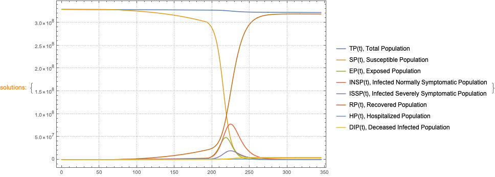

```mathematica
aSol4 = ecmObj4⟹ECMMonGetSolutionValues[Keys[aTargets], maxTime]⟹ECMMonTakeValue;
```

```mathematica
Map[ListLogPlot[{aSol4[#], aTargets[#]}, PlotLabel -> #, PlotRange -> All, ImageSize -> Medium, PlotLegends -> {"Calibrated model", "Target"}] &, Keys[aTargets]]
```

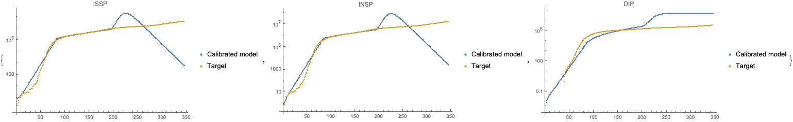

### Conclusions from the calibration results

We see the that with the calibration found parameter values the model can fit the data for the first 200 days, after that it overestimates the evolution of the infected and deceased popupulations.

We can conjecture that:

- The model is too simple, hence inadequate

- That more complicated quarantine policy functions have to be used

- That the calibration process got stuck in some local minima

## Future plans

In this section we outline some of the directions in which the presented work on `ECMMon` can be extended.

### More unit tests and random unit tests

We consider the preparation and systematic utilization of unit tests to be a very important component of any software development. Unit tests are especially important when complicated software package like `ECMMon` are developed.

For the presented software monad (and its separately developed, underlying packages) have implemented a few collections of tests, see [AAp10, AAp11]. 

We plan to extend and add more complicated unit tests that test for both quantitative and qualitative behavior. Here are some examples for such tests:

- Stock-vs-stock orbits produced by simulations of certain epidemic models

- Expected theoretical relationships between populations (or other stocks) for certain initial conditions and rates

- Wave-like propagation of the proportions of the infected populations in multi-site models over artificial countries and traveling patterns

- Finding of correct parameter values with model calibration over different data (both artificial and real life)

- Expected number of equations for different model set-ups

- Expected (relative) speed of simulations with respect to model sizes

Further for the monad `ECMMon` we plant to develop random pipeline unit tests as the ones in [AAp12] for the classification monad [ClCon](https://github.com/antononcube/MathematicaForPrediction/blob/master/MonadicProgramming/MonadicContextualClassification.m), [[AA11](https://mathematicaforprediction.wordpress.com/2018/05/15/a-monad-for-classification-workflows/)].

### More comprehensive calibration guides and documentation

We plan to produce more comprehensive guides for doing calibration with `ECMMon` and in general with Mathematica’s [NDSolve](https://reference.wolfram.com/language/ref/NDSolve.html) and [NMinimize](https://reference.wolfram.com/language/ref/NMinimize.html) functions.

### Full correspondence between the Mathematica and R implementations

The ingredients of the software monad `ECMMon` and `ECMMon` itself were designed and implemented in Mathematica first. The corresponding design and implementation was done in R, [[AAr2](https://github.com/antononcube/ECMMon-R)]. To distinguish the two implementations we call the R one ECMMon-R and Mathematica (Wolfram Language) one ECMMon-WL.  

At this point the calibration is not implemented in ECMMon-R, but we plan to do that soon. 

Using ECMMon-R (and the RStudio’s Shiny ecosystem) allows for highly shareable interactive interfaces to be programed. Here is an example: https://antononcube.shinyapps.io/SEI2HR-flexdashboard/ .

(With Mathematica similar interactive interfaces are presented in [AA7, AA8].)

### Model transfer between Mathematica and R

We are very interested in transferring epidemiological models from Mathematica to R (or Python, or Julia.)

This can be done in two principle ways: (i) using Mathematica expressions parsers, or (ii) using matrix representations. We plan to investigate the usage of both approaches.

### Conversational agent

Consider the making of a conversational agent for epidemiology modeling workflows building. Initial design and implementation is given in [AA13, AA14].

Consider the following epidemiology modeling workflow specification:

```mathematica
lsCommands = "create with SEI2HR;assign 100000 to total population;set infected normally symptomatic population to be 0;set infected severely symptomatic population to be 1;assign 0.56 to contact rate of infected normally symptomatic population;assign 0.58 to contact rate of infected severely symptomatic population;assign 0.1 to contact rate of the hospitalized population;simulate for 240 days;plot populations results;calibrate for target DIPt -> tsDeaths, over parameters contactRateISSP in from 0.1 to 0.7;echo pipeline value";
```

Here is the `ECMMon` code generated using the workflow specification:

```mathematica
ToEpidemiologyModelingWorkflowCode[lsCommands, "Execute" -> False, "StringResult" -> True]

(*"ECMMonUnit[SEI2HRModel[t]] ⟹ECMMonAssignInitialConditions[<|TP[0] -> 100000|>] ⟹ECMMonAssignInitialConditions[<|INSP[0] -> 0|>] ⟹ECMMonAssignInitialConditions[<|ISSP[0] -> 1|>] ⟹ECMMonAssignRateRules[<|\\[Beta][INSP] -> 0.56|>] ⟹ECMMonAssignRateRules[<|\\[Beta][ISSP] -> 0.58|>] ⟹ECMMonAssignRateRules[<|\\[Beta][HP] -> 0.1|>] ⟹ECMMonSimulate[\"MaxTime\" -> 240] ⟹ECMMonPlotSolutions[ \"Stocks\" -> __ ~~ \"Population\"] ⟹ECMMonCalibrate[ \"Target\" -> <|DIP -> tsDeaths|>, \"Parameters\" -> <|\\[Beta][ISSP] -> {0.1, 0.7}|> ] ⟹ECMMonEchoValue[]"*)
```

Here is the execution of the code above:

```mathematica
Block[{tsDeaths = Take[lsDeaths, 150]}, ToEpidemiologyModelingWorkflowCode[lsCommands]];
```

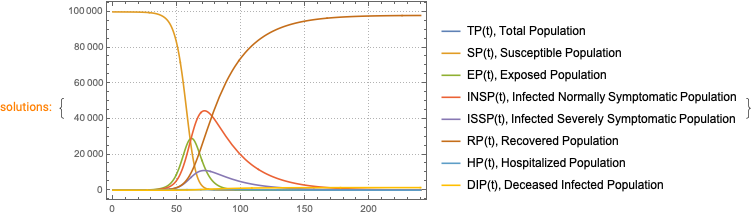


#### Different target languages

Using the natural commands workflow specification we can generate code to other languages, like, Python or R:

```mathematica
ToEpidemiologyModelingWorkflowCode[lsCommands, "Target" -> "Python"]

(*"obj = ECMMonUnit( model = SEI2HRModel())obj = ECMMonAssignInitialConditions( ecmObj = obj, initConds = [TPt = 100000])obj = ECMMonAssignInitialConditions( ecmObj = obj, initConds = [INSPt = 0])obj = ECMMonAssignInitialConditions( ecmObj = obj, initConds = [ISSPt = 1])obj = ECMMonAssignRateValues( ecmObj = obj, rateValues = [contactRateINSP = 0.56])obj = ECMMonAssignRateValues( ecmObj = obj, rateValues = [contactRateISSP = 0.58])obj = ECMMonAssignRateValues( ecmObj = obj, rateValues = [contactRateHP = 0.1])obj = ECMMonSimulate( ecmObj = obj, maxTime = 240)obj = ECMMonPlotSolutions( ecmObj = obj, stocksSpec = \".*Population\")obj = ECMMonCalibrate( ecmObj = obj,  target = [DIPt = tsDeaths], parameters = [contactRateISSP = [0.1, 0.7]] )"*)
```

## References

### Articles

[Wk1] Wikipedia entry, [Monad](https://en.wikipedia.org/wiki/Monad_(functional_programming)).

[Wk2] Wikipedia entry, ["Compartmental models in epidemiology"](https://en.wikipedia.org/wiki/Compartmental_models_in_epidemiology).

[Wk3] Wikipedia entry, ["Coronavirus disease 2019"](https://en.wikipedia.org/wiki/Coronavirus_disease_2019).

[BC1] Lucia Breierova,  Mark Choudhari,  [An Introduction to Sensitivity Analysis](https://ocw.mit.edu/courses/sloan-school-of-management/15-988-system-dynamics-self-study-fall-1998-spring-1999/readings/sensitivityanalysis.pdf), (1996), Massachusetts Institute of Technology.

[JS1] John D.Sterman, Business Dynamics: Systems Thinking and Modeling for a Complex World. (2000), New York: McGraw.

[HH1] Herbert W. Hethcote (2000). ["The Mathematics of Infectious Diseases"](http://leonidzhukov.net/hse/2014/socialnetworks/papers/2000SiamRev.pdf). SIAM Review. 42 (4): 599–653. Bibcode:2000SIAMR..42..599H. doi:10.1137/s0036144500371907.

[AA1] Anton Antonov, [”Monad code generation and extension”](https://github.com/antononcube/MathematicaForPrediction/blob/master/MarkdownDocuments/Monad-code-generation-and-extension.md), (2017),  [MathematicaForPrediction at GitHub/antononcube](https://github.com/antononcube/MathematicaForPrediction)*.*

[AA2] Anton Antonov, ["Coronavirus propagation modeling considerations"](https://github.com/antononcube/SystemModeling/blob/master/Projects/Coronavirus-propagation-dynamics/Documents/Coronavirus-propagation-modeling-considerations.md), (2020), [SystemModeling at GitHub/antononcube](https://github.com/antononcube/SystemModeling).

[AA3] Anton Antonov, ["Basic experiments workflow for simple epidemiological models"](https://github.com/antononcube/SystemModeling/blob/master/Projects/Coronavirus-propagation-dynamics/Documents/Basic-experiments-workflow-for-simple-epidemiological-models.md), (2020), [SystemModeling at GitHub/antononcube](https://github.com/antononcube/SystemModeling).

[AA4] Anton Antonov, ["Scaling of Epidemiology Models with Multi-site Compartments"](https://github.com/antononcube/SystemModeling/blob/master/Projects/Coronavirus-propagation-dynamics/Documents/Scaling-of-epidemiology-models-with-multi-site-compartments.md), (2020), [SystemModeling at GitHub/antononcube](https://github.com/antononcube/SystemModeling).

[AA5] Anton Antonov, ["WirVsVirus hackathon multi-site SEI2R over a hexagonal grid graph"](https://github.com/antononcube/SystemModeling/blob/master/Projects/Coronavirus-propagation-dynamics/Documents/WirVsVirus-hackathon-Multi-site-SEI2R-over-a-hexagonal-grid-graph.md), (2020), [SystemModeling at GitHub/antononcube](https://github.com/antononcube/SystemModeling).

[AA6] Anton Antonov, ["NY Times COVID-19 data visualization"](https://github.com/antononcube/SystemModeling/blob/master/Projects/Coronavirus-propagation-dynamics/Documents/NYTimes-COVID-19-data-visualization.md), (2020), [SystemModeling at GitHub/antononcube](https://github.com/antononcube/SystemModeling).

[AA7] Anton Antonov, ["SEI2HR model with quarantine scenarios"](https://github.com/antononcube/SystemModeling/blob/master/Projects/Coronavirus-propagation-dynamics/Documents/SEI2HR-model-with-quarantine-scenarios.md)[, ](https://github.com/antononcube/SystemModeling/blob/master/Projects/Coronavirus-propagation-dynamics/Documents/Scaling-of-epidemiology-models-with-multi-site-compartments.md)(2020), [SystemModeling at GitHub/antononcube](https://github.com/antononcube/SystemModeling).

[AA8] Anton Antonov, ["SEI2HR-Econ model with quarantine and supplies scenarios"](https://github.com/antononcube/SystemModeling/blob/master/Projects/Coronavirus-propagation-dynamics/Documents/SEI2HR-Econ-model-with-quarantine-and-supplies-scenarios.md), (2020), [SystemModeling at GitHub/antononcube](https://github.com/antononcube/SystemModeling).

[AA9] Anton Antonov, [Modelers questionnaire](https://github.com/antononcube/SystemModeling/blob/master/org/Modelers-questionnaire.org), (2020), [SystemModeling at GitHub/antononcube](https://github.com/antononcube/SystemModeling).

[AA10] Anton Antonov, [Calibrators questionnaire](https://github.com/antononcube/SystemModeling/blob/master/org/Calibrators-questionnaire.org), (2020), [SystemModeling at GitHub/antononcube](https://github.com/antononcube/SystemModeling).

[AA11] Anton Antonov, [A monad for classification workflows](https://mathematicaforprediction.wordpress.com/2018/05/15/a-monad-for-classification-workflows/), (2018), [MathematicaForPrediction at WordPress](https://mathematicaforprediction.wordpress.com).

### Repositories, packages

[WRI1] Wolfram Research, Inc., ["Epidemic Data for Novel Coronavirus COVID-19"](https://www.wolframcloud.com/obj/resourcesystem/published/DataRepository/resources/Epidemic-Data-for-Novel-Coronavirus-COVID-19), [WolframCloud](https://www.wolframcloud.com).

[WRI2] Wolfram Research Inc., [USA county records](https://github.com/antononcube/SystemModeling/blob/master/Data/dfUSACountyRecords.csv), (2020), [System Modeling at GitHub](https://github.com/antononcube/SystemModeling).

[NYT1] The New York Times, [Coronavirus (Covid-19) Data in the United States](https://github.com/nytimes/covid-19-data), (2020), GitHub.

[AAr1] Anton Antonov, [Coronavirus propagation dynamics project](https://github.com/antononcube/SystemModeling/tree/master/Projects/Coronavirus-propagation-dynamics), (2020), [SystemModeling at GitHub/antononcube](https://github.com/antononcube/SystemModeling).

[AAr2] Anton Antonov, [Epidemiology Compartmental Modeling Monad R package](https://github.com/antononcube/ECMMon-R), (2020), [ECMMon-R at GitHu/antononcube](https://github.com/antononcube/ECMMon-R).

[AAp1] Anton Antonov, [State monad code generator Mathematica package](https://github.com/antononcube/MathematicaForPrediction/blob/master/MonadicProgramming/StateMonadCodeGenerator.m), (2017), [MathematicaForPrediction at GitHub/antononcube](https://github.com/antononcube/MathematicaForPrediction)*.*

[AAp2] Anton Antonov, [Monadic tracing Mathematica package](https://github.com/antononcube/MathematicaForPrediction/blob/master/MonadicProgramming/MonadicTracing.m), (2017), [MathematicaForPrediction at GitHub/antononcube](https://github.com/antononcube/MathematicaForPrediction)*.*

[AAp3] Anton Antonov, [Epidemiology models Mathematica package](https://github.com/antononcube/SystemModeling/blob/master/Projects/Coronavirus-propagation-dynamics/WL/EpidemiologyModels.m), (2020), [SystemModeling at GitHub/antononcube](https://github.com/antononcube/SystemModeling).

[AAp4] Anton Antonov, [Epidemiology models modifications Mathematica package](https://github.com/antononcube/SystemModeling/blob/master/Projects/Coronavirus-propagation-dynamics/WL/EpidemiologyModelModifications.m), (2020), [SystemModeling at GitHub/antononcube](https://github.com/antononcube/SystemModeling).

[AAp5] Anton Antonov, [Epidemiology modeling visualization functions Mathematica package](https://github.com/antononcube/SystemModeling/blob/master/Projects/Coronavirus-propagation-dynamics/WL/EpidemiologyModelingVisualizationFunctions.m), (2020), [SystemModeling at GitHub/antononcube](https://github.com/antononcube/SystemModeling).

[AAp6] Anton Antonov, [System dynamics interactive interfaces functions Mathematica package](https://github.com/antononcube/SystemModeling/blob/master/WL/SystemDynamicsInteractiveInterfacesFunctions.m), (2020), [SystemModeling at GitHub/antononcube](https://github.com/antononcube/SystemModeling).

[AAp7] Anton Antonov, [Multi-site model simulation Mathematica package](https://github.com/antononcube/SystemModeling/blob/master/Projects/Coronavirus-propagation-dynamics/WL/MultiSiteModelSimulation.m), (2020), [SystemModeling at GitHub/antononcube](https://github.com/antononcube/SystemModeling).

[AAp8] Anton Antonov, [Monadic Epidemiology Compartmental Modeling Mathematica package](https://github.com/antononcube/SystemModeling/blob/master/Projects/Coronavirus-propagation-dynamics/WL/MonadicEpidemiologyCompartmentalModeling.m), (2020), [SystemModeling at GitHub/antononcube](https://github.com/antononcube/SystemModeling).

[AAp9] Anton Antonov, [Hextile bins Mathematica package](https://github.com/antononcube/MathematicaForPrediction/blob/master/Misc/HextileBins.m), (2020), [MathematicaForPrediction at GitHub/antononcube](https://github.com/antononcube/MathematicaForPrediction).

[AAp10] Anton Antonov, [Monadic Epidemiology Compartmental Modeling Mathematica unit tests](https://github.com/antononcube/SystemModeling/blob/master/Projects/Coronavirus-propagation-dynamics/WL/UnitTests/MonadicEpidemiologyCompartmentalModeling-Unit-Tests.mt), (2020), [SystemModeling at GitHub/antononcube](https://github.com/antononcube/SystemModeling).

[AAp11] Anton Antonov, [Epidemiology Models NDSolve Mathematica unit tests](https://github.com/antononcube/SystemModeling/blob/master/Projects/Coronavirus-propagation-dynamics/WL/UnitTests/EpidemiologyModels-NDSolve-Unit-Tests.m), (2020), [SystemModeling at GitHub/antononcube](https://github.com/antononcube/SystemModeling).

[AAp12] Anton Antonov, [Monadic contextual classification random pipelines Mathematica unit tests](https://github.com/antononcube/MathematicaForPrediction/blob/master/UnitTests/MonadicContextualClassificationRandomPipelinesUnitTests.m), (2018), [MathematicaForPrediction at GitHub/antononcube](https://github.com/antononcube/MathematicaForPrediction)*.*

[AAp13] Anton Antonov, [Epidemiology Modeling Workflows Raku package](https://github.com/antononcube/Raku-DSL-English-EpidemiologyModelingWorkflows), (2020), [Raku-DSL-English-EpidemiologyModelingWorkflows at GitHu/antononcube](https://github.com/antononcube/Raku-DSL-English-EpidemiologyModelingWorkflows).

[AAp14] Anton Antonov, [External Parsers Hookup Mathematica package](https://github.com/antononcube/ConversationalAgents/blob/master/Packages/WL/ExternalParsersHookup.m), (2019), [ConversationalAgents at GitHub](https://github.com/antononcube/ConversationalAgents).
