# Making Graphs over System Dynamics Models

Anton Antonov   
[MathematicaForPrediction at WordPress](https://mathematicaforprediction.wordpress.com)   
[SystemModeling at GitHub](https://github.com/antononcube/SystemModeling)   
December 2020   

## Introduction

In this document we give usage examples for the functions of the package, 
["SystemDynamicsModelGraph.m"](https://github.com/antononcube/SystemModeling/blob/master/WL/SystemDynamicsModelGraph.m), 
[[AAp1](https://github.com/antononcube/SystemModeling/blob/master/WL/SystemDynamicsModelGraph.m)]. The package provides functions for making dependency graphs for the stocks in [System Dynamics (SD)](https://en.wikipedia.org/wiki/System_dynamics) models. The primary motivation for creating the functions in this package is to have the ability to introspect, proofread, and verify the (typical) ODE models made in SD.

A more detailed explanation is:

- For a given SD system $S$ of Ordinary Differential Equations (ODEs) we make Mathematica graph objects that represent the interaction of variable dependent functions in $S$. 

- Those graph objects give alternative (and hopefully convenient) way of visualizing the model of $S$. 

## Load packages

The following commands load the packages [AAp1, AAp2, AAp3]:

```mathematica
Import["https://raw.githubusercontent.com/antononcube/SystemModeling/master/WL/SystemDynamicsModelGraph.m"]
Import["https://raw.githubusercontent.com/antononcube/SystemModeling/master/Projects/Coronavirus-propagation-dynamics/WL/EpidemiologyModels.m"]
Import["https://raw.githubusercontent.com/antononcube/MathematicaForPrediction/master/Misc/CallGraph.m"]
```

## Usage examples

### Equations

Here is a system of ODEs of a slightly modified [SEIR model](https://en.wikipedia.org/wiki/Compartmental_models_in_epidemiology#The_SEIR_model): 

```mathematica
lsEqs = {Derivative[1][SP][t] == -((IP[t] SP[t] \[Beta][IP])/TP[t]) - SP[t] \[Mu][TP], Derivative[1][EP][t] == (IP[t] SP[t] \[Beta][IP])/TP[t] - EP[t] (1/aincp + \[Mu][TP]), Derivative[1][IP][t] == EP[t]/aincp - IP[t]/aip - IP[t] \[Mu][IP], Derivative[1][RP][t] == IP[t]/aip - RP[t] \[Mu][TP], TP[t] == Max[0, EP[t] + IP[t] + RP[t] + SP[t]]};
ResourceFunction["GridTableForm"][List /@ lsEqs, TableHeadings -> {"Equations"}]
```

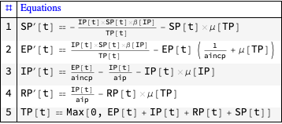

### Model graph

Here is a graph of the dependencies between the populations:

```mathematica
ModelDependencyGraph[lsEqs, {EP, IP, RP, SP, TP}, t]
```

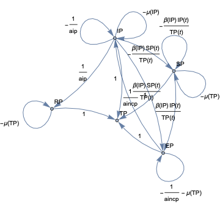

When the second argument given to `ModelDependencyGraph` is `Automatic` the stocks in the equations are heuristically 
found with the function `ModelHeuristicStocks`:

```mathematica
ModelHeuristicStocks[lsEqs, t]

(*{EP, IP, RP, SP, TP}*)
```

Also, the function `ModelDependencyGraph` takes all options of `Graph`:

```mathematica
ModelDependencyGraph[lsEqs, Automatic, t, 
  GraphLayout -> "GravityEmbedding", VertexLabels -> "Name", VertexLabelStyle -> Directive[Red, Bold, 16], EdgeLabelStyle -> Directive[Blue, 16], ImageSize -> Large]
```

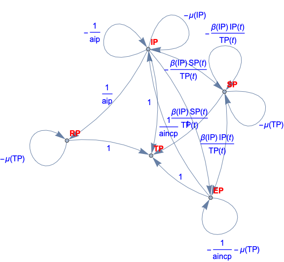

### Dependencies only

The dependencies in the model can be found with the function `ModelDependencyGraphEdges`:

```mathematica
lsEdges = ModelDependencyGraphEdges[lsEqs, Automatic, t]
```

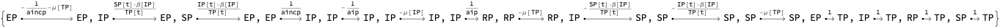

```mathematica
lsEdges[[4]] // FullForm
```

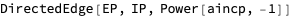

### Focus stocks

Here is a graph for a set of “focus” stocks-sources to a set of “focus” stocks-destinations:

```mathematica
gr = ModelDependencyGraph[lsEqs, {IP, SP}, {EP}, t]
```

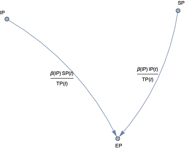

Compare with the graph in which the argument positions of sources and destinations of the previous command are swapped:

```mathematica
ModelDependencyGraph[lsEqs, {EP}, {IP, SP}, t]
```

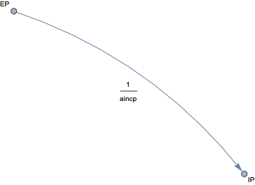

## Additional interfacing

The functions of this package work with the models from the package ["EpidemiologyModels.m"](https://github.com/antononcube/SystemModeling/blob/master/Projects/Coronavirus-propagation-dynamics/WL/EpidemiologyModels.m), [[AAp2](https://github.com/antononcube/SystemModeling/blob/master/Projects/Coronavirus-propagation-dynamics/WL/EpidemiologyModels.m)].

Here is a model from \[AAp2\]:

```mathematica
model = SEIRModel[t, "TotalPopulationRepresentation" -> "AlgebraicEquation"];
ModelGridTableForm[model]
```

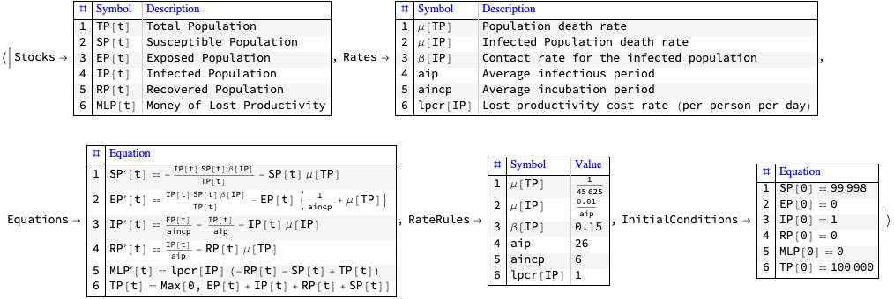

Here we make the corresponding graph:

```mathematica
ModelDependencyGraph[model, t]
```

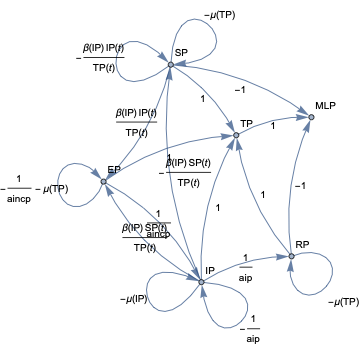

## Generating equations from graph specifications

A related, dual, or inverse task to the generation of graphs from systems of ODEs is 
the generation of system of ODEs from graphs.

Here is a model specifications through graph edges (using `DirectedEdge`): 


Here is the corresponding graph:

```mathematica
grModel = Graph[lsEdges, VertexLabels -> "Name", EdgeLabels -> "EdgeTag", ImageSize -> Large]
```

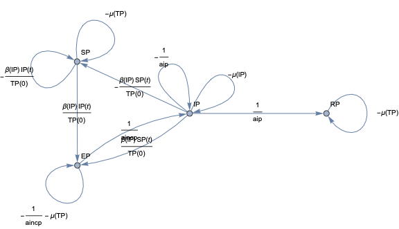

Here we generate the system of ODEs using the function `ModelGraphEquations`:

```mathematica
lsEqsGen = ModelGraphEquations[grModel, t];
ResourceFunction["GridTableForm"][List /@ lsEqsGen, TableHeadings -> {"Equations"}]
```

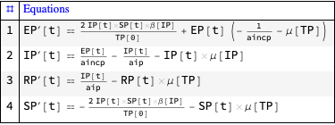

**Remark:** `ModelGraphEquations` works with both graph and list of edges as a first argument.

Here we replace the symbolically represented rates with concrete values: 

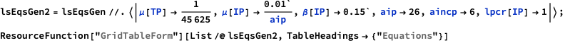

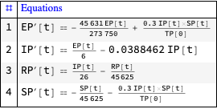

Here we solve the system of ODEs:

```mathematica
sol = First@NDSolve[{lsEqsGen2, SP[0] == 99998, EP[0] == 0, IP[0] == 1, RP[0] == 0,MLP[0] == 0, TP[0] == 100000}, Union[First /@ lsEdges], {t, 0, 365}]
```

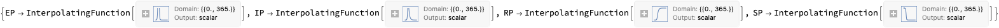

Here we plot the results:

```mathematica
ListLinePlot[sol[[All, 2]], PlotLegends -> sol[[All, 1]]]
```

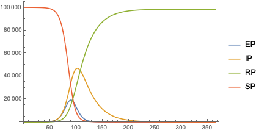

## Call graph

The functionalities provided by the presented package ["SystemDynamicsModelGraph.m"](https://github.com/antononcube/SystemModeling/blob/master/WL/SystemDynamicsModelGraph.m), [[AAp1](https://github.com/antononcube/SystemModeling/blob/master/WL/SystemDynamicsModelGraph.m)], resemble in spirit those of the package ["CallGraph.m”](https://github.com/antononcube/MathematicaForPrediction/blob/master/Misc/CallGraph.m), [[AAp3](https://github.com/antononcube/MathematicaForPrediction/blob/master/Misc/CallGraph.m)]. 

Here is call graph for the functions in the package [AAp1] made with the function `CallGraph` from the package [AAp3]:

```mathematica
CallGraph`CallGraph[Context[ModelDependencyGraph], "PrivateContexts" -> False, "UsageTooltips" -> True]
```

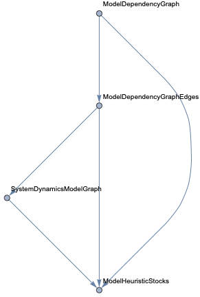

## References

### Packages

[AAp1] Anton Antonov, 
["System Dynamics Model Graph Mathematica package"](https://github.com/antononcube/SystemModeling/blob/master/WL/SystemDynamicsModelGraph.m),
(2020),
[SystemsModeling at GitHub/antononcube](https://github.com/antononcube/SystemModeling).         

[AAp2] Anton Antonov, 
["Epidemiology models Mathematica package"](https://github.com/antononcube/SystemModeling/blob/master/Projects/Coronavirus-propagation-dynamics/WL/EpidemiologyModels.m), 
(2020),
[SystemsModeling at GitHub/antononcube](https://github.com/antononcube/SystemModeling).         

[AAp3] Anton Antonov, 
["Call graph generation for context functions Mathematica package"](https://github.com/antononcube/MathematicaForPrediction/blob/master/Misc/CallGraph.m), 
(2018), 
[MathematicaForPrediction at GitHub/antononcube](https://github.com/antononcube/MathematicaForPrediction).

### Articles

[AA1] Anton Antonov, 
["Call graph generation for context functions"](https://mathematicaforprediction.wordpress.com/2019/01/01/call-graph-generation-for-context-functions/), 
(2019), 
[MathematicaForPrediction at WordPress](https://mathematicaforprediction.wordpress.com/2019/01/01/call-graph-generation-for-context-functions/).
