# NY Times COVID-19 data visualization

Anton Antonov  
[MathematicaForPrediction at WordPress](https://mathematicaforprediction.wordpress.com)  
[SystemModeling at GitHub](https://github.com/antononcube/SystemModeling)  
March 2020

## Introduction

The purpose of this notebook is to give data locations, data ingestion code, and code for rudimentary analysis and visualization of COVID-19 data provided by New York Times, [NYT1]. 

The following steps are taken:

- Ingest data

    - Take COVID-19 data from The New York Times, based on reports from state and local health agencies, [NYT1].

    - Take USA counties records data (FIPS codes, geo-coordinates, populations), [WRI1].

- Merge the data.

- Make data summaries and related plots.

- Make corresponding geo-plots.

Note that other, older repositories with COVID-19 data exist, like, [JH1, VK1].

**Remark:** The time series section is done for illustration purposes only. The forecasts there should not be taken seriously.

## Import data

### NYTimes USA states data

```mathematica
dsNYDataStates = ResourceFunction["ImportCSVToDataset"]["https://raw.githubusercontent.com/nytimes/covid-19-data/master/us-states.csv"];
dsNYDataStates = dsNYDataStates[All, AssociationThread[Capitalize /@ Keys[#], Values[#]] &];
dsNYDataStates[[1 ;; 6]]

```

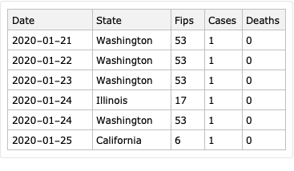

```mathematica
ResourceFunction["RecordsSummary"][dsNYDataStates]
```

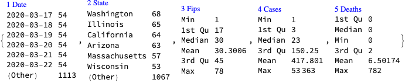

### NYTimes USA counties data

```mathematica
dsNYDataCounties = ResourceFunction["ImportCSVToDataset"]["https://raw.githubusercontent.com/nytimes/covid-19-data/master/us-counties.csv"];
dsNYDataCounties = dsNYDataCounties[All, AssociationThread[Capitalize /@ Keys[#], Values[#]] &];
dsNYDataCounties[[1 ;; 6]]
```

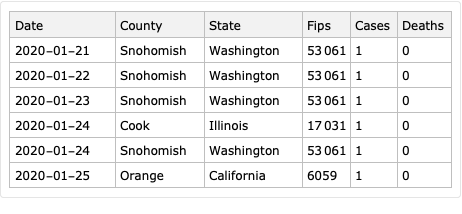

```mathematica
ResourceFunction["RecordsSummary"][dsNYDataCounties]
```

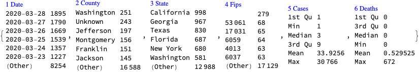

### US county records

```mathematica
dsUSACountyData = ResourceFunction["ImportCSVToDataset"]["https://raw.githubusercontent.com/antononcube/SystemModeling/master/Data/dfUSACountyRecords.csv"];
dsUSACountyData = dsUSACountyData[All, Join[#, <|"FIPS" -> ToExpression[#FIPS]|>] &];
dsUSACountyData[[1 ;; 6]]
```

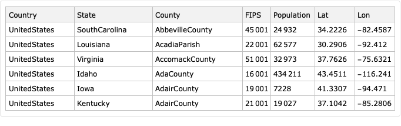

```mathematica
ResourceFunction["RecordsSummary"][dsUSACountyData]
```

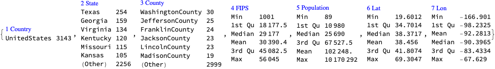

## Merge data

Verify that the two datasets have common FIPS codes:

```mathematica
Length[Intersection[Normal[dsUSACountyData[All, "FIPS"]], Normal[dsNYDataCounties[All, "Fips"]]]]

(*1874*)
```

Merge the datasets:

```mathematica
dsNYDataCountiesExtended = Dataset[JoinAcross[Normal[dsNYDataCounties],  Normal[dsUSACountyData[ All, {"FIPS", "Lat", "Lon", "Population"}]], Key["Fips"] -> Key["FIPS"]]];
```

Add a “DateObject” column and :

```mathematica
dsNYDataCountiesExtended = dsNYDataCountiesExtended[All, Join[<|"DateObject" -> DateObject[#Date]|>, #] &];
dsNYDataCountiesExtended = dsNYDataCountiesExtended[ReverseSortBy[#DateObject &]];
dsNYDataCountiesExtended[[1 ;; 6]]
```


## Basic data analysis

We consider cases and deaths for the last date only. (The queries can easily adjusted for other dates.)

```mathematica
dfQuery = dsNYDataCountiesExtended[Select[#Date == dsNYDataCountiesExtended[1, "Date"] &], {"Cases", "Deaths"}];
```

```mathematica
Total[dfQuery]

(*<|"Cases" -> 88616, "Deaths" -> 1435|>*)
```

```mathematica
ResourceFunction["RecordsSummary"][dfQuery]
```

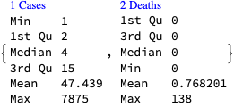

```mathematica
opts = {PlotRange -> All, ImageSize -> Medium};
Grid[
 Function[{columnName},
   {Histogram[Log10[#], PlotLabel -> Row[{Log10, Spacer[3], columnName}], opts], 
      ResourceFunction["ParetoPrinciplePlot"][#, PlotLabel -> columnName, opts]} &@ Normal[dfQuery[All, columnName]]
   ] /@ {"Cases", "Deaths"},
 Dividers -> All, FrameStyle -> GrayLevel[0.7]]
```

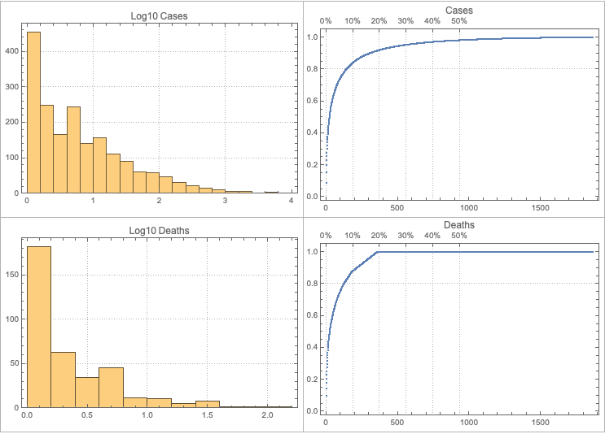

## Geo-histogram

```mathematica
lsAllDates = Union[Normal[dsNYDataCountiesExtended[All, "Date"]]];
lsAllDates // Length

(*66*)
```

```mathematica
Manipulate[
 DynamicModule[{ds = dsNYDataCountiesExtended[Select[#Date == datePick &]]},
  GeoHistogram[
   Normal[ds[All, {"Lat", "Lon"}][All, Values]] -> N[Normal[ds[All, columnName]]],
   Quantity[150, "Miles"], PlotLabel -> columnName, 
   PlotLegends -> Automatic, ImageSize -> Large, 
   GeoProjection -> "Equirectangular"]
  ],
 {{columnName, "Cases", "Data type:"}, {"Cases", "Deaths"}},
 {{datePick, "2020-03-26", "Date:"}, lsAllDates}, 
 SaveDefinitions -> True]
```

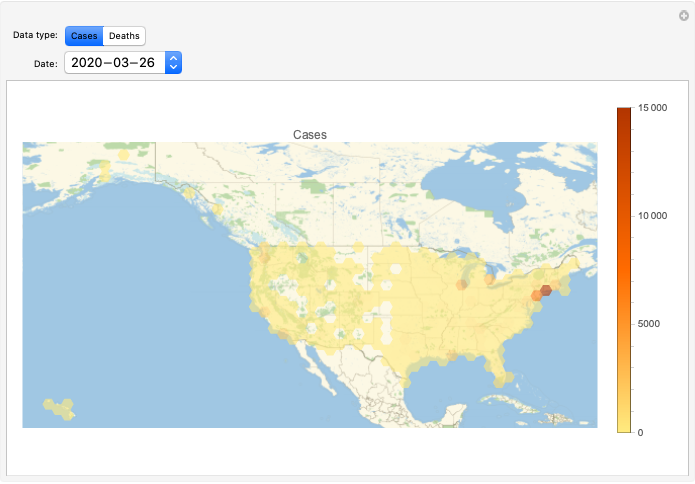

## Time series analysis

### Cases

#### Time series

For each date sum all cases over the states, make a time series, and plot it:

```mathematica
tsCases = TimeSeries@(List @@@  Normal[GroupBy[Normal[dsNYDataCountiesExtended], #DateObject &, Total[#Cases & /@ #] &]]);
opts = {PlotTheme -> "Detailed", PlotRange -> All, AspectRatio -> 1/4,ImageSize -> Large};
DateListPlot[tsCases, PlotLabel -> "Cases", opts]
```

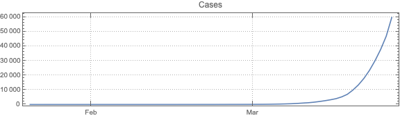

```mathematica
ResourceFunction["RecordsSummary"][tsCases["Path"]]
```

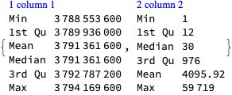

Logarithmic plot:

```mathematica
DateListPlot[Log10[tsCases], 
 PlotLabel -> Row[{Log10, Spacer[3], "Cases"}], opts]
```

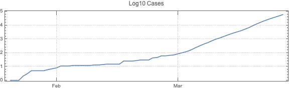

#### “Forecast”

Fit a time series model to log 10 of the time series:

```mathematica
tsm = TimeSeriesModelFit[Log10[tsCases]]
```

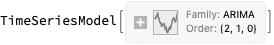

Plot log 10 data and forecast:

```mathematica
DateListPlot[{tsm["TemporalData"], TimeSeriesForecast[tsm, {10}]}, opts, PlotLegends -> {"Data", "Forecast"}]
```

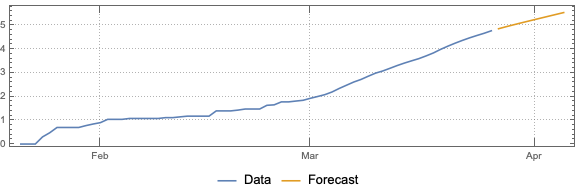

Plot data and forecast:

```mathematica
DateListPlot[{tsCases, 10^TimeSeriesForecast[tsm, {10}]}, opts, PlotLegends -> {"Data", "Forecast"}]
```


### Deaths

#### Time series

For each date sum all cases over the states, make a time series, and plot it:

```mathematica
tsDeaths = TimeSeries@(List @@@ Normal[GroupBy[Normal[dsNYDataCountiesExtended], #DateObject &, Total[#Deaths & /@ #] &]]);
opts = {PlotTheme -> "Detailed", PlotRange -> All, AspectRatio -> 1/4,ImageSize -> Large};
DateListPlot[tsDeaths, PlotLabel -> "Deaths", opts]
```

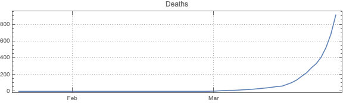

```mathematica
ResourceFunction["RecordsSummary"][tsDeaths["Path"]]
```

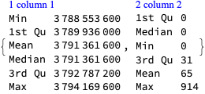

#### “Forecast”

Fit a time series model:

```mathematica
tsm = TimeSeriesModelFit[tsDeaths]
```

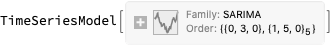

Plot data and forecast:

```mathematica
DateListPlot[{tsm["TemporalData"], TimeSeriesForecast[tsm, {10}]}, opts, PlotLegends -> {"Data", "Forecast"}]
```

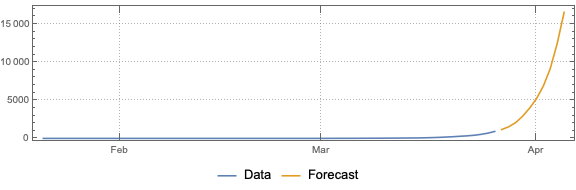

## References

[NYT1] The New York Times, [Coronavirus (Covid-19) Data in the United States](https://github.com/nytimes/covid-19-data), (2020), GitHub.

[WRI1] Wolfram Research Inc., [USA county records](https://github.com/antononcube/SystemModeling/blob/master/Data/dfUSACountyRecords.csv), (2020), [System Modeling at GitHub](https://github.com/antononcube/SystemModeling).

[JH1] CSSE at Johns Hopkins University, [COVID-19](https://github.com/CSSEGISandData/COVID-19), (2020), GitHub.

[VK1] Vitaliy Kaurov, [Resources For Novel Coronavirus COVID-19](https://community.wolfram.com/groups/-/m/t/1872608), (2020), [community.wolfram.com](https://community.wolfram.com).

