# SEI2HR-Econ model with quarantine and supplies scenarios

**Version 0.9**

Anton Antonov   
[MathematicaForPrediction at WordPress](https://mathematicaforprediction.wordpress.com)  
[SystemModeling at GitHub](https://github.com/antononcube/SystemModeling)  
March, April 2020

## Introduction

The [epidemiology compartmental model](https://en.wikipedia.org/wiki/Compartmental_models_in_epidemiology), [Wk1], presented in this notebook -- SEI2HR-Econ -- deals with all three rectangles in this diagram:

```mathematica
ImageResize[Import["https://github.com/antononcube/SystemModeling/raw/master/Projects/Coronavirus-propagation-dynamics/Diagrams/Coronavirus-propagation-simple-dynamics.jpeg"], 900]
```

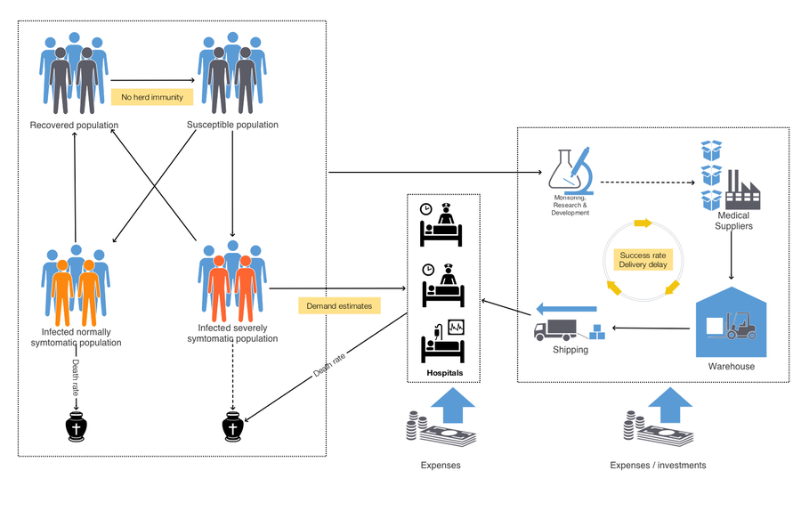

“SEI2HR” stands for “Susceptible, Exposed, Infected two, Hospitalized, Recovered” (populations.) “Econ” stands for “Economic”.

In this notebook we also deal with both quarantine scenarios and medical  supplies scenarios. In the notebook [AA4] we deal with quarantine scenarios over a simpler model, SEI2HR.

**Remark:** We consider the contagious disease propagation models as instances of the more general [System Dynamics (SD)](https://en.wikipedia.org/wiki/System_dynamics) models. We use SD terminology in this notebook.

### The models

#### SEI2R

The model SEI2R is introduced and explained in the notebook [AA2]. SEI2R differs from [the classical SEIR model](https://en.wikipedia.org/wiki/Compartmental_models_in_epidemiology), [Wk1, HH1], with the following elements:

1. Two separate infected populations: one is "severely symptomatic", the other is "normally symptomatic"

2. The monetary equivalent of lost productivity due to infected or died people is tracked

#### SEI2HR

For the formulation of SEI2HR we use a system of Differential Algebraic Equations (DAE’s). The package [AAp1] allows the use of a formulation that has just Ordinary Differential Equations (ODE’s).

Here are the unique features of SEI2HR:

- People stocks

    - There are two types of infected populations: normally symptomatic and severely symptomatic.

    - There is a hospitalized population.

    - There is a deceased from infection population.

- Hospital beds 

    - Hospital beds are a limited resource that determines the number of hospitalized people.

    - Only severely symptomatic people are hospitalized according to the available hospital beds.

    - The hospital beds stock is not assumed constant, it has its own change rate.

- Money stocks

    - The money from lost productivity is tracked.

    - The money for hospital services is tracked.

#### SEI2HR-Econ

SEI2HR-Econ adds the following features to SEI2HR:

- Medical supplies 

    - Medical supplies production is part of the model.

    - Medical supplies delivery is part of the model..

    - Medical supplies accumulation at hospitals is taken into account.

    - Medical supplies demand tracking.

- Hospitalization

    - Severely symptomatic people are hospitalized according to two limited resources: hospital beds and medical supplies.

- Money stocks

    - Money for medical supplies production is tracked.

#### SEI2HR-Econ’s place a development plan

This graph shows the “big picture” of the model development plan undertaken in [AAr1] and SEI2HR (discussed in this notebook) is in that graph:

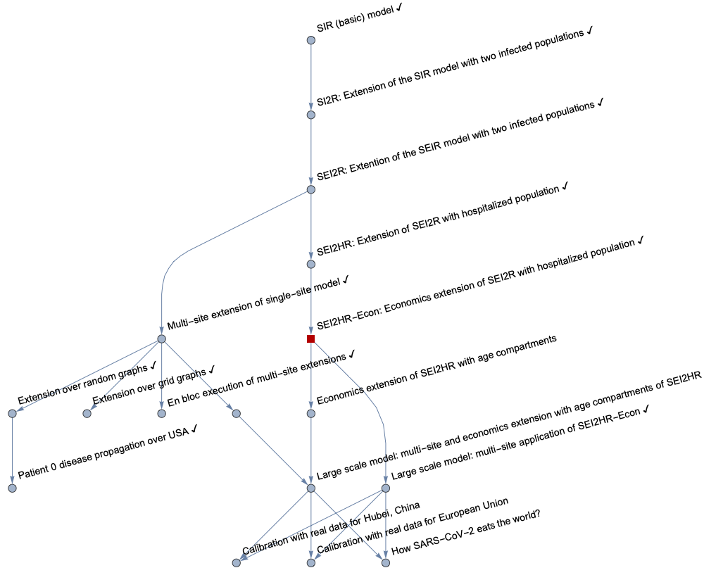

### Notebook structure

The rest of notebook has the following sequence of sections:

- Package load section

- SEI2HR-Econ structure in comparison of SEI2HR

- Explanations of the equations of SEI2HR-Econ

- Quarantine scenario modeling preparation

- Medical supplies production and delivery scenario modeling preparation

- Parameters and initial conditions setup

    - Populations, hospital beds, quarantine scenarios, medical supplies scenarios

- Simulation solutions

- Interactive interface

- Sensitivity analysis

## Load packages

The epidemiological models framework used in this notebook is implemented with the packages [AAp1-AAp4, AA3]; many of the plot functions are from the package [AAp5].

```mathematica
Import["https://raw.githubusercontent.com/antononcube/SystemModeling/master/Projects/Coronavirus-propagation-dynamics/WL/EpidemiologyModels.m"];
Import["https://raw.githubusercontent.com/antononcube/SystemModeling/master/Projects/Coronavirus-propagation-dynamics/WL/EpidemiologyModelModifications.m"];
Import["https://raw.githubusercontent.com/antononcube/SystemModeling/master/Projects/Coronavirus-propagation-dynamics/WL/EpidemiologyModelingVisualizationFunctions.m"];
Import["https://raw.githubusercontent.com/antononcube/SystemModeling/master/Projects/Coronavirus-propagation-dynamics/WL/EpidemiologyModelingSimulationFunctions.m"];
Import["https://raw.githubusercontent.com/antononcube/SystemModeling/master/WL/SystemDynamicsInteractiveInterfacesFunctions.m"];
```

## SEI2HR-Econ extends SEI2HR

The model SEI2HR-Econ is an extension of the model SEI2HR, [AA4].

Here is SEI2HR:

```mathematica
reprTP = "AlgebraicEquation";
lsModelOpts = {"Tooltips" -> True, 
   TooltipStyle -> {Background -> Yellow, CellFrameColor -> Gray, 
     FontSize -> 20}};
modelReference = 
  SEI2HRModel[t, "InitialConditions" -> True, "RateRules" -> True, 
   "TotalPopulationRepresentation" -> reprTP];
ModelGridTableForm[modelReference, lsModelOpts]
```

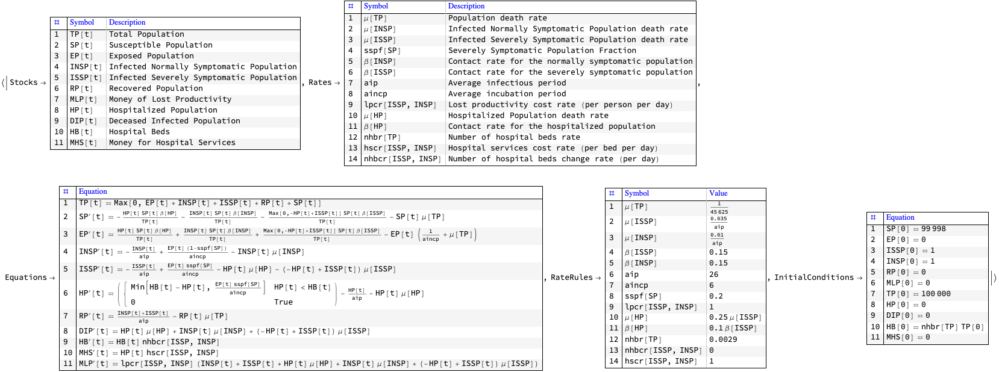

Here is SEI2HR-Econ:

```mathematica
modelSEI2HREcon = 
  SEI2HREconModel[t, "InitialConditions" -> True, "RateRules" -> True,
    "TotalPopulationRepresentation" -> reprTP];
ModelGridTableForm[modelSEI2HREcon, lsModelOpts]
```

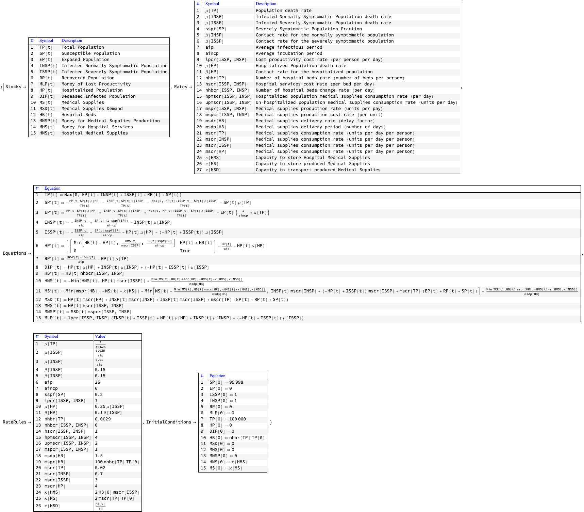

Here are the “differences” between the two models:

```mathematica
ModelGridTableForm@
 Merge[{modelSEI2HREcon, modelReference}, 
  If[AssociationQ[#[[1]]], KeyComplement[#], Complement @@ #] &]
```

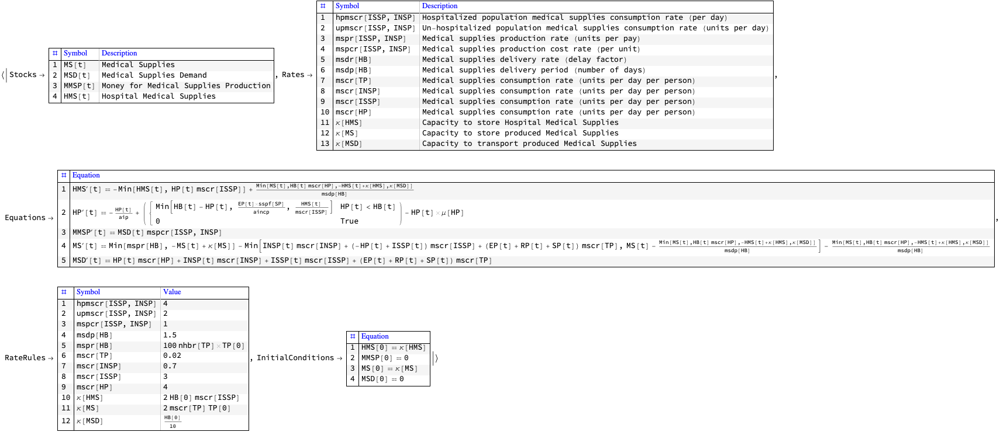

## Equations explanations

In this section we provide rationale for the equations of SEI2HR-Econ. 

The equations for Susceptible, Exposed, Infected, Recovered populations of SEI2R are "standard" and explanations about them are found in [WK1, HH1]. For SEI2HR those equations change because of the stocks Hospitalized Population and Hospital Beds. For SEI2HR-Econ the SEI2HR equations change because of the stocks Medical Supplies, Medical Supplies Demand, and Hospital Medical Supplies.

The equations time unit is one day. The time horizon is one year. Since we target COVID-19, [Wk2, AA1], we do not consider births.

**Remark:** For convenient reading the equations in this section have tooltips for the involved stocks and rates.

### Verbalization description of the model

We start with one infected (normally symptomatic) person, the rest of the people are susceptible. The infected people meet other people directly or get in contact with them indirectly. (Say, susceptible people touch things touched by infected.) For each susceptible person there is a probability to get the decease. The decease has an incubation period: before becoming infected the susceptible are (merely) exposed. The infected recover after a certain average infection period or die. A certain fraction of the infected become severely symptomatic. The severely symptomatic infected are hospitalized if there are enough hospital beds and enough medical supplies. The hospitalized severely infected have different death rate than the non-hospitalized ones. The number of hospital beds might change: hospitals are extended, new hospitals are build, or there are not enough medical personnel or supplies. 

The different types of populations (infected, hospitalized, recovered, etc.) have their own consumption rates of medical supplies. The medical supplies are produced with a certain rate (units per day) and delivered after a certain delay period. The hospitals have their own storage for medical supplies. Medical supplies are delivered to the hospitals only, non-hospitalized people go to the medical supplies producer to buy supplies. The hospitals have precedence for the medical supplies: if the medical supplies are not enough for everyone, the hospital needs are covered first (as much as possible.) 

The medical supplies producer has a certain storage capacity (for supplies.) The medical supplies delivery vehicles have a certain -- generally speaking, smaller -- capacity. The hospitals have a certain capacity to store medical supplies. It is assumed that both producer and hospitals have initial stocks of medical supplies. (Following a certain normal, general preparedness protocol.)

The combined demand from all populations for medical supplies is tracked (accumulated.) The deaths from infection are tracked (accumulated.) Money for medical supplies production, money for hospital services, and money from lost productivity are tracked (accumulated.) 

The equations below give mathematical interpretation of the model description above.

### Code for the equations

Each equation in this section are derived with code like this:

```mathematica
ModelGridTableForm[modelSEI2HREcon, lsModelOpts]["Equations"][[1, 
 EquationPosition[modelSEI2HREcon, RP] + 1, 2]]
```

and then the output cell is edited to be “DisplayFormula” and have CellLabel value corresponding to the stock of interest.

### The infected and hospitalized populations

SEI2HR has two types of infected populations: a normally symptomatic one and a severely symptomatic one. A major assumption for SEI2HR is that only the severely symptomatic people are hospitalized. (That assumption is also reflected in the diagram in the introduction.)

Each of those three populations have their own contact rates and mortality rates.

Here are the contact rates from the SEI2HR-Econ dictionary

```mathematica
ColumnForm@
 Cases[Normal@modelSEI2HREcon["Rates"], 
  HoldPattern[\[Beta][_] -> _], \[Infinity]]
```

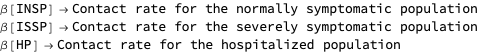

Here are the mortality rates from the SEI2HR-Econ dictionary

```mathematica
ColumnForm@
 Cases[Normal@modelSEI2HREcon["Rates"], 
  HoldPattern[\[Mu][_] -> _], \[Infinity]]
```

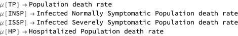

**Remark:** Below with “Infected Population” we mean both stocks Infected Normally Symptomatic Population (INSP) and Infected Severely Symptomatic Population (ISSP).

### Total Population

In this notebook we consider a DAE’s formulation of SEI2HR-Econ. The stock Total Population has the following (obvious) algebraic equation:

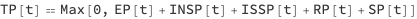

Note that with Max we specified that the total population cannot be less than $0$.

**Remark:** As mentioned in the introduction, the package [AAp1] allows for the use of non-algebraic formulation, without an equation for TP.

### Susceptible Population

The stock Susceptible Population (SP) is decreased by (1) infections derived from stocks Infected Populations and Hospitalized Population (HP), and (2) morality cases derived with the typical mortality rate.

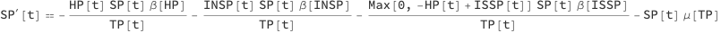

Because we hospitalize the severely infected people only instead of the term

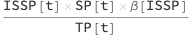

we have the terms 

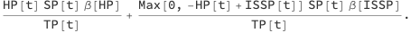

The first term is for the infections derived from the hospitalized population. The second term for the infections derived from people who are infected severely symptomatic and *not* hospitalized.

#### Births term

Note that we do not consider in this notebook births, but the births term can be included in SP’s equation:

```mathematica
Block[{m = SEI2HREconModel[t, "BirthsTerm" -> True]},
 ModelGridTableForm[m]["Equations"][[1, EquationPosition[m, SP] + 1, 
  2]]
 ]
```

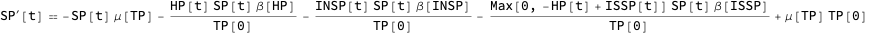

The births rate is the same as the death rate, but it can be programmatically changed. (See [AAp2].)

### Exposed Population

The stock Exposed Population (EP) is increased by (1) infections derived from the stocks Infected Populations and Hospitalized Population, and (2) mortality cases derived with the typical mortality rate. EP is decreased by (1) the people who after a certain average incubation period (aincp) become ill, and (2) mortality cases derived with the typical mortality rate.

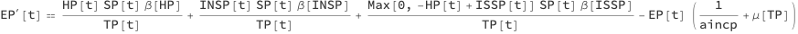

### Infected Normally Symptomatic Population

INSP is increased by a fraction of the people who have been exposed. That fraction is derived with the parameter severely symptomatic population fraction (sspf). INSP is decreased by (1) the people who recover after a certain average infection period (aip), and (2) the normally symptomatic people who die from the disease.

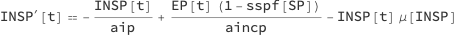

### Infected Severely Symptomatic Population

ISSP is increased by a fraction of the people who have been exposed. That fraction is corresponds to the parameter severely symptomatic population fraction (sspf). ISSP is decreased by (1) the people who recover after a certain average infection period (aip), (2) the hospitalized severely symptomatic people who die from the disease, and (3) the non-hospitalized severely symptomatic people who die from the disease.

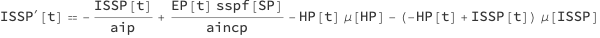

Note that we do not assume that severely symptomatic people recover faster if they are hospitalized, only that they have a different death rate.

### Hospitalized Population

The amount of people that can be hospitalized is determined by the available Hospital Beds (HB) -- the stock Hospitalized Population (HP) is subject to a resource limitation by the stock HB.

The equation of the stock HP can be easily understood from the following dynamics description points:

- If the number of hospitalized people is less that the number of hospital beds we hospitalize the new ISSP people.

- The Available Hospital Beds (AHB) are determined by the minimum of (i) the non-occupied hospital beds, and (ii) the hospital medical supplies divided by the ISSP consumption rate.

- If the new ISSP people are more than AHB the hospital takes as many as AHB.

- Hospitalized people have the same average infection period (aip).

- Hospitalized (severely symptomatic) people have their own mortality rate.

Here is the HP equation:

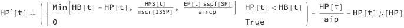

Note that although we know that in a given day some hospital beds are going to be freed they are not considered in the hospitalization plans for that day. Similarly, we know that new medical supplies are coming but we do not include them into AHB.

### Recovered Population

The stock Recovered Population (RP) is increased by the recovered infected people and decreased by mortality cases derived with the typical mortality rate.

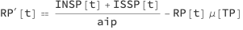

### Deceased Infected Population

The stock Deceased Infected Population (DIP) accumulates the deaths of the people who are infected. Note that we utilize the different death rates for HP and ISSP.

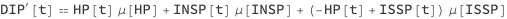

### Hospital Beds

The stock Hospital Beds (HB) can change with a rate that reflects the number of hospital beds change rate (nhbcr) per day. Generally speaking, using nhbcr we can capture scenarios, like, extending hospitals, building new hospitals, recruitment of new medical personnel, loss of medical personnel (due to infections.)

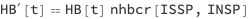

### Hospital Medical Supplies

The Hospital Medical Supplies (HMS) are decreased according to the medical supplies consumption rate (mscr) of HP and increased by a Medical Supplies (MS) delivery term (to be described next.)

The MS delivery term is build with the following assumptions / postulates: 

-  Every day the hospital attempts to order MS that correspond to HB multiplied by mscr.

- The hospital has limited capacity of MS storage, $\kappa [\text{HMS}]$.

- The MS producer has limited capacity for delivery, $\kappa [\text{MDS}]$.

- The hospital demand for MS has precedence over the demands for the non-hospitalized populations.

- Hence, if the MS producer has less stock of MS than the demand of the hospital then MS producer’s whole amount of MS goes to the hospital.

- The supplies are delivered with some delay period: the medical supplies delivery period (msdp).

Here is the MS delivery term:

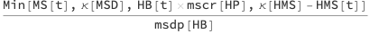

Here is the corresponding HMS equation:


### Medical Supplies

The equation of the Medical Supplies (MS) stock is based on the following assumptions / postulates:

- The non-hospitalized people go to the MS producer to buy supplies. (I.e. MS delivery is to the hospital only.)

- The MS producer vehicles have certain capacity, $\kappa [\text{MSD}]$.

- The MS producer has a certain storage capacity (for MS stock.)

- Each of the populations INSP, ISSP, and HP has its own specific medical supplies consumption rate (mscr). EP, RP, and TP have the same mscr.

- The hospital has precedence in its MS order. I.e. the demand from the hospital is satisfied first, and then the demand of the rest of the populations.

Here is the MS delivery term described in the previous section:

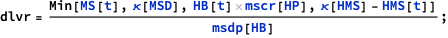

Here is the MS formula with the MS delivery term replaced with “Dlvr”:

```mathematica
ModelGridTableForm[modelSEI2HREcon, "Tooltips" -> False][
   "Equations"][[1, EquationPosition[modelSEI2HREcon, MS] + 1, 2]] /. 
 dlvr -> Dlvr
```


We can see from that equation that MS is increased by medical supplies production rate (mspr) with measuring dimension number of units per day. The production is restricted by the storage capacity, $\kappa [\text{MS}]$:

```
(*Min[mspr[HB], -MS[t] + \[Kappa][MS]]*)
```

MS is decreased by the MS delivery term and the demand from the non-hospitalized populations. Because the hospital has precedence, we use this term form in the equation:

```
(*Min[-Dlvr + MS[t], "non-hospital demand"]*)
```

Here is the full MS equation:

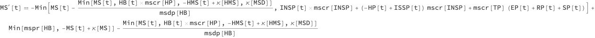

### Medical Supplies Demand

The stock Medical Supplies Demand (MSD) simply accumulates the MS demand derived from population stocks and their corresponding mscr:

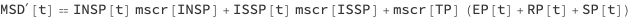

### Money for Hospital Services

The stock Money for Hospital Services (MHS) simply tracks expenses for hospitalized people. The parameter hospital services cost rate (hscr) with unit money per bed per day simply multiplies HP.


### Money from Lost Productivity

The stock Money from Lost Productivity (MLP) simply tracks the work non-availability of the infected and died from infection people. The parameter lost productivity cost rate (lpcr) with unit money per person per day multiplies the total count of the infected and dead from infection.

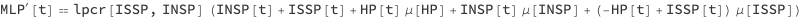

## Quarantine scenarios

In order to model quarantine scenarios we use piecewise constant functions for the contact rates $\beta [\text{ISSP}]$ and $\beta [\text{INSP}]$. 

**Remark:** Other functions can be used, like, functions derived through some statistical fitting. 

Here is an example plot :

```mathematica
Block[{func = \[Beta]*
    Piecewise[{{1, t < qsd}, {qcrf, qsd <= t <= qsd + ql}}, 1]},
 Legended[
  Block[{\[Beta] = 0.56, qsd = 60, ql = 8*7, qcrf = 0.25},
   ListLinePlot[Table[func, {t, 0, 365}], PlotStyle -> "Detailed"]
   ], func]]
```

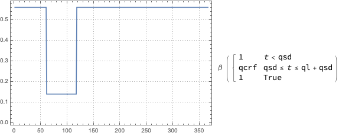

To model quarantine with a piecewise constant function we use the following  parameters:

-  $\text{qsd}$ for quarantine's start

- $\text{ql}$ for quarantines duration

- $\text{qcrf}$ for the effect on the quarantine on the contact rate

## Medical supplies scenarios

We consider three main scenarios for the medical supplies:

1. Constant production rate and consistent delivery (constant delivery period)

1. Constant production rate and disrupted delivery

1. Disrupted production and disrupted delivery

The disruptions are simulated with simple pulse functions -- we want to see how the system being modeled reacts to singular, elementary disruption.

Here is an example plot of a disruption of delivery period plot :

```mathematica
Block[{func = 
   dbp*Piecewise[{{1, t < dds}, {dsf, dds <= t <= dds + ddl}}, 1]},
 Legended[
  Block[{dbp = 1, dds = 70, ddl = 7, dsf = 1.8},
   ListLinePlot[Table[func, {t, 0, 365}], PlotStyle -> "Detailed"]
   ], func]]
```

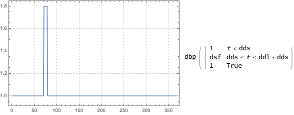

To model disruption of delivery with a piecewise constant function we use the following  parameters:

- $\text{dbp}$ for the delivery base period 

- $\text{dds}$ for delivery disruption start

- $\text{ddl}$ for delivery disruption duration

- $\text{dsf}$ for how much slower or faster the delivery period becomes

## Parameters and actual simulation equations code

Here are the parameters we want to experiment with (or do calibration with):

```mathematica
lsFocusParams = {aincp, aip, sspf[SP], \[Beta][HP], qsd, ql, qcrf, 
   nhbcr[ISSP, INSP], nhbr[TP], mspr[HB]};
```

Here we set custom rates and initial conditions:

```mathematica
population = 10^6;
modelSEI2HREcon =
  SetRateRules[
   modelSEI2HREcon,
   <|
    TP[0] -> population,
    \[Beta][ISSP] -> 
     0.5*Piecewise[{{1, t < qsd}, {qcrf, qsd <= t <= qsd + ql}}, 1],
    \[Beta][INSP] -> 
     0.5*Piecewise[{{1, t < qsd}, {qcrf, qsd <= t <= qsd + ql}}, 1],
    qsd -> 60,
    ql -> 8*7,
    qcrf -> 0.25,
    \[Beta][HP] -> 0.01,
    \[Mu][ISSP] -> 0.035/aip,
    \[Mu][INSP] -> 0.01/aip,
    nhbr[TP] -> 3/1000,
    lpcr[ISSP, INSP] -> 1,
    hscr[ISSP, INSP] -> 1,
    msdp[HB] -> 
     dbp*Piecewise[{{1, t < dds}, {dsf, dds <= t <= dds + ddl}}, 1],
    dbp -> 1,
    dds -> 70,
    ddl -> 7,
    dsf -> 2
    |>
   ];
```

**Remark:** Note the piecewise functions for $\beta [\text{ISSP}]$, $\beta [\text{INSP}]$, and $\text{msdp}[\text{HB}]$.

Here is the system of ODE’s we use to do *parametrized* simulations:

```mathematica
lsActualEquations = 
  ModelNDSolveEquations[modelSEI2HREcon, 
   KeyDrop[modelSEI2HREcon["RateRules"], lsFocusParams]];
ResourceFunction["GridTableForm"][List /@ lsActualEquations]
```

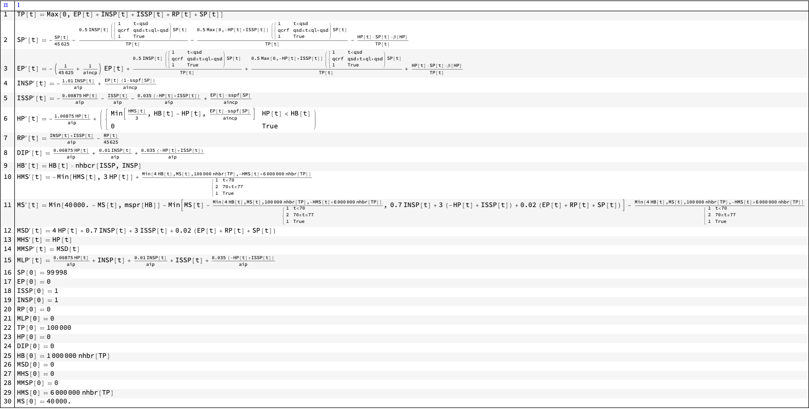

```mathematica
lsActualEquations = 
  ModelNDSolveEquations[modelSEI2HREcon, modelSEI2HREcon["RateRules"]];
ResourceFunction["GridTableForm"][List /@ lsActualEquations]
```

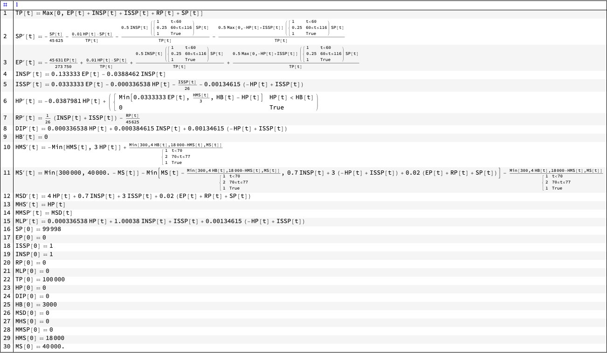

## Simulation

Instead of using ParametricNDSolve as in [AA4] in this notebook we use ModelNDSolve and SetRateRules from the package [AAp4].

### Different quarantine starts

Here we compute simulation solutions for a set of quarantine starts:

```mathematica
AbsoluteTiming[
 aVarSolutions =
   Association@
    Map[
     Function[{qsdVar},
      qsdVar -> 
       Association[
        ModelNDSolve[
          SetRateRules[
           modelSEI2HREcon, <|ql -> 56, qsd -> qsdVar|>], {t, 365}][[
         1]]]
      ],
     Range[40, 120, 20]
     ];
 ]

(*{0.366168, Null}*)
```

Here we plot the results for ISSP only:

```mathematica
SeedRandom[2532]
aVals = #[ISSP][Range[0, 365]] & /@ aVarSolutions;
ListLinePlot[
 KeyValueMap[
  Callout[Tooltip[#2, #1], #1, {If[#1 <= 70, 
      RandomInteger[{120, 200}], RandomInteger[{80, 110}]], Above}] &,
   aVals], PlotLegends -> 
  SwatchLegend[Keys[aVals], LegendLabel -> "Quarantine start"], 
 PlotRange -> All, ImageSize -> Large, 
 PlotLabel -> ISSP[t] /. modelSEI2HREcon["Stocks"]]
```

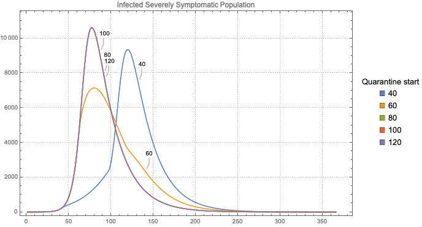

**Remark:** We use the code in this section to do the computations in the section “Sensitivity Analysis”.

## Interactive interface

Using the interface in this section we can interactively see the effects of changing parameters. (This interface is programmed without using parametrized NDSolve solutions in order to be have code that corresponds to the interface implementations in [AAr2].)

```mathematica
opts = {PlotRange -> All, PlotLegends -> None, 
   PlotTheme -> "Detailed", PerformanceGoal -> "Speed", 
   ImageSize -> 400};
lsPopulationKeys = {TP, SP, EP, ISSP, INSP, HP, RP, DIP, HB};
lsSuppliesKeys = {MS, MSD, HMS};
lsMoneyKeys = {MHS, MLP, MMSP};
Manipulate[
 DynamicModule[{modelLocal = modelSEI2HREcon, 
   aStocks = modelSEI2HREcon["Stocks"], aSolLocal = aParSol, 
   lsPopulationPlots, lsMoneyPlots, lsSuppliesPlots},
  
  modelLocal = 
   SetRateRules[
    modelLocal, <|aincp -> aincpM, aip -> aipM, 
     sspf[SP] -> sspfM, \[Beta][HP] -> crhpM, qsd -> qsdM, ql -> qlM, 
     qcrf -> qcrfM, nhbr[TP] -> nhbrM/1000, 
     nhbcr[ISSP, ISNP] -> nhbcrM, mspr[HB] -> msprM, 
     msdp[HB] -> msdpM|>];
  aSolLocal = Association[ModelNDSolve[modelLocal, {t, ndays}][[1]]];
  
  lsPopulationPlots =
   Quiet@ParametricSolutionsPlots[
     aStocks,
     KeyTake[aSolLocal, 
      Intersection[lsPopulationKeys, displayPopulationStocks]],
     None, ndays,
     "LogPlot" -> popLogPlotQ, "Together" -> popTogetherQ, 
     "Derivatives" -> popDerivativesQ, 
     "DerivativePrefix" -> "\[CapitalDelta]", opts, 
     Epilog -> {Gray, Dashed, 
       Line[{{qsdM, 0}, {qsdM, 1.5*population}}], 
       Line[{{qsdM + qlM, 0}, {qsdM + qlM, 1.5*population}}]}];
  
  lsSuppliesPlots =
   If[Length[
      KeyDrop[aSolLocal, Join[lsPopulationKeys, lsMoneyKeys]]] == 
     0, {},
    (*ELSE*)
    Quiet@ParametricSolutionsPlots[
      aStocks,
      KeyTake[KeyDrop[aSolLocal, Join[lsPopulationKeys, lsMoneyKeys]],
        displaySupplyStocks],
      None, ndays,
      "LogPlot" -> supplLogPlotQ, "Together" -> supplTogetherQ, 
      "Derivatives" -> supplDerivativesQ, 
      "DerivativePrefix" -> "\[CapitalDelta]", opts]
    ];
  
  lsMoneyPlots =
   Quiet@ParametricSolutionsPlots[
     aStocks,
     KeyTake[aSolLocal, Intersection[lsMoneyKeys, displayMoneyStocks]],
     None, ndays,
     "LogPlot" -> moneyLogPlotQ, "Together" -> moneyTogetherQ, 
     "Derivatives" -> moneyDerivativesQ, 
     "DerivativePrefix" -> "\[CapitalDelta]", opts];
  
  Multicolumn[Join[lsPopulationPlots, lsSuppliesPlots, lsMoneyPlots], 
   nPlotColumns, Dividers -> All, FrameStyle -> GrayLevel[0.8]],
  SaveDefinitions -> True
  ],
 {{ndays, 365, "Number of days"}, 1, 365, 1, Appearance -> {"Open"}},
 Delimiter,
 {{aincpM, 6., "Average incubation period (days)"}, 1, 60., 1, 
  Appearance -> {"Open"}},
 {{aipM, 21., "Average infectious period (days)"}, 1, 60., 1, 
  Appearance -> {"Open"}},
 {{sspfM, 0.2, "Severely symptomatic population fraction"}, 0, 1, 
  0.025, Appearance -> {"Open"}},
 {{crhpM, 0.1, "Contact rate of the hospitalized population"}, 0, 30, 
  0.1, Appearance -> {"Open"}},
 Delimiter,
 {{qsdM, 55, "Quarantine start days"}, 0, 365, 1, 
  Appearance -> {"Open"}},
 {{qlM, 8*7, "Quarantine length (in days)"}, 0, 120, 1, 
  Appearance -> {"Open"}},
 {{qcrfM, 0.25, "Quarantine contact rate fraction"}, 0, 1, 0.01, 
  Appearance -> {"Open"}},
 Delimiter,
 {{nhbrM, 2.9, "Number of hospital beds rate (per 1000 people)"}, 0, 
  100, 0.1, Appearance -> {"Open"}},
 {{nhbcrM, 0, "Number of hospital beds change rate"}, -0.5, 0.5, 
  0.001, Appearance -> {"Open"}},
 {{msprM, 200, "Medical supplies production rate"}, 0, 50000, 10, 
  Appearance -> {"Open"}},
 {{msdpM, 1.2, "Medical supplies delivery period"}, 0, 10, 0.1, 
  Appearance -> {"Open"}},
 Delimiter,
 {{displayPopulationStocks, lsPopulationKeys, 
   "Population stocks to display:"}, lsPopulationKeys, 
  ControlType -> TogglerBar},
 {{popTogetherQ, True, "Plot populations together"}, {False, True}},
 {{popDerivativesQ, False, "Plot populations derivatives"}, {False, 
   True}},
 {{popLogPlotQ, False, "LogPlot populations"}, {False, True}},
 Delimiter,
 {{displaySupplyStocks, lsSuppliesKeys, 
   "Supplies stocks to display:"}, lsSuppliesKeys, 
  ControlType -> TogglerBar},
 {{supplTogetherQ, True, "Plot supplies functions together"}, {False, 
   True}},
 {{supplDerivativesQ, False, 
   "Plot supplies functions derivatives"}, {False, True}},
 {{supplLogPlotQ, True, "LogPlot supplies functions"}, {False, 
   True}},
 Delimiter,
 {{displayMoneyStocks, lsMoneyKeys, "Money stocks to display:"}, 
  lsMoneyKeys, ControlType -> TogglerBar},
 {{moneyTogetherQ, True, "Plot money functions together"}, {False, 
   True}},
 {{moneyDerivativesQ, False, 
   "Plot money functions derivatives"}, {False, True}},
 {{moneyLogPlotQ, True, "LogPlot money functions"}, {False, True}},
 {{nPlotColumns, 1, "Number of plot columns"}, Range[5]},
 ControlPlacement -> Left, ContinuousAction -> False]
```

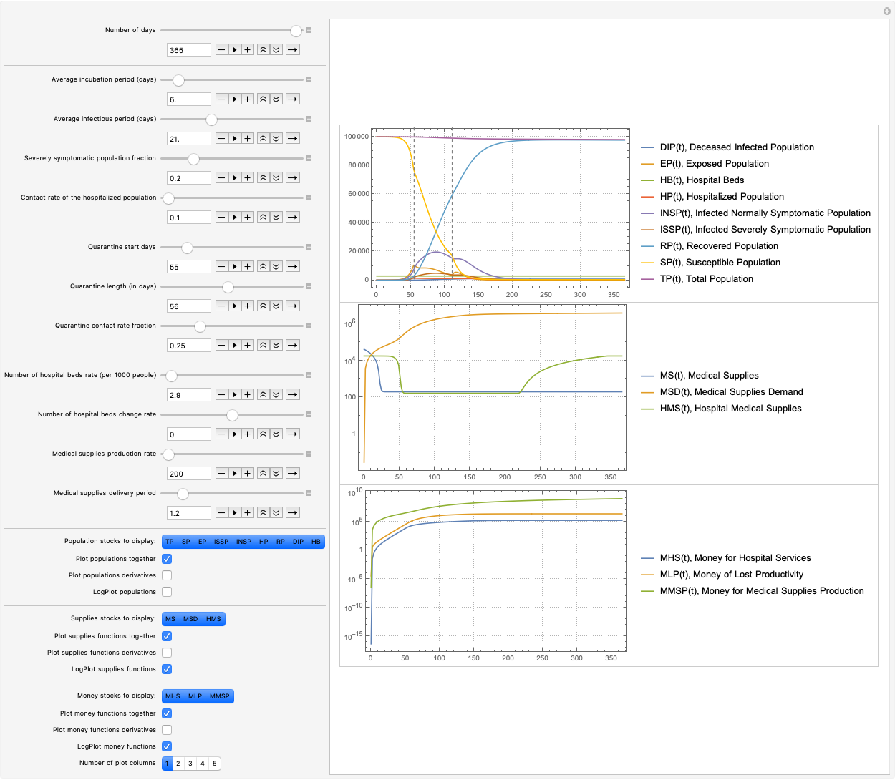

## Sensitivity analysis

When making and using this kind of dynamics models it is important to see how the solutions react to changes of different parameters. For example, we should try to find answers to questions like "What ranges of which parameters bring dramatic changes into important stocks?"

Sensitivity Analysis (SA) is used to determine how sensitive is a SD model to changes of the parameters and to changes of model’s equations, [BC1]. More specifically, parameter sensitivity, which we apply below, allows us to see the changes of stocks dynamic behaviour for different sequences (and combinations) of parameter values.

**Remark:** This section to mirrors to a point the section with same name in [AA4], except in this notebook we are more interested in medical supplies related SA because quarantine related SA is done in [AA4].

**Remark:** SA shown below should be done for other stocks and rates. In order to keep this exposition short we focus on ISSP, DIP, and HP. Also, it is interesting to think in terms of “3D parameter sensitivity plots.” We also do such plots.

### Evaluations by Area under the curve

For certain stocks we might be not just interested in their evolution in time but also in their cumulative values. I.e. we are interested in the so called Area Under the Curve (AUC) metric for those stocks.

There are three ways to calculate AUC for stocks of interest:

1. Add aggregation equations in the system of ODE’s. (Similar to the stock DIP in SEI2HR.)

    - For example, in order to compute AUC for ISSP we can add to SEI2HR the equation:

```
(*aucISSP'[t] = ISSP[t]*)
```

    - More details for such equation addition are given in [AA2].

1. Apply NIntegrate over stocks solution functions.

1. Apply [Trapezoidal rule](https://en.wikipedia.org/wiki/Trapezoidal_rule) to stock solution function values over a certain time grid.

Below we use 1 and 3. 

### Variation of medical supplies delivery period

Here are calculate the solutions for a certain combination of capacities and rates:

```mathematica
AbsoluteTiming[
 aVarSolutions =
   Association@
    Map[
     Function[{msdpVar},
      model2 = SEI2HREconModel[t];
      model2 = 
       SetRateRules[
        model2, <|\[Kappa][MS] -> 10000, \[Kappa][HMS] -> 100, 
         mspr[HB] -> 100, msdp[HB] -> msdpVar|>];
      msdpVar -> Association[ModelNDSolve[model2, {t, 365}][[1]]]
      ],
     Union[Join[Range[0.2, 1, 0.2], Range[1, 3, 0.5]]]
     ];
 ]

(*{0.231634, Null}*)
```

As expected more frequent delivery results in fuller utilization of the non-occupied hospital beds:

```mathematica
SeedRandom[23532]
focusStock = HP;
aVals = #[focusStock][Range[0, 365]] & /@ aVarSolutions;
ListLinePlot[
 KeyValueMap[
  Callout[Tooltip[#2, #1], #1, {If[#1 < 1, RandomInteger[{120, 150}], 
      RandomInteger[{160, 260}]], Above}] &, aVals], 
 PlotLegends -> 
  SwatchLegend[Keys[aVals], 
   LegendLabel -> "Medical supplies\ndelivery period"], 
 PlotRange -> All, ImageSize -> Large, 
 PlotLabel -> focusStock[t] /. modelSEI2HREcon["Stocks"]]
```

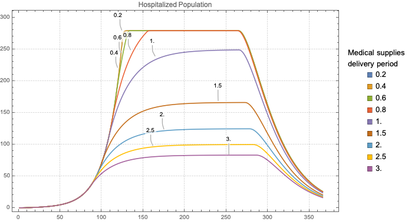

Here are the corresponding AUC values:

```mathematica
aAUCs = TrapezoidalRule[Transpose[{Range[0, 365], #}]] & /@ aVals;
ResourceFunction["GridTableForm"][aAUCs]
```

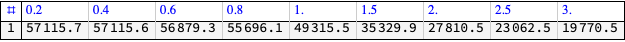

```mathematica
BarChart[aAUCs, ChartLabels -> Keys[aAUCs], ColorFunction -> "Pastel",
  PlotLabel -> 
  Row[{focusStock[t] /. modelSEI2HREcon["Stocks"], Spacer[5], "AUC"}]]
```

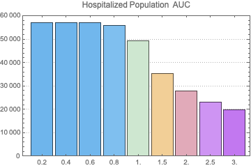

### Variation of medical supplies production rate

In order to demonstrate the effect of medical supplies production rate (mspr) it is beneficial to eliminate the hospital beds availability restriction -- we assume that we have enough hospital beds for all infected severely symptomatic people.

Here are calculate the solutions for a certain combination of capacities and rates:

```mathematica
AbsoluteTiming[
 aVarSolutions =
   Association@
    Map[
     Function[{msprVar},
      model2 = SEI2HREconModel[t];
      model2 = 
       SetRateRules[
        model2, <|\[Kappa][MS] -> 100000, \[Kappa][HMS] -> 
          10000, \[Kappa][MSD] -> 1000, mspr[HB] -> msprVar, 
         msdp[HB] -> 1.5, mscr[ISSP] -> 0.2, mscr[TP] -> 0.001, 
         mscr[ISSP] -> 1, nhbr[TP] -> 100/1000|>];
      msprVar -> Association[ModelNDSolve[model2, {t, 365}][[1]]]
      ],
     {20, 60, 100, 200, 300, 1000, 10000}
     ];
 ]

(*{0.156794, Null}*)
```

#### Hospitalized Population

As expected we can see that with smaller production rates we get less hospitalized people:

```mathematica
SeedRandom[1232]
focusStock = HP;
aVals = #[focusStock][Range[0, 365]] & /@ aVarSolutions;
ListLinePlot[
 KeyValueMap[
  Callout[Tooltip[#2, #1], #1, {RandomInteger[{180, 240}], Above}] &, 
  aVals], PlotLegends -> 
  SwatchLegend[Keys[aVals], 
   LegendLabel -> "Medical supplies\nproduction rate"], 
 PlotRange -> All, ImageSize -> Large, 
 PlotLabel -> focusStock[t] /. modelSEI2HREcon["Stocks"]]
```

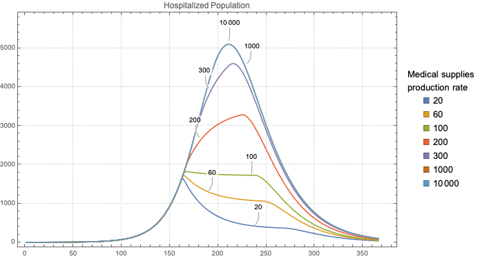

Here are the corresponding AUC values:

```mathematica
aAUCs = TrapezoidalRule[Transpose[{Range[0, 365], #}]] & /@ aVals;
ResourceFunction["GridTableForm"][aAUCs]
```

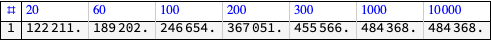

```mathematica
BarChart[aAUCs, ChartLabels -> Keys[aAUCs], ColorFunction -> "Pastel",
  PlotLabel -> 
  Row[{focusStock[t] /. modelSEI2HREcon["Stocks"], Spacer[5], "AUC"}]]
```

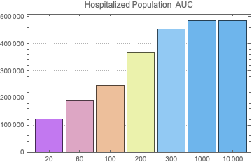

#### Medical Supplies

Here we plot the availability of MS at MS producer’s storage:

```mathematica
SeedRandom[821]
focusStock = MS;
aVals = #[MS][Range[0, 365]] & /@ aVarSolutions;
ListLinePlot[
 KeyValueMap[
  Callout[Tooltip[#2, #1], #1, {RandomInteger[{100, 160}], Above}] &, 
  aVals], PlotLegends -> 
  SwatchLegend[Keys[aVals], 
   LegendLabel -> "Medical supplies\nproduction rate"], 
 PlotRange -> All, ImageSize -> Large, 
 PlotLabel -> focusStock[t] /. modelSEI2HREcon["Stocks"]]
```

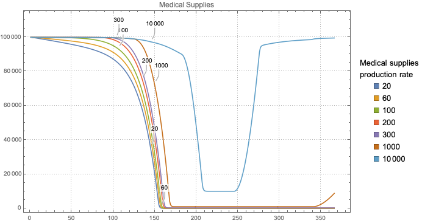

Here are the corresponding AUC values:

```mathematica
aAUCs = TrapezoidalRule[Transpose[{Range[0, 365], #}]] & /@ aVals;
ResourceFunction["GridTableForm"][aAUCs]
```

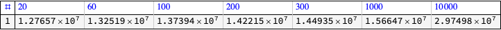

```mathematica
BarChart[aAUCs, 
 ChartLabels -> Map[Rotate[ToString[#], \[Pi]/6] &, Keys[aAUCs]], 
 ColorFunction -> "Pastel", 
 PlotLabel -> 
  Row[{focusStock[t] /. modelSEI2HREcon["Stocks"], Spacer[5], "AUC"}],
  ImageSize -> Medium]
```

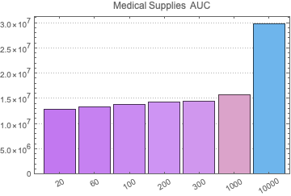

### Variation of delivery disruption starts

Here we compute simulation solutions for a set of delivery disruption starts using disruption length of 7 days and disruption “slowing down” factor 2:

```mathematica
AbsoluteTiming[
 aVarSolutions =
   Association@
    Map[
     Function[{ddsVar},
      ddsVar -> 
       Association[
        ModelNDSolve[
          SetRateRules[
           modelSEI2HREcon, <|\[Kappa][MS] -> 100000, \[Kappa][HMS] ->
              1000, mspr[HB] -> 100, ql -> 56, qsd -> 60, 
            nhbr[TP] -> 3/1000, dbp -> 1, dds -> ddsVar, ddl -> 7, 
            dsf -> 2|>], {t, 365}][[1]]]
      ],
     Append[Range[40, 120, 20], 365]
     ];
 ]

(*{0.45243, Null}*)
```

Note, that disruption start at day 365 means no disruption. Also, we use three hospital beds per thousand people.

Here we plot the results for HP only:

```mathematica
SeedRandom[009]
focusStock = HP;
aVals = #[focusStock][Range[0, 365]] & /@ aVarSolutions;
ListLinePlot[
 KeyValueMap[
  Callout[Tooltip[#2, #1], #1, {RandomInteger[{60, 140}], Bottom}] &, 
  aVals], PlotLegends -> 
  SwatchLegend[Keys[aVals], 
   LegendLabel -> "Medical supplies\ndisruption start"], 
 PlotRange -> All, ImageSize -> Large, 
 PlotLabel -> focusStock[t] /. modelSEI2HREcon["Stocks"]]
```

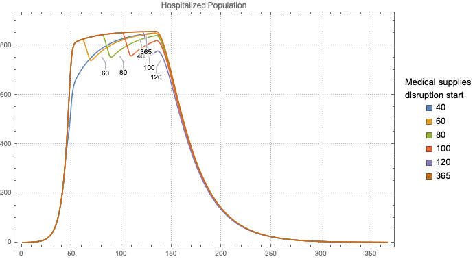

Here are the corresponding AUC values:

```mathematica
aAUCs = TrapezoidalRule[Transpose[{Range[0, 365], #}]] & /@ aVals;
ResourceFunction["GridTableForm"][aAUCs]
```

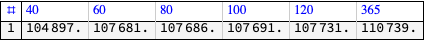

```mathematica
BarChart[aAUCs, 
 ChartLabels -> Map[Rotate[ToString[#], \[Pi]/6] &, Keys[aAUCs]], 
 ColorFunction -> "Pastel", 
 PlotLabel -> 
  Row[{focusStock[t] /. modelSEI2HREcon["Stocks"], Spacer[5], "AUC"}],
  ImageSize -> Medium]
```

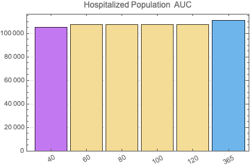

### Combined variability of delivery start and disruption

Here are calculate the solutions for a set of combinations of delivery periods and delivery disruption starts:

```mathematica
AbsoluteTiming[
 aVarSolutions =
   Association@
    Map[
     Function[{par},
      model2 = modelSEI2HREcon;
      model2 = 
       SetRateRules[
        model2, <|\[Kappa][MS] -> 100000, \[Kappa][HMS] -> 10000, 
         mspr[HB] -> 1000, dbp -> par[[1]], dds -> par[[2]], ddl -> 7,
          dsf -> 4, nhbr[TP] -> 3/1000|>];
      par -> Association[ModelNDSolve[model2, {t, 365}][[1]]]
      ],
     Flatten[Outer[List, {0.5, 1, 1.5}, {60, 100, 365}], 1]
     ];
 ]

(*{0.759922, Null}*)
```

As expected more frequent, less disrupted delivery brings fuller utilization of the non-occupied hospital beds:

```mathematica
SeedRandom[3233]
focusStock = HP;
aVals = #[focusStock][Range[0, 365]] & /@ aVarSolutions;
ListLinePlot[
 KeyValueMap[
  Callout[Tooltip[#2, ToString[#1]], 
    ToString[#1], {RandomInteger[{60, 160}], Left}] &, aVals], 
 PlotLegends -> 
  SwatchLegend[ToString /@ Keys[aVals], 
   LegendLabel -> 
    "Medical supplies\ndelivery period & disruption start"], 
 PlotRange -> All, ImageSize -> Large, 
 PlotLabel -> focusStock[t] /. modelSEI2HREcon["Stocks"]]
```

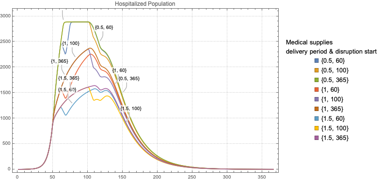

Here are the corresponding AUC values:

```mathematica
aAUCs = TrapezoidalRule[Transpose[{Range[0, 365], #}]] & /@ aVals;
ResourceFunction["GridTableForm"][aAUCs]
```

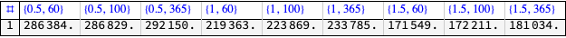

```mathematica
BarChart[aAUCs, 
 ChartLabels -> Map[Rotate[ToString[#], \[Pi]/6] &, Keys[aAUCs]], 
 ColorFunction -> "Pastel", 
 PlotLabel -> 
  Row[{focusStock[t] /. modelSEI2HREcon["Stocks"], Spacer[5], "AUC"}],
  ImageSize -> Medium]
```

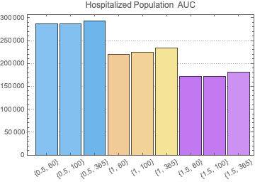

```mathematica
SeedRandom[3233]
focusStock = DIP;
aVals = #[focusStock][Range[0, 365]] & /@ aVarSolutions;
ListLinePlot[
 KeyValueMap[
  Callout[Tooltip[#2, ToString[#1]], 
    ToString[#1], {RandomInteger[{60, 160}], Left}] &, aVals], 
 PlotLegends -> 
  SwatchLegend[ToString /@ Keys[aVals], 
   LegendLabel -> 
    "Medical supplies\ndelivery period & disruption start"], 
 PlotRange -> All, ImageSize -> Large, 
 PlotLabel -> focusStock[t] /. modelSEI2HREcon["Stocks"]]
```

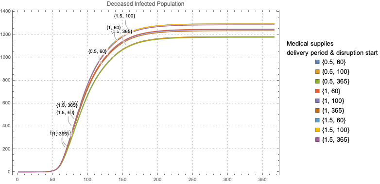

```mathematica
ResourceFunction["GridTableForm"][Last /@ aVals]
```

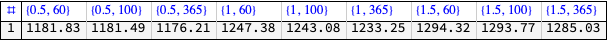

```mathematica
BarChart[Last /@ aVals, 
 ChartLabels -> Map[Rotate[ToString[#], \[Pi]/6] &, Keys[aAUCs]], 
 ColorFunction -> "Pastel", 
 PlotLabel -> "Deceased Population at day 365", ImageSize -> Medium]
```

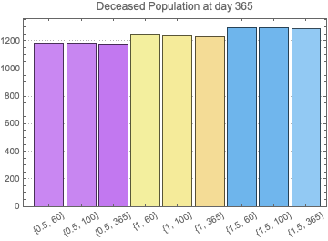

## References

### Articles

[Wk1] Wikipedia entry, ["Compartmental models in epidemiology"](https://en.wikipedia.org/wiki/Compartmental_models_in_epidemiology).

[Wl2] Wikipedia entry, ["Coronavirus disease 2019"](https://en.wikipedia.org/wiki/Coronavirus_disease_2019).

[HH1] Herbert W. Hethcote (2000). ["The Mathematics of Infectious Diseases"](http://leonidzhukov.net/hse/2014/socialnetworks/papers/2000SiamRev.pdf). SIAM Review. 42 (4): 599–653. Bibcode:2000SIAMR..42..599H. doi:10.1137/s0036144500371907.

[BC1] Lucia Breierova,  Mark Choudhari,  [An Introduction to Sensitivity Analysis](https://ocw.mit.edu/courses/sloan-school-of-management/15-988-system-dynamics-self-study-fall-1998-spring-1999/readings/sensitivityanalysis.pdf), (1996), Massachusetts Institute of Technology.

[AA1] Anton Antonov, ["Coronavirus propagation modeling considerations"](https://github.com/antononcube/SystemModeling/blob/master/Projects/Coronavirus-propagation-dynamics/Documents/Coronavirus-propagation-modeling-considerations.md), (2020), [SystemModeling at GitHub](https://github.com/antononcube/SystemModeling).

[AA2] Anton Antonov, ["Basic experiments workflow for simple epidemiological models"](https://github.com/antononcube/SystemModeling/blob/master/Projects/Coronavirus-propagation-dynamics/Documents/Basic-experiments-workflow-for-simple-epidemiological-models.md), (2020), [SystemModeling at GitHub](https://github.com/antononcube/SystemModeling).

[AA3] Anton Antonov, ["Scaling of Epidemiology Models with Multi-site Compartments"](https://github.com/antononcube/SystemModeling/blob/master/Projects/Coronavirus-propagation-dynamics/Documents/Scaling-of-epidemiology-models-with-multi-site-compartments.md), (2020), [SystemModeling at GitHub](https://github.com/antononcube/SystemModeling).

[AA4] Anton Antonov, ["SEI2HR model with quarantine scenarios"](https://github.com/antononcube/SystemModeling/blob/master/Projects/Coronavirus-propagation-dynamics/Documents/SEI2HR-model-with-quarantine-scenarios.md), (2020), [SystemModeling at GitHub](https://github.com/antononcube/SystemModeling).

### Repositories, packages

[WRI1] Wolfram Research, Inc., ["Epidemic Data for Novel Coronavirus COVID-19"](https://www.wolframcloud.com/obj/resourcesystem/published/DataRepository/resources/Epidemic-Data-for-Novel-Coronavirus-COVID-19), [WolframCloud](https://www.wolframcloud.com).

[AAr1] Anton Antonov, [Coronavirus propagation dynamics project](https://github.com/antononcube/SystemModeling/tree/master/Projects/Coronavirus-propagation-dynamics), (2020), [SystemModeling at GitHub](https://github.com/antononcube/SystemModeling).

[AAr2] Anton Antonov, ["Epidemiology Compartmental Modeling Monad in R"](https://github.com/antononcube/ECMMon-R), (2020), [ECMon-R at GitHub](https://github.com/antononcube/ECMMon-R).

[AAp1] Anton Antonov, ["Epidemiology models Mathematica package"](https://github.com/antononcube/SystemModeling/blob/master/Projects/Coronavirus-propagation-dynamics/WL/EpidemiologyModels.m), (2020), [SystemModeling at GitHub](https://github.com/antononcube/SystemModeling).

[AAp2] Anton Antonov, ["Epidemiology models modifications Mathematica package"](https://github.com/antononcube/SystemModeling/blob/master/Projects/Coronavirus-propagation-dynamics/WL/EpidemiologyModelModifications.m), (2020), [SystemModeling at GitHub](https://github.com/antononcube/SystemModeling).

[AAp3] Anton Antonov, ["Epidemiology modeling visualization functions Mathematica package"](https://github.com/antononcube/SystemModeling/blob/master/Projects/Coronavirus-propagation-dynamics/WL/EpidemiologyModelingVisualizationFunctions.m), (2020), [SystemModeling at GitHub](https://github.com/antononcube/SystemModeling).

[AAp4] Anton Antonov, ["Epidemiology modeling simulation functions Mathematica package"](https://github.com/antononcube/SystemModeling/blob/master/Projects/Coronavirus-propagation-dynamics/WL/EpidemiologyModelingSimulationFunctions.m), (2020), [SystemModeling at GitHub](https://github.com/antononcube/SystemModeling).

[AAp5] Anton Antonov, ["System dynamics interactive interfaces functions Mathematica package"](https://github.com/antononcube/SystemModeling/blob/master/WL/SystemDynamicsInteractiveInterfacesFunctions.m), (2020), [SystemsModeling at GitHub](https://github.com/antononcube/SystemModeling).
