# SEI2HR model with quarantine scenarios

**Version 0.8**

Anton Antonov  
[MathematicaForPrediction at WordPress](https://mathematicaforprediction.wordpress.com)  
[SystemModeling at GitHub](https://github.com/antononcube/SystemModeling)  
March, April 2020  

## Introduction

The [epidemiology compartmental model](https://en.wikipedia.org/wiki/Compartmental_models_in_epidemiology), [Wk1], presented in this notebook -- SEI2HR -- deals with the left-most and middle rectangles in this diagram:

```mathematica
ImageResize[Import["https://github.com/antononcube/SystemModeling/raw/master/Projects/Coronavirus-propagation-dynamics/Diagrams/Coronavirus-propagation-simple-dynamics.jpeg"], 900]
```

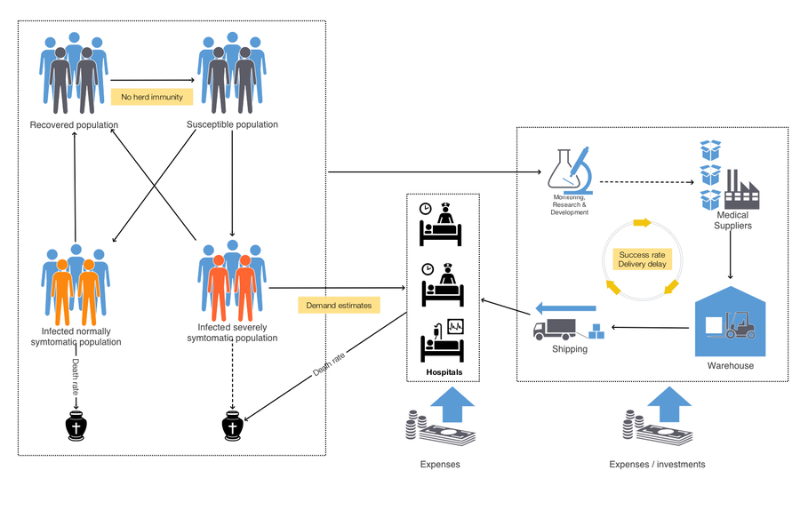

“SEI2HR” stands for “Susceptible, Exposed, Infected two, Hospitalized, Recovered” (populations.)

In this notebook we also deal with quarantine scenarios.

**Remark:** We consider the contagious disease propagation models as instances of the more general [System Dynamics (SD)](https://en.wikipedia.org/wiki/System_dynamics) models. We use SD terminology in this notebook.

### The models

#### SEI2R

The model SEI2R are introduced and explained in the notebook [AA2]. SEI2R differs from [the classical SEIR model](https://en.wikipedia.org/wiki/Compartmental_models_in_epidemiology) , [Wk1, HH1], with the following elements:

1. Two separate infected populations: one is "severely symptomatic", the other is "normally symptomatic"

2. The monetary equivalent of lost productivity due to infected or died people is tracked.

#### SEI2HR

For the formulation of SEI2HR we use a system of Differential Algebraic Equations (DAE’s). The package [AAp1] allows the use of a formulation that has just Ordinary Differential Equations (ODE’s).

Here are the unique features of SEI2HR:

- People stocks

    - Two types of infected populations: normally symptomatic and severely symptomatic

    - Hospitalized population

    - Deceased from infection population

- Hospital beds 

    - Hospital beds are a limited resource that determines the number of hospitalized people

    - Only severely symptomatic people are hospitalized according to the available hospital beds

    - The hospital beds stock is not assumed constant, it has its own change rate.

- Money stocks

    - The money from lost productivity are tracked

    - The money for hospital services are tracked

#### SEI2HR’s place a development plan

This graph shows the “big picture” of the model development plan undertaken in [AAr1] and SEI2HR (discussed in this notebook) is in that graph:

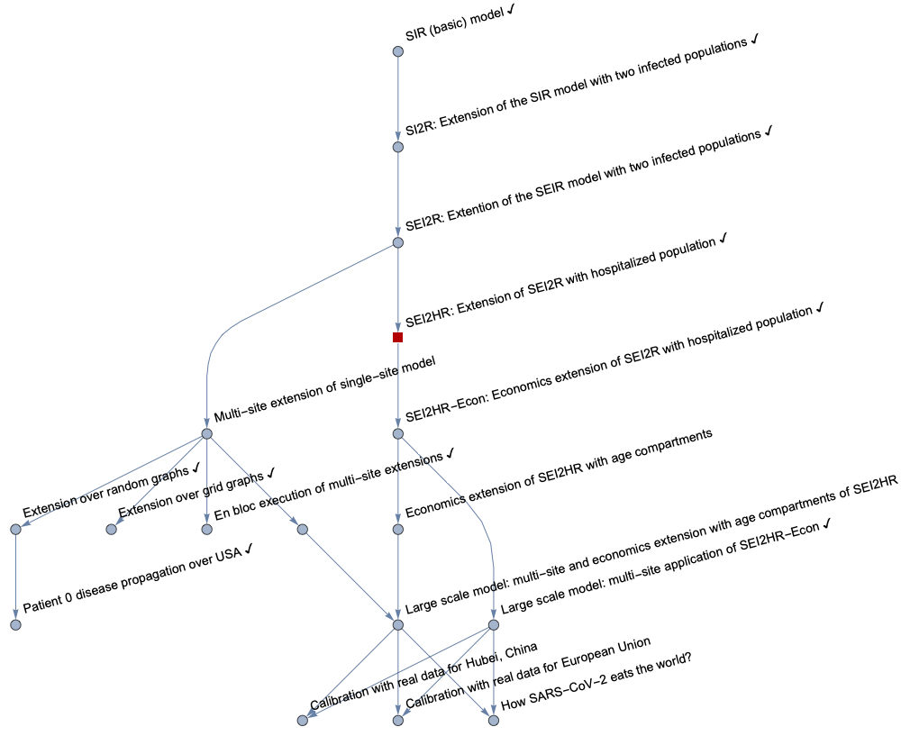

### Notebook structure

The rest of notebook has the following sequence of sections:

- Package load section

- SEI2HR structure in comparison of SEI2R

- Explanations of the equations of SEI2HR

- Quarantine scenario modeling preparation

- Parameters and initial conditions setup

    - Populations, hospital beds, quarantine scenarios

- Parametric simulation solution

- Interactive interface

- Sensitivity analysis

## Load packages

The epidemiological models framework used in this notebook is implemented with the packages [AAp1, AAp2, AA3]; many of the plot functions are from the package [AAp4].

```mathematica
Import["https://raw.githubusercontent.com/antononcube/SystemModeling/master/Projects/Coronavirus-propagation-dynamics/WL/EpidemiologyModels.m"];
Import["https://raw.githubusercontent.com/antononcube/SystemModeling/master/Projects/Coronavirus-propagation-dynamics/WL/EpidemiologyModelModifications.m"];
Import["https://raw.githubusercontent.com/antononcube/SystemModeling/master/Projects/Coronavirus-propagation-dynamics/WL/EpidemiologyModelingVisualizationFunctions.m"];
Import["https://raw.githubusercontent.com/antononcube/SystemModeling/master/WL/SystemDynamicsInteractiveInterfacesFunctions.m"]
```

## SEI2HR extends SEI2R

The model SEI2HR is an extension of the model SEI2R, [AA2].

Here is SEI2R:

```mathematica
reprTP = "AlgebraicEquation";
lsModelOpts = {"Tooltips" -> True, TooltipStyle -> {Background -> Yellow, CellFrameColor -> Gray, FontSize -> 20}};
modelSEI2R = SEI2RModel[t, "InitialConditions" -> True, "RateRules" -> True, "TotalPopulationRepresentation" -> reprTP];
ModelGridTableForm[modelSEI2R, lsModelOpts]
```

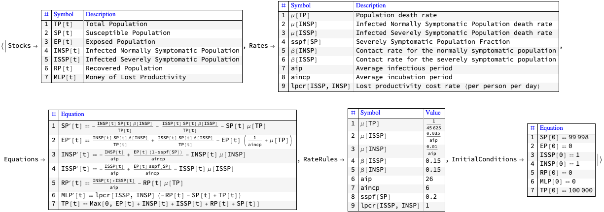

Here is SEI2HR:

```mathematica
modelSEI2HR = SEI2HRModel[t, "InitialConditions" -> True, "RateRules" -> True, "TotalPopulationRepresentation" -> reprTP];
ModelGridTableForm[modelSEI2HR, lsModelOpts]
```

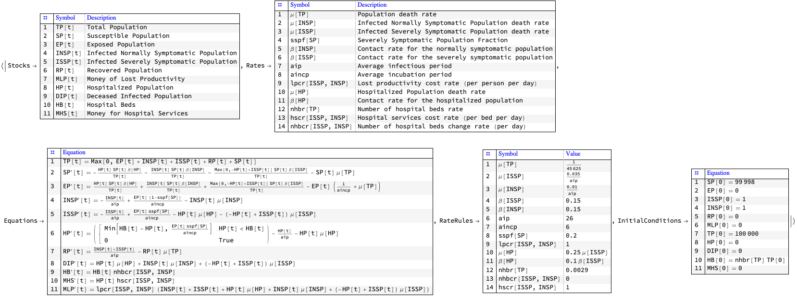

Here are the “differences” between the two models:

```mathematica
ModelGridTableForm@
 Merge[{modelSEI2HR, modelSEI2R}, 
  If[AssociationQ[#[[1]]], KeyComplement[#], Complement @@ #] &]
```

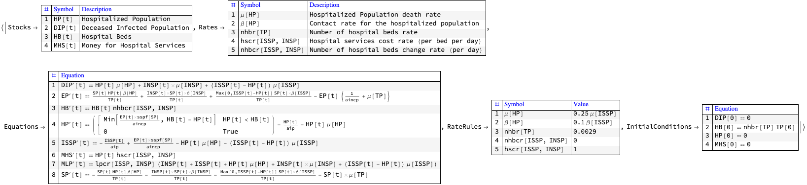

## Equations explanations

In this section we provide rationale of the model equations of SEI2HR. 

The equations for Susceptible, Exposed, Infected, Recovered populations of SEI2R are "standard" and explanations about them are found in [WK1, HH1]. For SEI2HR those equations change because of the stocks Hospitalized Population and Hospital Beds.

The equations time unit is one day. The time horizon is one year. Since we target COVID-19, [Wk2, AA1], we do not consider births.

**Remark:** For convenient reading the equations in this section have tooltips for the involved stocks and rates.

### Verbalization description of the model

We start with one infected (normally symptomatic) person, the rest of the people are susceptible. The infected people meet other people directly or get in contact with them indirectly. (Say, susceptible people touch things touched by infected.) For each susceptible person there is a probability to get the decease. The decease has an incubation period: before becoming infected the susceptible are (merely) exposed. The infected recover after a certain average infection period or die. A certain fraction of the infected become severely symptomatic. If there are enough hospital beds the severely symptomatic infected are hospitalized. The hospitalized severely infected have different death rate than the non-hospitalized ones. The number of hospital beds might change: hospitals are extended, new hospitals are build, or there are not enough medical personnel or supplies. The deaths from infection are tracked (accumulated.) Money for hospital services and money from lost productivity are tracked (accumulated.) 

The equations below give mathematical interpretation of the model description above.

### Code for the equations

Each equation in this section are derived with code like this:

```mathematica
ModelGridTableForm[modelSEI2HR, lsModelOpts]["Equations"][[1, 
 EquationPosition[modelSEI2HR, RP] + 1, 2]]
```

and then the output cell is edited to be “DisplayFormula” and have CellLabel value corresponding to the stock of interest.

### The infected and hospitalized populations

SEI2HR has two types of infected populations: a normally symptomatic one and a severely symptomatic one. A major assumption for SEI2HR is that only the severely symptomatic people are hospitalized. (That assumption is also reflected in the diagram in the introduction.)

Each of those three populations have their own contact rates and mortality rates.

Here are the contact rates from the SEI2HR dictionary

```mathematica
ColumnForm@
 Cases[Normal@modelSEI2HR["Rates"], 
  HoldPattern[\[Beta][_] -> _], \[Infinity]]
```

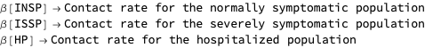

Here are the mortality rates from the SEI2HR dictionary

```mathematica
ColumnForm@
 Cases[Normal@modelSEI2HR["Rates"], 
  HoldPattern[\[Mu][_] -> _], \[Infinity]]
```

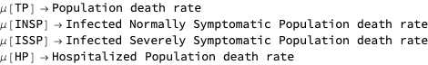

**Remark:** Below with “Infected Population” we mean both stocks Infected Normally Symptomatic Population (INSP) and Infected Severely Symptomatic Population (ISSP).

### Total Population

In this notebook we consider a DAE’s formulation of SEI2HR. The stock Total Population has the following (obvious) algebraic equation:

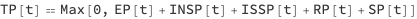

Note that with Max we specified that the total population cannot be less than $0$.

**Remark:** As mentioned in the introduction, the package [AAp1] allows for the use of non-algebraic formulation, without an equation for TP.

### Susceptible Population

The stock Susceptible Population (SP) is decreased by (1) infections derived from stocks Infected Populations and Hospitalized Population (HP), and (2) morality cases derived with the typical mortality rate.

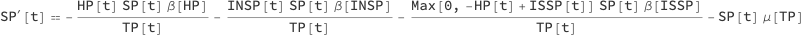

Because we hospitalize the severely infected people only instead of the term


we have the terms 


The first term is for the infections derived from the hospitalized population. The second term for the infections derived from people who are infected severely symptomatic and *not* hospitalized.

#### Births term

Note that we do not consider in this notebook births, but the births term can be included in SP’s equation:

```mathematica
Block[{m = SEI2HRModel[t, "BirthsTerm" -> True]},
 ModelGridTableForm[m]["Equations"][[1, EquationPosition[m, SP] + 1, 
  2]]
 ]
```

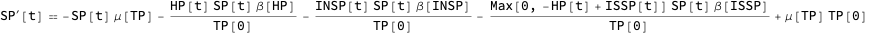

The births rate is the same as the death rate, but it can be programmatically changed. (See [AAp2].)

### Exposed Population

The stock Exposed Population (EP) is increased by (1) infections derived from the stocks Infected Populations and Hospitalized Population, and (2) mortality cases derived with the typical mortality rate. EP is decreased by (1) the people who after a certain average incubation period (aincp) become ill, and (2) mortality cases derived with the typical mortality rate.

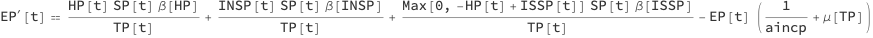

### Infected Normally Symptomatic Population

INSP is increased by a fraction of the people who have been exposed. That fraction is derived with the parameter severely symptomatic population fraction (sspf). INSP is decreased by (1) the people who recover after a certain average infection period (aip), and (2) the normally symptomatic people who die from the disease.

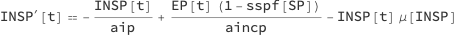

### Infected Severely Symptomatic Population

ISSP is increased by a fraction of the people who have been exposed. That fraction is corresponds to the parameter severely symptomatic population fraction (sspf). ISSP is decreased by (1) the people who recover after a certain average infection period (aip), (2) the hospitalized severely symptomatic people who die from the disease, and (3) the non-hospitalized severely symptomatic people who die from the disease.

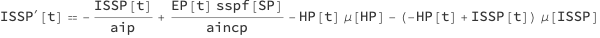

Note that we do not assume that severely symptomatic people recover faster if they are hospitalized, only that they have a different death rate.

### Hospitalized Population

The amount of people that can be hospitalized is determined by the available Hospital Beds (HB) -- the stock Hospitalized Population (HP) is subject to a resource limitation by the stock HB.

The equation of the stock HP can be easily understood from the following dynamics description points:

- If the number of hospitalized people is less that the number of hospital beds we hospitalize the new ISSP people.

- If the new ISSP people are more than the Available Hospital Beds (AHB) we take as many as AHB.

- Hospitalized people have the same average infection period (aip).

- Hospitalized (severely symptomatic) people have their own mortality rate.

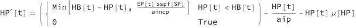

Note that although we know that in a given day some hospital beds are going to be freed they are not considered in the hospitalization plans for that day.

### Recovered Population

The stock Recovered Population (RP) is increased by the recovered infected people and decreased by mortality cases derived with the typical mortality rate.

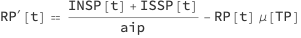

### Deceased Infected Population

The stock Deceased Infected Population (DIP) accumulates the deaths of the people who are infected. Note that we utilize the different death rates for HP and ISSP.

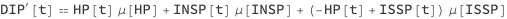

### Hospital Beds

The stock Hospital Beds (HB) can change with a rate that reflects the number of hospital beds change rate (nhbcr) per day. Generally speaking, using nhbcr we can capture scenarios, like, extending hospitals, building new hospitals, recruitment of new medical personnel, loss of medical personnel (due to infections.)

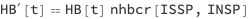

### Money for Hospital Services

The stock Money for Hospital Services (MHS) simply tracks expenses for hospitalized people. The parameter hospital services cost rate (hscr) with unit money per bed per day simply multiplies HP.


### Money from Lost Productivity

The stock Money from Lost Productivity (MLP) simply tracks the work non-availability of the infected and died from infection people. The parameter lost productivity cost rate (lpcr) with unit money per person per day multiplies the total count of the infected and dead from infection.

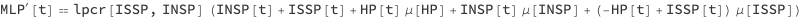

## Quarantine scenarios

In order to model quarantine scenarios we use piecewise constant functions for the contact rates $\beta [\text{ISSP}]$ and $\beta [\text{INSP}]$. 

**Remark:** Other functions can be used, like, functions derived through some statistical fitting. 

Here is an example plot :

```mathematica
Block[{func = \[Beta]*
    Piecewise[{{1, t < qsd}, {qcrf, qsd <= t <= qsd + ql}}, 1]},
 Legended[
  Block[{\[Beta] = 0.56, qsd = 60, ql = 8*7, qcrf = 0.25},
   ListLinePlot[Table[func, {t, 0, 365}], PlotStyle -> "Detailed"]
   ], func]]
```

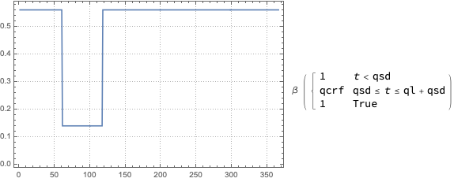

To model quarantine with a piecewise constant function we use the following  parameters:

-  $\text{qsd}$ for quarantine's start

- $\text{ql}$ for quarantines duration

- $\text{qcrf}$ for the effect on the quarantine on the contact rate

## Parameters and actual simulation equations code

Here are the parameters we want to experiment with (or do calibration with):

```mathematica
lsFocusParams = {aincp, aip, sspf[SP], \[Beta][HP], qsd, ql, qcrf, 
   nhbcr[ISSP, INSP], nhbr[TP]};
aParametricRateRules = 
  KeyDrop[modelSEI2HR["RateRules"], lsFocusParams];
```

Here we set custom rates and initial conditions:

```mathematica
population = 10^6;
If[reprTP == "AlgebraicEquation",
  modelSEI2HR = SetRateRules[modelSEI2HR,
    <|
     \[Beta][ISSP] -> 
      0.5*Piecewise[{{1, t < qsd}, {qcrf, qsd <= t <= qsd + ql}}, 1],
     \[Beta][INSP] -> 
      0.5*Piecewise[{{1, t < qsd}, {qcrf, qsd <= t <= qsd + ql}}, 1],
     qsd -> 60,
     ql -> 8*7,
     qcrf -> 0.25,
     \[Beta][HP] -> 0.01,
     \[Mu][ISSP] -> 0.035/aip,
     \[Mu][INSP] -> 0.01/aip,
     nhbr[TP] -> 3/1000,
     lpcr[ISSP, INSP] -> 1,
     hscr[ISSP, INSP] -> 1
     |>]; 
  modelSEI2HR = 
   SetInitialConditions[
    modelSEI2HR, <|TP[0] == population, SP[0] -> population - 1, 
     ISSP[0] -> 0, INSP[0] -> 1|>],
  (*ELSE*)
  
  modelSEI2HR = 
   SetRateRules[
    modelSEI2HR, <|
     TP[t] -> population, \[Beta][ISSP] -> 0.56, \[Beta][INSP] -> 
      0.56, \[Beta][HP] -> 0.01, \[Mu][ISSP] -> 
      0.035/aip, \[Mu][INSP] -> 0.01/aip, \[Mu][HP] -> 0.005/aip, 
     nhbr[TP] -> population*3/1000|>]; 
  modelSEI2HR = 
   SetInitialConditions[
    modelSEI2HR, <|SP[0] -> population - 1, ISSP[0] -> 0, 
     INSP[0] -> 1|>];
  ];
```

**Remark:** Note the piecewise functions for $\beta [\text{ISSP}]$ and $\beta [\text{INSP}]$.

Here is the system of ODE’s we use to do *parametrized* simulations:

```mathematica
lsActualEquations =
  Join[
   modelSEI2HR["Equations"] //. 
    KeyDrop[modelSEI2HR["RateRules"], lsFocusParams],
   modelSEI2HR["InitialConditions"] //. 
    KeyDrop[modelSEI2HR["RateRules"], lsFocusParams]
   ];
ResourceFunction["GridTableForm"][List /@ lsActualEquations]
```

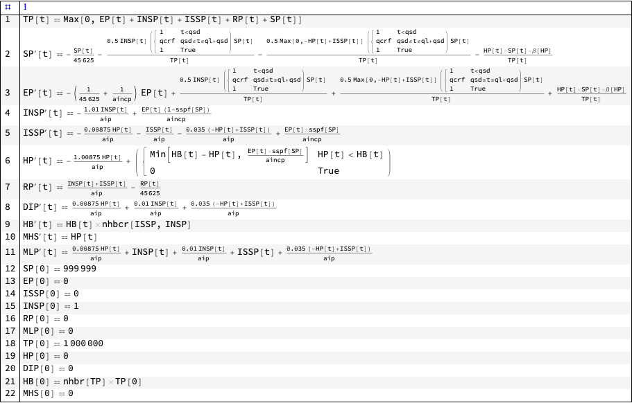

## Simulation

### Solutions

Straightforward simulation for one year using ParametricNDSolve :

```mathematica
aSol =
  Association@Flatten@
    ParametricNDSolve[lsActualEquations, 
     GetStockSymbols[modelSEI2HR, __ ~~ __], {t, 0, 365}, 
     lsFocusParams];
```

### Example evaluation

Here are the parameters of a stock solution:

```mathematica
aSol[HP]["Parameters"]

(*{aincp, aip, sspf[SP], \[Beta][HP], qsd, ql, qcrf, nhbcr[ISSP, INSP], 
 nhbr[TP]}*)
```

Here we replace the parameters with concrete rate values (kept in the model object):

```mathematica
aSol[HP]["Parameters"] //. modelSEI2HR["RateRules"]
```

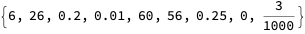

Here is an example evaluation of a solution using the parameter values above:

```mathematica
With[{seq = 
   Sequence @@ (aSol[HP]["Parameters"] //. modelSEI2HR["RateRules"])},
  aSol[HP][seq][100]]

(*2887.95*)
```

## Interactive interface

Using the interface in this section we can interactively see the effects of changing the focus parameters.

```mathematica
opts = {PlotRange -> All, PlotLegends -> None, 
   PlotTheme -> "Detailed", PerformanceGoal -> "Speed", 
   ImageSize -> 400};
lsPopulationKeys = {TP, SP, EP, ISSP, INSP, HP, RP, DIP, HB};
lsEconKeys = {MHS, MLP};
Manipulate[
 DynamicModule[{lsPopulationPlots, lsEconPlots, lsRestPlots},
  
  lsPopulationPlots =
   ParametricSolutionsPlots[
    modelSEI2HR["Stocks"],
    KeyTake[aSol, Intersection[lsPopulationKeys, displayStocks]],
    {aincp, aip, spf, crhp, qsd, ql, qcrf, nhbcr, nhbr/1000}, ndays,
    "LogPlot" -> popLogPlotQ, "Together" -> popTogetherQ, 
    "Derivatives" -> popDerivativesQ, 
    "DerivativePrefix" -> "\[CapitalDelta]", opts];
  
  lsEconPlots =
   ParametricSolutionsPlots[
    modelSEI2HR["Stocks"],
    KeyTake[aSol, Intersection[lsEconKeys, displayStocks]],
    {aincp, aip, spf, crhp, qsd, ql, qcrf, nhbcr, nhbr/1000}, ndays,
    "LogPlot" -> econLogPlotQ, "Together" -> econTogetherQ, 
    "Derivatives" -> econDerivativesQ, 
    "DerivativePrefix" -> "\[CapitalDelta]", opts];
  
  lsRestPlots =
   If[Length[KeyDrop[aSol, Join[lsPopulationKeys, lsEconKeys]]] == 
     0, {},
    (*ELSE*)
    ParametricSolutionsPlots[
     modelSEI2HR["Stocks"],
     KeyTake[KeyDrop[aSol, Join[lsPopulationKeys, lsEconKeys]], 
      displayStocks],
     {aincp, aip, spf, crhp, qsd, ql, qcrf, nhbcr, nhbr/1000}, ndays,
     "LogPlot" -> econLogPlotQ, "Together" -> econTogetherQ, 
     "Derivatives" -> econDerivativesQ, 
     "DerivativePrefix" -> "\[CapitalDelta]", opts]
    ];
  
  Multicolumn[Join[lsPopulationPlots, lsEconPlots, lsRestPlots], 
   nPlotColumns, Dividers -> All, FrameStyle -> GrayLevel[0.8]]
  ],
 {{displayStocks, Join[lsPopulationKeys, lsEconKeys], 
   "Stocks to display:"}, Join[lsPopulationKeys, lsEconKeys], 
  ControlType -> TogglerBar},
 {{aincp, 6., "Average incubation period (days)"}, 1, 60., 1, 
  Appearance -> {"Open"}},
 {{aip, 21., "Average infectious period (days)"}, 1, 60., 1, 
  Appearance -> {"Open"}},
 {{spf, 0.2, "Severely symptomatic population fraction"}, 0, 1, 0.025,
   Appearance -> {"Open"}},
 {{qsd, 65, "Quarantine start days"}, 0, 365, 0.01, 
  Appearance -> {"Open"}},
 {{ql, 8*7, "Quarantine length (in days)"}, 0, 120, 1, 
  Appearance -> {"Open"}},
 {{qcrf, 0.25, "Quarantine contact rate fraction"}, 0, 1, 0.01, 
  Appearance -> {"Open"}},
 {{crhp, 0.1, "Contact rate of the hospitalized population"}, 0, 30, 
  0.1, Appearance -> {"Open"}},
 {{nhbcr, 0, "Number of hospital beds change rate"}, -0.5, 0.5, 0.001,
   Appearance -> {"Open"}},
 {{nhbr, 2.9, "Number of hospital beds rate (per 1000 people)"}, 0, 
  100, 0.1, Appearance -> {"Open"}},
 {{ndays, 365, "Number of days"}, 1, 365, 1, Appearance -> {"Open"}},
 {{popTogetherQ, True, "Plot populations together"}, {False, True}},
 {{popDerivativesQ, False, "Plot populations derivatives"}, {False, 
   True}},
 {{popLogPlotQ, False, "LogPlot populations"}, {False, True}},
 {{econTogetherQ, True, "Plot economics functions together"}, {False, 
   True}},
 {{econDerivativesQ, False, 
   "Plot economics functions derivatives"}, {False, True}},
 {{econLogPlotQ, True, "LogPlot economics functions"}, {False, 
   True}},
 {{nPlotColumns, 1, "Number of plot columns"}, Range[5]},
 ControlPlacement -> Left, ContinuousAction -> False]
```

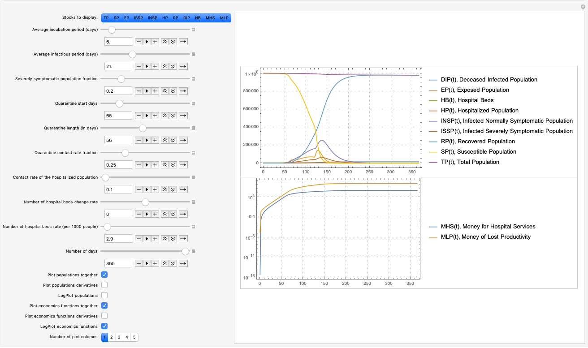

## Sensitivity analysis

When making and using this kind of dynamics models it is important to see how the solutions react to changes of different parameters. For example, we should try to find answers to questions like "What ranges of which parameters bring dramatic changes into important stocks?"

Sensitivity analysis is used to determine how sensitive is a SD model to changes of the parameters and to changes of model’s equations, [BC1]. More specifically, parameter sensitivity, which we apply below, allows us to see the changes of stocks dynamic behaviour for different sequences (and combinations) of parameter values.

**Remark:** The sensitivity analysis shown below should be done for other stocks and rates. In order to keep this exposition short we focus on ISSP, DIP, and HP.

It is interesting to think in terms of “3D parameter sensitivity plots.” We also do such plots.

### Evaluations by Area under the curve

For certain stocks we might be not just interested in their evolution in time but also in their cumulative values. I.e. we are interested in the so called Area Under the Curve (AUC) metric for those stocks.

There are three ways to calculate AUC for stocks of interest:

1. Add aggregation equations in the system of ODE’s. (Similar to the stock DIP in SEI2HR.)

    - For example, in order to compute AUC for ISSP we can add to SEI2HR the equation:

```
(*aucISSP'[t] = ISSP[t]*)
```

    - More details for such equation addition are given in [AA2].

1. Apply NIntegrate over stocks solution functions.

1. Apply [Trapezoidal rule](https://en.wikipedia.org/wiki/Trapezoidal_rule) to stock solution function values over a certain time grid.

Below we use 1 and 3. 

**Remark:** The AUC measure for a stock is indicated with the prefix “∫”. For example AUC for ISSP is marked with “∫ISSP”.

### Ranges

Below we use the following sets of quarantine starts and quarantine durations.

```mathematica
lsQStartRange = Join[{365}, Range[50, 100, 5], {140}];
lsQLengthRange = Join[{0}, Range[2*7, 12*7, 7]];
```

Note that putting the quarantine start to be at day 365 means “no quarantine.”

### Number of infected people

#### Quarantine starts sensitivity

```mathematica
ColumnForm[
 Map[StockVariabilityPlot[aSol, ISSP, 
    Join[modelSEI2HR["RateRules"], <|ql -> 8*7|>], {qsd, 
     lsQStartRange}, 365, "Operation" -> #, opts, 
    ImageSize -> 300] &, {"Identity", "Integral"}]]
```

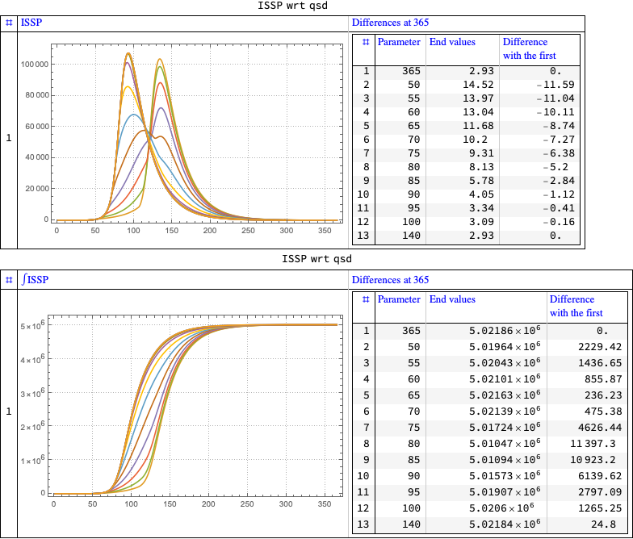

Note that the plots and tabulated differences with “no quarantine” indicate that there is a very narrow range to choose an effective quarantine start.

#### Quarantine duration sensitivity

```mathematica
ColumnForm[
 Map[StockVariabilityPlot[aSol, ISSP, 
    Join[modelSEI2HR["RateRules"], <|qsd -> 60|>], {ql, 
     lsQLengthRange}, 365, "Operation" -> #, opts, 
    ImageSize -> 300] &, {"Identity", "Integral"}]]
```

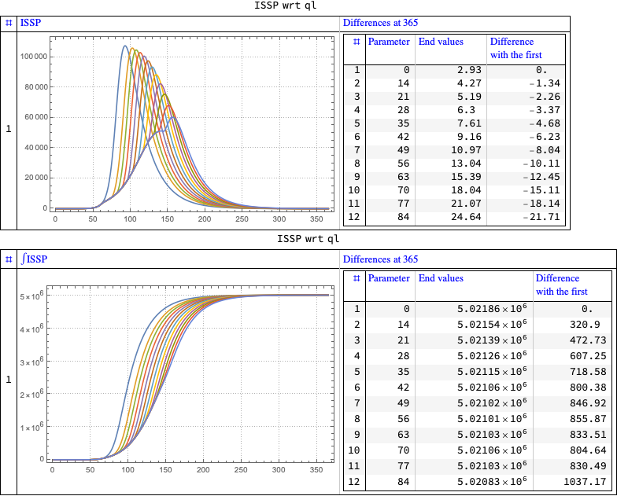

### Number of deceased people

#### Quarantine starts sensitivity

```mathematica
ColumnForm[
 Map[StockVariabilityPlot[aSol, DIP, 
    Join[modelSEI2HR["RateRules"], <|ql -> 8*7|>], {qsd, 
     lsQStartRange}, 365, "Operation" -> #, opts, 
    ImageSize -> 300] &, {"Identity", "Derivative"}]]
```

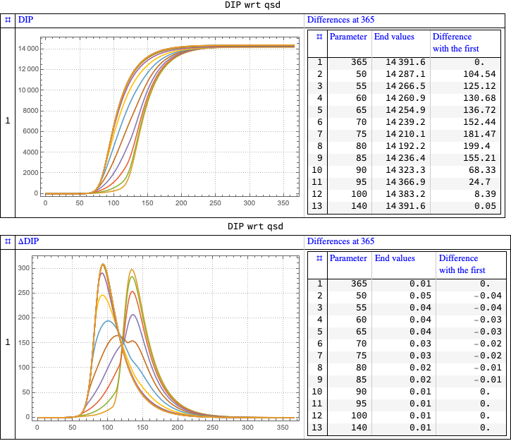

### Number of hospitalized people

#### Quarantine starts sensitivity

```mathematica
ColumnForm[
 Map[StockVariabilityPlot[aSol, HP, 
    Join[modelSEI2HR["RateRules"], <|ql -> 8*7|>], {qsd, 
     lsQStartRange}, 365, "Operation" -> #, opts, 
    ImageSize -> 300] &, {"Identity", "Integral"}]]
```

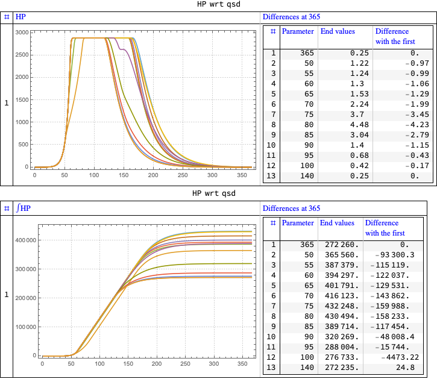

### Infected Severely Symptomatic Population stock integral with respect to quarantine start and length

In this section the 3D plot of AUC of ISSP is calculated using Trapezoidal rule.

```mathematica
AbsoluteTiming[
 aVals = Association@
    Flatten@Table[{qsdVar, qlVar} -> 
       ParametricFunctionValues[aSol[ISSP], 
        Join[modelSEI2HR["RateRules"], <|qsd -> qsdVar, 
          ql -> qlVar|>], {0, 365, 1}], {qsdVar, 50, 120, 5}, {qlVar, 
       10, 120, 5}];
 ]

(*{20.3553, Null}*)
```

```mathematica
ListPlot3D[KeyValueMap[Append[#1, #2] &, TrapezoidalRule /@ aVals], 
 AxesLabel -> {"Quaratine start", "Quarantine length", 
   "Infected Severely Symptomatic Population AUC"}, PlotRange -> All, 
 ImageSize -> Large]
```

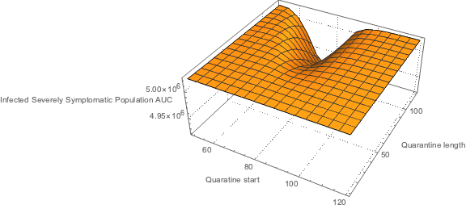

### Deceased Infected Population stock with respect to quarantine start and length

 We can see from SEI2HR’s equations that DIP is already an AUC type of value. We can just plot the DIP values at the time horizon (one year.) 

```mathematica
focusStock = DIP;
```

```mathematica
AbsoluteTiming[
 aVals = Association@
    Flatten@Table[{qsdVar, qlVar} -> 
       ParametricFunctionValues[aSol[focusStock], 
        Join[modelSEI2HR["RateRules"], <|qsd -> qsdVar, 
          ql -> qlVar|>], {365, 365, 1}], {qsdVar, 50, 120, 
       5}, {qlVar, 2*7, 12*7, 7}];
 ]

(*{8.34843, Null}*)
```

```mathematica
ListPlot3D[KeyValueMap[Join[#1, #2[[1, {2}]]] &, aVals], 
 AxesLabel -> {"Quarantine start", "Quarantine duration", 
   focusStock[t] /. modelSEI2HR["Stocks"]}, PlotRange -> All, 
 ImageSize -> Large]
```

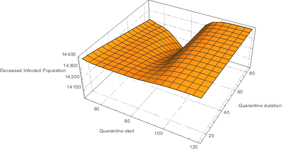

### Hospitalized Population stock integral with respect to quarantine start and length

In this section the 3D plot of AUC of HP is calculated using Trapezoidal rule.

```mathematica
AbsoluteTiming[
 aVals = Association@
    Flatten@Table[{qsdVar, qlVar} -> 
       ParametricFunctionValues[aSol[HP], 
        Join[modelSEI2HR["RateRules"], <|qsd -> qsdVar, 
          ql -> qlVar|>], {0, 365, 1}], {qsdVar, 50, 120, 5}, {qlVar, 
       10, 120, 5}];
 ]

(*{18.7415, Null}*)
```

```mathematica
ListPlot3D[KeyValueMap[Append[#1, #2] &, TrapezoidalRule /@ aVals], 
 AxesLabel -> {"Quaratine start", "Quarantine length", 
   "Hospitalized population AUC"}, PlotRange -> All, 
 ImageSize -> Large]
```

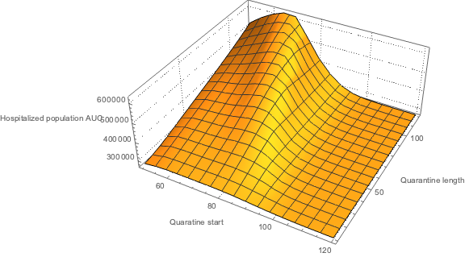

## References

### Articles

[Wk1] Wikipedia entry, ["Compartmental models in epidemiology"](https://en.wikipedia.org/wiki/Compartmental_models_in_epidemiology).

[Wl2] Wikipedia entry, ["Coronavirus disease 2019"](https://en.wikipedia.org/wiki/Coronavirus_disease_2019).

[HH1] Herbert W. Hethcote (2000). ["The Mathematics of Infectious Diseases"](http://leonidzhukov.net/hse/2014/socialnetworks/papers/2000SiamRev.pdf). SIAM Review. 42 (4): 599–653. Bibcode:2000SIAMR..42..599H. doi:10.1137/s0036144500371907.

[BC1] Lucia Breierova,  Mark Choudhari,  [An Introduction to Sensitivity Analysis](https://ocw.mit.edu/courses/sloan-school-of-management/15-988-system-dynamics-self-study-fall-1998-spring-1999/readings/sensitivityanalysis.pdf), (1996), Massachusetts Institute of Technology.

[AA1] Anton Antonov, ["Coronavirus propagation modeling considerations"](https://github.com/antononcube/SystemModeling/blob/master/Projects/Coronavirus-propagation-dynamics/Documents/Coronavirus-propagation-modeling-considerations.md), (2020), [SystemModeling at GitHub](https://github.com/antononcube/SystemModeling).

[AA2] Anton Antonov, ["Basic experiments workflow for simple epidemiological models"](https://github.com/antononcube/SystemModeling/blob/master/Projects/Coronavirus-propagation-dynamics/Documents/Basic-experiments-workflow-for-simple-epidemiological-models.md), (2020), [SystemModeling at GitHub](https://github.com/antononcube/SystemModeling).

[AA3] Anton Antonov, ["Scaling of Epidemiology Models with Multi-site Compartments"](https://github.com/antononcube/SystemModeling/blob/master/Projects/Coronavirus-propagation-dynamics/Documents/Scaling-of-epidemiology-models-with-multi-site-compartments.md), (2020), [SystemModeling at GitHub](https://github.com/antononcube/SystemModeling).

### Repositories, packages

[WRI1] Wolfram Research, Inc., ["Epidemic Data for Novel Coronavirus COVID-19"](https://www.wolframcloud.com/obj/resourcesystem/published/DataRepository/resources/Epidemic-Data-for-Novel-Coronavirus-COVID-19), [WolframCloud](https://www.wolframcloud.com).

[AAr1] Anton Antonov, [Coronavirus propagation dynamics project](https://github.com/antononcube/SystemModeling/tree/master/Projects/Coronavirus-propagation-dynamics), (2020), [SystemModeling at GitHub](https://github.com/antononcube/SystemModeling).

[AAp1] Anton Antonov, ["Epidemiology models Mathematica package"](https://github.com/antononcube/SystemModeling/blob/master/Projects/Coronavirus-propagation-dynamics/WL/EpidemiologyModels.m), (2020), [SystemsModeling at GitHub](https://github.com/antononcube/SystemModeling).

[AAp2] Anton Antonov, ["Epidemiology models modifications Mathematica package"](https://github.com/antononcube/SystemModeling/blob/master/Projects/Coronavirus-propagation-dynamics/WL/EpidemiologyModelModifications.m), (2020), [SystemsModeling at GitHub](https://github.com/antononcube/SystemModeling).

[AAp3] Anton Antonov, ["Epidemiology modeling visualization functions Mathematica package"](https://github.com/antononcube/SystemModeling/blob/master/Projects/Coronavirus-propagation-dynamics/WL/EpidemiologyModelingVisualizationFunctions.m), (2020), [SystemsModeling at GitHub](https://github.com/antononcube/SystemModeling).

[AAp4] Anton Antonov, ["System dynamics interactive interfaces functions Mathematica package"](https://github.com/antononcube/SystemModeling/blob/master/WL/SystemDynamicsInteractiveInterfacesFunctions.m), (2020), [SystemsModeling at GitHub](https://github.com/antononcube/SystemModeling).

### Project management files

[AAo1] Anton Antonov, [WirVsVirus-Hackathon-work-plan.org](https://github.com/antononcube/SystemModeling/blob/master/Projects/Coronavirus-propagation-dynamics/org/WirVsVirus-Hackathon-work-plan.org), (2020), [SystemsModeling at GitHub](https://github.com/antononcube/SystemModeling).

[AAo2] Anton Antonov, [WirVsVirus-hackathon-Geo-spatial-temporal-model-mind-map](https://github.com/antononcube/SystemModeling/blob/master/Projects/Coronavirus-propagation-dynamics/org/WirVsVirus-hackathon-Geo-spatial-temporal-model-mind-map.pdf), (2020), [SystemsModeling at GitHub](https://github.com/antononcube/SystemModeling).
