# Scaling of epidemiology models with multi-site compartments

**Version 1.0**

Anton Antonov  
[MathematicaForPrediction at WordPress](https://mathematicaforprediction.wordpress.com)  
[SystemModeling at GitHub](https://github.com/antononcube/SystemModeling)  
March 2020

## Introduction

In this notebook we describe and exemplify an algorithm that allows the specification and execution geo-spatial-temporal simulations of infectious disease spreads. (Concrete implementations and examples are given.)

The assumptions of the typical compartmental epidemiological models do not apply for countries or cities that are non-uniformly populated. (For example, China, USA, Russia.) There is a need to derive epidemiological models that take into account the non-uniform distribution of populations and related traveling patterns within the area of interest. 

Here is a visual aid (made with a random graph over the 30 largest cities of China):


In this notebook we show how to extend core, single-site epidemiological models into larger models for making spatial-temporal simulations. In the explanations and examples we use [SEI2R](https://github.com/antononcube/SystemModeling/blob/master/Projects/Coronavirus-propagation-dynamics/Documents/Basic-experiments-workflow-for-simple-epidemiological-models.md), [AA2, AAp1], as a core epidemiological model, but other models can be adopted if they adhere to the model data structure of the package ["EpidemiologyModels.m"](https://github.com/antononcube/SystemModeling/blob/master/Projects/Coronavirus-propagation-dynamics/WL/EpidemiologyModels.m), [AAp1].

From our experiments with we believe that the proposed multi-site extension algorithm gives a modeling ingredient that is hard emulate by other means within single-site models.

### Definitions

**Single-site:** A geographical location (city, neighbourhood, campus) for which the assumptions of the classical compartmental epidemiological models hold.

**Single site epidemiological model:** A compartmental epidemiological model for a single site. Such model has a system of Ordinary Differential Equations (ODE’s) and site dependent initial conditions.

**Multi-site area:** An area comprised of multiple single sites with known traveling patterns between them. The area has a directed graph $G$ with nodes that correspond to the sites and a positive matrix $\text{\textit{tpm}}(G)$ for the traveling patterns between the sites.

**Problem definition:** Given (i) a single site epidemiological model $M$, (ii) a graph $G$ connecting multiple sites, and (iii) a traveling patterns matrix $\text{\textit{tpm}}(G)$ between the nodes of $G$ derive an epidemiological model $S(M,\text{\textit{tpm}}(G))$ that simulates more adequately viral decease propagation over $G$.

**Multi-Site Epidemiological Model Extension Algorithm (MSEMEA):** An algorithm that derives from a given single site epidemiological model and multi-site area an epidemiological model that can be used to simulate the geo-spatial-temporal epidemics and infectious disease spreads. (The description of MSEMEA is the main message of this notebook.)

### Load packages

The epidemiological models framework used in this notebook is implemented with the packages [AAp1, AAp2, AA3]; the interactive plots functions are from the package [AAp4].

```mathematica
Import["https://raw.githubusercontent.com/antononcube/SystemModeling/master/Projects/Coronavirus-propagation-dynamics/WL/EpidemiologyModels.m"]
Import["https://raw.githubusercontent.com/antononcube/SystemModeling/master/Projects/Coronavirus-propagation-dynamics/WL/EpidemiologyModelModifications.m"]
Import["https://raw.githubusercontent.com/antononcube/SystemModeling/master/Projects/Coronavirus-propagation-dynamics/WL/EpidemiologyModelingVisualizationFunctions.m"]
Import["https://raw.githubusercontent.com/antononcube/SystemModeling/master/WL/SystemDynamicsInteractiveInterfacesFunctions.m"]
```

### Notebook structure

The section “General algorithm description” gives rationale and conceptual steps of MSEMEA.

The next two sections of the notebook follow the procedure outline using the SEI2R model as $M$, a simple graph with two nodes as $G$, and both constant and time-dependent matrices for $\text{\textit{tpm}}(G)$.

The section “Constant traveling patterns over a grid graph” presents an important test case with a grid graph that we use to test and build confidence in MSEMEA. The sub-section “Observations” is especially of interest.

The section “Time-dependent traveling patterns over a random graph” presents a nearly “real life” application of MSEMEA using a random graph and a time dependent travelling patterns matrix.

The section “Money from lost productivity” shows how to track the money losses across the sites.

The last section “Future plans” outlines envisioned (immediate) extensions work presented in this notebook.

## General algorithm description

In this section we describe a modeling approach that uses different mathematical modeling approaches for (i) the multi-site travelling patterns and (ii) the single-site disease spread interactions, and then (iii) unifies them into a common model. 

### Splitting and scaling

The traveling between large, densely populated cities is a very different process of the usual people mingling in those cities. The usual large, dense city mingling is assumed and used in the typical compartmental epidemiological models. It seems it is a good idea to split the two processes and derive a common model. 

Assume that all journeys finish within a day. We can model the people arriving (flying in) into a city as births, and people departing a city as deaths.

Let as take a simple model like SIR or SEIR and write the equation for every site we consider. This means for every site we have the same ODE’s with site-dependent initial conditions.

Consider the traveling patterns matrix $K$, which is a contingency matrix derived from source-destination traveling records. (Or the adjacency matrix of a travelling patterns graph.) The matrix entry of $K(i,j)$ tells us how many people traveled from site $i$ to site $j$. We systematically change the ODE’s of the sites in following way.

Assume that site $a$ had only travelers coming from site $b$ and going to site $b$. Assume that the Total Population (TP) sizes for sites $a$ and $b$ are $N_a$ and $N_b$ respectively. Assume that only people from the Susceptible Population (SP) traveled. If the adopted single-site model is SIR, [Wk1], we take the SP equation of site $a$

$$\text{SP}_a'(t)=-\frac{\beta  \text{IP}_a(t) \text{SP}_a(t)}{N_a}-\text{SP}_a(t) \mu$$

and change into the equation 

$$\text{SP}_a'(t)=-\frac{\beta  \text{IP}_a(t) \text{SP}_a(t)}{N_a}-\text{SP}_a(t) \mu -\frac{K(a,b)\text{SP}_a(t)}{N_a}+\frac{K(b,a)\text{SP}_b(t)}{N_b},$$

assuming that

$$\frac{K(a,b)\text{SP}_a(t)}{N_a}\leq N_a ,\frac{K(b,a)\text{SP}_b(t)}{N_b}\leq N_b.$$

**Remark:** In the package [AAp3] the transformations above are done with the more general and robust formula:

$$\min \left(\frac{K(i,j)\text{SP}_i(t)}{\text{TP}_i(t)},\text{TP}_i(t)\right).$$

The transformed systems of ODE’s of the sites are joined into one “big” system of ODE’s, appropriate initial conditions are set, and the “big” ODE system is solved. (The sections below show concrete examples.)

### Steps of MSEMEA 

The MSEMEA derives a compartmental model that combines (i) a graph representation of multi-site traveling patterns with (ii) a single-site compartmental epidemiological model.

Here is a visual aid for the algorithm steps below:


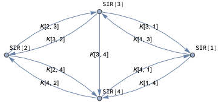

1. Get a single-site epidemiological compartmental model data structure, $M$.

    1. The model data structure has stocks and rates dictionaries, equations, initial conditions, and prescribed rate values; see [AA2, AAp1].

1. Derive the site-to-site traveling patterns matrix $K$ for the sites in the graph $G$.

1. For each of node $i$ of $G$ make a copy of the model $M$ and denote with $M[i]$.

    1. In general, the models $M[i], i\in G$ have different initial conditions. 

    1. The models can also have different death rates, contact rates, etc.

1. Combine the models $M[i], i\in G$ into the scaled model $S$.

    1. Change the equations of $M[i]$, $i\in G$ to reflect the traveling patterns matrix $K$.	

    1. Join the systems of ODE’s of $M[i]$, $i\in G$ into one system of ODE’s.

1. Set appropriate or desired initial conditions for each of the populations in $S$.

1. Solve the ODE’s of $S$.

1. Visualize the results.

### Precaution

Care should be taken when specifying the initial conditions of MSEMEA’s system of ODE’s (sites’ populations) and the traveling patterns matrix. For example, the simulations can “blow up” if the traveling patterns matrix values are too large. As it was indicated above, the package [AAp3] puts some safe-guards, but in our experiments with random graphs and random traveling patterns matrices occasionally we still get “wild” results.

### Analogy with Large scale air-pollution modeling

There is a strong analogy between MSEMEA and Eulerian models of Large Scale Air-Pollution Modeling (LSAPM), [AA3, ZZ1].

The mathematical models of LSAPM have a “chemistry part” and an “advection-diffusion part.” It is hard to treat such mathematical model directly -- different kinds of splittings are used. If we consider 2D LSAPM then we can say that we cover the modeling area with steer tank reactors, then with the chemistry component we simulate the species chemical reactions in those steer tanks, and with the advection-diffusion component we change species concentrations in the steer tanks (according to some wind patterns.)

Similarly, with MSEMEA we separated the travel of population compartments from the “standard” epidemiological modeling interaction between the population compartments.

Similarly to the so called “rotational test” used in LSAPM to evaluate numerical schemes, we derive and study the results of “grid graph tests” for MSEMEA.

## Single site epidemiological model

Here is the SEI2R model from the package [AAp1]:

```mathematica
model1 = SEI2RModel[t, "InitialConditions" -> True, 
   "RateRules" -> True, 
   "TotalPopulationRepresentation" -> "AlgebraicEquation"];
ModelGridTableForm[model1]
```


Here we endow the SEI2R model with a (prominent) ID:

```mathematica
ModelGridTableForm[AddModelIdentifier[model1, 1]]
```

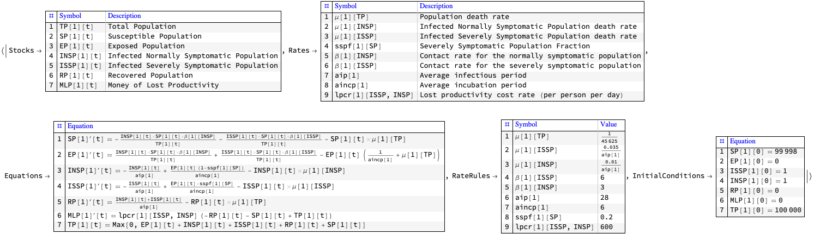

Thus we demonstrated that we can do Step 3 of MSEMEA.

Below we use ID’s that correspond to the nodes of graphs (and are integers.)

## Scaling the single-site SIR model over a small complete graph

### Constant travel matrices

Assume we have two sites and the following graph and matrix describe the traveling patterns between them.

Here is the graph:

```mathematica
gr = CompleteGraph[2, DirectedEdges -> True, 
  GraphLayout -> "SpringElectricalEmbedding"]
```

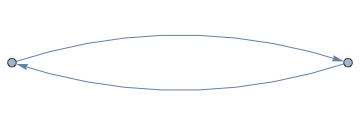

And here is the traveling patterns matrix:

```mathematica
SeedRandom[44];
matTravel = 
  AdjacencyMatrix[gr]*
   RandomInteger[{100, 1000}, {VertexCount[gr], VertexCount[gr]}];
MatrixForm[matTravel]
```

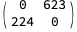

Note that there are much more travelers from 1 to 2 than from 2 to 1.

Here we obtain the core, single-site model (as shown in the section above):

```mathematica
model1 = SEI2RModel[t, "InitialConditions" -> True, 
   "RateRules" -> True, 
   "TotalPopulationRepresentation" -> "AlgebraicEquation"];
```

Make the multi-site compartments model with SEI2R and the two-node travel matrix using the function ToSiteCompartmentsModel of [AAp2]:

```mathematica
modelBig = 
  ToSiteCompartmentsModel[model1, matTravel, 
   "MigratingPopulations" -> {"Susceptible Population", 
     "Exposed Population", "Infected Normally Symptomatic Population",
      "Recovered Population"}];
```

Show the unique stocks in the multi-site model:

```mathematica
GetPopulationSymbols[modelBig, __ ~~ __]

(*{TP[1], SP[1], EP[1], INSP[1], ISSP[1], RP[1], MLP[1], TP[2], SP[2], 
 EP[2], INSP[2], ISSP[2], RP[2], MLP[2]}*)
```

From the symbolic form of the multi-model equations derive the specific equations with the adopted rate values:

```mathematica
ModelGridTableForm[
 KeyTake[modelBig, {"Equations"}] //. modelBig["RateRules"]]
```

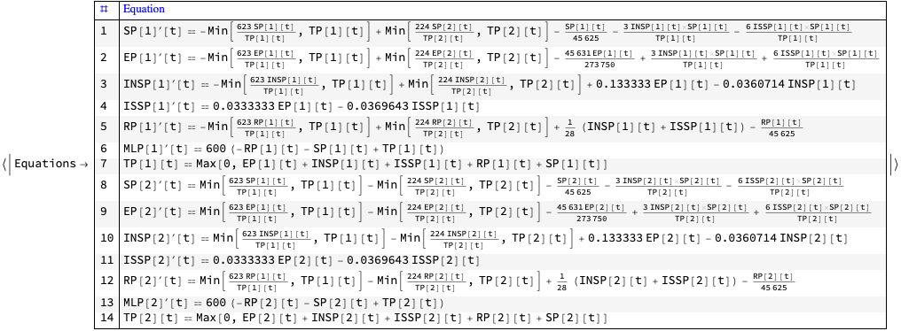

Show the initial conditions:

```mathematica
RandomSample[modelBig["InitialConditions"], UpTo[12]]

(*{ISSP[2][0] == 1, TP[1][0] == 100000, EP[2][0] == 0,
  EP[1][0] == 0, SP[1][0] == 99998, RP[2][0] == 0, 
 RP[1][0] == 0, INSP[1][0] == 1, INSP[2][0] == 1, 
 TP[2][0] == 100000, SP[2][0] == 99998, 
 MLP[1][0] == 0}*)
```

Show the total number of equations:

```mathematica
Length[modelBig["Equations"]]

(*14*)
```

Solve the system of ODE’s of the extended model:

```mathematica
maxTime = 120;
AbsoluteTiming[
  aSol = Association@First@
      NDSolve[
       Join[modelBig["Equations"] //. modelBig["RateRules"], 
        modelBig["InitialConditions"]],
       GetStockSymbols[modelBig, __ ~~ "Population"],
       {t, 0, maxTime}
       ];
  ];
Length[aSol]

(*12*)
```

Display the solutions for each site separately:

```mathematica
ParametricSolutionsPlots[modelBig["Stocks"], #, None, maxTime, 
   "Together" -> True, PlotTheme -> "Detailed", 
   ImageSize -> Medium] & /@ 
 GroupBy[Normal@
   aSol, #[[1, 1]] &, 
  Association]
```

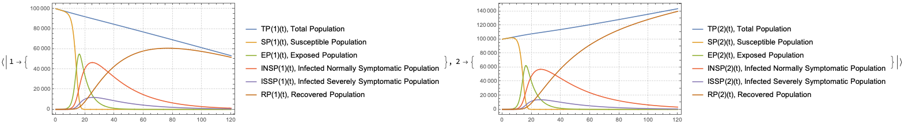

From the plots above we see that both sites start with total populations of $100000$ people. Because more travelers go from 1 to 2 we see that the exposed, infected, and recovered populations are larger at 2.

### Time dependent travel matrices

Instead of using constant traveling patterns matrices we can use matrices with time functions as entries. It is instructive to repeat the computations above using this matrix:

```mathematica
SeedRandom[232]
matTravel2 = 
  matTravel*
   Table[Abs[Sin[RandomReal[{0.01, 0.1}] t]], VertexCount[gr], 
    VertexCount[gr]];
MatrixForm[matTravel2]
```

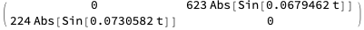

Here are the corresponding number of traveling people functions:

```mathematica
Plot[Evaluate[DeleteCases[Flatten@Normal@matTravel2, 0]], {t, 0, 120},
  PlotTheme -> "Detailed"]
```

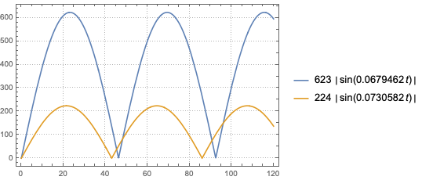

Here we scale the SIR model, solve the obtained system of ODE’s, and plot the solutions:

```mathematica
modelBig = 
  ToSiteCompartmentsModel[model1, matTravel2, 
   "MigratingPopulations" -> {"Susceptible Population", 
     "Exposed Population", "Infected Normally Symptomatic Population",
      "Recovered Population"}];
aSol = Association@First@
    NDSolve[
     Join[modelBig["Equations"] //. modelBig["RateRules"], 
      modelBig["InitialConditions"]],
     GetStockSymbols[modelBig, __ ~~ ""],
     {t, 0, maxTime}
     ];
ParametricSolutionsPlots[modelBig["Stocks"], #, None, 120, 
    "Together" -> True, PlotTheme -> "Detailed", 
    ImageSize -> 
     Medium][[1]] & /@ 
 GroupBy[Normal@
   KeySelect[
    aSol, ! MemberQ[{MLP}, Head[#]] &], #[[1, 
    1]] &, Association]
```

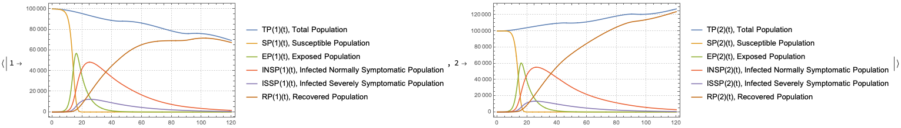

Note that the oscillatory nature of the temporal functions in the travelling patterns matrix are reflected in the simulation results. 

## Constant traveling patterns over a grid graph

In this section we do the model extension and simulation over a regular grid graph with a constant traveling patterns matrix.

Here we create a grid graph with directed edges:

```mathematica
{m, n} = {7, 12};
grGrid = GridGraph[{m, n}, DirectedEdges -> True, 
  GraphLayout -> "SpringEmbedding", 
  VertexLabels -> Automatic, ImageSize -> Large]
```


Note that:

- There is one directed edge between any two edge-connected nodes

- All horizontal edges point in one direction

- All vertical edges point in one direction

-  The edges are directed from nodes with smaller indexes to nodes with larger indexes.

Here we make a constant traveling matrix and summarize it:

```mathematica
matGridTravel = 
  AdjacencyMatrix[grGrid]*
   ConstantArray[1000, {VertexCount[grGrid], VertexCount[grGrid]}];
{ResourceFunction["RecordsSummary"][Flatten[matGridTravel], 
   "All elements"][[1]], 
 ResourceFunction["RecordsSummary"][
   Select[Flatten[matGridTravel], # > 0 &], 
   "Non-zero elements"][[1]], 
 MatrixPlot[matGridTravel]}

```

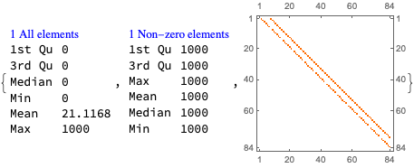

Here we scale the SEI2R model with the grid graph constant traveling matrix:

```mathematica
model1 = SEI2RModel[t, "InitialConditions" -> True, 
   "RateRules" -> True, 
   "TotalPopulationRepresentation" -> "AlgebraicEquation", 
   "BirthsTerm" -> True];
```

```mathematica
modelGrid = 
  ToSiteCompartmentsModel[model1, matGridTravel, 
   "MigratingPopulations" -> Automatic];
```

Change the initial conditions in the following way: 

- Pick initial population size per site (same for all sites)

- Make a constant populations vector

- At all sites except the first one put the infected populations to zero; the first site has one severely symptomatic person

- Set the susceptible populations to be consistent with the total and infected populations.

```mathematica
maxPopulation = 10^6;
lsRPopulations = 
  ConstantArray[maxPopulation, 
   Length[GetPopulationSymbols[modelGrid, "Total Population"]]];
modelGrid =
  SetInitialConditions[
   modelGrid,
   Join[
    Join[AssociationThread[
      Through[GetPopulationSymbols[modelGrid, "Total Population"][0]],
       lsRPopulations], <|TP[1][0] -> maxPopulation|>],
    Join[Association@
      Map[#[0] -> 0 &, 
       GetPopulationSymbols[modelGrid, 
        "Infected Severely Symptomatic Population"]], <|
      ISSP[1][0] -> 1|>],
    Join[Association@
      Map[#[0] -> 0 &, 
       GetPopulationSymbols[modelGrid, 
        "Infected Normally Symptomatic Population"]], <|
      INSP[1][0] -> 0|>],
    Join[AssociationThread[
      Through[GetPopulationSymbols[modelGrid, 
         "Susceptible Population"][0]], lsRPopulations], <|
      SP[1][0] -> maxPopulation - 1|>]
    ]
   ];
```

Solve the system of ODE’s of the scaled model:

```mathematica
maxTime = 160;
AbsoluteTiming[
 aSolGrid = Association@First@
     NDSolve[
      Join[modelGrid["Equations"] //. modelGrid["RateRules"], 
       modelGrid["InitialConditions"]],
      GetStockSymbols[modelGrid, __ ~~ "Population"],
      {t, 0, maxTime}
      ];
 ]

(*{0.717229, Null}*)
```

Randomly sample the graph sites and display the solutions separately for each site in the sample:

```mathematica
Multicolumn[
 Table[
  Block[{aSol = KeySelect[aSolGrid, MatchQ[#, _Symbol[i]] &]},
   Plot[Evaluate[Map[#[t] &, Values[aSol]]], {t, 0, maxTime}, 
    PlotRange -> All, GridLines -> All, 
    PlotTheme -> "Scientific", PlotLegends -> Keys[aSol], 
    ImageSize -> 300]
   ], {i, RandomSample[Range[VertexCount[grGrid]], UpTo[9]]}],
 3]
```

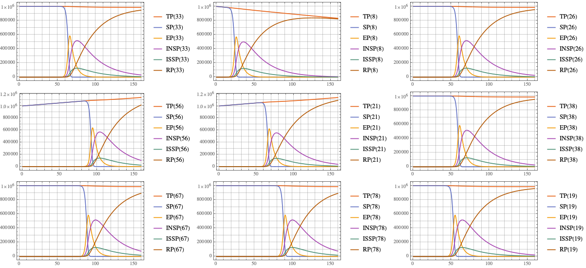

Display solutions of the first and last site:

```mathematica
Multicolumn[
 Table[
  Block[{aSol = KeySelect[aSolGrid, MatchQ[#, _Symbol[i]] &]},
   Plot[Evaluate[Map[#[t] &, Values[aSol]]], {t, 0, maxTime}, 
    PlotRange -> All, GridLines -> All, 
    PlotTheme -> "Scientific", PlotLegends -> Keys[aSol], 
    ImageSize -> 300]
   ], {i, {1, VertexCount[grGrid]}}],
 3]
```

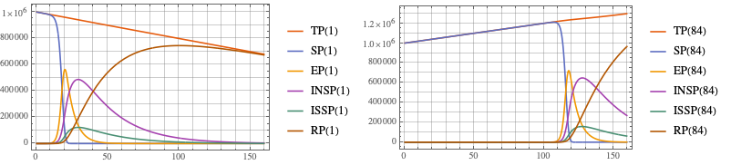

As expected from the graph structure, we can see in the first site plot that its total population is decreasing -- nobody is traveling to the first site. Similarly, we can see in the last site plot that its total population is increasing -- nobody leaves the last site.

### Graph evolution visualizations

We can visualize the spatial-temporal evolution of model’s populations using sequences of graphs. The graphs in the sequences are copies of the multi-site graph each copy having its nodes colored according to the populations in the solutions steps. 

Here is a sub-sequence for the total populations:

```mathematica
EvaluateSolutionsOverGraph[grGrid, modelGrid, "Total Population", \
aSolGrid, {1, maxTime, 12}, "NodeSizeFactor" -> 5, 
 "ColorScheme" -> "TemperatureMap", "Legended" -> True, 
 VertexLabels -> None, ImageSize -> 200]
```

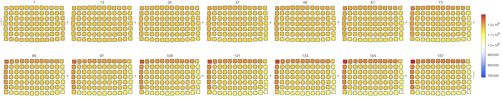

Here is a sub-sequence for the sum of the infected populations:

```mathematica
EvaluateSolutionsOverGraph[grGrid, modelGrid, {"Infected Normally \
Symptomatic Population", 
  "Infected Severely Symptomatic Population"}, aSolGrid, {1, maxTime, 
  12}, "NodeSizeFactor" -> 5, 
 "ColorScheme" -> "TemperatureMap", "Legended" -> True, 
 VertexLabels -> None, ImageSize -> 200]
```

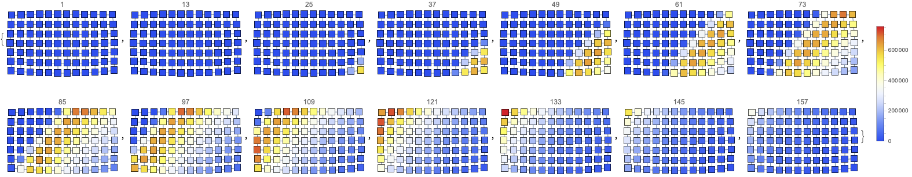

Here is a sub-sequence for the recovered population:

```mathematica
EvaluateSolutionsOverGraph[grGrid, modelGrid, "Recovered Population", \
aSolGrid, {1, maxTime, 12}, "NodeSizeFactor" -> 5, 
 "ColorScheme" -> "TemperatureMap", "Legended" -> True, 
 VertexLabels -> None, ImageSize -> 200]
```

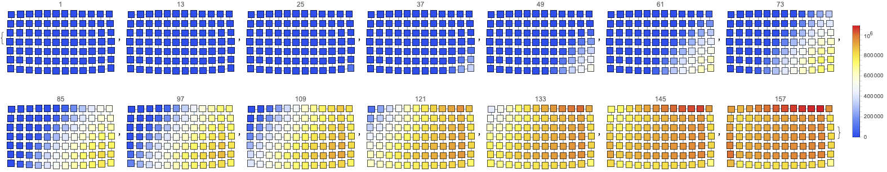

Here is an animation of the sum of the infected populations:

```mathematica
Block[{stocks = {"Infected Normally Symptomatic Population", 
    "Infected Severely Symptomatic Population"}, 
  colorScheme = "TemperatureMap", timeStep = 4},
 Legended[
  ListAnimate[
   EvaluateSolutionsOverGraph[grGrid, modelGrid, stocks, 
    aSolGrid, {1, maxTime, timeStep}, "NodeSizeFactor" -> 6, 
    "ColorScheme" -> colorScheme, ImageSize -> 400]], 
  BarLegend[{colorScheme, 
    MinMax[EvaluateSolutionsOverGraphVertexes[grGrid, modelGrid, 
      stocks, aSolGrid, {1, maxTime, timeStep}]]}]
  ]
 ]
```

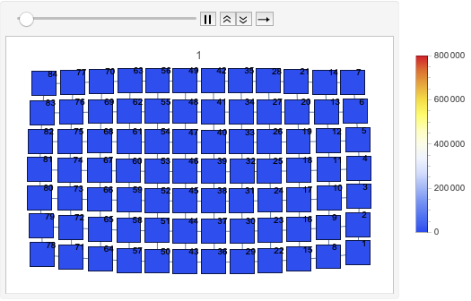

### Curve shapes of the globally-aggregated solutions

Let us plot for each graph vertex the sum of the solutions of the two types of infected populations. Here is a sample of those graphs:

```mathematica
SeedRandom[1782];
ListLinePlot[#, PlotTheme -> "Detailed"] & /@ 
 KeySort[RandomSample[
   EvaluateSolutionsOverGraphVertexes[grGrid, 
    modelGrid, {"Infected Normally Symptomatic Population", 
     "Infected Severely Symptomatic Population"}, 
    aSolGrid, {1, maxTime, 4}], 12]]
```

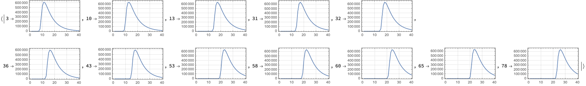

We can see from the plot above that at the grid vertexes we have typical SEIR curve shapes for the corresponding infected populations.

Let us evaluate the solutions for the infected populations for over all graph vertexes and sum them. Here is the corresponding **“globally-aggregated”** plot:

```mathematica
ListLinePlot[#, PlotTheme -> "Detailed"] &@
 Total[Values[
   EvaluateSolutionsOverGraphVertexes[grGrid, 
    modelGrid, {"Infected Normally Symptomatic Population", 
     "Infected Severely Symptomatic Population"}, 
    aSolGrid, {1, maxTime, 4}]]]
```

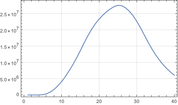

We can see that the globally aggregated plot has a very different shape than the individual vertex plots. The globally aggregated plot has more symmetric look; the individual vertex plots have much steeper gradients on their left sides. 

We can conjecture that a multi-site model made by MSEMEA would capture better real life situations than any single-site model. For example, by applying MSEMEA we might be more successful in our calibration attempts for the Hubei data shown (and calibrated upon) in [AA2.].

### Interactive interface

With this interactive interface we see the evolution of all populations across the graph:

```mathematica
Manipulate[
 Block[{aSol = aSolGrid},
  DynamicModule[{gr = grGrid, imageSize = 270, factor = 3.2, 
    maxPopulation = aSolGrid[TP[VertexCount[grGrid]]][maxTime], 
    lsPops, lsRes},
   lsPops = {"Total Population", "Susceptible Population", 
     "Exposed Population", {"Infected Normally Symptomatic \
Population", "Infected Severely Symptomatic Population"}, 
     "Recovered Population"};
   If[! addInfectedPopulationsQ,
    lsPops = Flatten[lsPops]
    ];
   lsRes =
    Map[
     Labeled[
       EvaluateSolutionsOverGraph[grGrid, modelGrid, #, 
        aSolGrid, {time, time, 1}, "NodeSizeFactor" -> factor, 
        "ColorScheme" -> cf, "Legended" -> legendedQ, 
        VertexLabels -> "Name", ImageSize -> imageSize], 
       If[ListQ[#], "Infected Population", #],
       Top
       ] &, lsPops];
   Multicolumn[lsRes, 3, Dividers -> All, 
    FrameStyle -> GrayLevel[0.8]]
   ]],
 {{time, 80, "time:"}, 0, maxTime, 1, Appearance -> {"Open"}},
 {{addInfectedPopulationsQ, True, "sum infected populations:"}, {True,
    False}},
 {{cf, "TemperatureMap", "color function:"}, {"AvocadoColors", 
   "GreenBrownTerrain", "Rainbow", "TemperatureMap"}},
 {{legendedQ, False, "legended:"}, {False, True}}]
```

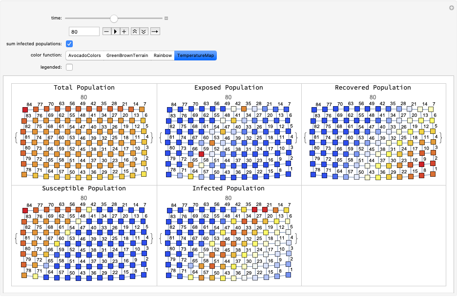

### Observations

Obviously the simulations over the described grid graph, related constant traveling patterns matrix, and constant populations have the purpose to build confidence in conceptual design of MSEMEA and its implementation.

The following observations agree with our expectations for MSEMEA’s results over the “grid graph test”.

1. The populations plots at each site resemble the typical plots of SEI2R.

1. The total population at the first site linearly decreases.

1. The total population at the last site linearly increases.

1. The plots of the total populations clearly have gradually increasing gradients from the low index value nodes to the high index value nodes.

1. For the infected populations there is a clear wave that propagates diagonally from the low index value nodes to the high index value nodes.

    1. In the direction of the general “graph flow.“

1. The front of the infected populations wave is much steeper (gives “higher contrast”) than the tail.

    1. This should be expected from the single-site SEI2R plots.

1. For the recovered populations there is a clear “saturation wave” pattern that indicates that the recovered populations change from $0$ to values close to the corresponding final total populations.

1. The globally aggregated solutions might have fairly different shapes than the single-site solutions. Hence, we think that MSEMEA gives a modeling ingredient that is hard to replicate or emulate by other means in single-site models.

## Time-dependent traveling patterns over a random graph

In this section we apply the model extension and simulation over a random graph with random time-dependent traveling patterns matrix.

```mathematica
SeedRandom[84];
grRandom = 
 RandomGraph[{20, 100}, DirectedEdges -> True, 
  GraphLayout -> "SpringElectricalEmbedding", 
  VertexLabels -> "Name"]
```

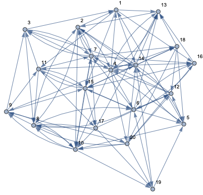

**Remark:** The computations in this section work with larger random graphs; we use a small graph for more legible presentation of the workflow and results. Also, the computations should clearly demonstrate the ability to do simulations with real life data.

Derive a traveling patterns matrix with entries that are random functions:

```mathematica
Block[{gr = grRandom},
 matRandomTravel = 
   AdjacencyMatrix[gr]*
    RandomInteger[{10, 100}, {VertexCount[gr], VertexCount[gr]}]*
    Table[Sin[RandomReal[{0.02, 0.1}] t], VertexCount[gr], 
     VertexCount[gr]];
 ]
```

Here is a *fragment *of the matrix:

```mathematica
Magnify[MatrixForm[
  matRandomTravel[[1 ;; 12, 
   1 ;; 12]]], 0.7]
```

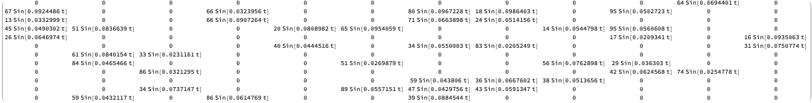

Summarize and plot the matrix at $t=1$: 

```mathematica
Block[{matTravel = matRandomTravel /. t -> 1},
 {ResourceFunction["RecordsSummary"][Flatten[matTravel], 
    "All elements"][[1]], 
  ResourceFunction["RecordsSummary"][
    Select[Flatten[matTravel], # > 0 &], 
    "Non-zero elements"][[1]], 
  MatrixPlot[matTravel]}
 ]
```

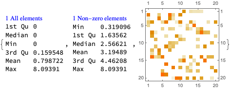

Here we scale the SEI2R model with the random traveling matrix:

```mathematica
model1 = SEI2RModel[t, "InitialConditions" -> True, 
   "RateRules" -> True, 
   "TotalPopulationRepresentation" -> "AlgebraicEquation"];
```

```mathematica
modelRandom = 
  ToSiteCompartmentsModel[model1, matRandomTravel, 
   "MigratingPopulations" -> {"Susceptible Population", 
     "Exposed Population", "Infected Normally Symptomatic Population",
      "Recovered Population"}];
```

Change the initial conditions in the following way: 

- Pick maximum population size per site

- Derive random populations for the sites

- At all sites except the first one put the infected populations to zero; the first site has one severely symptomatic person

- Set the susceptible populations to be consistent with the total and infected populations.

```mathematica
maxPopulation = 10^6;
lsRPopulations = 
  RandomReal[{100000, maxPopulation}, 
   Length[GetPopulationSymbols[modelRandom, "Total Population"]]];
modelRandom =
  SetInitialConditions[
   modelRandom,
   Join[
    Join[AssociationThread[
      Through[GetPopulationSymbols[modelRandom, "Total Population"][
        0]], lsRPopulations], <|TP[1][0] -> maxPopulation|>],
    Join[Association@
      Map[#[0] -> 0 &, 
       GetPopulationSymbols[modelRandom, 
        "Infected Severely Symptomatic Population"]], <|
      ISSP[1][0] -> 1|>],
    Join[Association@
      Map[#[0] -> 0 &, 
       GetPopulationSymbols[modelRandom, 
        "Infected Normally Symptomatic Population"]], <|
      INSP[1][0] -> 0|>],
    Join[AssociationThread[
      Through[GetPopulationSymbols[modelRandom, 
         "Susceptible Population"][0]], lsRPopulations], <|
      SP[1][0] -> maxPopulation - 1|>]
    ]
   ];
```

Here solve the obtained system of ODE’s:

```mathematica
maxTime = 120;
AbsoluteTiming[
 aSolRandom = Association@First@
     NDSolve[
      Join[modelRandom["Equations"] //. modelRandom["RateRules"], 
       modelRandom["InitialConditions"]],
      GetStockSymbols[modelRandom, __ ~~ "Population"],
      {t, 0, maxTime}
      ];
 ]

(*{0.208188, Null}*)
```

Here we plot the solutions:

```mathematica
ParametricSolutionsPlots[<||>, #, None, maxTime, 
    "Together" -> True, PlotTheme -> "Detailed", 
    ImageSize -> 
     Small][[1]] & /@ 
 RandomSample[
  GroupBy[Normal@
    aSolRandom, #[[1, 1]] &, 
   Association], UpTo[12]]
```

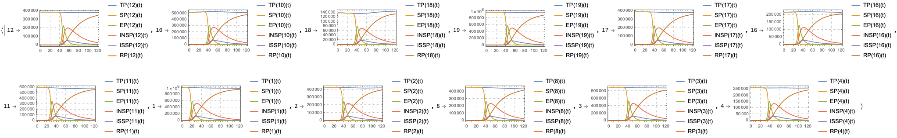

### Graph evolution visualizations

As in the previous section we can visualize the spatial-temporal evolution of model’s populations using sequences of graphs.

Here is a globally normalized sequence:

```mathematica
EvaluateSolutionsOverGraph[grRandom, modelRandom, {"Recovered \
Population"}, aSolRandom, {1, maxTime, 24}, 
 "NodeSizeFactor" -> 4, "ColorScheme" -> "TemperatureMap", 
 "Normalization" -> "Global", "Legended" -> True]
```

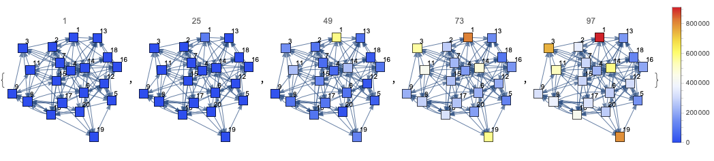

Here is a locally normalized (“by vertex”) sequence:

```mathematica
EvaluateSolutionsOverGraph[grRandom, modelRandom, {"Recovered \
Population"}, aSolRandom, {1, maxTime, 24}, 
 "NodeSizeFactor" -> 4, "ColorScheme" -> "TemperatureMap", 
 "Normalization" -> "ByVertex", "Legended" -> True]
```

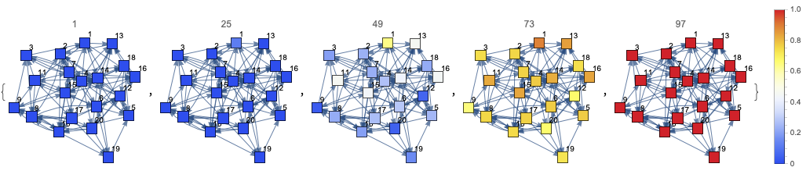

## Money from lost productivity

The model SEI2R from [AAp1] has the stock “Money from Lost Productivity” shown as $\text{MLP}(t)$ in the equations:

```mathematica
ModelGridTableForm[KeyTake[SEI2RModel[t], "Equations"]]
```

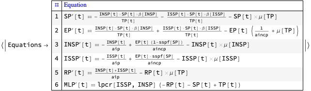

Here are MLP plots from the two-node graph model:

```mathematica
ParametricSolutionsPlots[modelBig["Stocks"], #, None, 120, 
    "Together" -> True, PlotTheme -> "Detailed", 
    ImageSize -> 
     250][[1]] & /@ 
 GroupBy[Normal@
   KeySelect[aSol, MemberQ[{MLP}, Head[#]] &], #[[1,
     1]] &, Association]
```

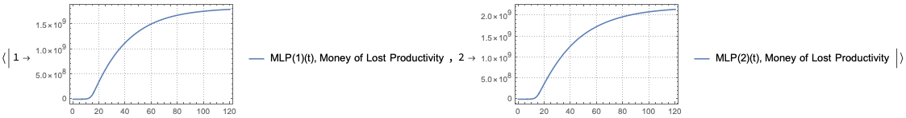

Here we plot the sum of the accumulated money losses:

```mathematica
funcs = Values[KeySelect[aSol, MemberQ[{MLP}, Head[#]] &]];
ListLinePlot[{#, Total[Through[funcs[#]]]} & /@ Range[1, maxTime], 
 PlotTheme -> "Detailed", ImageSize -> 250]
```

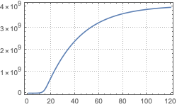

Here is the corresponding “daily loss” (derivative):

```mathematica
funcs = Map[D[#[t], t] &, 
   Values[KeySelect[aSol, MemberQ[{MLP}, Head[#]] &]]];
ListLinePlot[{#, Total[funcs /. t -> #]} & /@ Range[1, maxTime], 
 PlotTheme -> "Detailed", ImageSize -> 250]
```

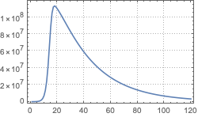

## Future plans

There are multiple ways to extend the presented algorithm, MSEMEA. Here are a few most immediate ones:

1. Investigate and describe the conditions under which MSEMEA performs well, and under which it “blows up”

1. Apply MSEMEA together with single site models that have large economics parts

1. Do real data simulations related to the spread of [COVID-19.](https://en.wikipedia.org/wiki/Coronavirus_disease_2019)

## References

### Articles, books

[Wk1] Wikipedia entry, ["Compartmental models in epidemiology"](https://en.wikipedia.org/wiki/Compartmental_models_in_epidemiology).

[HH1] Herbert W. Hethcote (2000). ["The Mathematics of Infectious Diseases"](http://leonidzhukov.net/hse/2014/socialnetworks/papers/2000SiamRev.pdf). SIAM Review. 42 (4): 599–653. Bibcode:2000SIAMR..42..599H. doi:10.1137/s0036144500371907.

[AA1] Anton Antonov, ["Coronavirus propagation modeling considerations"](https://github.com/antononcube/SystemModeling/blob/master/Projects/Coronavirus-propagation-dynamics/Documents/Coronavirus-propagation-modeling-considerations.md), (2020), [SystemModeling at GitHub](https://github.com/antononcube/SystemModeling).

[AA2] Anton Antonov, ["Basic experiments workflow for simple epidemiological models"](https://github.com/antononcube/SystemModeling/blob/master/Projects/Coronavirus-propagation-dynamics/Documents/Basic-experiments-workflow-for-simple-epidemiological-models.md), (2020), [SystemModeling at GitHub](https://github.com/antononcube/SystemModeling).

[AA3] Anton Antonov, ["Air pollution modeling with gridMathematica"](https://library.wolfram.com/infocenter/Conferences/6532/), (2006), Wolfram Technology Conference.

[ZZ1] Zahari Zlatev, Computer Treatment of Large Air Pollution Models. 1995. Kluwer.

### Repositories, packages

[WRI1] Wolfram Research, Inc., ["Epidemic Data for Novel Coronavirus COVID-19"](https://www.wolframcloud.com/obj/resourcesystem/published/DataRepository/resources/Epidemic-Data-for-Novel-Coronavirus-COVID-19), [WolframCloud](https://www.wolframcloud.com).

[AAr1] Anton Antonov, [Coronavirus propagation dynamics project](https://github.com/antononcube/SystemModeling/tree/master/Projects/Coronavirus-propagation-dynamics), (2020), [SystemModeling at GitHub](https://github.com/antononcube/SystemModeling).

[AAp1] Anton Antonov, ["Epidemiology models Mathematica package"](https://github.com/antononcube/SystemModeling/blob/master/Projects/Coronavirus-propagation-dynamics/WL/EpidemiologyModels.m), (2020), [SystemsModeling at GitHub](https://github.com/antononcube/SystemModeling).

[AAp2] Anton Antonov, ["Epidemiology models modifications Mathematica package"](https://github.com/antononcube/SystemModeling/blob/master/Projects/Coronavirus-propagation-dynamics/WL/EpidemiologyModelModifications.m), (2020), [SystemsModeling at GitHub](https://github.com/antononcube/SystemModeling).

[AAp3] Anton Antonov, ["Epidemiology modeling visualization functions Mathematica package"](https://github.com/antononcube/SystemModeling/blob/master/Projects/Coronavirus-propagation-dynamics/WL/EpidemiologyModelingVisualizationFunctions.m), (2020), [SystemsModeling at GitHub](https://github.com/antononcube/SystemModeling).

[AAp4] Anton Antonov, ["System dynamics interactive interfaces functions Mathematica package"](https://github.com/antononcube/SystemModeling/blob/master/WL/SystemDynamicsInteractiveInterfacesFunctions.m), (2020), [SystemsModeling at GitHub](https://github.com/antononcube/SystemModeling).

