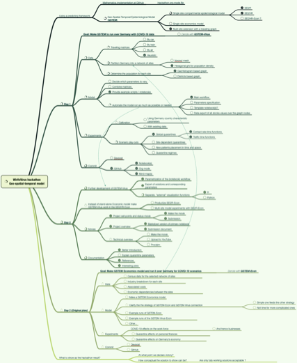
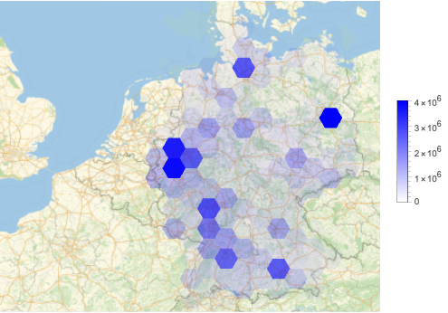
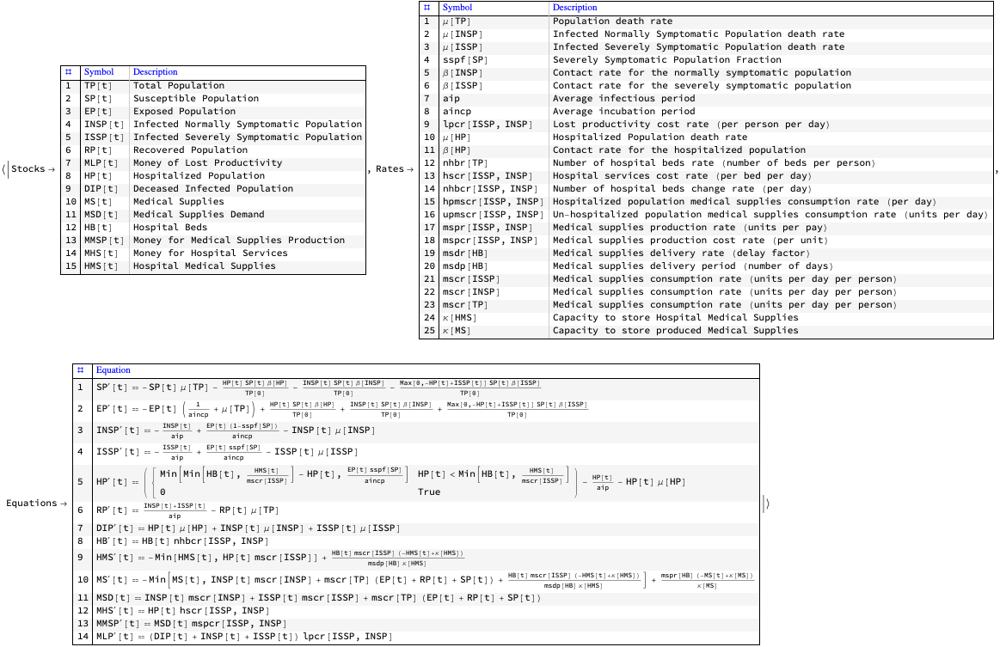
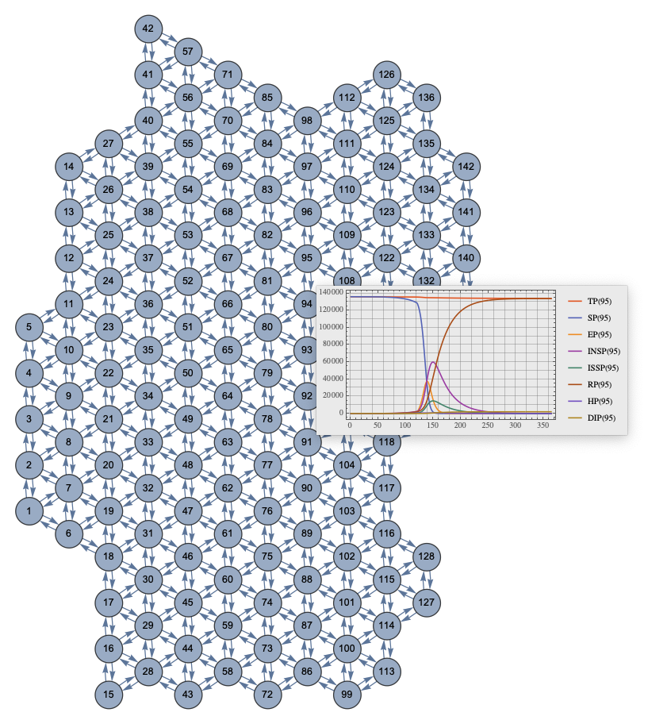
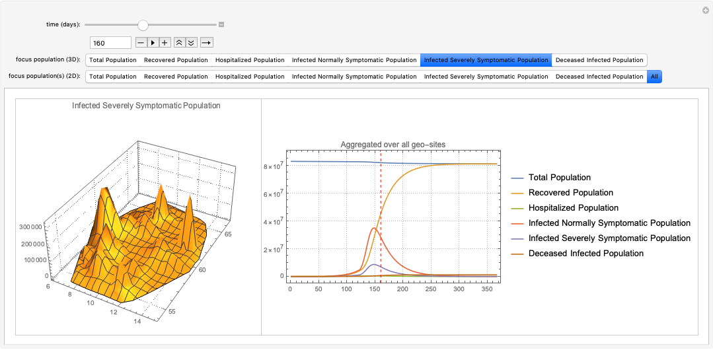

# WirVsVirus 2020 hackathon participation

Anton Antonov  
[MathematicaForPrediction at WordPress](https://mathematicaforprediction.wordpress.com)  
[SystemModeling at GitHub](https://github.com/antononcube/SystemModeling)  
March 2020

## Introduction

Last weekend -- 2020-03-20 ÷ 2020-03-22 -- I participated in [the (Germany-centric) hackathon WirVsVirus](https://wirvsvirushackathon.org). 
(I friend of mine who lives in Germany asked me to team up and sign up. Participated together with Balint Badonfai and Diego Zviovich.)

[Our idea proposal](https://github.com/antononcube/SystemModeling/blob/master/Projects/Coronavirus-propagation-dynamics/org/WirVsVirus-Hackathon-work-plan.org) 
was accepted, 
[listed in the dedicated overview table (see item 806)](https://airtable.com/shrs71ccUVKyvLlUA/tbl6Br4W3IyPGk1jt/viw7AlEju6qFtXJqL?blocks=hide). 
The title of our hackathon project is:

**“Geo-spatial-temporal Economic Model for COVID-19 Propagation and Management in Germany”**

[Nearly a dozen of people enlisted to help](https://devpost.com/software/geo-raumlich-zeitliches-wirtschaftsmodell-fur-covid-19). (We communicated through Slack.)

```mathematica
WebImage["https://devpost.com/software/geo-raumlich-zeitliches-wirtschaftsmodell-fur-covid-19"]
```

[](../org/WirVsVirus-hackathon-Geo-spatial-temporal-model-mind-map.pdf)

Multiple people helped with the discussion of ideas, directions where to find data, with actual data gathering, and related documented analysis. 
Of course, just discussing the proposed solutions was already a great help!

## What was accomplished

### Work plans

The following mind-map reflects pretty well what was planned and done:



There is also a related [org-mode file with the work plan](https://github.com/antononcube/SystemModeling/blob/master/Projects/Coronavirus-propagation-dynamics/org/WirVsVirus-Hackathon-work-plan.org).

### Data

I obtained Germany city data with Mathematica’s build-in functions and used it to heuristically derive a traveling patterns graph, [AA1]. 

Here is the data:

```mathematica
dsCityRecords = ResourceFunction["ImportCSVToDataset"]["https://raw.githubusercontent.com/antononcube/SystemModeling/master/Data/dfGermanyCityRecords.csv"];
Dimensions[dsCityRecords]

(*{12538, 6}*)
```

Here is Geo-histogram of that data:

```mathematica
cellRadius = Quantity[70,"Kilometers"];
aCoordsToPopulations = AssociationThread[Values /@ Normal[dsCityRecords[All, {"Lat", "Lon"}]], Normal[dsCityRecords[All, "Population"]]];
GeoHistogram[aCoordsToPopulations, cellRadius, ColorFunction -> (Opacity[#, Blue] &), PlotLegends -> Automatic]
```



We considered a fair amount of other data. But because of the time limitations of the hackathon we had to use only the one above.

### Single-site models

During the development phase I used the model SEI2R, but since we wanted to have a 
“geo-spatial-temporal epidemiological economics model” I productized the implementation of SEI2HR-Econ, [AAp1].

Here are the stocks, rates, and equations of SEI2HR-Econ:

```mathematica
Magnify[ModelGridTableForm[SEI2HREconModel[t]], 0.85]
```



### Multi-site SEI2R (SEI2HR-Econ) over a hexagonal grid graph

I managed to follow through with a large part of 
[the work plan for the hackathon](https://github.com/antononcube/SystemModeling/blob/master/Projects/Coronavirus-propagation-dynamics/org/WirVsVirus-hackathon-Geo-spatial-temporal-model-mind-map.pdf) 
and make multi-site scaled model that “follows the money”, [[AA1](https://github.com/antononcube/SystemModeling/blob/master/Projects/Coronavirus-propagation-dynamics/Documents/WirVsVirus-hackathon-Multi-site-SEI2R-over-a-hexagonal-grid-graph.md)]. Here is a diagram that shows the travelling patterns graph and solutions at one of the nodes:



Here is (a snapshot of) an interactive interface for studying and investigating the solution results:



For more details see the notebook 
[[AA1](https://github.com/antononcube/SystemModeling/blob/master/Projects/Coronavirus-propagation-dynamics/Documents/WirVsVirus-hackathon-Multi-site-SEI2R-over-a-hexagonal-grid-graph.md)]. 
Different parameters can be set in the “Parameters” section. Especially of interest are the quarantine related parameters: start, duration, effect on contact rates and traffic patterns.

I also put in the notebook code for export of simulations results and programmed visualization routines in R, [AA2]. 
(In order other members of team to be able to explore the results.)

## References

[DP1] [47_wirtschaftliche Auswirkung_Geo-spatial-temp-econ-modell](https://devpost.com/software/geo-raumlich-zeitliches-wirtschaftsmodell-fur-covid-19), DevPost.

[WRI1] Wolfram Research, Inc., [Germany city data records](https://github.com/antononcube/SystemModeling/blob/master/Data/dfGermanyCityRecords.csv), (2020), [SystemModeling at GitHub](https://github.com/antononcube/SystemModeling).

[AA1] Anton Antonov, ["WirVsVirus hackathon multi-site SEI2R over a hexagonal grid graph"](https://github.com/antononcube/SystemModeling/blob/master/Projects/Coronavirus-propagation-dynamics/Documents/WirVsVirus-hackathon-Multi-site-SEI2R-over-a-hexagonal-grid-graph.md), (2020), [SystemModeling at GitHub](https://github.com/antononcube/SystemModeling).

[AA2] Anton Antonov, ["WirVsVirus-Hackathon in R"](https://github.com/antononcube/SystemModeling/tree/master/Projects/Coronavirus-propagation-dynamics/R/WirVsVirus-Hackathon), (2020), [SystemModeling at GitHub](https://github.com/antononcube/SystemModeling).

[AAp1] Anton Antonov, ["Epidemiology models Mathematica package"](https://github.com/antononcube/SystemModeling/blob/master/Projects/Coronavirus-propagation-dynamics/WL/EpidemiologyModels.m), (2020), [SystemsModeling at GitHub](https://github.com/antononcube/SystemModeling).
