# WirVsVirus hackathon multi-site SEI2R over a hexagonal grid graph

**Version 0.8**

Anton Antonov   
[MathematicaForPrediction at WordPress](https://mathematicaforprediction.wordpress.com)  
[SystemModeling at GitHub](https://github.com/antononcube/SystemModeling)  
March 2020

## Introduction

This notebook has simulations for the [WirVsVirus Hackathon](https://wirvsvirushackathon.org) (held March 20-22, 2020). 

The notebook is based on previously developed framework for simulations with multi-site epidemiological models. [AA2, AA3, AAp1, AAp2, AAp3].

For the derivation of the graph and traveling patterns matrix used in [AA3] in this notebook we utilize an ad hoc solution using GeoHistogram’s output. (Replicating the previous approach using Voronoi mesh over USA population density data was problematic.)

The bigger picture for this notebook can seen in the project management files [AAo1, AAo2].

### Data

For the model in this notebook we use the dataset [WRI2] that associates $\approx 12500$ German cities with their populations and geographics coordinates. (The data was retrieved using Mathematica’s function [CityData](https://reference.wolfram.com/language/ref/CityData.html).)

### General assumptions (for COVID-19)

The general assumptions about COVID-19 and related mathematical modeling are listed in [AA1].

The most important features of COVID-19 used in the model here are following.

- We have two types of infected populations: severely symptomatic and normally symptomatic.

- The severely symptomatic population is 20% of the infected population.

- *Please see the full list in [AA1].*

### Specific assumptions (for this model)

- Germany’s territory is partitioned with a grid of hexagon cells. For each cell the population is obtained from [WRI2].

- People from each cell of the obtained hexagonal grid can travel to the neighboring cells. 

- All trips finish within a day.

- We consider grids that have cells with radius 50-70 km to be adequate.

- After a quarantine is enforced the usual, "everything is normal" traffic patterns become much less representative of the quarantine-time traffic patterns. 

    - *Hackathon-wise:* We did not produce actual traffic data quickly enough, and when we did, other tasks become more important in view of the approaching deadlines.

- A quarantine decreases the contact rates with a certain constant factor smaller than 1.

- Only severely symptomatic people are hospitalized.

- The hospitals have limited number of beds.

### Additional points & observations

- Right now (2020-03-22 07:40) I simulate Germany as a close system. But we can easily add, say, neighboring countries as graph nodes.  
Also, we can have “entry nodes” — international airports or train stations, border check points.

- Note that if quarantine scenarios are enacted / simulated then comprehensive traffic traveling patters data is less important — people would be staying at home.

### The single-site models

#### SEI2R (almost standard)

The model SEI2R [AA2] is a modification on the standard SIR model, [Wk1, HH1]. The fairly simple modification uses two infected populations: severely symptomatic and normally symptomatic. The main workflow using the SEI2R implementation in [AAp1] is given in [AA2].

#### SEI2HR (hospitalization population)

The model SEI2HR deals with the left-most and middle rectangles in this diagram:

```mathematica
ImageResize[Import["https://github.com/antononcube/SystemModeling/raw/master/Projects/Coronavirus-propagation-dynamics/Diagrams/Coronavirus-propagation-simple-dynamics.jpeg"], 800]
```

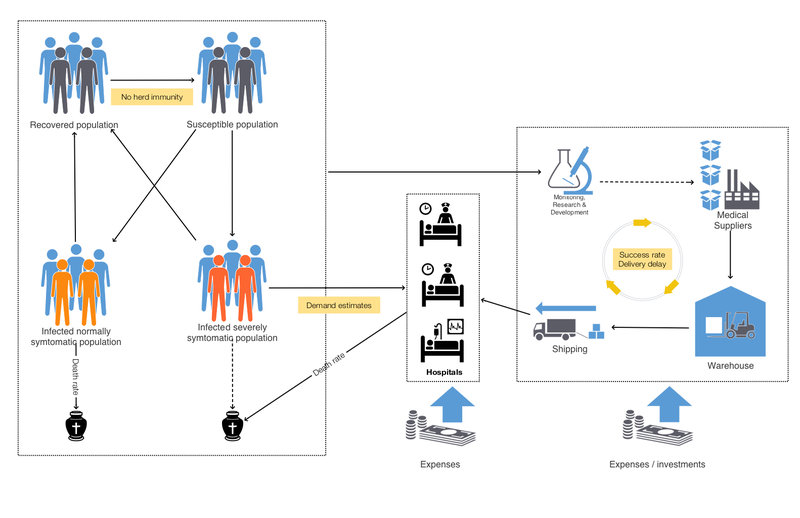

SEI2HR is implemented in [AAp1] and detailed explanations of its equations and usage are given in [AA4].

#### SEI2HR-Econ (economics extensions)

The model SEI2HR-Econ deals with all rectangles in the diagram above.

The diagram and following table with the stocks in SEI2HR-Econ should give a pretty good idea of model’s scope:

```mathematica
ModelGridTableForm[SEI2HREconModel[t]]["Stocks"]
```

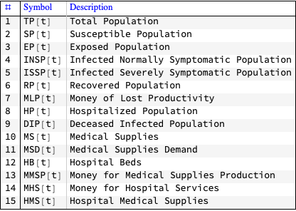

SEI2HR-Econ is implemented in [AAp1] and detailed explanations of its equations and usage are given in [AA5].

Plots made with simulations of scaling SEI2HR-Econ over Germany can seen in the section “Summary statistics”.

### Future plans

The presented work can be extended in multiple ways:

- Sensitivity analysis based on systematic runs of the scaled model (in this notebook.)

    - For example, the changes of Deceased Infected Population with respect to different available number of beds or quarantine period lengths.

- Combination of the hexagonal cell traffic patterns graph with traffic patterns graph based on dedicated traffic patterns studies.

    - We hope that a union merge of the two graphs would produce closer to reality simulation of the traffic patterns.

- Calibration of the model with concrete, closer to reality parameter values.

- Combination of this model with a dedicated Economy-impact-of-COVID-19 model.

- Further tasks are shown (hinted) in [AAo2].

## *ToDo list*

- [X] Implement global quarantine scenarios.

    - This includes the specification of parameters for quarantine start, duration, contact rate factor, traffic fraction factor.

- [ ] Expose/assign SEI2R/SEI2HR parameters in the section “Parameters”.

    - *Fundamental*: contact rates, incubation period, infectious period.

    - *Additional*: number of hospital beds per 1000 people, births inclusion.

- [X] Experiment with other single-site models.

    - [X] SEI2HR

    - [X] SEI2HR-Econ

- [ ] Implement site-dependent quarantine scenarios.

- [ ] Implement “injection” of infected people in arbitrary time and location.

    - This requires handling of relevant parameters.

    - Ideally the location is given with Geo-coordinates.

- [ ] General explanations.

    - [ ] How is this notebook used with better data?

    - [ ] The place of this notebook in the big picture strategy for Virus-Econ model. (For the hackathon.)

- [ ] Discussion of different experimental results. (Probably best to be in a separate notebook.)

## Parameters

In this section we specify the parameters for the computations.

### Graph parameters

Cell radius for the hexagonal grid:

```mathematica
cellRadius = Quantity[70, "Kilometers"];
```

Traffic factor for the traveling matrix:

```mathematica
trafficFraction = 0.12;
```

### Simulation parameters

```mathematica
singleSiteModelFunc = SEI2HREconModel;
```

```mathematica
 (* max simulation time *)
maxTime = 365;
```

```mathematica
(* should births term be included in the equations? *)

includeBirthsTermQ = False;
```

#### Quarantine parameters

```mathematica
(* when the quarantine starts.? *)
quarantineStart = 65;
```

```mathematica
(* how long the quarantine is? *)
quarantineDuration = 8*7; 
```

```mathematica
(* how much the "usual" contact number decreases? *)

quarantineContactRateFactor = 0.25;
```

```mathematica
(* how much the traffic decreases? *)

quarantineTrafficFractionFactor = 0.05;
```

#### Initial conditions parameters

```mathematica
(* sites with initial infections *)
lsPatientZeroNodeInds = Automatic;
```

### Additional parameters

```mathematica
exportFileNamePrefix = "WirVsVirus-";
```

```mathematica
exportSolutionsQ = False;
```

```mathematica
renderGraphPlotsQ = True;
```

```mathematica
renderSolultionsPlotsQ = True;
```

```mathematica
renderGraphicsOfSolultionsOverGraphQ = True;
```

```mathematica
renderSolutionAnimationQ = False;
```

## Load packages

The epidemiological models framework used in this notebook is implemented with the packages [AAp1, AAp2, AA3]; the interactive plots functions are from the package [AAp4].

```mathematica
Import["https://raw.githubusercontent.com/antononcube/SystemModeling/master/Projects/Coronavirus-propagation-dynamics/WL/EpidemiologyModels.m"]
Import["https://raw.githubusercontent.com/antononcube/SystemModeling/master/Projects/Coronavirus-propagation-dynamics/WL/EpidemiologyModelModifications.m"]
Import["https://raw.githubusercontent.com/antononcube/SystemModeling/master/Projects/Coronavirus-propagation-dynamics/WL/EpidemiologyModelingVisualizationFunctions.m"]
Import["https://raw.githubusercontent.com/antononcube/SystemModeling/master/WL/SystemDynamicsInteractiveInterfacesFunctions.m"]
```

## Ingest data

The data was previously ingested in a separate notebook. Here we ingest it directly from GitHub:

```mathematica
dsCityRecords = ResourceFunction["ImportCSVToDataset"]["https://raw.githubusercontent.com/antononcube/SystemModeling/master/Data/dfGermanyCityRecords.csv"];
Dimensions[dsCityRecords]

(*{12538, 6}*)
```

```mathematica
SeedRandom[232];
RandomSample[dsCityRecords, 4]
```

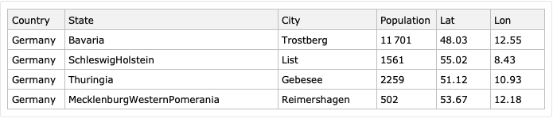

## Simple data analysis

Summary of the data:

```mathematica
ResourceFunction["RecordsSummary"][dsCityRecords]
```

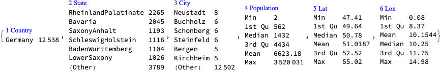

We can see that $\approx 20$% of the cities correspond to $\approx 80$% of the population.

```mathematica
ResourceFunction["ParetoPrinciplePlot"][
 Normal[dsCityRecords[All, "Population"]]]
```

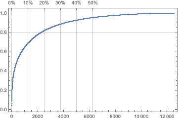

## Make the hexagon cells graph

In this section we make a *heuristic* traveling patterns graph based on a hexagonal cells Geo-histogram of the German population.

### Geo-histogram object

```mathematica
aCoordsToPopulations = 
  AssociationThread[
   Values /@ Normal[dsCityRecords[All, {"Lat", "Lon"}]], 
   Normal[dsCityRecords[All, "Population"]]];
```

```mathematica
grHist = GeoHistogram[aCoordsToPopulations, cellRadius, 
   ColorFunction -> (Opacity[#, Blue] &), PlotLegends -> Automatic];
If[TrueQ[renderGraphPlotsQ], grHist]
```

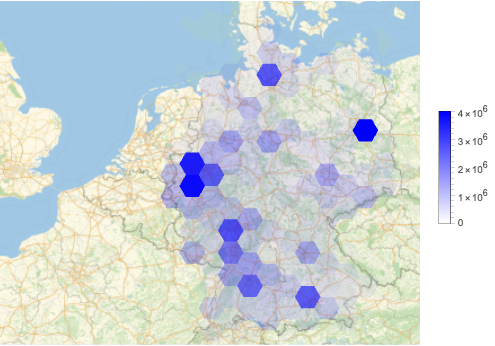

### Extract histogram cells (bins)

```mathematica
Count[grHist[[1]], 
 Tooltip[h_Polygon /; MatrixQ[h[[1]]], 
  pop_ /; NumberQ[pop] && pop > 3], \[Infinity]]

(*146*)
```

```mathematica
lsCells = 
  Cases[grHist[[1]], 
   Tooltip[h_Polygon /; MatrixQ[h[[1]]], 
     pop_ /; NumberQ[pop] && pop > 3] :> <|"Cell" -> h, 
     "Population" -> pop|>, \[Infinity]];
Length[lsCells]

(*146*)
```

```mathematica
lsCells = 
  Map[Append[#, "Center" -> Mean[PolygonCoordinates[#["Cell"]]]] &, 
   lsCells];
```

```mathematica
lsCells = SortBy[lsCells, #["Center"] &];
```

```mathematica
aCells = AssociationThread[Range[Length[lsCells]], lsCells];
aCells = Association@
   KeyValueMap[#1 -> Prepend[#2, "ID" -> #1] &, aCells];
```

Preliminary check:

```mathematica
If[TrueQ[renderGraphPlotsQ],
 Graphics[{FaceForm[GrayLevel[0.9]], EdgeForm[Blue], 
   Values[#["Cell"] & /@ aCells], Red, 
   Point[Values[#["Center"] & /@ aCells]]}]
 ]
```

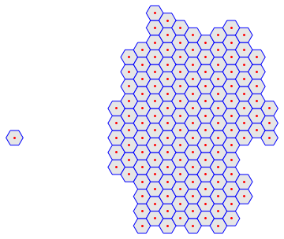

### Compute Nearest Neighbors graph

Create a function to find the nearest large cities to a given position in the U.S.:

```mathematica
nc = Nearest[Values[aCells] -> Keys[aCells], 
  DistanceFunction -> (EuclideanDistance[#1["Center"], #2[
       "Center"]] &)]
```


```mathematica
lsDistances = 
  Select[Flatten@
    DistanceMatrix[Values[#["Center"] & /@ aCells]], # > 0 &];
ResourceFunction["RecordsSummary"][lsDistances]
```

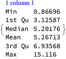

Identify outlier(s) and drop them:

```mathematica
pos = Select[
  nc[#, {6, 1.1*Min[lsDistances]/Cos[\[Pi]/6.]}] & /@ aCells, 
  Length[#] == 1 &]

(*<|1 -> {1}|>*)
```

```mathematica
aCells = KeyDrop[aCells, Keys[pos]];
```

Re-assign ID’s:

```mathematica
aCells = AssociationThread[Range[Length[aCells]], Values[aCells]];
aCells = Association@
   KeyValueMap[#1 -> Prepend[#2, "ID" -> #1] &, aCells];
```

```mathematica
grHexagonCellsNetwork = 
  NearestNeighborGraph[
   Keys[aCells], {7, Min[lsDistances]/Cos[\[Pi]/6.]}, 
   DistanceFunction -> (EuclideanDistance[aCells[#1]["Center"], 
       aCells[#2]["Center"]] &), 
   VertexCoordinates -> KeyValueMap[#1 -> #2["Center"] &, aCells], 
   VertexLabels -> "Name", ImageSize -> Large];
```

Verification plot:

```mathematica
If[TrueQ[renderGraphPlotsQ],
 Show[Graphics[{FaceForm[GrayLevel[0.9]], EdgeForm[Red], 
    Values[#["Cell"] & /@ aCells]}], grHexagonCellsNetwork, 
  ImageSize -> Large]
 ]
```

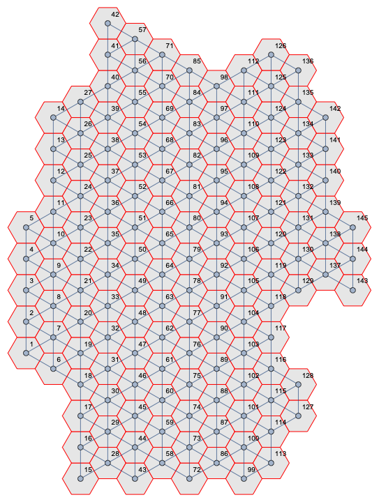

## Assign traffic

Here we use a simple heuristic: the traffic between two nodes is a certain fraction of the sum of the populations at those two nodes. The traffic fraction can be constant or seasonal (time dependent).

```mathematica
grHexagonCells = 
  Graph[DirectedEdge @@@ 
    Join[EdgeList[grHexagonCellsNetwork], 
     Reverse /@ EdgeList[grHexagonCellsNetwork]], 
   DirectedEdges -> True, 
   VertexCoordinates -> KeyValueMap[#1 -> #2["Center"] &, aCells], 
   ImageSize -> Large, VertexLabels -> Placed[Automatic, Center], 
   VertexSize -> .4];
If[TrueQ[renderGraphPlotsQ], grHexagonCells]
```

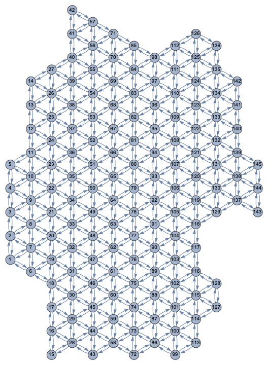

Here is the corresponding, heuristic traveling patterns matrix:

```mathematica
matHexagonCellsTraffic = 
 SparseArray[
  Map[(List @@ #) -> 
     trafficFraction*
      Mean[Map[aCells[#]["Population"] &, List @@ #]] &, 
   EdgeList[grHexagonCells]]]
```

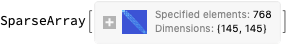

Here we make the traveling patterns matrix time-dependent in order to be able to simulate quarantine scenarios:

```mathematica
If[quarantineStart < maxTime && quarantineTrafficFractionFactor != 1,
 matHexagonCellsTraffic = 
   matHexagonCellsTraffic*
    Piecewise[{{1, 
       t < quarantineStart}, {quarantineTrafficFractionFactor, 
       quarantineStart <= t <= quarantineStart + quarantineDuration}},
      1];
 ]
```

Here we make a constant traveling matrix and summarize it:

```mathematica
Block[{matTravel = Normal[matHexagonCellsTraffic] /. t -> 1.0},
 {ResourceFunction["RecordsSummary"][Flatten[matTravel], 
    "All elements"][[1]], 
  ResourceFunction["RecordsSummary"][
    Select[Flatten[matTravel], # > 0 &], "Non-zero elements"][[1]], 
  MatrixPlot[matTravel, ImageSize -> Medium]}
 ]
```

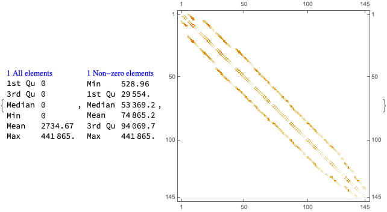

## Initial infected population

If the nodes with initial infected populations are not specified we simply use randomly selected graph nodes.

Find bottom graph nodes (to be used in the initial conditions below):

```mathematica
If[TrueQ[lsPatientZeroNodeInds === Automatic] || ! 
   VectorQ[lsPatientZeroNodeInds, IntegerQ],
 lsPatientZeroNodeInds = 
  RandomSample[Keys[TakeSmallest[#["Center"][[2]] & /@ aCells, 8]], 
   2]
 ]

(*{28, 43}*)
```

## Single-site “seed” model 

In this section we create a single-site model that is being replicated over the graph nodes. (The rates and initial conditions are replicated for all nodes.)

```mathematica
model1 = singleSiteModelFunc[t, "InitialConditions" -> True, 
   "RateRules" -> True, 
   "TotalPopulationRepresentation" -> "AlgebraicEquation", 
   "BirthsTerm" -> TrueQ[includeBirthsTermQ]];
```

Quarantine scenarios functions:

```mathematica
model1 =
  SetRateRules[model1,
   <|\[Beta][ISSP] -> 
     0.56*Piecewise[{{1, 
         t < quarantineStart}, {quarantineContactRateFactor, 
         quarantineStart <= t <= 
          quarantineStart + quarantineDuration}}, 1],
    \[Beta][INSP] -> 
     0.56*Piecewise[{{1, 
         t < quarantineStart}, {quarantineContactRateFactor, 
         quarantineStart <= t <= 
          quarantineStart + quarantineDuration}}, 1]|>];
```

Number of beds per 1000 people:

```mathematica
model1 = SetRateRules[model1, <|nhbr[TP] -> 8/1000|>];
```

## Main multi-site workflow

In this section we do the model extension and simulation over a the hexagonal cells graph and the corresponding constant traveling patterns matrix.

Here we scale the SEI2R model with the grid graph constant traveling matrix:

```mathematica
AbsoluteTiming[
 modelHexGermany = 
   ToSiteCompartmentsModel[model1, matHexagonCellsTraffic, 
    "MigratingPopulations" -> Automatic];
 ]

(*{1.46468, Null}*)
```

Change the initial conditions in the following way: 

- Pick initial population size to be the hexagonal cell population

- Make a (constant) populations vector

- At all sites -- except selected “patient 0” ones -- put the infected populations to zero; the selected “patient 0” sites have one severely symptomatic person

- Set the susceptible populations to be consistent with the total and infected populations.

```mathematica
lsRPopulations = 
  aCells[#]["Population"] & /@ 
   Range[Dimensions[matHexagonCellsTraffic][[1]]];
maxPopulation = Max[lsRPopulations];
sInds = Flatten[
   Position[Keys[aCells], #] & /@ lsPatientZeroNodeInds];
AbsoluteTiming[
 modelHexGermany =
   SetInitialConditions[
    modelHexGermany,
    Join[
     Join[
      AssociationThread[
       Through[GetPopulationSymbols[modelHexGermany, 
          "Total Population"][0]], lsRPopulations], 
      Association[Map[TP[#][0] -> lsRPopulations[[#]] &, sInds]]],
     Join[
      Association@
       Map[#[0] -> 0 &, 
        GetPopulationSymbols[modelHexGermany, 
         "Infected Severely Symptomatic Population"]], 
      Association[Map[ISSP[#][0] -> 1 &, sInds]]],
     Join[
      Association@
       Map[#[0] -> 0 &, 
        GetPopulationSymbols[modelHexGermany, 
         "Infected Normally Symptomatic Population"]], 
      Association[Map[INSP[#][0] -> 0 &, sInds]]],
     Join[
      AssociationThread[
       Through[GetPopulationSymbols[modelHexGermany, 
          "Susceptible Population"][0]], lsRPopulations], 
      Association[Map[SP[#][0] -> lsRPopulations[[#]] - 1 &, sInds]]]
     ]
    ];
 ]

(*{0.307279, Null}*)
```

Solve the system of ODE’s of the scaled model:

```mathematica
AbsoluteTiming[
 aSolHexGermany = Association@First@
     NDSolve[
      Join[
       modelHexGermany["Equations"] //. 
        Join[ToAssociation[modelHexGermany["InitialConditions"]], 
         modelHexGermany["RateRules"]],
       modelHexGermany["InitialConditions"] //. 
        modelHexGermany["RateRules"]
       ],
      GetStockSymbols[modelHexGermany],
      {t, 0, maxTime}
      ];
 ]
```


```
(*{42.6321, Null}*)
```

Number of solutions:

```mathematica
aSolHexGermany // Length

(*2175*)
```

Randomly sample the graph sites and display the solutions separately for each site in the sample:

```mathematica
If[TrueQ[renderSolultionsPlotsQ],
 Multicolumn[
  Table[
   Block[{aSol = 
      KeySelect[
       KeyTake[aSolHexGermany, 
        GetPopulationSymbols[
         modelHexGermany, ___ ~~ "Population"]], #[[1]] == i &]},
    Plot[Evaluate[Map[#[t] &, Values[aSol]]], {t, 0, maxTime}, 
     PlotRange -> All, GridLines -> All, PlotTheme -> "Scientific", 
     PlotLegends -> Keys[aSol], ImageSize -> 300]
    ], {i, RandomSample[Range[VertexCount[grHexagonCells]], UpTo[9]]}],
  3]
 ]
```

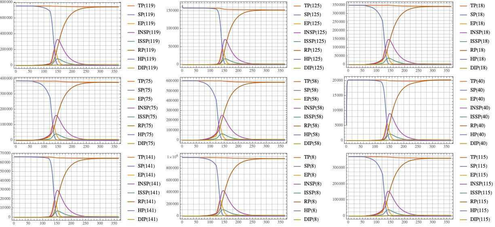

Display solutions of the initial entry sits and last site:

```mathematica
If[TrueQ[renderSolultionsPlotsQ],
 Multicolumn[
  Table[
   Block[{aSol = 
      KeySelect[
       KeyTake[aSolHexGermany, 
        GetPopulationSymbols[
         modelHexGermany, ___ ~~ "Population"]], #[[1]] == i &]},
    Plot[Evaluate[Map[#[t] &, Values[aSol]]], {t, 0, maxTime}, 
     PlotRange -> All, GridLines -> All, PlotTheme -> "Scientific", 
     PlotLegends -> Keys[aSol], ImageSize -> 300]
    ], {i, Join[sInds, {VertexCount[grHexagonCells]}]}],
  3]
 ]
```

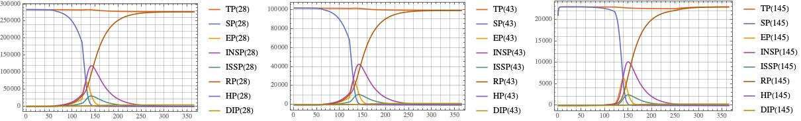

### Graph evolution visualizations

We can visualize the spatial-temporal evolution of model’s populations using sequences of graphs. The graphs in the sequences are copies of the multi-site graph each copy having its nodes colored according to the populations in the solutions steps. 

Here is a sub-sequence for the total populations:

```mathematica
If[TrueQ[renderGraphicsOfSolultionsOverGraphQ],
 EvaluateSolutionsOverGraph[grHexagonCells, modelHexGermany, 
  "Total Population", aSolHexGermany, {1, maxTime, 24}, 
  "NodeSizeFactor" -> 2.5, "ColorScheme" -> "TemperatureMap", 
  "Legended" -> True, VertexLabels -> None, ImageSize -> 200]
 ]
```

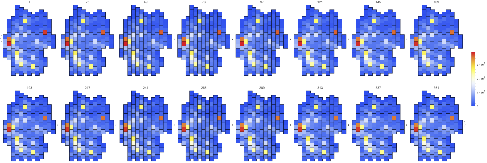

Here is the “lost money evolution”:

```mathematica
If[TrueQ[renderGraphicsOfSolultionsOverGraphQ],
 EvaluateSolutionsOverGraph[grHexagonCells, 
  modelHexGermany, __ ~~ "Productivity", 
  aSolHexGermany, {1, maxTime, 24}, "NodeSizeFactor" -> 3, 
  "ColorScheme" -> "TemperatureMap", "Legended" -> True, 
  VertexLabels -> None, ImageSize -> 200]
 ]
```

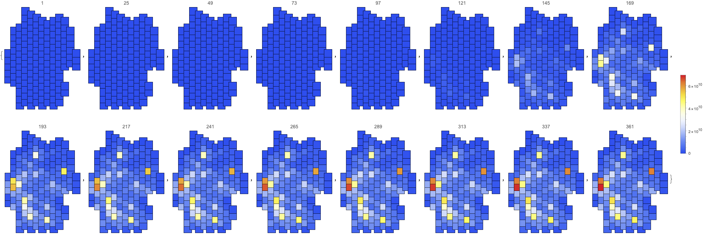

Here is a sub-sequence for the sum of the infected populations:

```mathematica
If[TrueQ[renderGraphicsOfSolultionsOverGraphQ],
 EvaluateSolutionsOverGraph[grHexagonCells, 
  modelHexGermany, {"Infected Normally Symptomatic Population", 
   "Infected Severely Symptomatic Population"}, 
  aSolHexGermany, {1, maxTime, 24}, "NodeSizeFactor" -> 4, 
  "ColorScheme" -> "TemperatureMap", "Normalization" -> "ByVertex", 
  "Legended" -> True, VertexLabels -> None, ImageSize -> 200]
 ]
```

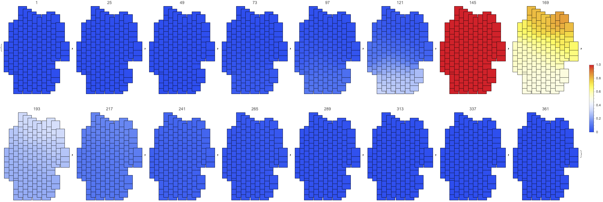

Here is a sub-sequence for the recovered population:

```mathematica
If[TrueQ[renderGraphicsOfSolultionsOverGraphQ],
 EvaluateSolutionsOverGraph[grHexagonCells, modelHexGermany, 
  "Recovered Population", aSolHexGermany, {1, maxTime, 24}, 
  "NodeSizeFactor" -> 4, "ColorScheme" -> "TemperatureMap", 
  "Normalization" -> "ByVertex", "Legended" -> True, 
  VertexLabels -> None, ImageSize -> 200]
 ]
```

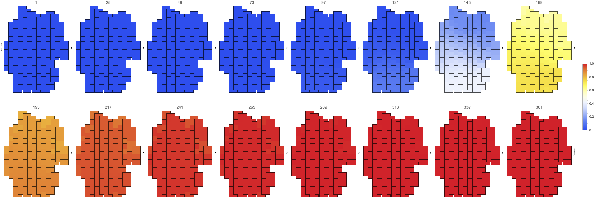

Here is an animation of the sum of the infected populations:

```mathematica
If[TrueQ[renderSolutionAnimationQ],
 Block[{stocks = {"Infected Normally Symptomatic Population", 
     "Infected Severely Symptomatic Population"}, 
   colorScheme = "TemperatureMap", timeStep = 3},
  lsAninmationPlots = 
   ListAnimate[
    EvaluateSolutionsOverGraph[grHexagonCells, modelHexGermany, 
     stocks, aSolHexGermany, {1, maxTime, timeStep}, 
     "Normalization" -> "ByVertex", "NodeSizeFactor" -> 2.5, 
     "ColorScheme" -> colorScheme, VertexLabels -> None, 
     ImageSize -> 400]];
  Legended[lsAninmationPlots, BarLegend[colorScheme]
   ]
  ]
 ]
```

```mathematica
(*AbsoluteTiming[
Export[FileNameJoin[{NotebookDirectory[],"Germany-hexagonal-grid-\
network-traveling-IP-simulation.gif"}],lsAninmationPlots]
]*)
```

## Summary statistics

```mathematica
ResourceFunction["RecordsSummary"][
 MinMax /@ 
  EvaluateSolutionsOverGraphVertexes[grHexagonCells, modelHexGermany, 
   "Recovered Population", aSolHexGermany, {1, maxTime, 1}], 
 Thread -> True]
```

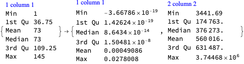

### Definitions

```mathematica
Clear[PopulationStockPlots];
PopulationStockPlots[stocksArg : (_String | {_String ..}), 
   addOpts : OptionsPattern[]] :=
  
  Block[{opts = {PlotTheme -> "Detailed", PlotRange -> All, 
      ImageSize -> Medium}, stocks = Flatten[{stocksArg}], vals},
   If[TrueQ[renderSolultionsPlotsQ] && 
     Apply[And, 
      MemberQ[Union[Values[modelHexGermany["Stocks"]]], #] & /@ 
       stocks],
    vals = 
     Total@Map[
       Total@Values[
          EvaluateSolutionsOverGraphVertexes[grHexagonCells, 
           modelHexGermany, #, aSolHexGermany, {1, maxTime, 1}]] &, 
       stocks];
    Row[{ListLinePlot[vals, addOpts, opts, 
       PlotLabel -> StringRiffle[stocks, " + "]],
      Spacer[10],
      ListLinePlot[
       vals/
        Total[Values[
          EvaluateSolutionsOverGraphVertexes[grHexagonCells, 
           modelHexGermany, "Total Population", 
           aSolHexGermany, {1, maxTime, 1}]]],
       addOpts, opts, 
       PlotLabel -> 
        Row[{"Ratio of", Spacer[2], StringRiffle[stocks, " + "], 
          Spacer[2], "with Total Population"}]
       ]}]
    ]
   ];
```

```mathematica
PopulationStockPlots[{"Infected Normally Symptomatic Population", 
  "Infected Severely Symptomatic Population"}]
```

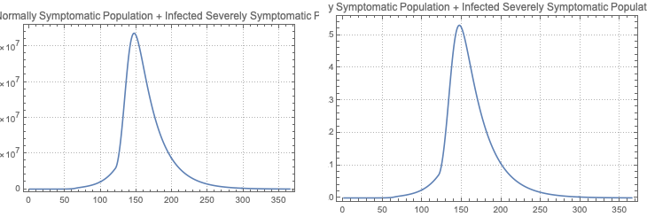

```mathematica
Clear[EconomicsStockPlots];
EconomicsStockPlots[stock_String] :=
  
  Block[{opts = {PlotTheme -> "Detailed", PlotRange -> All, 
      ImageSize -> Medium}},
   If[TrueQ[renderSolultionsPlotsQ] && 
     MemberQ[Union[Values[modelHexGermany["Stocks"]]], stock],
    Row[{
      ListLinePlot[
       Total[Values[
         EvaluateSolutionsOverGraphVertexes[grHexagonCells, 
          modelHexGermany, stock, aSolHexGermany, {1, maxTime, 1}]]], 
       opts, PlotLabel -> stock],
      Spacer[10],
      ListLinePlot[
       Differences@
        Total[Values[
          EvaluateSolutionsOverGraphVertexes[grHexagonCells, 
           modelHexGermany, stock, aSolHexGermany, {1, maxTime, 1}]]],
        opts, PlotLabel -> 
        Row[{"\[CapitalDelta]", Spacer[1], stock}]]}]
    ]
   ];
```

### Populations

#### Infected Population

Single-site profiles:

```mathematica
If[TrueQ[renderSolultionsPlotsQ], 
 ListLinePlot[#, PlotTheme -> "Detailed", PlotRange -> All] & /@ 
  RandomSample[
   EvaluateSolutionsOverGraphVertexes[grHexagonCells, 
    modelHexGermany, {"Infected Normally Symptomatic Population", 
     "Infected Severely Symptomatic Population"}, 
    aSolHexGermany, {1, maxTime, 4}], 12]
 ]
```

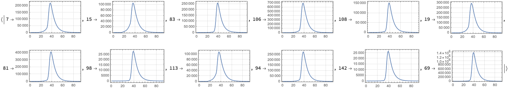

Total (of all sites) profile and its ratio with Total Population: 

```mathematica
PopulationStockPlots[{"Infected Normally Symptomatic Population", 
  "Infected Severely Symptomatic Population"}, PlotLabel -> None, 
 ImageSize -> Medium]
```

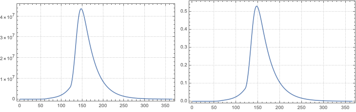

#### Recovered Population

Total of the Recovered Population:

```mathematica
PopulationStockPlots["Recovered Population"]
```

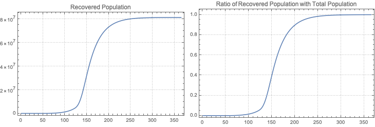

#### Deceased Infected Population

Total of the Deceased Infected Population and its ratio of Total Population:

```mathematica
PopulationStockPlots["Deceased Infected Population"]
```

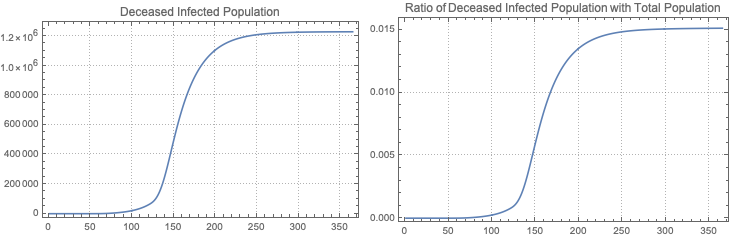

#### Hospitalized Population

Total of the Hospitalized Population:

```mathematica
PopulationStockPlots["Hospitalized Population"]
```

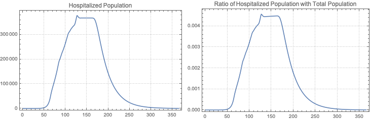

### Medical Supplies

#### Money for Medical Supplies Production

Total of the Money for Medical Supplies Production:

```mathematica
EconomicsStockPlots["Money for Medical Supplies Production"]
```

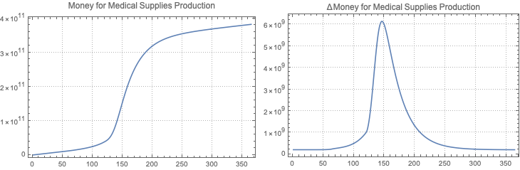

#### Medical Supplies Demand

Total of the Medical Supplies Demand:

```mathematica
EconomicsStockPlots["Medical Supplies Demand"]
```

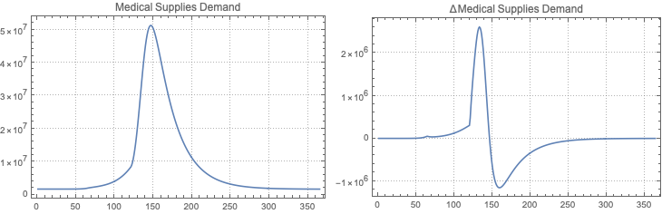

#### Hospital Medical Supplies

Total of the Hospital Medical Supplies:

```mathematica
EconomicsStockPlots["Hospital Medical Supplies"]
```

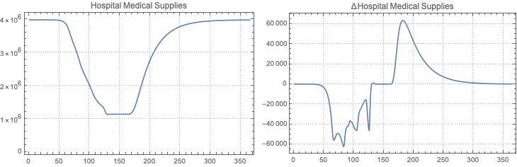

## Export

```mathematica
AbsoluteTiming[
 aSolData = 
   Association@
    Map[# -> 
       Round[EvaluateSolutionsOverGraphVertexes[grHexagonCells, 
         modelHexGermany, #, aSolHexGermany, {1, maxTime, 1}], 
        0.001] &, Union[Values[modelHexGermany["Stocks"]]]];
 ]

(*{1.26011, Null}*)
```

```mathematica
dsSolData = ConvertSolutions[aSolData, "Array"];
lsSolDataColumnNames = {"Stock", "Node", "Time", "Value"};
ResourceFunction["GridTableForm"][RandomSample[dsSolData, 4], 
 TableHeadings -> lsSolDataColumnNames]
```

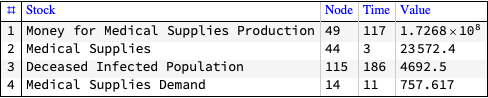

```mathematica
timeStamp = StringReplace[DateString["ISODateTime"], ":" -> "."]

(*"2020-03-24T12.12.13"*)
```

```mathematica
If[! StringQ[exportFileNamePrefix], 
  exportFileNamePrefix = "WirVsVirus-"];
```

```mathematica
aParams = <|
   "singleSiteModelFunc" -> singleSiteModelFunc,
   "cellRadius" -> cellRadius,
   "trafficFraction" -> trafficFraction,
   "includeBirthsTermQ" -> includeBirthsTermQ,
   "quarantineStart" -> quarantineStart,
   "quarantineDuration" -> quarantineDuration,
   "quarantineContactRateFactor" -> quarantineContactRateFactor,
   "quarantineTrafficFractionFactor" -> 
    quarantineTrafficFractionFactor,
   "exportFileNamePrefix" -> exportFileNamePrefix
   |>;
dsParams = List @@@ Normal[aParams];
```

```mathematica
If[TrueQ[exportSolutionsQ],
 Export[FileNameJoin[{NotebookDirectory[], 
    StringJoin[exportFileNamePrefix, "GSTEM-Parameters-", timeStamp, 
     ".csv"]}], Prepend[dsParams, {"Parameter", "Value"}], "CSV"];
 Export[FileNameJoin[{NotebookDirectory[], 
    StringJoin[exportFileNamePrefix, "GSTEM-Solutions-", timeStamp, 
     ".csv"]}], Prepend[dsSolData, lsSolDataColumnNames], "CSV"];
 ]
```

## References

### Articles

[Wk1] Wikipedia entry, ["Compartmental models in epidemiology"](https://en.wikipedia.org/wiki/Compartmental_models_in_epidemiology).

[HH1] Herbert W. Hethcote (2000). ["The Mathematics of Infectious Diseases"](http://leonidzhukov.net/hse/2014/socialnetworks/papers/2000SiamRev.pdf). SIAM Review. 42 (4): 599–653. Bibcode:2000SIAMR..42..599H. doi:10.1137/s0036144500371907.

[AA1] Anton Antonov, ["Coronavirus propagation modeling considerations"](https://github.com/antononcube/SystemModeling/blob/master/Projects/Coronavirus-propagation-dynamics/Documents/Coronavirus-propagation-modeling-considerations.md), (2020), [SystemModeling at GitHub](https://github.com/antononcube/SystemModeling).

[AA2] Anton Antonov, ["Basic experiments workflow for simple epidemiological models"](https://github.com/antononcube/SystemModeling/blob/master/Projects/Coronavirus-propagation-dynamics/Documents/Basic-experiments-workflow-for-simple-epidemiological-models.md), (2020), [SystemModeling at GitHub](https://github.com/antononcube/SystemModeling).

[AA3] Anton Antonov, ["Scaling of Epidemiology Models with Multi-site Compartments"](https://github.com/antononcube/SystemModeling/blob/master/Projects/Coronavirus-propagation-dynamics/Documents/Scaling-of-epidemiology-models-with-multi-site-compartments.md), (2020), [SystemModeling at GitHub](https://github.com/antononcube/SystemModeling).

[AA4] Anton Antonov, “Extension of SEI2R with Hospitalized Population”, (2020), [SystemModeling at GitHub](https://github.com/antononcube/SystemModeling).

[AA5] Anton Antonov, “Simple Economics Extension of Compartmental Epidemiological Models”, (2020), [SystemModeling at GitHub](https://github.com/antononcube/SystemModeling).

### Repositories, packages, data

[WRI1] Wolfram Research, Inc., ["Epidemic Data for Novel Coronavirus COVID-19"](https://www.wolframcloud.com/obj/resourcesystem/published/DataRepository/resources/Epidemic-Data-for-Novel-Coronavirus-COVID-19), [WolframCloud](https://www.wolframcloud.com).

[WRI2] Wolfram Research, Inc., [Germany city data records](https://github.com/antononcube/SystemModeling/blob/master/Data/dfGermanyCityRecords.csv), (2020), [SystemModeling at GitHub](https://github.com/antononcube/SystemModeling).

[AAr1] Anton Antonov, [Coronavirus propagation dynamics project](https://github.com/antononcube/SystemModeling/tree/master/Projects/Coronavirus-propagation-dynamics), (2020), [SystemModeling at GitHub](https://github.com/antononcube/SystemModeling).

[AAp1] Anton Antonov, ["Epidemiology models Mathematica package"](https://github.com/antononcube/SystemModeling/blob/master/Projects/Coronavirus-propagation-dynamics/WL/EpidemiologyModels.m), (2020), [SystemsModeling at GitHub](https://github.com/antononcube/SystemModeling).

[AAp2] Anton Antonov, ["Epidemiology model modifications Mathematica package"](https://github.com/antononcube/SystemModeling/blob/master/Projects/Coronavirus-propagation-dynamics/WL/EpidemiologyModelModifications.m), (2020), [SystemsModeling at GitHub](https://github.com/antononcube/SystemModeling).

[AAp3] Anton Antonov, ["Epidemiology modeling visualization functions Mathematica package"](https://github.com/antononcube/SystemModeling/blob/master/Projects/Coronavirus-propagation-dynamics/WL/EpidemiologyModelingVisualizationFunctions.m), (2020), [SystemsModeling at GitHub](https://github.com/antononcube/SystemModeling).

[AAp4] Anton Antonov, ["System dynamics interactive interfaces functions Mathematica package"](https://github.com/antononcube/SystemModeling/blob/master/WL/SystemDynamicsInteractiveInterfacesFunctions.m), (2020), [SystemsModeling at GitHub](https://github.com/antononcube/SystemModeling).

### Project management files

[AAo1] Anton Antonov, [WirVsVirus-Hackathon-work-plan.org](https://github.com/antononcube/SystemModeling/blob/master/Projects/Coronavirus-propagation-dynamics/org/WirVsVirus-Hackathon-work-plan.org), (2020), [SystemsModeling at GitHub](https://github.com/antononcube/SystemModeling).

[AAo2] Anton Antonov, [WirVsVirus-hackathon-Geo-spatial-temporal-model-mind-map](https://github.com/antononcube/SystemModeling/blob/master/Projects/Coronavirus-propagation-dynamics/org/WirVsVirus-hackathon-Geo-spatial-temporal-model-mind-map.pdf), (2020), [SystemsModeling at GitHub](https://github.com/antononcube/SystemModeling).
