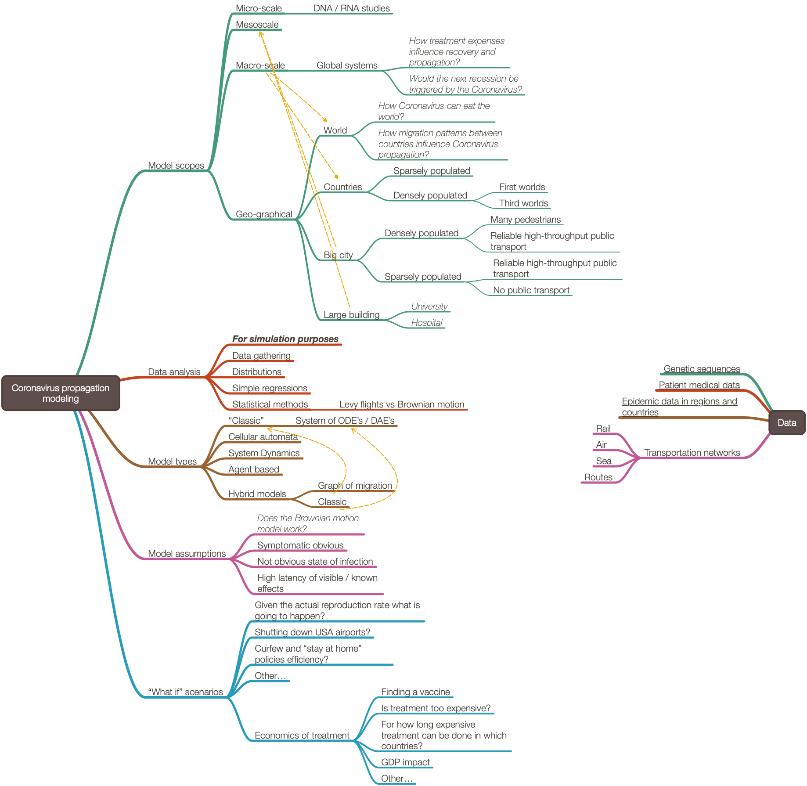
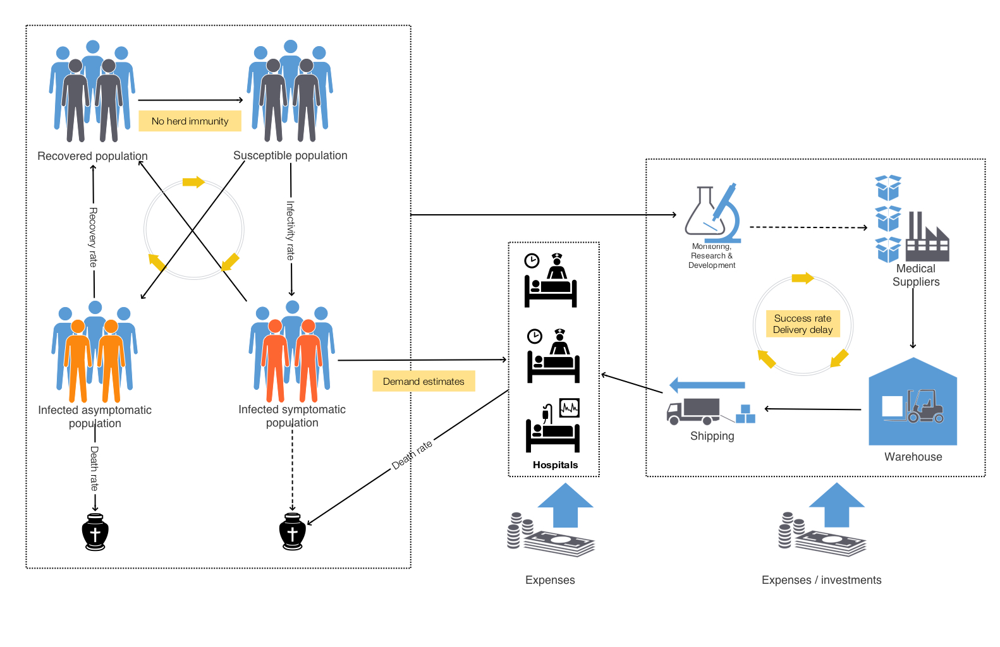
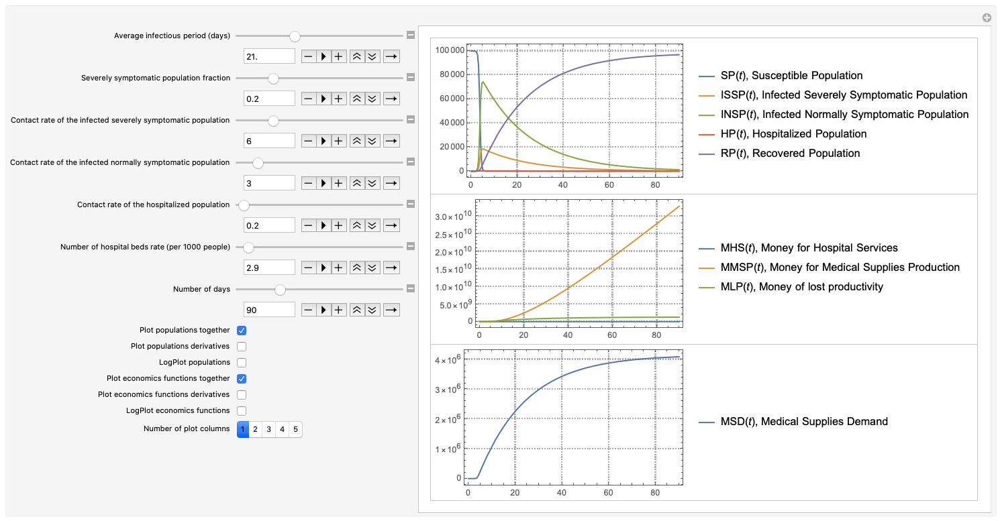
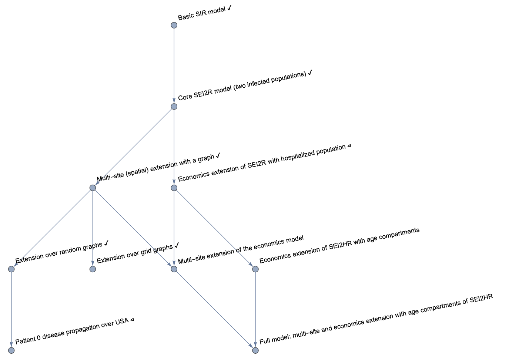

# Coronavirus propagation dynamics

This project has models for different aspects of Coronavirus propagation dynamics.
More specifically the focus is on the propagation of 
[SARS-CoV-2](https://en.wikipedia.org/wiki/Severe_acute_respiratory_syndrome_coronavirus_2)
and the economic impact of 
[COVID-19](https://en.wikipedia.org/wiki/Coronavirus_disease_2019). 

## The model

The following mind-map illustrates the scope of the considered model:

## Data analysis

In order to build or confirm certain modeling conjectures and assumptions certain data analysis is required.

A fair amount of links to data and data analysis can be found here:

["Resources For Novel Coronavirus COVID-19"](https://community.wolfram.com/groups/-/m/t/1872608), \[WRI1\].

## Simple epidemiology models

A small, lightweight software framework for retrieval of the basic 
[compartmental epidemiology models](https://en.wikipedia.org/wiki/Compartmental_models_in_epidemiology).

The framework consists of the packages:

- [EpidemiologyModels.m](./WL/EpidemiologyModels.m),

- [EpidemiologyModelModifications.m](./WL/EpidemiologyModelModifications.m),

- [EpidemiologyModelingVisualizationFunctions.m](./WL/EpidemiologyModelingVisualizationFunctions.m).

See the document 
["Basic experiments workflow for simple epidemiological models"](./Documents/Basic-experiments-workflow-for-simple-epidemiological-models.md)
for the envisioned general workflow, interactive interfaces, and ad-hoc calibration.   

## The SEI2HR-Econ model

Generally speaking, the 
[System dynamics](https://en.wikipedia.org/wiki/System_dynamics) 
methodology is used. 

The first model uses a lot of simplifying assumptions and deals only with:

- eight types of populations (no age is included),

- available hospital beds,

- medical supplies, and

- related costs.

Nevertheless, that simple model provides certain insights and it is a good starting point for multiple types of
model extensions. 

Here is a component interaction diagram:

Here is "a teaser" of how the simple model interactive interface looks like:

## Work plan

The work plan and its completion state can be found 
[here](./org/Coronavirus-propagation-work-plan.org).

### Model extensions plan

The following graph shows the development plan:
 
 
 
*(The check marks indicate completion; the triangles indicate current focus.)*
 

## Calibration

Calibration issues are (briefly) discussed in
["Basic experiments workflow for simple epidemiological models"](https://github.com/antononcube/SystemModeling/blob/master/Projects/Coronavirus-propagation-dynamics/Documents/Basic-experiments-workflow-for-simple-epidemiological-models.md), 
\[AA2\].

## Videos

- ["COVID19 Epidemic Modeling: Compartmental Models"](https://www.twitch.tv/videos/566141765), based on \[AA2\].

- ["Scaling of Epidemiology Models with Multi-site Compartments"](https://www.twitch.tv/videos/566703353), based on \[AA3\].

## References

\[CDC1\] https://www.cdc.gov/coronavirus/2019-ncov .

\[WRI1\] Wolfram Research, Inc.
["Resources For Novel Coronavirus COVID-19"](https://community.wolfram.com/groups/-/m/t/1872608), 
(2020)
[Community.wolfram.com](https://community.wolfram.com/). 

\[AA1\] Anton Antonov, 
["Coronavirus propagation modeling considerations"](https://github.com/antononcube/SystemModeling/blob/master/Projects/Coronavirus-propagation-dynamics/Documents/Coronavirus-propagation-modeling-considerations.md), 
(2020), 
[SystemModeling at GitHub](https://github.com/antononcube/SystemModeling).

\[AA2\] Anton Antonov, 
["Basic experiments workflow for simple epidemiological models"](https://github.com/antononcube/SystemModeling/blob/master/Projects/Coronavirus-propagation-dynamics/Documents/Basic-experiments-workflow-for-simple-epidemiological-models.md), 
(2020), 
[SystemModeling at GitHub](https://github.com/antononcube/SystemModeling).

\[AA3\] Anton Antonov, 
["Scaling of Epidemiology Models with Multi-site Compartments"](https://github.com/antononcube/SystemModeling/blob/master/Projects/Coronavirus-propagation-dynamics/Documents/Scaling-of-epidemiology-models-with-multi-site-compartments.md),
(2020), 
[SystemModeling at GitHub](https://github.com/antononcube/SystemModeling).

