# Pets licensing data analysis

Anton Antonov
[MathematicaForPrediction at WordPress](https://mathematicaforprediction.wordpress.com)
[SystemModeling at GitHub](https://github.com/antononcube/SystemModeling)
January 2020

#### Introduction

In order to build or confirm certain modeling conjectures and assumptions data analysis is made for Seattle pets licensing data. The main ones are:

   + the Pareto principle manifests for pets breeds;

   + the Pareto principle manifests for zip code;

   + there is upward trend for becoming a pet owner.

All three are confirmed, assuming the retrieved data is representative. See the last section of an additional discussion.

#### Data

The pet licensing data was taken from this page:  [“Seattle Pet Licenses”](https://data.seattle.gov/Community/Seattle-Pet-Licenses/jguv-t9rb/data) , [https://data.seattle.gov/Community/Seattle-Pet-Licenses/jguv-t9rb/data](https://data.seattle.gov/Community/Seattle-Pet-Licenses/jguv-t9rb/data) . 

The ZIP code coordinates data was taken from a GitHub repository,  ["US Zip Codes from 2013 Government Data", https://gist.github.com/erichurst/7882666 .](https://gist.github.com/erichurst/7882666)

##### Animal licenses

```mathematica
dsPetLicenses=ResourceFunction["ImportCSVToDataset"]["~/Datasets/Seattle/Seattle_Pet_Licenses.csv"]
```

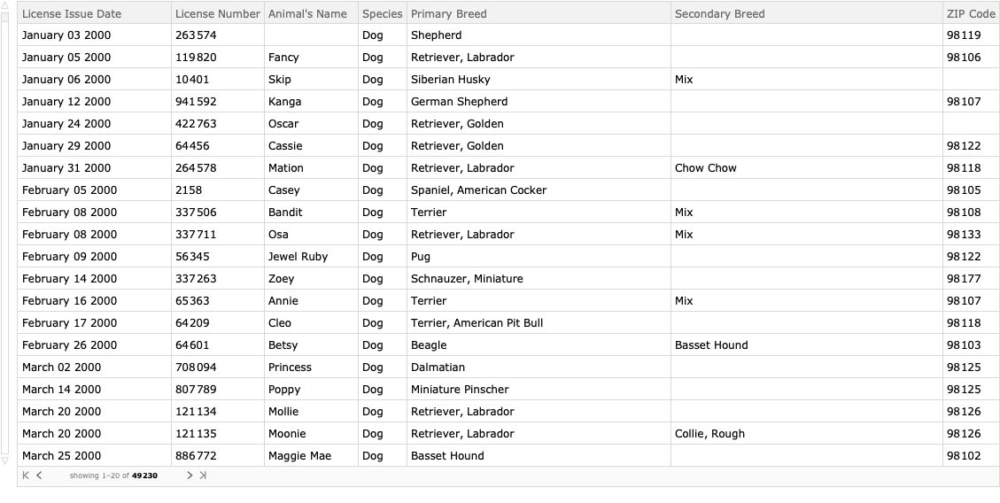

Convert “Licence Issue Date” values into DateObjects.

```mathematica
dsPetLicenses=dsPetLicenses[All,Prepend[#,"DateObject"\[Rule]DateObject[{#\[LeftDoubleBracket]1\[RightDoubleBracket],{"Month","Day","Year"}}]]&];
```

###### Summary

```mathematica
ResourceFunction["RecordsSummary"][dsPetLicenses]
```

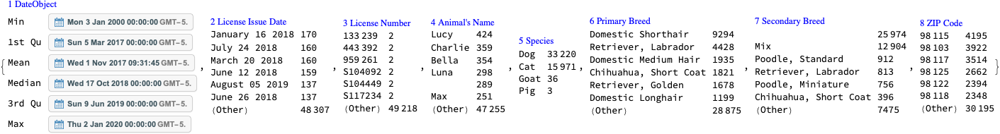

###### Keep dogs and cats only

Since the number of animals that are not cats or dogs is very small we remove them from the data in order to produce more concise statistics.

```mathematica
dsPetLicenses=dsPetLicenses[Select[MemberQ[{"Cat","Dog"},#Species]&]];
    Dimensions[dsPetLicenses]

(*{49191,8}*)
```

##### ZIP code geo-coordinates

```mathematica
dsZIPCodes=ImportCSVToDataset["~/Datasets/USAZipCodes/US-Zip-Codes-from-2013-Government-Data.csv"];
    Dimensions[dsZIPCodes]

(*{33144,3}*)
```

```mathematica
aZipLatLon=Association[Normal[Query[#ZIP\[Rule]{#LAT,#LON}&]/@dsZIPCodes]];
    aZipLatLon=KeyMap[ToString,aZipLatLon];
    Length[aZipLatLon]

(*33144*)
```

###### Summary

```mathematica
ResourceFunction["RecordsSummary"][dsZIPCodes]
```

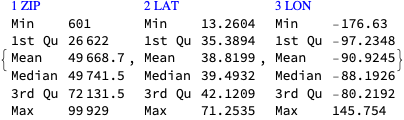

```mathematica
ResourceFunction["RecordsSummary"][aZipLatLon,Thread\[Rule]True]
```

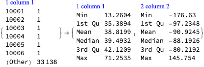

#### Pareto principle adherence

In this section we apply to the Pareto principle statistic in order to see does the Pareto principle manifests over the different columns of the pet licensing data.

##### Breeds

We see a typical Pareto principle adherence for both dog breeds and cat breeds. For example, $20$% of the dog breeds correspond to $80$% of all registered dogs. 

Note the number of unique cat breeds is 4 times smaller than the number of unique dog breeds.

```mathematica
focusColumnName="Primary Breed";
```

```mathematica
dsQuery=Query[GroupBy[#Species&],GroupBy[#[focusColumnName]&],Length]@dsPetLicenses;
    dsQuery=Dataset[ReverseSort/@Normal[dsQuery]]
```

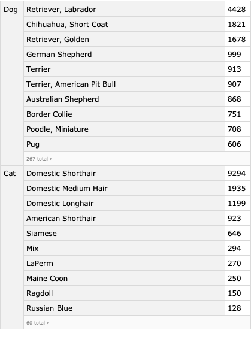

```mathematica
KeyValueMap[ResourceFunction["ParetoPrinciplePlot"][Values[#2],PlotLabel\[Rule]Row[{#1,Spacer[3],focusColumnName}],ImageSize\[Rule]Medium,opts]&,Normal[dsQuery]]
```

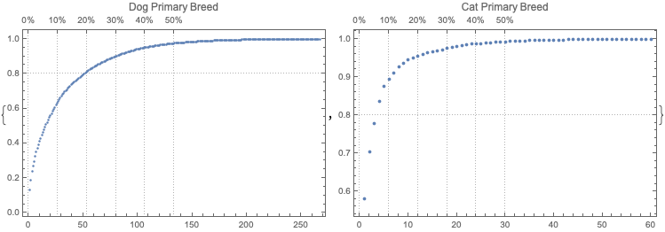

##### Animal names

We see a typical Pareto principle adherence for the frequencies of the pet names. For dogs, $10$% of the unique names correspond to $\text{$\$$Failed}$% of the pets.

```mathematica
focusColumnName="Animal's Name";
```

```mathematica
dsQuery=Query[GroupBy[#Species&],GroupBy[#[focusColumnName]&],Length]@dsPetLicenses;
    dsQuery=Dataset[ReverseSort/@Normal[dsQuery]]
```

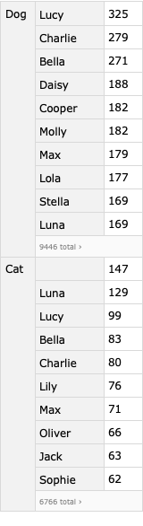

```mathematica
KeyValueMap[ResourceFunction["ParetoPrinciplePlot"][Values[#2],PlotLabel\[Rule]Row[{#1,Spacer[3],focusColumnName}],ImageSize\[Rule]Medium,opts]&,Normal[dsQuery]]
```

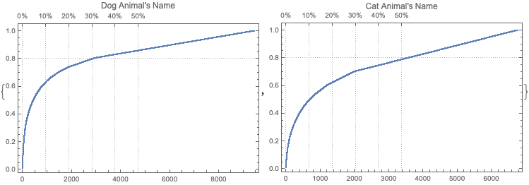

##### Zip codes

We see typical -- even exaggerated -- manifestation of the Pareto principle over ZIP codes of the registered pets.

```mathematica
focusColumnName="ZIP Code";
```

```mathematica
dsQuery=Query[GroupBy[#Species&],GroupBy[#[focusColumnName]&],Length]@dsPetLicenses;
    dsQuery=Dataset[ReverseSort/@Normal[dsQuery]];
```

```mathematica
KeyValueMap[ResourceFunction["ParetoPrinciplePlot"][Values[#2],PlotLabel\[Rule]Row[{#1,Spacer[3],focusColumnName}],ImageSize\[Rule]Medium,opts]&,Normal[dsQuery]]
```

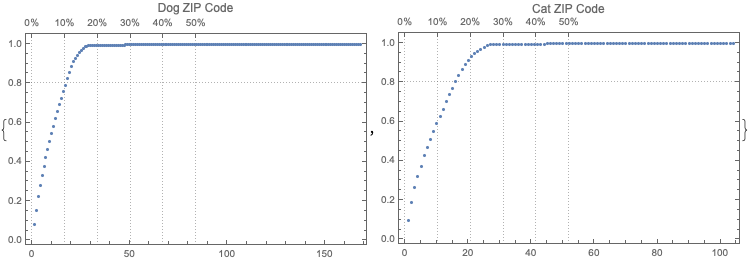

#### Geo-distribution

In this section we visualize the pets licensing geo-distribution with geo-histograms.

```mathematica
city=Entity["City",{"Seattle","Washington","UnitedStates"}];
    GeoPosition[city]

(*GeoPosition[{47.6205,-122.351}]*)
```

##### Both cats and dogs

```mathematica
lsCoords=Map[If[KeyExistsQ[aZipLatLon,#],aZipLatLon[#],Nothing]&,Select[ToString/@Normal[dsPetLicenses[All,"ZIP Code"]],StringQ[#]&&StringLength[#]>=5&]];
```

```mathematica
GeoHistogram[lsCoords,GeoCenter\[Rule]city,GeoRange\[Rule]Quantity[20,"Miles"],PlotLegends\[Rule]Automatic,ColorFunction\[Rule](Hue[2/3,2/3,1-#]&),opts]
```

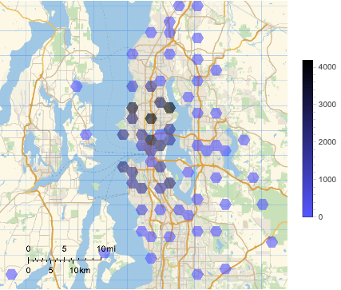

##### Cats and dogs separate

```mathematica
lsCoords=Map[If[KeyExistsQ[aZipLatLon,#],aZipLatLon[#],Nothing]&,Select[ToString/@Normal[dsPetLicenses[Select[#Species\[Equal]"Cat"&],"ZIP Code"]],StringQ[#]&&StringLength[#]>=5&]];
    gr1=GeoHistogram[lsCoords,GeoCenter\[Rule]city,GeoRange\[Rule]Quantity[20,"Miles"],PlotLegends\[Rule]Automatic,ColorFunction\[Rule](Hue[2/3,2/3,1-#]&),opts];
```

```mathematica
lsCoords=Map[If[KeyExistsQ[aZipLatLon,#],aZipLatLon[#],Nothing]&,Select[ToString/@Normal[dsPetLicenses[Select[#Species\[Equal]"Dog"&],"ZIP Code"]],StringQ[#]&&StringLength[#]>=5&]];
    gr2=GeoHistogram[lsCoords,GeoCenter\[Rule]city,GeoRange\[Rule]Quantity[20,"Miles"],PlotLegends\[Rule]Automatic,ColorFunction\[Rule](Hue[2/3,2/3,1-#]&),opts];
```

```mathematica
ResourceFunction["GridTableForm"][{gr1,gr2},TableHeadings\[Rule]{"Cats","Dogs"},Background\[Rule]White]
```

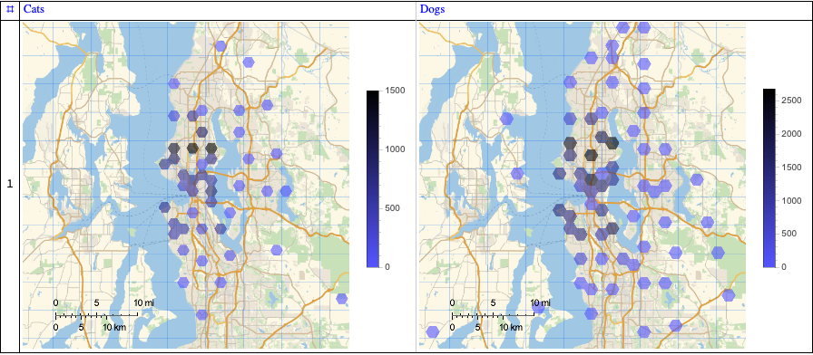

##### Pet stores

In this subsection we show the distribution of pet stores (in Seattle). 

It is better instead of image retrieval we should show corresponding geo-markers in the geo-histograms above. (This is not considered that important in the first version of this notebook/document.)

```mathematica
(*WebImage["https://www.google.com/maps/search/pet+stores+in+Seattle,+WA/@47.6326975,-122.4227211,12.05z"]*)
```

#### Time series

In this section we visualize the time series corresponding to the pet registrations.

##### Time series objects

Here we make time series objects:

```mathematica
dsQuery=Query[GroupBy[#Species&],GroupBy[#DateObject&],Length]@dsPetLicenses;
    aTS=TimeSeries/@(List@@@Normal[#]&/@Normal[dsQuery])
```

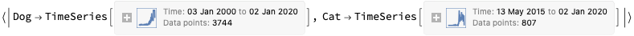

##### Time series plots of all registrations

```mathematica
DateListPlot[#,opts]&/@aTS
```

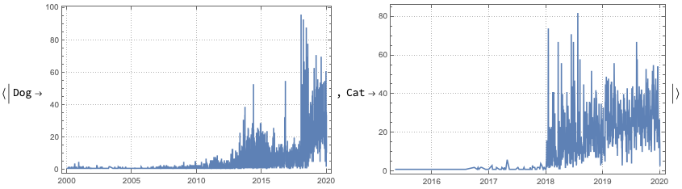

##### Time series plots of most recent registrations

It is an interesting question why the number of registrations is much higher in volume and frequency in the years 2018 and later.

```mathematica
DateListPlot[TimeSeriesWindow[#,{{2017,1,1},{2020,1,1}}],opts]&/@aTS
```

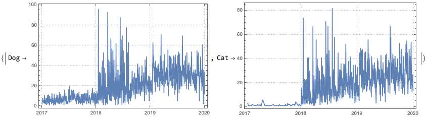

#### Quantile regression application

##### Fit over the data

Here we apply both Linear and Quantile Regression 

```mathematica
QRMonUnit[TimeSeriesWindow[#,{{2018,1,1},{2020,1,1}}]]\[DoubleLongRightArrow]
    QRMonLeastSquaresFit[4]\[DoubleLongRightArrow]
    QRMonQuantileRegression[20]\[DoubleLongRightArrow]
    QRMonDateListPlot[opts,"Echo"->False]\[DoubleLongRightArrow]
    QRMonTakeValue&/@aTS
```

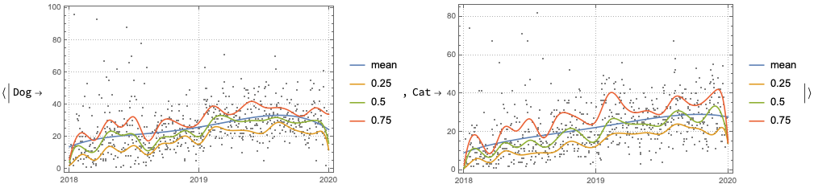

##### Simulation

In this sub-section we simulate the differences between the time series for 2018 and 2019, then we add the simulated difference to the time series of the year 2019.

```mathematica
ts1=TimeSeriesResample[TimeSeriesWindow[aTS\[LeftDoubleBracket]1\[RightDoubleBracket],{{2018,1,1},{2019,1,1}}],"Day"];
    ts1["Path"]\[LeftDoubleBracket]All,2\[RightDoubleBracket];
```

```mathematica
ts2=TimeSeriesResample[TimeSeriesWindow[aTS\[LeftDoubleBracket]1\[RightDoubleBracket],{{2019,1,1},{2020,1,1}}],"Day"];
    ts2["Path"]\[LeftDoubleBracket]All,2\[RightDoubleBracket];
```

```mathematica
ts3=TimeSeries[Transpose[{ts1["Path"]\[LeftDoubleBracket]All,1\[RightDoubleBracket],ts2["Path"]\[LeftDoubleBracket]All,2\[RightDoubleBracket]-ts1["Path"]\[LeftDoubleBracket]All,2\[RightDoubleBracket]}]]
```

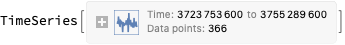

```mathematica
qrObj=
    QRMonUnit[ts3]\[DoubleLongRightArrow]
    QRMonEchoDataSummary\[DoubleLongRightArrow]
    QRMonQuantileRegression[30,Join[Range[0.1,0.9,0.1],{0.01,0.99}]]\[DoubleLongRightArrow]
    QRMonDateListPlot[opts];
```

[//]: # (No rules defined for Echo:BoxData)

[//]: # (No rules defined for Echo:BoxData)

```mathematica
qrObj=
    qrObj\[DoubleLongRightArrow]
    QRMonEchoFunctionContext[DateListPlot[#data,PlotLabel\[Rule]"Original data",opts]&]\[DoubleLongRightArrow]
    QRMonSimulate[ts2["Path"]//Length]\[DoubleLongRightArrow]
    QRMonEchoFunctionValue[DateListPlot[#,PlotLabel\[Rule]"Simulated data",opts]&];
```

[//]: # (No rules defined for Echo:BoxData)

[//]: # (No rules defined for Echo:BoxData)

```mathematica
tsSimDiff=TimeSeries[qrObj\[DoubleLongRightArrow]QRMonTakeValue]
```

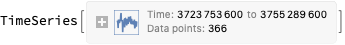

```mathematica
tsSim=MapThread[{#1\[LeftDoubleBracket]1\[RightDoubleBracket],#1\[LeftDoubleBracket]2\[RightDoubleBracket]+#2\[LeftDoubleBracket]2\[RightDoubleBracket]}&,{ts2["Path"],tsSimDiff["Path"]}];
    tsSim\[LeftDoubleBracket]All,2\[RightDoubleBracket]=Clip[tsSim\[LeftDoubleBracket]All,2\[RightDoubleBracket],{0,Max[tsSim\[LeftDoubleBracket]All,2\[RightDoubleBracket]]}];
    tsSim=TimeSeries[tsSim];
    DateListPlot[tsSim,opts]
```

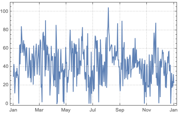

#### Discussion

This section has subsections that correspond to additional discussion questions. Not all questions are answered, the plan is to progressively answer the questions with the subsequent versions of the this notebook / document.

###### □ Too few pets

The number of registered pets seems too few. Seattle is a large city with more than $600000$ citizens; approximately $50$% of the USA households have dogs; hence the registered pets are too few ($\text{$\$$Failed}$). 

###### □ Why too few pets?

Seattle is high tech city and its citizens are too busy to have pets?

Most people do not register their pets? (Very unlikely if they have used veterinary services.)

Incomplete data?

#### Preliminary definitions

```mathematica
opts=Sequence@@{PlotRange\[Rule]All,ImageSize\[Rule]Medium,PlotTheme\[Rule]"Detailed"};
```


#### References

[1] Anton Antonov, Pets retail modeling, SystemModeling at GitHub, 2020.