# Pets licensing data analysis

Anton Antonov   
[MathematicaForPrediction at WordPress](https://mathematicaforprediction.wordpress.com)   
[SystemModeling at GitHub](https://github.com/antononcube/SystemModeling)   
January 2020

## Introduction

This notebook / document provides ground data analysis used to make or confirm certain modeling conjectures and assumptions 
of a Pets Retail Dynamics Model (PRDM), 
\[[AA1](https://github.com/antononcube/SystemModeling/tree/master/Projects/Pets-retail-dynamics)\]. 
Seattle pets licensing data is used, \[[SOD2](https://data.seattle.gov/Community/Seattle-Pet-Licenses/jguv-t9rb/data)\].

We want to provide answers to the following questions.

   + Does the Pareto principle manifests for pets breeds?

   + Does the Pareto principle manifests for ZIP codes?

   + Is there an upward trend for becoming a pet owner?

All three questions have positive answers, assuming the retrieved data, 
\[[SOD2](https://data.seattle.gov/Community/Seattle-Pet-Licenses/jguv-t9rb/data)\], 
is representative. See the last section for an additional discussion.

We also discuss pet adoption simulations that are done using Quantile Regression, \[AA2, AAp1\].

This notebook/document is part of the 
[SystemsModeling at GitHub](https://github.com/antononcube/SystemModeling) 
project 
"Pets retail dynamics", [AA1].](https://github.com/antononcube/SystemModeling/tree/master/Projects/Pets-retail-dynamics)

## Data

The pet licensing data was taken from this page:
[“Seattle Pet Licenses”](https://data.seattle.gov/Community/Seattle-Pet-Licenses/jguv-t9rb/data), 
[https://data.seattle.gov/Community/Seattle-Pet-Licenses/jguv-t9rb/data](https://data.seattle.gov/Community/Seattle-Pet-Licenses/jguv-t9rb/data). 

The ZIP code coordinates data was taken from a GitHub repository,  
["US Zip Codes from 2013 Government Data", https://gist.github.com/erichurst/7882666](https://gist.github.com/erichurst/7882666).

### Animal licenses

```mathematica
dsPetLicenses=ResourceFunction["ImportCSVToDataset"]["~/Datasets/Seattle/Seattle_Pet_Licenses.csv"]
```

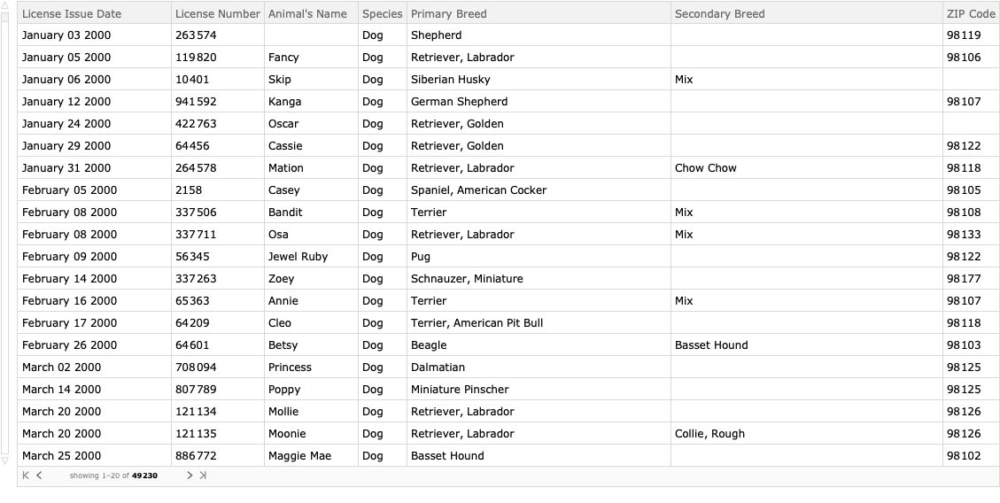

Convert “Licence Issue Date” values into DateObjects.

```mathematica
dsPetLicenses=dsPetLicenses[All,Prepend[#,"DateObject"->DateObject[{#[[1]],{"Month","Day","Year"}}]]&];
```

#### Summary

```mathematica
ResourceFunction["RecordsSummary"][dsPetLicenses]
```

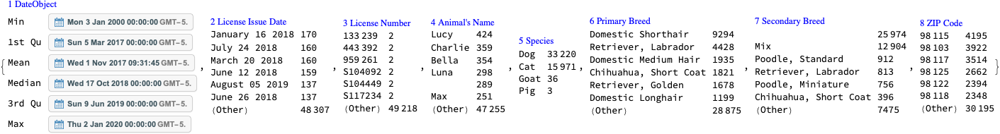

#### Keep dogs and cats only

Since the number of animals that are not cats or dogs is very small we remove them from the data in order to produce more concise statistics.

```mathematica
dsPetLicenses=dsPetLicenses[Select[MemberQ[{"Cat","Dog"},#Species]&]];
    Dimensions[dsPetLicenses]

(*{49191,8}*)
```

### ZIP code geo-coordinates

```mathematica
dsZIPCodes=ImportCSVToDataset["~/Datasets/USAZipCodes/US-Zip-Codes-from-2013-Government-Data.csv"];
    Dimensions[dsZIPCodes]

(*{33144,3}*)
```

```mathematica
aZipLatLon=Association[Normal[Query[#ZIP->{#LAT,#LON}&]/@dsZIPCodes]];
    aZipLatLon=KeyMap[ToString,aZipLatLon];
    Length[aZipLatLon]

(*33144*)
```

#### Summary

```mathematica
ResourceFunction["RecordsSummary"][dsZIPCodes]
```

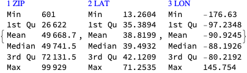

```mathematica
ResourceFunction["RecordsSummary"][aZipLatLon,Thread->True]
```

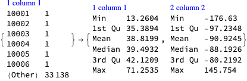

## Pareto principle adherence

In this section we apply to the Pareto principle statistic in order to see does the Pareto principle manifests over the different columns of the pet licensing data.

### Breeds

We see a typical Pareto principle adherence for both dog breeds and cat breeds. 
For example, $20$% of the dog breeds correspond to $80$% of all registered dogs. 

Note the number of unique cat breeds is 4 times smaller than the number of unique dog breeds.

```mathematica
focusColumnName="Primary Breed";
```

```mathematica
dsQuery=Query[GroupBy[#Species&],GroupBy[#[focusColumnName]&],Length]@dsPetLicenses;
    dsQuery=Dataset[ReverseSort/@Normal[dsQuery]]
```

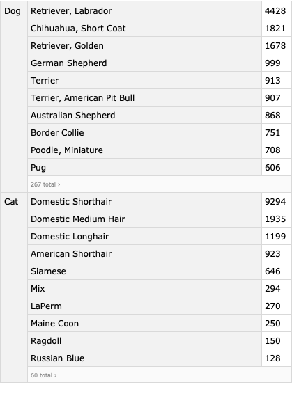

```mathematica
KeyValueMap[ResourceFunction["ParetoPrinciplePlot"][Values[#2],PlotLabel->Row[{#1,Spacer[3],focusColumnName}],ImageSize->Medium,opts]&,Normal[dsQuery]]
```

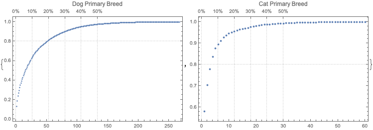

### Animal names

We see a typical Pareto principle adherence for the frequencies of the pet names. 
For dogs, $10$% of the unique names correspond to ~$65$% of the pets.

```mathematica
focusColumnName="Animal's Name";
```

```mathematica
dsQuery=Query[GroupBy[#Species&],GroupBy[#[focusColumnName]&],Length]@dsPetLicenses;
    dsQuery=Dataset[ReverseSort/@Normal[dsQuery]]
```

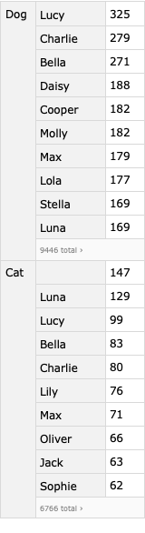

```mathematica
KeyValueMap[ResourceFunction["ParetoPrinciplePlot"][Values[#2],PlotLabel->Row[{#1,Spacer[3],focusColumnName}],ImageSize->Medium,opts]&,Normal[dsQuery]]
```

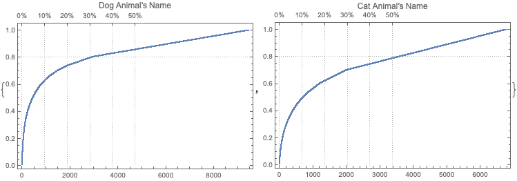

### Zip codes

We see typical -- even exaggerated -- manifestation of the Pareto principle over ZIP codes of the registered pets.

```mathematica
focusColumnName="ZIP Code";
```

```mathematica
dsQuery=Query[GroupBy[#Species&],GroupBy[#[focusColumnName]&],Length]@dsPetLicenses;
    dsQuery=Dataset[ReverseSort/@Normal[dsQuery]];
```

```mathematica
KeyValueMap[ResourceFunction["ParetoPrinciplePlot"][Values[#2],PlotLabel->Row[{#1,Spacer[3],focusColumnName}],ImageSize->Medium,opts]&,Normal[dsQuery]]
```


## Geo-distribution

In this section we visualize the pets licensing geo-distribution with geo-histograms.

```mathematica
city=Entity["City",{"Seattle","Washington","UnitedStates"}];
    GeoPosition[city]

(*GeoPosition[{47.6205,-122.351}]*)
```

### Both cats and dogs

```mathematica
lsCoords=Map[If[KeyExistsQ[aZipLatLon,#],aZipLatLon[#],Nothing]&,Select[ToString/@Normal[dsPetLicenses[All,"ZIP Code"]],StringQ[#]&&StringLength[#]>=5&]];
```

```mathematica
GeoHistogram[lsCoords,GeoCenter->city,GeoRange->Quantity[20,"Miles"],PlotLegends->Automatic,ColorFunction->(Hue[2/3,2/3,1-#]&),opts]
```


### Dogs and cats separate

```mathematica
lsCoords=Map[If[KeyExistsQ[aZipLatLon,#],aZipLatLon[#],Nothing]&,Select[ToString/@Normal[dsPetLicenses[Select[#Species=="Dog"&],"ZIP Code"]],StringQ[#]&&StringLength[#]>=5&]];
    gr1=GeoHistogram[lsCoords,GeoCenter->city,GeoRange->Quantity[20,"Miles"],PlotLegends->Automatic,ColorFunction->(Hue[2/3,2/3,1-#]&),opts];
```

```mathematica
lsCoords=Map[If[KeyExistsQ[aZipLatLon,#],aZipLatLon[#],Nothing]&,Select[ToString/@Normal[dsPetLicenses[Select[#Species=="Cat"&],"ZIP Code"]],StringQ[#]&&StringLength[#]>=5&]];
    gr2=GeoHistogram[lsCoords,GeoCenter->city,GeoRange->Quantity[20,"Miles"],PlotLegends->Automatic,ColorFunction->(Hue[2/3,2/3,1-#]&),opts];
```

```mathematica
ResourceFunction["GridTableForm"][{gr1,gr2},TableHeadings->{"Dogs","Cats"},Background->White]
```

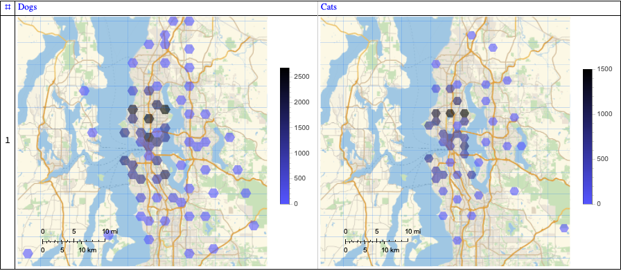

### Pet stores

In this subsection we show the distribution of pet stores (in Seattle). 

It is better instead of image retrieval to show corresponding geo-markers in the geo-histograms above. 
(This is not considered that important in the first version of this notebook/document.)

```mathematica
WebImage["https://www.google.com/maps/search/pet+stores+in+Seattle,+WA/@47.6326975,-122.4227211,12.05z"]
```

## Time series

In this section we visualize the time series corresponding to the pet registrations.

### Time series objects

Here we make time series objects:

```mathematica
dsQuery=Query[GroupBy[#Species&],GroupBy[#DateObject&],Length]@dsPetLicenses;
    aTS=TimeSeries/@(List@@@Normal[#]&/@Normal[dsQuery])
```

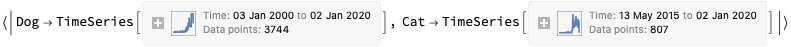

### Time series plots of all registrations

Here are time series plots corresponding to all registrations:

```mathematica
DateListPlot[#,opts]&/@aTS
```

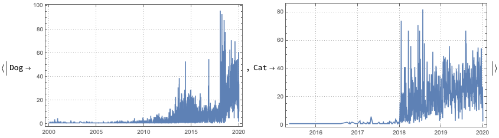

### Time series plots of most recent registrations

It is an interesting question why the number of registrations is much higher in volume and frequency in the years 2018 and later.

```mathematica
DateListPlot[TimeSeriesWindow[#,{{2017,1,1},{2020,1,1}}],opts]&/@aTS
```

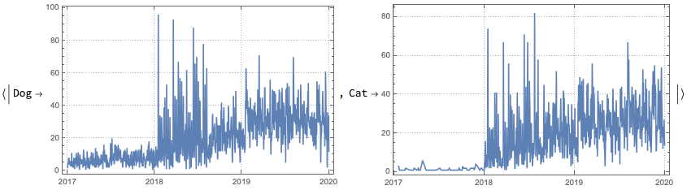

### Upward trend

Here we apply both Linear Regression and Quantile Regression:

```mathematica
QRMonUnit[TimeSeriesWindow[#,{{2018,1,1},{2020,1,1}}]]⟹
    QRMonLeastSquaresFit[{1,x}]⟹
    QRMonQuantileRegressionFit[4,0.5]⟹
    QRMonDateListPlot[opts,"Echo"->False]⟹
    QRMonTakeValue&/@aTS
```

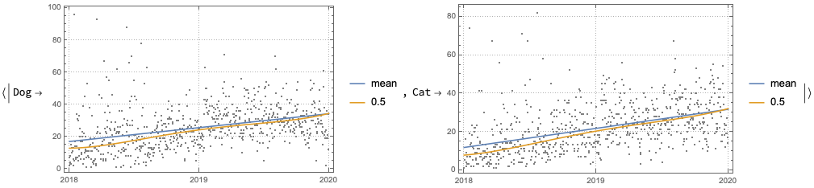

We can see that there is clear upward trend for both dogs and cats.

## Quantile regression application

In this section we investigate the possibility to simulate the pet adoption rate. 
We plan to use simulations of the pet adoption rate in PRDM.

We do that using the software monad `QRMon`, \[AAp1\]. A list of steps follows.

   + Split the time series into windows corresponding to the years 2018 and 2019.

   + Find the difference between the two years.

   + Apply Quantile Regression to the difference using a reasonable grid of probabilities.

   + Simulate the difference.

   + Add the simulated difference to year 2019.

##### Simulation

In this sub-section we simulate the differences between the time series for 2018 and 2019, 
then we add the simulated difference to the time series of the year 2019.

```mathematica
ts1=TimeSeriesResample[TimeSeriesWindow[aTS[[1]],{{2018,1,1},{2019,1,1}}],"Day"];
    ts1["Path"][[All,2]];
```

```mathematica
ts2=TimeSeriesResample[TimeSeriesWindow[aTS[[1]],{{2019,1,1},{2020,1,1}}],"Day"];
    ts2["Path"][[All,2]];
```

```mathematica
ts3=TimeSeries[Transpose[{ts1["Path"][[All,1]],ts2["Path"][[All,2]]-ts1["Path"][[All,2]]}]]
```

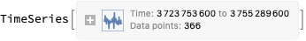

```mathematica
qrObj=
    QRMonUnit[ts3]⟹
    QRMonEchoDataSummary⟹
    QRMonQuantileRegression[20,Join[Range[0.1,0.9,0.1],{0.03,0.93}],InterpolationOrder->2]⟹
    QRMonDateListPlot[opts];
```

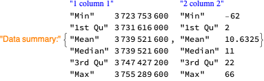

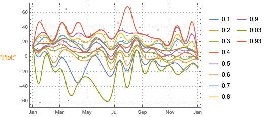

```mathematica
qrObj=
    qrObj⟹
    QRMonEchoFunctionContext[DateListPlot[#data,PlotLabel->"Original data",opts]&]⟹
    QRMonSimulate[ts2["Path"]//Length]⟹
    QRMonEchoFunctionValue[DateListPlot[#,PlotLabel->"Simulated data",opts]&];
```

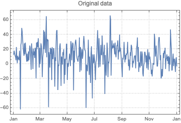

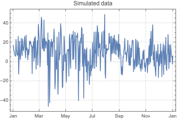

Take the simulated time series difference:

```mathematica
tsSimDiff=TimeSeries[qrObj⟹QRMonTakeValue];
```

Add the simulated time series difference to year 2019, clip the values less than zero, shift the result to 2020:

```mathematica
tsSim=MapThread[{#1[[1]],#1[[2]]+#2[[2]]}&,{ts2["Path"],tsSimDiff["Path"]}];
    tsSim[[All,2]]=Clip[tsSim[[All,2]],{0,Max[tsSim[[All,2]]]}];
    tsSim=TimeSeriesShift[TimeSeries[tsSim],Quantity[365,"Days"]];
    DateListPlot[tsSim,opts]
```

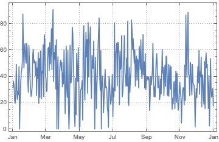

### Plot all years together

```mathematica
DateListPlot[{ts1,ts2,tsSim},opts,PlotLegends->{2018,2019,2020}]
```

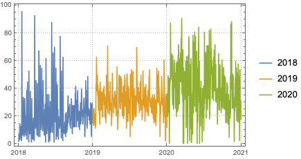

## Discussion

This section has subsections that correspond to additional discussion questions. Not all questions are answered, the plan is to progressively answer the questions with the subsequent versions of the this notebook / document.

### □ Too few pets

The number of registered pets seems too few. Seattle is a large city with more than $600000$ citizens; 
approximately $50$% of the USA households have dogs; 
hence the registered pets are too few (~$50000$). 

### □ Why too few pets?

Seattle is a high tech city and its citizens are too busy to have pets?

Most people do not register their pets? (Very unlikely if they have used veterinary services.)

Incomplete data?

### Adoption rate

Can we tell apart the adoption rates of pet-less people and people who already have pets?

## Preliminary definitions

```mathematica
opts=Sequence@@{PlotRange->All,ImageSize->Medium,PlotTheme->"Detailed"};
```

```mathematica
Import["https://raw.githubusercontent.com/antononcube/MathematicaForPrediction/master/MonadicProgramming/MonadicQuantileRegression.m"]
```

#### References

\[AA1\] Anton Antonov, 
[Pets retail dynamics project](https://github.com/antononcube/SystemModeling/tree/master/Projects/Pets-retail-dynamics), 
(2020), 
[SystemModeling at GitHub](https://github.com/antononcube/SystemModeling).
 
\[AA2\] Anton Antonov, 
[A monad for Quantile Regression workflows](https://mathematicaforprediction.wordpress.com/2018/08/01/a-monad-for-quantile-regression-workflows/), 
(2018), 
[MathematicaForPrediction at WordPress](https://mathematicaforprediction.wordpress.com).

\[AAp1\] Anton Antonov, 
[Monadic Quantile Regression Mathematica package](https://github.com/antononcube/MathematicaForPrediction/blob/master/MonadicProgramming/MonadicQuantileRegression.m), 
(2018), 
[MathematicaForPrediction at GitHub](https://github.com/antononcube/MathematicaForPrediction).

\[SOD1\] Seattle Open Data, 
[“Seattle Pet Licenses”](https://data.seattle.gov/Community/Seattle-Pet-Licenses/jguv-t9rb/data), 
[https://data.seattle.gov/Community/Seattle-Pet-Licenses/jguv-t9rb/data](https://data.seattle.gov/Community/Seattle-Pet-Licenses/jguv-t9rb/data) . 
