# Pets retail dynamics model

Anton Antonov
[MathematicaForPrediction at WordPress](https://mathematicaforprediction.wordpress.com)
[SystemModeling at GitHub](https://github.com/antononcube/SystemModeling)
January 2020

#### Introduction

This notebook/document discusses a Pets Retail Dynamics Model (PRDM) -- the domain area, assumptions, building, equations, parameters. Simulations results are shown and discussed.

Generally speaking, the [System dynamics](https://en.wikipedia.org/wiki/System_dynamics) methodology is used. 

The model is built incrementally: a few simple models are made first then the “large” model is build. Calibration of the model is discussed, but the actual calibration it is out of the scope of this notebook/document.

The first model uses a lot of simplifying assumptions and deals only with owned dogs and dog food. Nevertheless, the simple model provides certain insights and it is a good starting point for multiple types of model extensions. 

#### Model design

##### The modeled universe

Large city / metro area in USA.

The Pets Retail Company (PRS) has multiple stores in the model area. The competitors -- both direct and indirect  -- also have a large number of stores. 

Geographically the stores of PRS and the competitors are uniformly distributed within the pet owners areas.

Hence, the multiple stores of PRS can be modeled as “one big store.”

##### Time frame

We consider the unit of time to be a week. We are interested in a time horizon that is one year or two years.

##### Assumptions

###### General assumptions

The demand for dog food relates to a straight forward manner. For example, if all pets consisted of only one dog breed then the food demand is just a constant multiplied to the dog population. (With possible breakdown with respect to dog age.)

For all considered pet species, the breeds adhere to the Pareto Principle.

The geographical distributions pet owners also adhere to the Pareto Principle.

###### Simple model assumptions

A list of simplifying assumptions for the simple model follow.

   +  Pets ages are neglected. 

      + For example, the food consumption rates would incorporate the pets age distributions.

   + Each owner has one pet.

   + Once becoming an owner

#### Further discussion

##### Demand

Demand for pets varies, but it is expected in general going upward.

Millennials tend to want and buy more pets.

```mathematica
(*WebSearch["Millennials and pets",Method\[Rule]"Bing"]*)
```

##### Services

Veterinary and pet grooming services are a big part of the “pet economy.”

More specifically, spewing and neutering are most likely “a big business.” (Well, in USA Healthcare circumcision is.)

##### Sources

```mathematica
(*WebImage["https://www.avma.org/resources-tools/reports-statistics/us-pet-ownership-statistics"]*)
```

```mathematica
(*WebImage["https://www.petfoodindustry.com/articles/7255-survey-examines-us-pet-ownership-demographics"]*)
```

#### Model building progression

To be finished....

##### Building simple(r) representative model  -- dogs owned and dog food

##### Adding dog ages and weight

##### Adding cats

##### Adding birds and other species

##### Adding retail services 

##### Adding time dependent rates

#### Model dictionary

##### Stocks

```mathematica
aStocks=<|
    "Dogs Population"\[Rule]DP[t],
    "Cats Population"\[Rule]CP[t],
    "No pet Owner population"\[Rule]NO[t],
    "Dog Owner Wannabes"\[Rule]DOW[t],
    "Cat Owner Wannabes"\[Rule]COW[t],
    "Dog Owners"\[Rule]DO[t],
    "Cat Owners"\[Rule]CO[t],
    "Dogs to Sell"\[Rule]DS[t],
    "Cats to Sell"\[Rule]CS[t],
    "Dog Food to Sell (Stock)"\[Rule]DFS[t],
    "Dog Food Demand"\[Rule]DFD[t],
    "Dog Food Purchased"\[Rule]DFP[t],
    "Cat Food to Sell (Stock)"\[Rule]CFS[t],
    "Cat Food Demand"\[Rule]CFD[t],
    "Cat Food Purchased"\[Rule]CFP[t],
    "Dog Accessories to Sell"\[Rule]DAS[t],
    "Dog Accessories Demand"\[Rule]DAD[t],
    "Cat Accessories to Sell"\[Rule]CAS[t],
    "Cat Accessories Demand"\[Rule]CAD[t],
    "Dog Services to Sell"\[Rule]DSS[t],
    "Dog Services Demand"\[Rule]DSD[t],
    "Cat Services to Sell"\[Rule]CSS[t],
    "Cat Services Demand"\[Rule]CSD[t],
    "Store Regular Employees"\[Rule]SRE[t],
    "Store pet Service Employees"\[Rule]SSE[t],
    "Money from dog food purchases"\[Rule]MDF[t],
    "Money from dog accessories purchases"\[Rule]MDA[t],
    "Money from cat food purchases"\[Rule]MCF[t],
    "Money from cat accessories purchases"\[Rule]MCA[t],
    "Missed money income from dog food purchases"\[Rule]MMIDF[t],
    "Missed money income from cat food purchases"\[Rule]MMICF[t]
    |>;
```

##### Rates

```mathematica
aRates=<|
    "Dogs demand rate"\[Rule]ddr[DP,DO,NO],
    "Cats demand rate"\[Rule]cdr[CP,CO,NO],
    "Want a dog curve"\[Rule]\[Gamma][NO,DO,t],
    "Want a cat curve"\[Rule]\[Gamma][NO,CO,t],
    "Want a dog rate"\[Rule]wdr[NO,DO],
    "Want a cat rate"\[Rule]wcr[NO,CO],
    "Dogs adoption rate per wannabe"\[Rule]dar[DP,DOW],
    "Cats adoption rate per wannabe"\[Rule]car[CP,COW],
    "Dogs death rate"\[Rule]\[Delta][DP],
    "Cats death rate"\[Rule]\[Delta][CP],
    "Dogs birth rate"\[Rule]\[Beta][DP],
    "Cats birth rate"\[Rule]\[Beta][CP],
    "Dog pregranacy term"\[Rule]\[Rho][DP],
    "Cat pregranacy term"\[Rule]\[Rho][DC],
    "Dog owner mourning period"\[Rule]\[Mu][DO],
    "Cat owner mourning period"\[Rule]\[Mu][CO],
    "Dog food consuption rate (per dog, time unit)"\[Rule]dfcr[DP],
    "Cat food consuption rate (per cat, time unit)"\[Rule]cfcr[CP],
    "Dog accessories consuption rate (per dog)"\[Rule]dacr[DP],
    "Cat accessories consuption rate (per cat)"\[Rule]cacr[CP],
    "Dog services consuption rate (per dog)"\[Rule]dscr[DP],
    "Cat services consuption rate (per cat)"\[Rule]cscr[CP],
    "Dog owner store visit rate (number of time units per owner, pet)"\[Rule]dsvr[DO,DP],
    "Cat owner store visit rate (number of time units per owner, pet)"\[Rule]csvr[CO,CP],
    "Propbabilyty to go a competitor store"\[Rule]\[Kappa][DO],
    "Regular employees quit rate"\[Rule]reqr[SE],
    "Pet services employees quit rate"\[Rule]seqr[SE],
    "Delivery curve (number of time units, delay)"->\[CapitalDelta][t],
    "Dog food delivery rate (delay factor)"\[Rule]dfdr[DFD],
    "Cat food delivery rate (delay factor)"\[Rule]cfdr[CFD],
    "Dog accessories delivery rate (number of time units, delay)"\[Rule]dadr[DFD],
    "Cat accessories delivery rate (number of time units, delay)"\[Rule]cadr[CFD],
    "Dog food expiration rate"\[Rule]\[Delta][DFS],
    "Cat food expiration rate"\[Rule]\[Delta][CFS],
    "Dog food price"->\[Eta][DFS],
    "Cat food price"->\[Eta][CFS],
    "Dog accessories price"->\[Eta][DAS],
    "Cat accessories price"->\[Eta][CAS],
    "Store capacity for dog food"\[Rule]SK[DFS],
    "Store capacity for cat food"\[Rule]SK[CFS]
    |>;
```

##### Tabulation

```mathematica
GridTableForm[List@@@Normal[aStocks],TableHeadings\[Rule]{"Description","Symbol"}]
```

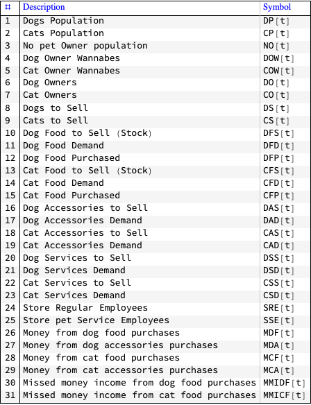

```mathematica
GridTableForm[List@@@Normal[aRates],TableHeadings\[Rule]{"Description","Symbol"}]
```

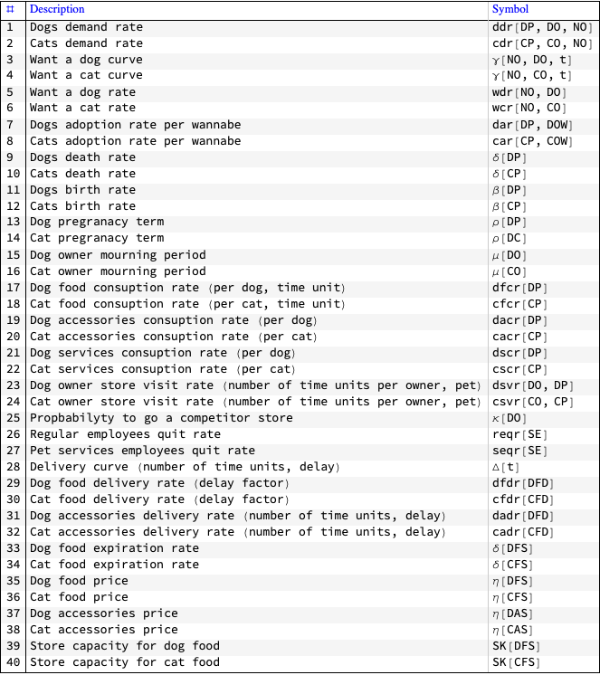

#### Model equations

##### Equations (dogs and dog food only)

```mathematica
dogAdoptionTerm=dar[DP,DOW]*Min[DS[t],DOW[t]];
```

```mathematica
wannaDogTerm=wdr[NO,DO]*\[Gamma][NO,DO,t]*NO[t];
```

```mathematica
dogFoodPurchaseCallTerm=(1-\[Kappa][DO])*dsvr[DO,DP]*dfcr[DP]*(DP[t]/DO[t])*DO[t]/dsvr[DO,DP];
```

```mathematica
dogFoodPurchaseTerm=Min[dogFoodPurchaseCallTerm,DFS[t]]*Unitize[Ramp[DFS[t]]]

(*Min[DFS[t],dfcr[DP] DP[t] (1-\[Kappa][DO])] Unitize[Ramp[DFS[t]]]*)
```

```mathematica
lsEquations=
    {
    DP'[t]\[Equal]dogAdoptionTerm-\[Delta][DP]*DP[t],
    DFD[t]\[Equal](1-\[Kappa][DO])*dfcr[DP]*DP[t],
    DO'[t]\[Equal]dogAdoptionTerm-\[Delta][DP]*DP[t],
    DS'[t]\[Equal]Min[wannaDogTerm,\[Beta][DP]*DP[t]]-dar[DP,DOW]*DS[t],
    DOW'[t]\[Equal]wannaDogTerm-dogAdoptionTerm+\[Delta][DP]*DP[t]/\[Mu][DO],
    NO'[t]\[Equal]\[Delta][DP]*DP[t]-wannaDogTerm,
    DFS'[t]\[Equal]DFD[t]/(dfdr[DFD]*\[CapitalDelta][t])*(1-DFS[t]/SK[DFS])-dogFoodPurchaseTerm-\[Delta][DFS]*DFS[t],
    MDF'[t]\[Equal]\[Eta][DFS]*dogFoodPurchaseTerm,
    MMIDF'[t]\[Equal]\[Eta][DFS]*(dogFoodPurchaseCallTerm-DFS[t])*Unitize[Ramp[dogFoodPurchaseCallTerm-DFS[t]]]
    };
```

##### Equations explanations

###### Dog adoption term

Since no more dogs can be adopted than the minimum of Dog Owner Wannabes (DOW) and Dogs to Sell (DS), the dog adoption term is formed by that minimum multiplied by a factor in the range $\text{$\$$Failed}$ the reflects how selective DOW are.

```mathematica
dogAdoptionTerm

(*dar[DP,DOW] Min[DOW[t],DS[t]]*)
```

###### Wanna dog term

The people that convert from No dog Owners (NO) to Dog Owner Wannabes (DOW) are modeled with demand curve ($\gamma$) and a multiplying factor ($\text{wdr}$):

```mathematica
wannaDogTerm

(*NO[t] wdr[NO,DO] \[Gamma][NO,DO,t]*)
```

###### Dog food purchase call term

The dog purchase call term is the probability of a dog owner to go to a company store multiplied by the dog food consumption rate.

```mathematica
dogFoodPurchaseCallTerm

(*dfcr[DP] DP[t] (1-\[Kappa][DO])*)
```

###### Dog food purchase term

The dog food purchase term satisfies the dog food purchase call  with the Dog Food for Sale (DFS) by taking into account the availability of the dog food in the store -- that is why we have the terms Min[__] and Unitize[__].  

```mathematica
dogFoodPurchaseTerm

(*Min[DFS[t],dfcr[DP] DP[t] (1-\[Kappa][DO])] Unitize[Ramp[DFS[t]]]*)
```

###### Dog population

The Dog Population (DP) is increased by the dogs adoption rate and decreased by the dogs death rate.

```mathematica
DP'[t]\[Equal]dogAdoptionTerm-\[Delta][DP]*DP[t]
```

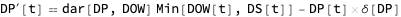

###### Dog food demand

Dog food demand increases proportionally to the dog population (using the dog consumption rate) and proportionally to the store visits probability by the dog owners.

```mathematica
DFD'[t]\[Equal](1-\[Kappa][DO])*dfcr[DP]*DP[t]
```


###### Dog owners

Dog owners increase with the dog adoption term and decrease with the dog death rate multiplied by the Dog Population (DP). Note that here we assume that a owner has one dog only.

```mathematica
DO'[t]\[Equal]dogAdoptionTerm-\[Delta][DP]*DP[t]
```

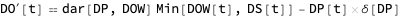

###### Dogs to Sell

The Dogs to Sell (DS) are  increased by the Dog Owner Wannabes (DOW) divided by the pregnancy length and decreased by DS multiplied by the dog adoption rate ($\text{dar}$). The dog adoption rate is a number in $\text{$\$$Failed}$. 

```mathematica
DS'[t]\[Equal]Min[wannaDogTerm/\[Rho][DP],\[Beta][DP]*DP[t]]-dar[DP,DOW]*DS[t]
```

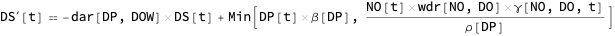

###### Dog owner wannabes

```mathematica
DOW'[t]\[Equal]wannaDogTerm-dogAdoptionTerm+\[Delta][DP]*DP[t]/\[Mu][DO]
```

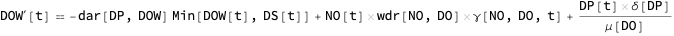

#### Randomizing delivery

In this section we consider the “randomized” delivery for goods.

```mathematica
rpath=RandomFunction[ARProcess[{0.1},0.3],{0,200}]["Path"];
    rpath\[LeftDoubleBracket]All,2\[RightDoubleBracket]=Clip[1+rpath\[LeftDoubleBracket]All,2\[RightDoubleBracket],{1,2},{1,2}];
    rfunc=Interpolation[rpath];
    Plot[rfunc[t],{t,0,100}]
```

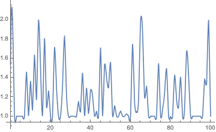

#### Simulations

##### Parameters

```mathematica
aRateRules=<|
    \[Gamma][NO,DO,t]\[Rule]1+UnitStep[t-12],
    wdr[NO,DO]\[Rule]0.05,
    \[Delta][DP]\[Rule]0.079/52,
    \[Delta][CP]\[Rule]0.083/52,
    \[Beta][DP]\[Rule]0.114/52,
    \[Beta][CP]\[Rule]0.112/52,
    \[Rho][DP]\[Rule]65/7.,
    \[Rho][CP]\[Rule]70/7.,
    \[Mu][DO]\[Rule]12,
    \[Mu][CO]\[Rule]12,
    dsvr[DO,DP]\[Rule]2.,
    dar[DP,DOW]\[Rule]0.5,
    \[CapitalDelta][t]\[Rule]1+UnitStep[t-6]-UnitStep[t-7],
    dfdr[DFD]\[Rule]0.2,
    dfcr[DP]\[Rule]7.,
    \[Kappa][DO]\[Rule]0.5,
    \[Delta][DFS]\[Rule]1/40,
    \[Delta][CFS]\[Rule]1/40,
    \[Eta][DFS]\[Rule]10,
    \[Eta][CFS]\[Rule]10,
    SK[DFS]\[Rule]0.5*300000*8,
    SK[CFS]\[Rule]0.3*300000*6
    |>;
```

```mathematica
aRateRules[#]&/@Values[aRates]
```

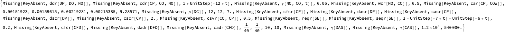

##### Equations with the actual parameters

To be used for parametric equation solving:

```mathematica
lsFocusParams={wdr[NO,DO],dfdr[DFD]};
    aParametricRateRules=KeyDrop[aRateRules,lsFocusParams];
```

```mathematica
lsRateEquations=MapThread[Equal,{Values[aRates],Values[aRates]/.aRateRules}];
```

```mathematica
ColumnForm[lsEquations/.Normal[aParametricRateRules]]
```

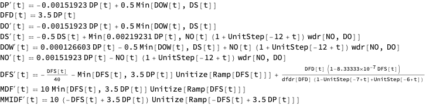

##### Solution

Here we solve a parametric system of ODE’s:

```mathematica
sol=
    Flatten@
    ParametricNDSolve[Join[lsEquations/.Normal[aParametricRateRules],
    {
    NO[0]\[Equal]100000/2,
    DO[0]\[Equal]100000/2,
    DP[0]\[Equal]100000/2,
    DS[0]\[Equal]200,
    DOW[0]\[Equal]0,
    DFS[0]\[Equal]0.2*100000/2*dfcr[DP]/.Normal[aParametricRateRules],
    (*DFD[0]\[Equal]100000/2*dfcr[DP]/.Normal[aParametricRateRules],*)
    MDF[0]\[Equal]0,
    MMIDF[0]\[Equal]0
    }],
    {NO[t],DO[t],DP[t],DS[t],DOW[t],DFS[t],DFD[t],MDF[t],MMIDF[t]},
    {t,0,5*52},
    lsFocusParams]
```

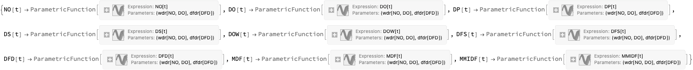

#### Interactive interface

```mathematica
opts={PlotRange\[Rule]All,PlotLegends\[Rule]None,PlotTheme\[Rule]"Detailed",PerformanceGoal\[Rule]"Speed",ImageSize\[Rule]300,AspectRatio->1/2};
    Manipulate[
    Multicolumn[
    Join[
    {ListLinePlot[
    (wdr[NO,DO]*\[Gamma][NO,DO,t]/.Join[aRateRules,AssociationThread[lsFocusParams,{wdr0,dfdr0}]]/.t\[Rule]#)&/@Range[0,nweeks],
    PlotLabel\[Rule]"wdr[NO,DO]\[Times]\[Gamma][NO,DO,t]",
    Evaluate[opts]],
    ListLinePlot[
    (dfdr[DFD]*\[CapitalDelta][t]/.Join[aRateRules,AssociationThread[lsFocusParams,{wdr0,dfdr0}]]/.t\[Rule]#)&/@Range[0,nweeks],
    PlotLabel\[Rule]"dfdr[DFD]\[Times]\[CapitalDelta][t]",
    Evaluate[opts]]},
    Map[
    Plot[Evaluate[#\[LeftDoubleBracket]2\[RightDoubleBracket][wdr0/52,dfdr0]],{t,0,nweeks},
    PlotLabel\[Rule]Row[{#\[LeftDoubleBracket]1\[RightDoubleBracket],",",Spacer[3],#\[LeftDoubleBracket]1\[RightDoubleBracket]/.Map[Reverse,Normal@aStocks]}],
    Evaluate[opts]]&,
    sol],
    {ListLinePlot[
    Block[{d=(Association[sol][DFS[t]][wdr0/52,dfdr0]/.t\[Rule]#)&/@Range[0,nweeks]},
    Prepend[Differences[d],d\[LeftDoubleBracket]1\[RightDoubleBracket]]
    ],
    PlotLabel\[Rule]"\[CapitalDelta] DFS(t)",
    Evaluate[opts]
    ],
    ListLinePlot[
    Block[{
    d=(Association[sol][DFD[t]][wdr0/52,dfdr0]/.t\[Rule]#)&/@Range[0,nweeks],
    s=(Association[sol][DFS[t]][wdr0/52,dfdr0]/.t\[Rule]#)&/@Range[0,nweeks]},
    s-d
    ],
    PlotLabel\[Rule]"DFS(t)-DFD(t)",
    Evaluate[opts]
    ],
    ListLinePlot[
    Block[{m=(Association[sol][MDF[t]][wdr0/52,dfdr0]/.t\[Rule]#)&/@Range[0,nweeks]},
    Prepend[Differences[m],m\[LeftDoubleBracket]1\[RightDoubleBracket]]
    ],
    PlotLabel\[Rule]"\[CapitalDelta] MDF(t), money flow",
    Evaluate[opts]
    ],
    ListLinePlot[
    Block[{
    d=(Association[sol][MDF[t]][wdr0/52,dfdr0]/.t\[Rule]#)&/@Range[0,nweeks],
    s=(Association[sol][MMIDF[t]][wdr0/52,dfdr0]/.t\[Rule]#)&/@Range[0,nweeks]},
    Divide@@@Select[Transpose[{s,d}],#\[LeftDoubleBracket]2\[RightDoubleBracket]>0&]
    ],
    PlotLabel\[Rule]"MMIDF(t)/MDF(t)",
    Evaluate[opts]
    ]}
    ],4],
    {{wdr0,0.03,"wdr[NO,DO]], fraction per year"},0,1,0.005,Appearance\[Rule]{"Open"}},
    {{dfdr0,1,"dfdr[DFD], dog food dilivery delat factor"},0,20,0.01,Appearance\[Rule]{"Open"}},
    {{nweeks,30,"number of weeks"},1,5*52,1,Appearance\[Rule]{"Open"}}]
```


#### References

[1] Anton Antonov, Pets retail modeling, SystemModeling at GitHub, 2020.

#### Export

```mathematica
SetDirectory[NotebookDirectory[]]

(*"/Users/antonov/MathFiles/System Modeling"*)
```

```mathematica
Needs["M2MD`"]
```

```mathematica
EvaluationNotebook[]
```

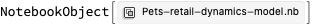

```mathematica
Options[MDExport]

(*{"ImagesExportURL"\[Rule]Automatic,"ImagesFetchURL"\[Rule]"Relative"}*)
```

```mathematica
fileName="Pets-retail-dynamics-model.md";
```

```mathematica
MDExport[fileName,EvaluationNotebook[]]
```

[//]: # (No rules defined for $Failed:CellObject)

[//]: # (No rules defined for $Failed:CellObject)

[//]: # (No rules defined for $Failed:CellObject)

[//]: # (No rules defined for $Failed:CellObject)

[//]: # (No rules defined for $Failed:CellObject)

[//]: # (No rules defined for $Failed:CellObject)

[//]: # (No rules defined for $Failed:CellObject)

```mathematica
SystemOpen[fileName]
```