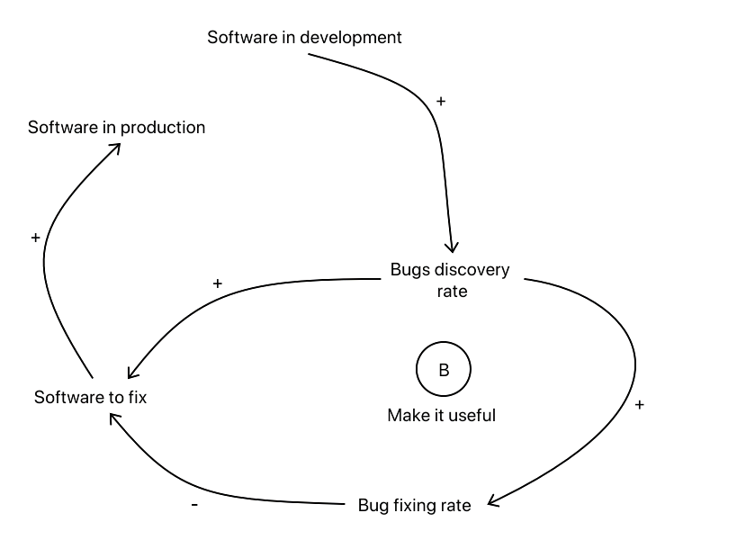

```{r}
library(deSolve)
library(tidyr)
library(ggplot2)
```

# Introduction

In this notebook we build and simulate Software Bugs Fixing Model (SBFM).

Here is the casual loops diagram:


The example is also discussed in \[JD1\].

# Software bugs fixing model 

## Time frame 

We consider a regular time grid with time unit one week. 

## Stocks

Consider the two stocks:

- Software With Bugs (SWB)

- Bugs (B)

(The suffix "t" is for )

```{r}
lsInitialConditions <- c( SWBt = 0, Bt = 0 )
```

## Rates

The rates we consider are:

- Bugs discovery rate (discoveryRate) with units number of bugs per week

- Bug fixing rate (fixRate) with units fraction of bugs fixed per week

```{r}
lsRateValues <- c( discoveryRate = 20, fixRate = 1/6 )
```

## Equations

Simplistic Right Hand Side (RHS) function formulation:

```{r}
RHSFunction <- 
  function( time, state, parameters ) {
    with(as.list( c( state, parameters ) ) ,
         {
           
           dSWPt <- discoveryRate - fixRate * SWBt
           dBt <- discoveryRate
           
           return( list( c( dSWPt, dBt ) ) )
         }
    )
  }
```

A more complicated RHS function formulation can be done that allows the specification of the rate `discoveryRate` to be a function:

```{r}
RHSFunction2 <- 
  function( time, state, parameters ) {
    with(as.list( c( state, parameters ) ) ,
         {

           if( is.function(discoveryRate) ) {
             nDelta <- discoveryRate( time )
           } else {
             nDelta <- discoveryRate
           }

           dSWPt <- nDelta - fixRate * SWBt
           dBt <- nDelta
           
           return( list( c( dSWPt, dBt ) ) )
         }
    )
  }
```


```{r}
lsRateValues2 <- list( discoveryRate = function(t) { 100 * ifelse( floor(t) %/% 2 == floor(t) / 2, 0, 1 ) }, fixRate = 1/6 )
```

Here is the function `discoveryRate`:

```{r}
plot( (lsRateValues2$discoveryRate)(seq(1,40,0.2)), type = "l", ylab = "discoveryRate", xlab = "time" )
```

# Simulations

```{r}
sol <- deSolve::ode( y = lsInitialConditions, times = seq(0, 100), func = RHSFunction, parms = lsRateValues, method = "rk4" )
```

```{r}
sol
```


```{r}
sol <- deSolve::ode( y = lsInitialConditions, times = seq(0, 30), func = RHSFunction2, parms = lsRateValues2, method = "rk4" )
```


# Plots

Here we convert the matrix `sol` into a data frame:

```{r}
dfSol <- as.data.frame(sol)
colnames(dfSol) <- gsub( "time", "Time", colnames(dfSol) )
head(dfSol)
```

```{r}
dfSol %>% 
  tidyr::pivot_longer( cols = colnames(dfSol)[-1], names_to = "Stock", values_to = "Value" ) %>%
  ggplot2::ggplot( ) +
  ggplot2::geom_line( ggplot2::aes( x = Time, y = Value, color = Stock ) ) +
  ggplot2::facet_wrap( ~Stock, scales = "free" )
```


# References

\[KS1\] Karline Soetaert, Thomas Petzoldt, R. Woodrow Setzer,
["deSolve: Solvers for Initial Value Problems of Differential Equations ('ODE', 'DAE', 'DDE')"](https://cran.r-project.org/web/packages/deSolve/index.html),
[CRAN](https://cran.r-project.org). 

\[JD2\] Jim Duggan, 
["SDMR"](https://github.com/JimDuggan/SDMR), 
2016, 
[GitHub](https://github.com/JimDuggan).   
(Resources for text book "System Dynamics Modeling with R".)
