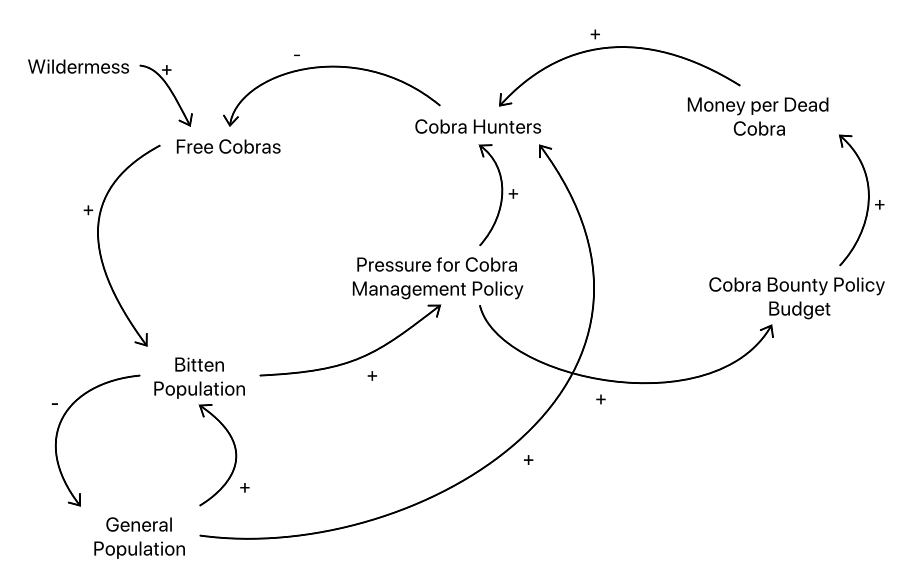
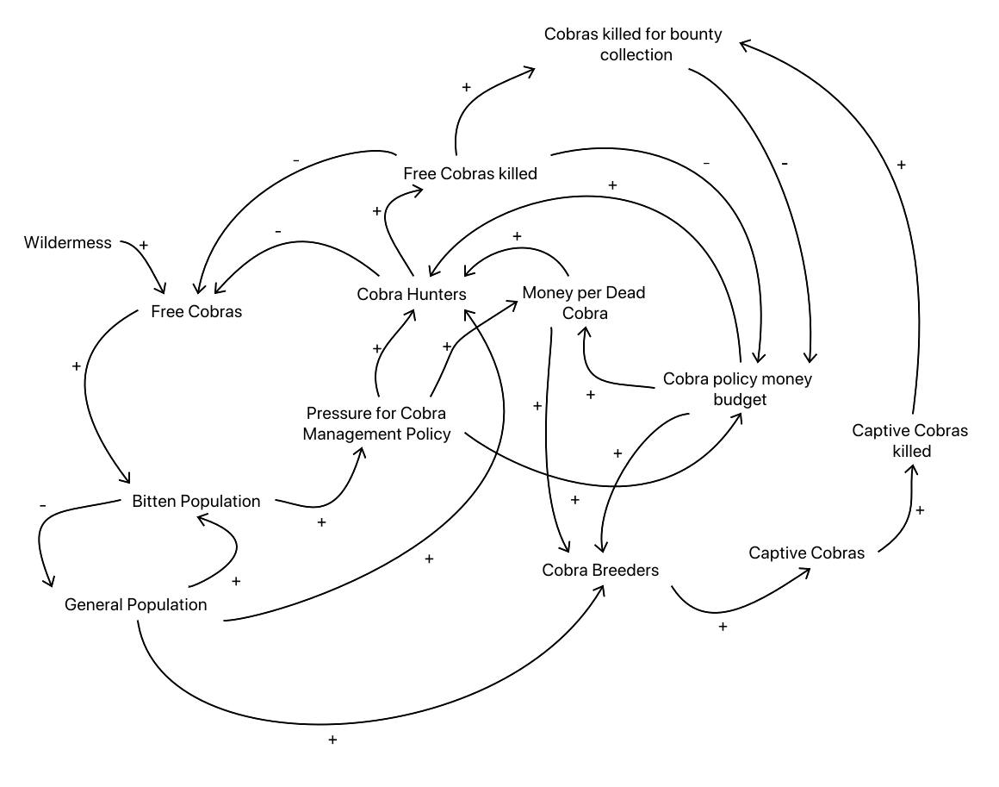

# Unintended consequences

## In brief

In the project we spell out in the detail the set-ups, assumptions, and equations of different models 
applied to situations that manifested the 
[law of unintended consequences](https://en.wikipedia.org/wiki/Unintended_consequences).

## Cobra effect

**Cobra Effect short description:** 
A century or so ago the British government of Delhi wanted to reduce the number of cobras 
seen in the city. So, they established a Cobra Bounty Program (CBP). 
Initially CBP seemed to work, but then citizens of Delhi started breeding cobras. 
When the government learned about the cobra breeding they cancelled CBP. 
The cobra breeders released the cobras they had in their "cobra farms." 
So, Delhi ended up with much more cobras than when CBP started.

### True story?

I choose to believe that story -- it sounds plausible and 
I found a maybe confirming excerpt in the book "Preparing the 21st Century Church", \[LB1\]. 

> A few years ago, one of the southern Indian provinces was
hit by a cobra plague. These not so harmless snakes had multi-
plied until suddenly you could find them everywhere-in the
streets, in houses, on the fields, and in the stables. The state
authorities stepped in and promised a head fee for each dead
cobra. At first, the situation changed according to expectations.
The citizen's organized "cobra hunts" and the number of cobras
dropped markedly. There was even a new profession that 
developed -- professional cobra hunters could be frequently seen.

> Yet after the initial decline of the cobra population, the
authorities were shocked to learn that cobras could again be
found everywhere. After investigating this phenomenon they
found that many snake hunters had become snake breeders, [...]"

There is a well documented similar policy by the French in Hanoi about a similar “rats problem”, \[MV1\].

### Modeling

Here is a System Dynamics casual loops diagram of the naive, policy makers model:

Here is the corresponding WL notebook: 
["Modeling Cobra effect's naive policy"](./WL-notebooks/Modeling-Cobra-effect's-naive-policy.nb).

Here is a diagram of the full(er) model:

## References

\[Wk1\] Wikipedia entry, [Cobra effect](https://en.wikipedia.org/wiki/Cobra_effect).

\[Wk2\] Wikipedia entry, [Unintended consequences](https://en.wikipedia.org/wiki/Unintended_consequences).

\[SD1\] Stephen J. Dubner,  (2012). 
["The Cobra Effect: A New Freakonomics Radio Podcast"](https://freakonomics.com/podcast/the-cobra-effect-a-new-freakonomics-radio-podcast/), 
Freakonomics, LLC. 

\[SD2\] Stephen J. Dubner, (2012). 
["The Cobra Effect (Ep. 96): Full Transcript"](https://freakonomics.com/2012/10/11/the-cobra-effect-full-transcript/),
Freakonomics, LLC.

\[LB1\] Leslie H. Brickman, (2002). Preparing the 21st Century Church. p. 326. ISBN 978-1-59160-167-8.

\[MV1\] Michael Vann, (2003). Of Rats, Rice, and Race: The Great Hanoi Rat Massacre, an Episode in French Colonial History. 
French Colonial History. 4. 191-203. 10.1353/fch.2003.0027. 