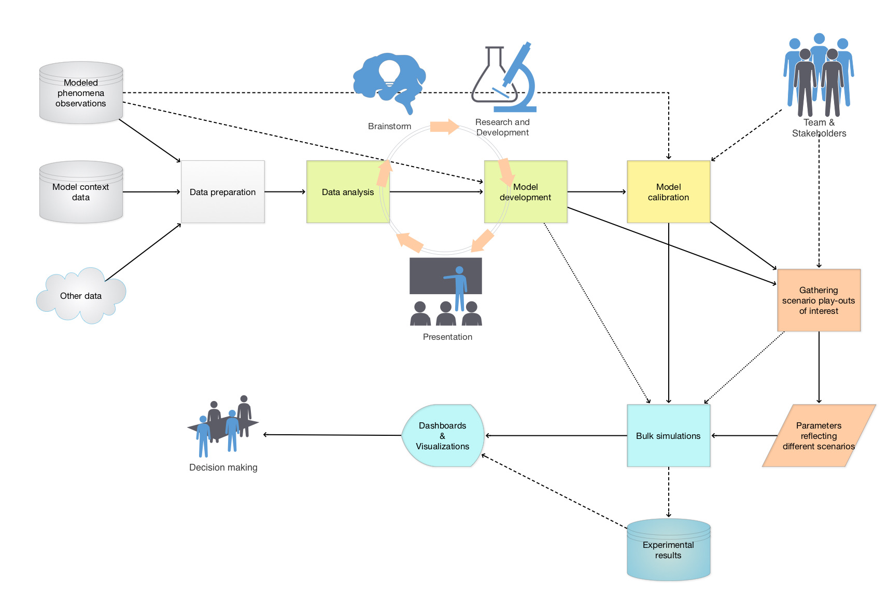

# War Games Dynamics

This project has models for different aspects of War Games Dynamics (WGD).

The aim is to produce comprehensive modeling support of war games simulations that 

1. Allow faithful approximations of real life military exercises or wars
2. Conducting experiments for different "what-if" scenarios

## Modeling scope

The following mind-map illustrates the scope of the modeling work:

This diagram shows the "big picture" in which the considered comprehensive models 
should be a major part of:

--------

## Simple war game models

The simplest war games models are derived in the on works of Mikhail Pavlovich Osipov and
[Frederick William Lanchester](https://en.wikipedia.org/wiki/Frederick_W._Lanchester), [Wk1].
See 
[Lanchester's laws](https://en.wikipedia.org/wiki/Lanchester%27s_laws), [Wk2].

Osipov derived Lanchester's laws and fitted them to existing data of wars, [LG1]:

> Osipov’s most unique and important contribution is the explicit and systematic 
> application to quantitative historical data of what, for his time, 
> were fairly advanced formal statistical methods.

This Wolfram Language (WL) notebook discusses symbolic and numerical solutions of the corresponding
systems of differential equations.

------

## References

[NBM1] Н. В. МИТЮКОВ,
["М. П. ОСИПОВ: К ИДЕНТИФИКАЦИИ ЛИЧНОСТИ АВТОРА ПЕРВОЙ МОДЕЛИ ГЛОБАЛЬНЫХ ПРОЦЕССОВ"](https://www.socionauki.ru/journal/files/ipisi/2011_2/mitukov.pdf)
(2011),
Историческая психология и социология истории.

[LG1] Lester W. Grau and Clint Reach,
["A Mathematical Probability of Success for Soviets in Cold War Confrontation"](https://www.ikn.army.mil/apps/MIPBW/MIPB_Features/AMathematicalProbabilityofSuccessforSovietsinCOldWarConfrontation.pdf)
(2021),
Military Intelligence

[Wk1] Wikipedia entry,
[Frederick W. Lanchester](https://en.wikipedia.org/wiki/Frederick_W._Lanchester).

[Wk2] Wikipedia entry,
[Lanchester's laws](https://en.wikipedia.org/wiki/Lanchester%27s_laws).
