# Extracting Russian casualties in Ukraine data from Mediazona publications

**Version 0.9**

Anton Antonov   
[MathematicaForPrediction at WordPress](https://mathematicaforprediction.wordpress.com)   
[RakuForPrediction at WordPress](https://rakuforprediction.wordpress.com)   
[SystemModeling at GitHub](https://github.com/antononcube/SystemModeling)   
November 2023   

## Introduction

In this notebook we discuss data extraction techniques from the Web site Mediazona that tracks the[ Russian casualties in Ukraine](https://en.zona.media/article/2022/05/20/casualties_eng). See [MZ1]. 

Since we did not find a public source code (or data) repository (like GitHub) of the data, we extract the data directly from the web site [MZ1]. We can use both (i) image processing and (ii) web browser automation. But since we consider the latter to be both time consuming and unreliable to reproduce, in this notebook we consider only image processing (combined with AI vision.)

We did not “harvest” all types of data from Mediazona, only the casualties per week and day for all troops. (Which we see as most important.)

This notebook is intentionally kept to be only “technical know-how”, without further data analysis, or correlation confirmations with other publications, or model applications, etc. We plan to do analysis and modeling in other notebooks/articles. (Using data from Mediazona and other sources.)

**Remark:** At the time of programming the extractions of this notebook, (2023-11-29), Midiazona, [MZ1], says that the Russian casualties it presents are corroborated by publicly available data as of 17 November, 2023.

**Remark:** Mediazona is [Anti Putinist](https://en.wikipedia.org/wiki/Opposition_to_Vladimir_Putin_in_Russia), [[Wk1](https://en.wikipedia.org/wiki/Mediazona)], and (judging from its publications) it is pro-Ukraine and pro-West.

### Similar other data sources

Here is a couple of other data sources with similar intent or mission:

- [lostarmour.info](https://lostarmour.info/ukr200) (in Russian)

- [wartears.org](https://wartears.org/en/posts/math-model/) (in English, Russian, and Ukrainian)

**Remark:** Those are pro-Russian sites.

### TL;DR

Here is the data that is extracted below using image processing and OpenAI’s LLM vision capabilities, [[AAn1](https://community.wolfram.com/groups/-/m/t/3072318), OAIb1]:


Here is the [corresponding JSON file](https://drive.google.com/file/d/13-c_DYqbgoIbTtiAFyffe8oe2xnCzzyr/view?usp=sharing).

Here is a bar chart with tooltips for the weekly casualties that corresponds to the weekly casualties bar chart in [[MZ1](https://en.zona.media/article/2022/05/20/casualties_eng)] (for all troops):

```mathematica
bcCol = RGBColor @@ ({143, 53, 33}/255);
xTicks = MapIndexed[{#2[[1]], DateString[First@#WeekSpan, {"MonthNameShort", " '", "YearShort"}]} &, mediaZonaData];
BarChart[Map[Tooltip[#["total_casualties"], Labeled[Grid[Map[{#[[1]], " : ", #[[2]]} &, List @@@ Normal[#["count_per_day"]]]], Column[{Style[#["week_span"], Blue], Row[{"total casualties:", Spacer[3], Style[#["total_casualties"], Red]}]}], Top]] &, mediaZonaData 
  ], 
  PlotTheme -> "Detailed", 
  FrameLabel -> Map[Style[#, FontSize -> 14] &, {"Week", "Number of killed"}], FrameTicks -> {{Automatic, Automatic}, {{#[[1]], Rotate[#[[2]], \[Pi]/6]} & /@ xTicks[[1 ;; -1 ;; 4]], Automatic}}, PlotLabel -> Style["Confirmed Russian casualties in Ukraine per week", Bold, FontSize -> 18], 
  ChartStyle -> Block[{tcs = Map[#["total_casualties"] &, mediaZonaData]}, Blend[{White, bcCol}, #] & /@ (tcs/Max[tcs])], 
  ImageSize -> 1000, 
  AspectRatio -> 1/1.8 
 ]
```

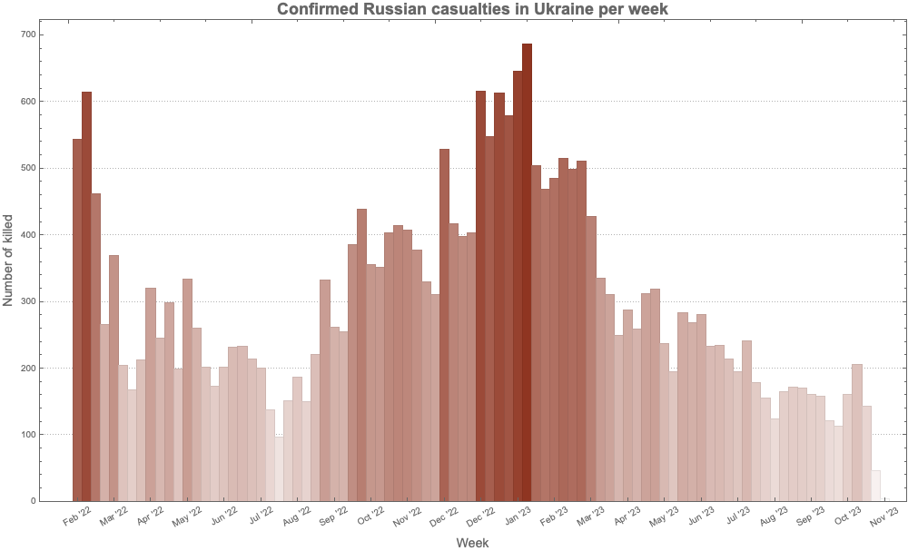

### Document structure

The rest of document has the following sections:

- Images with data

- Weekly casualties extraction

- Daily data extraction from daily bar chart

- Daily data extraction from weekly bar chart tooltips

- Additional comments and remarks

The second and fourth sections have subsections that outline the corresponding procedures.

## Images with data

At first we got two images from [MZ1]: one for casualties per week and one for casualties per day. (For all troops.)

Then in order to extract more faithful daily casualties data we took ≈90 screenshots of the weekly casualties bar chart at [MZ1], each screenshot with a tooltip shown for a different week. 

### Casualties per week

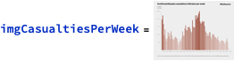

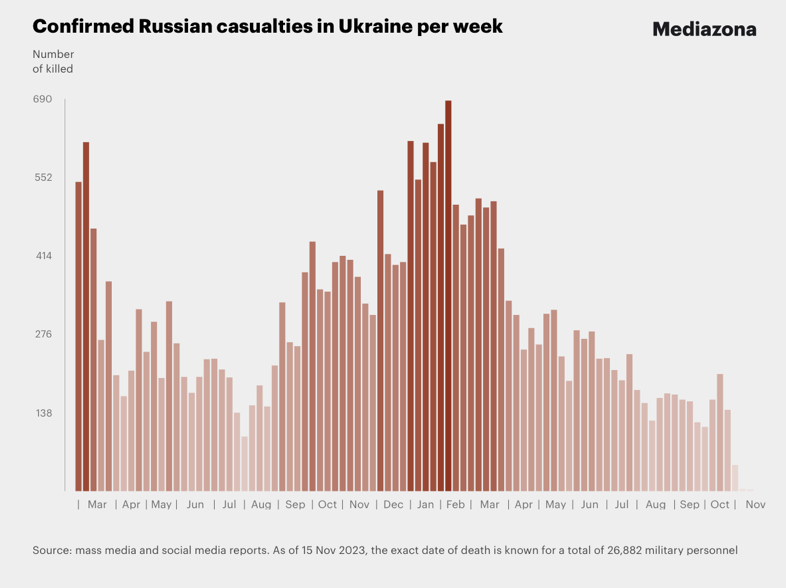

### Casualties per day


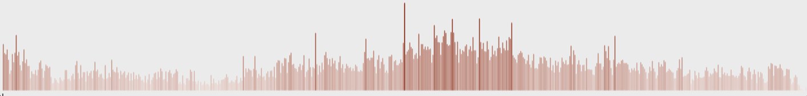

### Screenshots of weekly bar chart with tooltips

In order to get more faithful data readings of the daily casualties multiple (≈90) screenshots were taken of the weekly casualties bar chart, each of the screenshots having a tooltip table of one (unique) bar. It took ≈15 minutes to take those screenshots. They can be obtained from [this Google Drive link](https://drive.google.com/file/d/1Z76Gk4talQ6lMdC5jeUsuK0vcWU38wfm/view?usp=sharing).

Here is how one of them looks like:

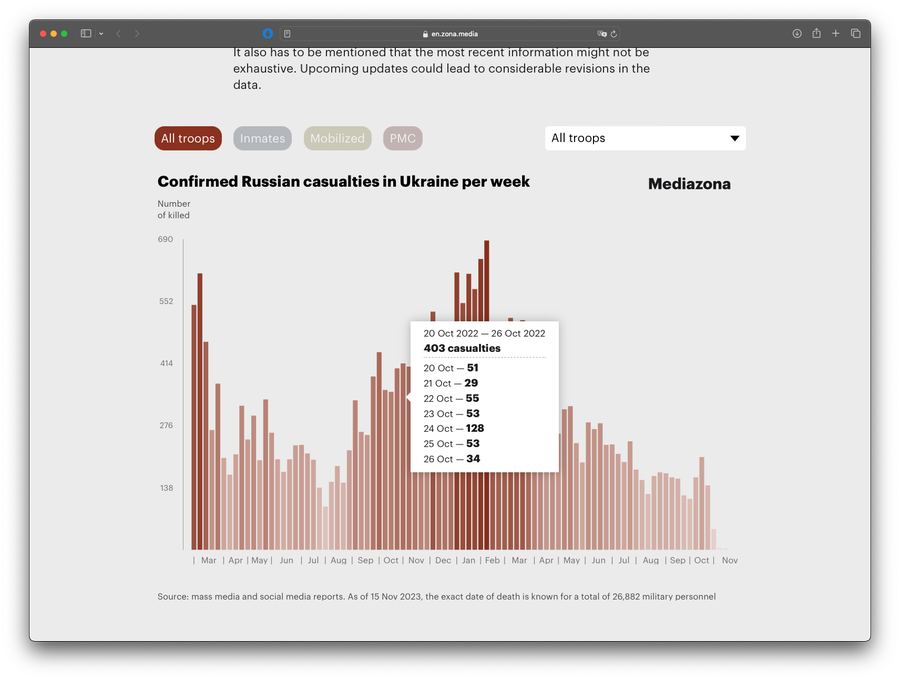

### Number of days and number weeks

Here is the number of weeks we expect to see in the "Casualties per week" plot: 

```mathematica
nWeeks = Round@DateDifference[DateObject[{2022, 02, 24}], DateObject[{2023, 11, 17}], "Week"]

(* 90 wk *)
```

Here is the number of days we expect to see in the "Casualties per day" plot: 

```mathematica
nDays = Round@DateDifference[DateObject[{2022, 02, 24}], DateObject[{2023, 11, 03}]]

(*617 days*)
```

-------

## Weekly data extraction

### Procedure

Here is the outline of the procedure:

- Crop the image, so only the bar chart elements are on it

- Binarize the image, and negated

    - So all visible bars are white on black background

- Extracting morphological components

- Find the bar sizes from the extracted components

- Rescale to match real data

- Check the absolute and relative errors between derived total number of casualties and the published one

### Crop image

Here we take "the bars only" part of the image:

```mathematica
imgCasualtiesPerWeek2 = ImageTake[imgCasualtiesPerWeek, {120, -140}, {100, -60}]
```

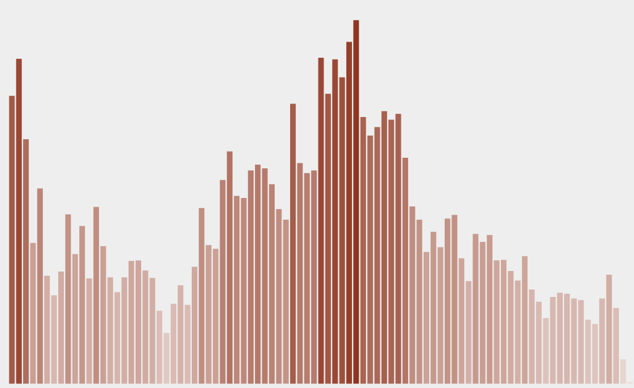

### Binarization and color negation

Binarize the cropped the image:

```mathematica
img = Binarize[imgCasualtiesPerWeek2, 0.85]
```

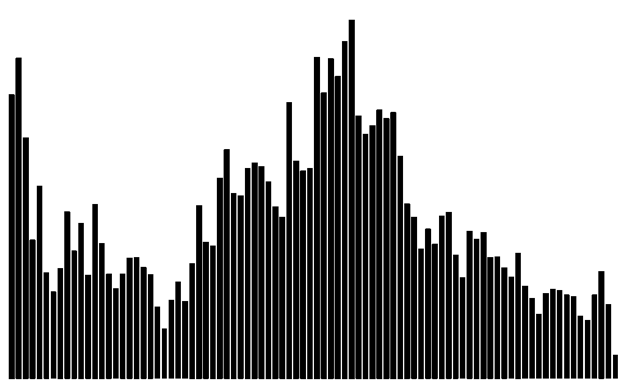

Here we binarize and color negate the image:

```mathematica
img2 = ColorNegate@Binarize[img]
```

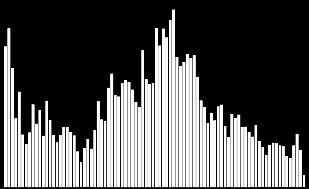

### Extracting morphological components

Here is the result of an application of morphological components finder:

```mathematica
MorphologicalComponents[img2] // Colorize
```

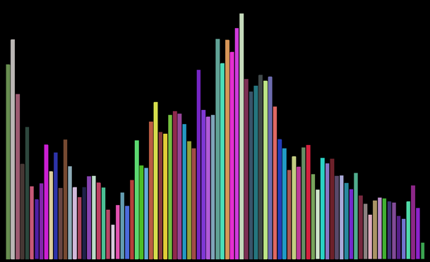

Find the bounding boxes of the morphological components:

```mathematica
aBoxes = SortBy[Association[ComponentMeasurements[img2, "BoundingBox"]], #[[1, 1]] &];
aBoxes = AssociationThread[Range@Length@aBoxes, Values@aBoxes];
aBoxes[[1 ;; 4]]

(*<|1 -> {{14., 6.}, {24., 473.}}, 2 -> {{25., 6.}, {35., 533.}}, 3 -> {{37., 6.}, {47., 402.}}, 4 -> {{48., 6.}, {58., 235.}}|>*)
```

Here we see are all component bounding boxes having the same minimum y-coordinate:

```mathematica
Tally@Values[aBoxes][[All, 1, 2]]

(*{{6., 66}, {7., 22}}*)
```

Find the heights of the rectangles and make a corresponding bar plot:

```mathematica
(*aHeights=Map[#\[LeftDoubleBracket]2,2\[RightDoubleBracket]-#\[LeftDoubleBracket]1,2\[RightDoubleBracket]&,aBoxes];*)
  aHeights = Map[#[[2, 2]] - Min[Values[aBoxes][[All, 1, 2]]] &, aBoxes]; 
   BarChart[aHeights, PlotTheme -> "Detailed", ImageSize -> 900]
```

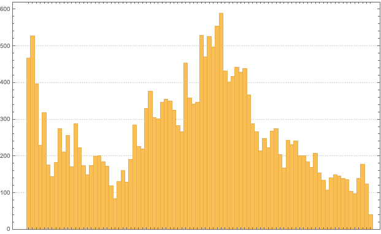

### Rescaling to match real data

The extracted data has to be rescaled to match the reported data. (We can see we have to "calibrate" the extracted data over a few points of the real data.)

Here we remake the plot above to include characteristic points we can use the calibration:

```mathematica
pos = Position[aHeights, Max[aHeights]][[1, 1, 1]];
pos2 = 23;
aHeights2 = aHeights;
Do[aHeights2[p] = Callout[aHeights2[[p]]], {p, {1, pos2, pos}}];
BarChart[aHeights2, GridLines -> {pos, None}, PlotTheme -> "Detailed",ImageSize -> 900]
```

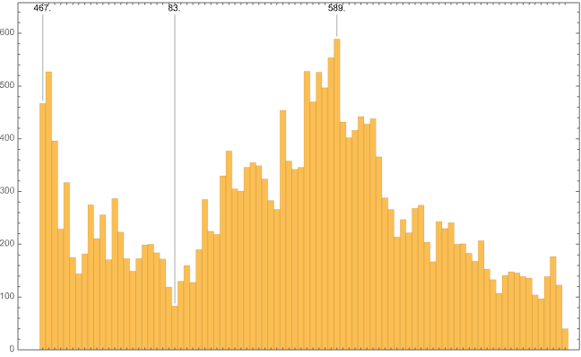

Here are a few characteristic points of the real data

```mathematica
aRealHeights = <|1 -> 544, 7 -> 167, 23 -> 96, pos2 -> 414, pos -> 687|>

(*<|1 -> 544, 7 -> 167, 23 -> 414, 50 -> 687|>*)
```

Rescaling formula:

```mathematica
frm = Rescale[x, {aHeights[pos2], aHeights[pos]}, {aRealHeights[pos2], aRealHeights[pos]}]

(*369.219 + 0.539526 x*)
```

```mathematica
frm = Rescale[x, {0, aHeights[pos]}, {0, aRealHeights[pos]}]

(*0. + 1.16638 x*)
```

Rescaling function:

```mathematica
f = With[{fb = frm /. x -> Slot[1]}, fb &]

(*0. + 1.16638 #1 &*)
```

Apply the rescaling function:

```mathematica
aHeightsRescaled = Ceiling@*f /@ aHeights

(*<|1 -> 545, 2 -> 615, 3 -> 462, 4 -> 268, 5 -> 370, 6 -> 205, 7 -> 168, 8 -> 213, 9 -> 321, 10 -> 247, 11 -> 299, 12 -> 200, 13 -> 335, 14 -> 261, 15 -> 202, 16 -> 174, 17 -> 202, 18 -> 233, 19 -> 234, 20 -> 215, 21 -> 201, 22 -> 139, 23 -> 97, 24 -> 152, 25 -> 187, 26 -> 150, 27 -> 222, 28 -> 333, 29 -> 263, 30 -> 256, 31 -> 385, 32 -> 440, 33 -> 356, 34 -> 352, 35 -> 404, 36 -> 415, 37 -> 408, 38 -> 378, 39 -> 331, 40 -> 311, 41 -> 530, 42 -> 418, 43 -> 399, 44 -> 404, 45 -> 616, 46 -> 549, 47 -> 614, 48 -> 580, 49 -> 647, 50 -> 687, 51 -> 504, 52 -> 469, 53 -> 486, 54 -> 516, 55 -> 500, 56 -> 511, 57 -> 427, 58 -> 336, 59 -> 311, 60 -> 250, 61 -> 289, 62 -> 259, 63 -> 313, 64 -> 320, 65 -> 238, 66 -> 195, 67 -> 284, 68 -> 269, 69 -> 282, 70 -> 234, 71 -> 235, 72 -> 214, 73 -> 196, 74 -> 242, 75 -> 179, 76 -> 156, 77 -> 125, 78 -> 165, 79 -> 173, 80 -> 171, 81 -> 163, 82 -> 159, 83 -> 122, 84 -> 114, 85 -> 163, 86 -> 207, 87 -> 144, 88 -> 47|>*)
```

Here are some easy to check points (post-rescaling):

```mathematica
KeyTake[aHeightsRescaled, {1, 2, 7, Length[aHeightsRescaled]}]

(*<|1 -> 545, 2 -> 615, 7 -> 168, 88 -> 47|>*)
```

### Verification check

Here is the image-extraction, estimated total:

```mathematica
imgTotal = aHeightsRescaled // Total

(*26961*)
```

The estimated total is close to the reported $26882$, with $79$absolute error and$\approx 3$‰ relative error:

```mathematica
reportTotal = 26882;
errAbs = N@Abs[reportTotal - imgTotal]
errRatio = N@Abs[reportTotal - imgTotal]/reportTotal

(*79.*)

(*0.00293877*)
```

**Remark:** The reported total number of casualties can be seen in the original weekly casualties screenshot above.

## Daily data extraction from daily bar chart

Daily casualties extraction is not that easy with technique applied to the weekly casualties plot. One of the reasons is that the daily casualties plot is also a user input interface(on that web page). 

Since we want to get daily data for calibration of (generalized) Lanchester law models we can simply extrapolate the weekly data with daily averages. We can also over-impose in some way the two images (or plots) in order to convince ourselves that we have a faithful enough interpolation.

```mathematica
lsDailyHeightsRescaled = Flatten@Map[Table[#, 7]/7 &, Values[aHeightsRescaled]];
```

```mathematica
BarChart[lsDailyHeightsRescaled, ImageSize -> 900, AspectRatio -> 1/8,PlotTheme -> "Web"]
```

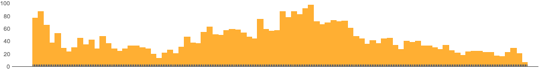

Nevertheless, more faithful daily data can be obtained by image- and LLM processing the tooltips of the weekly casualties chart. (See the next section.)

-------

## Daily data extraction from weekly bar chart tooltips

### Procedure

Here is the procedure outline:

- Take multiple screenshots of the weekly casualties bar chart

    -  A screenshot for each week with the corresponding tooltip shown

    - Make sure all screenshots have the same size (or nearly the same size)

        - E.g. take “window screenshots” 

    - ≈90 screenshots can be taken within 15 minutes

- Crop the screenshots appropriately

- In order to get the tooltip tables only for each screenshot:

    - Color negate and [morphologically binarize](https://reference.wolfram.com/language/ref/MorphologicalBinarize.html)

    - Apply automatic [image crop](https://reference.wolfram.com/language/ref/ImageCrop.html?q=ImageCrop)

- Verify good tooltips table image is obtained for each screenshot (week)

- Do Optical Character Recognition (OCR) over the images 

    - One option is to send them to an Artificial Intelligence (AI) vision service 

        - Like [OpenAI's Vision](https://platform.openai.com/docs/guides/vision)

        - Using an appropriate prompt

    - Another option is to use WL’s [TextRecognize](https://reference.wolfram.com/language/ref/TextRecognize.html?q=TextRecognize)

- Parse or otherwise process the obtained OCR (or AI vision) results

- Verify that each week is reflected in the data

    - It might happen that screenshots are not “a full set“

- Make time series with the obtained data and compare or verify with published data and plots

    - Check are the casualties totals the same, do the plots look similar, etc.

- Make an informative bar chart with tooltips 

    - That resembles the one the screenshots were taken from

    - See the subsection “TL;DR” in the introduction

**Remark:** When using AI vision the prompt engineering might take a few iterations, but not that many.

**Remark:** The few experiments with the WL built-in text recognition produced worse results than using AI vision. Hence, they were not extended further.

### Screenshots ingestion

#### Get screenshot file names

```mathematica
dirNameImport = FileNameJoin[{NotebookDirectory[], "Screenshots-Mediazona-weekly-casualties-histogram"}];
lsFileNames = FileNames["*.png", dirNameImport];
Length[lsFileNames]

(*94*)
```

#### Import images

```mathematica
AbsoluteTiming[
  lsImgs = Import /@ lsFileNames; 
 ]

(*{2.50844, Null}*)
```

Here is one of the imported images:

```mathematica
ImageResize[lsImgs[[14]], 900]
```

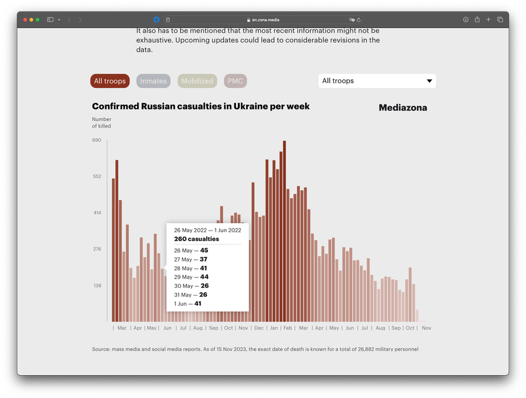

### Definition

Here define a function that is used to batch transform the screenshots:

```mathematica
Clear[MakeEasyToRead];
Options[MakeEasyToRead] = {"BoundingBox" -> Automatic, "BinarizingLimits" -> Automatic};
MakeEasyToRead[img_?ImageQ, opts : OptionsPattern[]] := 
   Block[{boundingBox, mbLimits, img2, img3}, 
    
    boundingBox = OptionValue[MakeEasyToRead, "BoundingBox"]; 
    If[TrueQ[boundingBox === Automatic], boundingBox = {{380, -180}, {280, -280}}]; 
    
    mbLimits = OptionValue[MakeEasyToRead, "BinarizingLimits"]; 
    If[TrueQ[mbLimits === Automatic], mbLimits = {0.2, 0.75}]; 
    
    img2 = ImageTake[img, Sequence @@ boundingBox]; 
    img3 = MorphologicalBinarize[ColorNegate@img2, mbLimits]; 
    ImageCrop[ColorNegate[img3]] 
   ];
```

**Remark:** This function corresponds to the second and third step of the procedure outlined above.

### Batch transform

```mathematica
AbsoluteTiming[
  lsImgTables = MakeEasyToRead[#, "BoundingBox" -> {{380, -100}, {280, -280}}, "BinarizingLimits" -> {0.4, 0.76}] & /@ lsImgs; 
 ]

(*{9.76089, Null}*)
```

```mathematica
MapIndexed[Labeled[#, #2[[1]], Top] &, lsImgTables]
```

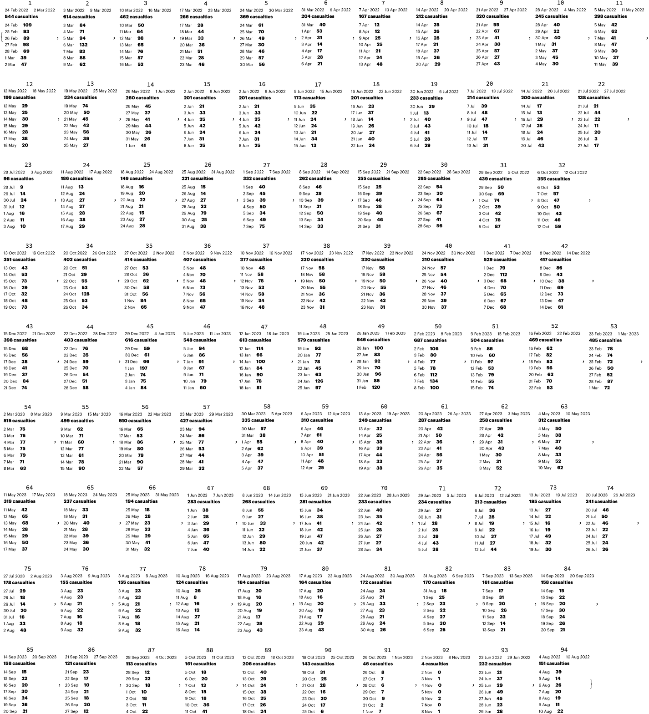

### Batch AI-vision application

Load the package [“LLMVision.m”](https://github.com/antononcube/MathematicaForPrediction/blob/master/Misc/LLMVision.m), [AAp1, AAn1]:

```mathematica
Import["https://raw.githubusercontent.com/antononcube/MathematicaForPrediction/master/Misc/LLMVision.m"]
```


Here we do batch AI vision application, [AAn1], using an appropriate prompt:

```mathematica
h = 11;
AbsoluteTiming[
  lsImgTableJSONs = 
    Table[(
      Echo[Style[{i, i + (h - 1)}, Purple, Bold], "Span:"]; 
      t = 
       LLMVisionSynthesize[{
         "Get the 1) week span, 2) total casualties 3) count per day from the image.\n", 
         "Give the result as a JSON record with keys 'week_span', 'total_casualties', and 'count_per_day'.\n", 
         "Here is example of the JSON record for each image:{\"week_span\": \"10 Mar 2022 - 16 Mar 2022\",\"total_casualties\": 462,\"count_per_day\": {\"10 Mar\": 50,\"11 Mar\": 64,\"12 Mar\": 98,\"13 Mar\": 65,\"14 Mar\": 76,\"15 Mar\": 57,\"16 Mar\": 52}}", 
         LLMPrompt["NothingElse"]["JSON"] 
        }, 
        Take[lsImgTables, {i, UpTo[i + (h - 1)]}], 
        "MaxTokens" -> 1200, "Temperature" -> 0.1]; 
      Echo[t, "OCR:"]; 
      t 
     ), 
     {i, 1, Length[lsImgs], h}]; 
 ]
```


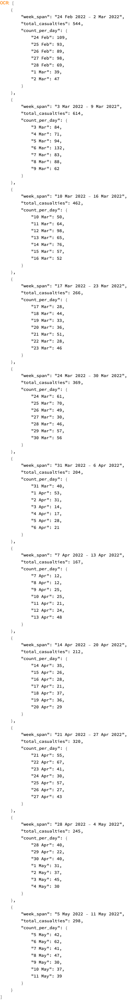


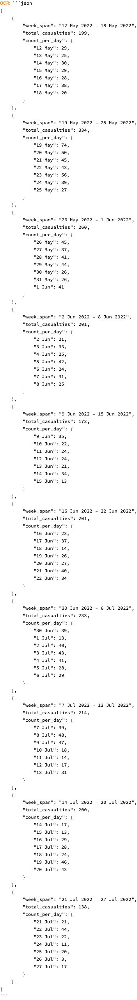


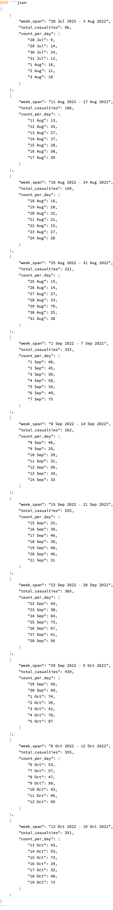


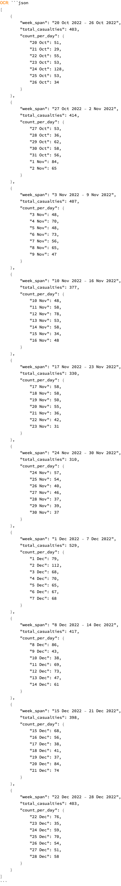


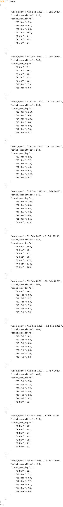


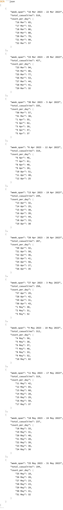


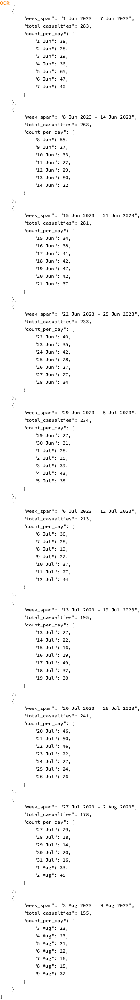


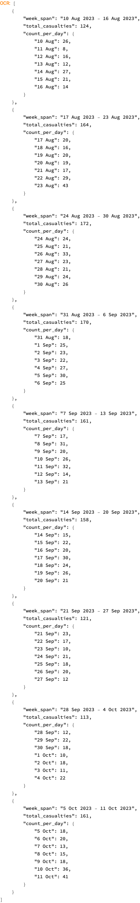


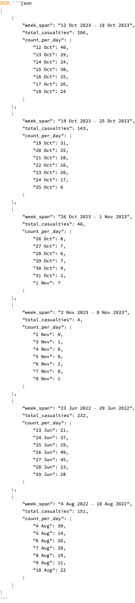

```
(*{260.739, Null}*)
```

### Process AI-vision results

Extract JSONs and import them as WL structures:

```mathematica
pres1 = Map[ImportString[StringReplace[#, {"```json" -> "", "```" -> ""}], "RawJSON"] &, lsImgTableJSONs];
pres1[[1 ;; 2]]

(*{{<|"week_span" -> "24 Feb 2022 - 2 Mar 2022", "total_casualties" -> 544, "count_per_day" -> <|"24 Feb" -> 109, "25 Feb" -> 93, "26 Feb" -> 89, "27 Feb" -> 98, "28 Feb" -> 69, "1 Mar" -> 39, "2 Mar" -> 47|>|>, <|"week_span" -> "3 Mar 2022 - 9 Mar 2022", "total_casualties" -> 614, "count_per_day" -> <|"3 Mar" -> 84, "4 Mar" -> 71, "5 Mar" -> 94, "6 Mar" -> 132, "7 Mar" -> 83, "8 Mar" -> 88, "9 Mar" -> 62|>|>, <|"week_span" -> "10 Mar 2022 - 16 Mar 2022", "total_casualties" -> 462, "count_per_day" -> <|"10 Mar" -> 50, "11 Mar" -> 64, "12 Mar" -> 98, "13 Mar" -> 65, "14 Mar" -> 76, "15 Mar" -> 57, "16 Mar" -> 52|>|>, <|"week_span" -> "17 Mar 2022 - 23 Mar 2022","total_casualties" -> 266, "count_per_day" -> <|"17 Mar" -> 28, "18 Mar" -> 44, "19 Mar" -> 33, "20 Mar" -> 36, "21 Mar" -> 51, "22 Mar" -> 28, "23 Mar" -> 46|>|>, <|"week_span" -> "24 Mar 2022 - 30 Mar 2022","total_casualties" -> 369, "count_per_day" -> <|"24 Mar" -> 61, "25 Mar" -> 70, "26 Mar" -> 49, "27 Mar" -> 30, "28 Mar" -> 46, "29 Mar" -> 57, "30 Mar" -> 56|>|>, <|"week_span" -> "31 Mar 2022 - 6 Apr 2022", "total_casualties" -> 204, "count_per_day" -> <|"31 Mar" -> 40, "1 Apr" -> 53, "2 Apr" -> 31, "3 Apr" -> 14, "4 Apr" -> 17, "5 Apr" -> 28, "6 Apr" -> 21|>|>, <|"week_span" -> "7 Apr 2022 - 13 Apr 2022", "total_casualties" -> 167, "count_per_day" -> <|"7 Apr" -> 12, "8 Apr" -> 12, "9 Apr" -> 25, "10 Apr" -> 25, "11 Apr" -> 21, "12 Apr" -> 24, "13 Apr" -> 48|>|>, <|"week_span" -> "14 Apr 2022 - 20 Apr 2022","total_casualties" -> 212, "count_per_day" -> <|"14 Apr" -> 35, "15 Apr" -> 26, "16 Apr" -> 28, "17 Apr" -> 21, "18 Apr" -> 37, "19 Apr" -> 36, "20 Apr" -> 29|>|>, <|"week_span" -> "21 Apr 2022 - 27 Apr 2022","total_casualties" -> 320, "count_per_day" -> <|"21 Apr" -> 55, "22 Apr" -> 67, "23 Apr" -> 41, "24 Apr" -> 30, "25 Apr" -> 57, "26 Apr" -> 27, "27 Apr" -> 43|>|>, <|"week_span" -> "28 Apr 2022 - 4 May 2022", "total_casualties" -> 245, "count_per_day" -> <|"28 Apr" -> 40, "29 Apr" -> 22, "30 Apr" -> 40, "1 May" -> 31, "2 May" -> 37, "3 May" -> 45, "4 May" -> 30|>|>, <|"week_span" -> "5 May 2022 - 11 May 2022", "total_casualties" -> 298, "count_per_day" -> <|"5 May" -> 42, "6 May" -> 62, "7 May" -> 41, "8 May" -> 47, "9 May" -> 30, "10 May" -> 37, "11 May" -> 39|>|>}, {<|"week_span" -> "12 May 2022 - 18 May 2022", "total_casualties" -> 199, "count_per_day" -> <|"12 May" -> 29, "13 May" -> 25, "14 May" -> 30, "15 May" -> 29, "16 May" -> 28, "17 May" -> 38, "18 May" -> 20|>|>, <|"week_span" -> "19 May 2022 - 25 May 2022","total_casualties" -> 334, "count_per_day" -> <|"19 May" -> 74, "20 May" -> 50, "21 May" -> 45, "22 May" -> 43, "23 May" -> 56, "24 May" -> 39, "25 May" -> 27|>|>, <|"week_span" -> "26 May 2022 - 1 Jun 2022", "total_casualties" -> 260, "count_per_day" -> <|"26 May" -> 45, "27 May" -> 37, "28 May" -> 41, "29 May" -> 44, "30 May" -> 26, "31 May" -> 26, "1 Jun" -> 41|>|>, <|"week_span" -> "2 Jun 2022 - 8 Jun 2022", "total_casualties" -> 201, "count_per_day" -> <|"2 Jun" -> 21, "3 Jun" -> 33, "4 Jun" -> 25, "5 Jun" -> 42, "6 Jun" -> 24, "7 Jun" -> 31, "8 Jun" -> 25|>|>, <|"week_span" -> "9 Jun 2022 - 15 Jun 2022", "total_casualties" -> 173, "count_per_day" -> <|"9 Jun" -> 35, "10 Jun" -> 22, "11 Jun" -> 24,"12 Jun" -> 24, "13 Jun" -> 21, "14 Jun" -> 34, "15 Jun" -> 13|>|>, <|"week_span" -> "16 Jun 2022 - 22 Jun 2022","total_casualties" -> 201, "count_per_day" -> <|"16 Jun" -> 23, "17 Jun" -> 37, "18 Jun" -> 14, "19 Jun" -> 26, "20 Jun" -> 27, "21 Jun" -> 40, "22 Jun" -> 34|>|>, <|"week_span" -> "30 Jun 2022 - 6 Jul 2022", "total_casualties" -> 233, "count_per_day" -> <|"30 Jun" -> 39, "1 Jul" -> 13, "2 Jul" -> 40, "3 Jul" -> 43, "4 Jul" -> 41, "5 Jul" -> 28, "6 Jul" -> 29|>|>, <|"week_span" -> "7 Jul 2022 - 13 Jul 2022", "total_casualties" -> 214, "count_per_day" -> <|"7 Jul" -> 39, "8 Jul" -> 48, "9 Jul" -> 47, "10 Jul" -> 18, "11 Jul" -> 14, "12 Jul" -> 17, "13 Jul" -> 31|>|>, <|"week_span" -> "14 Jul 2022 - 20 Jul 2022","total_casualties" -> 200, "count_per_day" -> <|"14 Jul" -> 17, "15 Jul" -> 13, "16 Jul" -> 29, "17 Jul" -> 28, "18 Jul" -> 24, "19 Jul" -> 46, "20 Jul" -> 43|>|>, <|"week_span" -> "21 Jul 2022 - 27 Jul 2022","total_casualties" -> 138, "count_per_day" -> <|"21 Jul" -> 21, "22 Jul" -> 44, "23 Jul" -> 22, "24 Jul" -> 11, "25 Jul" -> 20, "26 Jul" -> 3, "27 Jul" -> 17|>|>}}*)
```

Make a list of weekly records and make sure to have unique data records:

```mathematica
pres2 = Union[Flatten[pres1]];
Length[pres2]

(*89*)
```

To each record add a WL expression for the extracted week span and sort the records by week start date: 

```mathematica
pres3 = Map[Prepend[#, "WeekSpan" -> Map[DateObject@*StringTrim, StringSplit[#["week_span"], "-"]]] &, pres2];
pres3 = SortBy[pres3, First@#WeekSpan &];
```

Here are the first two records:

```mathematica
pres3[[1 ;; 2]]
```

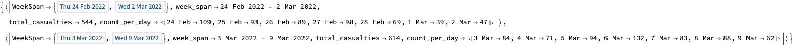

### Verification (all weeks are present)

Summarize the starts of week:

```mathematica
ResourceFunction["RecordsSummary"][Map[First@#WeekSpan &, pres3]]
```

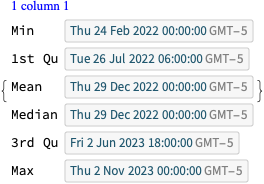

Make sure consistent weekly data is obtained: 

```mathematica
Differences[Sort@Map[First@#WeekSpan &, pres3]] // Tally
```

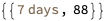

### Plots

Here is bar chart with tooltips based using the extracted data:

```mathematica
BarChart[Tooltip[#["total_casualties"], Labeled[Grid[Map[{#[[1]], " : ", #[[2]]} &, List @@@ Normal[#["count_per_day"]]]], Column[{Style[#["week_span"], Blue], Row[{"total casualties:", Spacer[3], Style[#["total_casualties"], Red]}]}], Top]] & /@ pres3, AxesLabel -> {"Week", "Number of\nkilled"}, ImageSize -> 700]
```

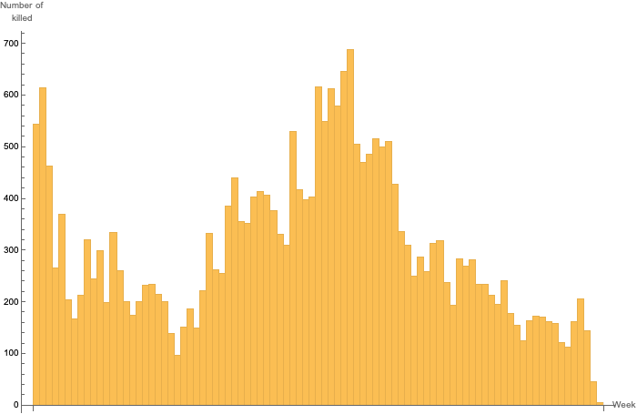

**Remark:** See the subsection “TL;DR” in the introduction for a better plot.

Here we make the corresponding daily casualties time series and plot it:

```mathematica
pres4 = Map[AssociationThread[DateRange @@ #WeekSpan, Values[#["count_per_day"]]] &, pres3];
pres5 = Join @@ pres4;
tsCasualties = TimeSeries[pres5];
DateListPlot[tsCasualties, PlotRange -> All, AspectRatio -> 1/6, FrameLabel -> {"Time", "Number of killed"}, ImageSize -> 1200]
```

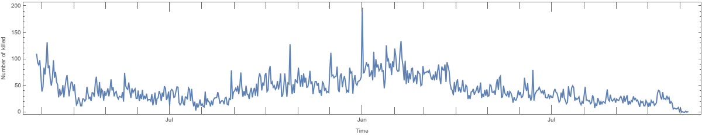

### Verification (with published results)

Here is the total number casualties based on the extracted data:

```mathematica
tooltipTotal = Total@tsCasualties

(*26879*)
```

It compares very well with the total number in the Mediazona’s plot -- $3$ as an absolute error and$\approx 0.1$‰ relative error:

```mathematica
reportTotal = 26882;
errAbs = N@Abs[reportTotal - tooltipTotal]
errRatio = N@Abs[reportTotal - tooltipTotal]/reportTotal

(*3.*)

(*0.000111599*)
```

-------

## Additional comments and remarks

### Good agreement between the two procedures

The two data extraction procedures agree very well over the extracted totals of casualties.

(Also good agreement with the “official” published total -- approximately $3$‰ and $0.1$‰ respectively.)

### LLMVision package

The function LLMVisionSynthesize used above is from the package [“LLMVision.m”](https://github.com/antononcube/MathematicaForPrediction/blob/master/Misc/LLMVision.m), [AAp1, AAn1]. One of the primary reasons to develop the package ["LLMvision.m"](https://github.com/antononcube/MathematicaForPrediction/blob/master/Misc/LLMVision.m) was to use it in workflows like those above -- extracting data from different sources in order to do war simulations.

**Remark:** In the section above LLMVisionSynthesize uses Base64 conversion of images. [OpenAI's Vision documentation advices](https://platform.openai.com/docs/guides/vision/managing-images) to use URLs instead of Base64 images in long conversations.

### Why apply image transformations when using AI vision?

One can ask:

    Why do certain image transformations, or other image preprocessing, if we are using AI vision functionalities? 
Can’t we just apply the AI?!

There are multiple reasons for preprocessing the images that are on different conceptual and operational levels:

- We want to be able to use the same workflow but with different OCR algorithms that are “smaller” and “less AI”

- Images having only the information to be extracted produce more reliable results

    - This obvious when OCR functions are used (like TextRecognize)

    - Less prompt engineering would be needed with AI-vision (most likely)

- It is much cheaper -- both computationally and money-wise -- to use some smaller images for processed conveniently

**Remark:** OpenAI’s vision documentation discusses the money costs, preferred image formats, and reliability -- see [this "Limitations" section](https://platform.openai.com/docs/guides/vision/limitations).

### JSON data

The [extracted daily Mediazona data](https://drive.google.com/file/d/13-c_DYqbgoIbTtiAFyffe8oe2xnCzzyr/view?usp=sharing) was exported to JSON with this command:

```mathematica
(*Export[FileNameJoin[{NotebookDirectory[],"mediaZonaData.json"}],Map[Normal,mediaZonaData]/.d_DateObject:>DateString[d,"ISODate"]]*)
```

-------

## References

### Articles

[MZ1] Mediazona, [Russian casualties in Ukraine](https://en.zona.media/article/2022/05/20/casualties_eng), (2022-2023).

[OAIb1] OpenAI team, ["New models and developer products announced at DevDay"](https://openai.com/blog/new-models-and-developer-products-announced-at-devday) , (2023), [OpenAI/blog](https://openai.com/blog) .

[Wk1] Wikipedia, ["Mediazona"](https://en.wikipedia.org/wiki/Mediazona).

### Functions

[WRIf1] Wolfram Research, Inc., [MorphologicalBinarize](https://reference.wolfram.com/language/ref/MorphologicalBinarize.html), Wolfram Language function,(2010), (updated 2012).

[WRIf2] Wolfram Research, Inc, [ImageCrop](https://reference.wolfram.com/language/ref/ImageCrop.html?q=ImageCrop), Wolfram Language function,(2008), (updated 2021).

[WRIf3] Wolfram Research, Inc, [TextRecognize](https://reference.wolfram.com/language/ref/TextRecognize.html?q=TextRecognize), Wolfram Language function,(2010), (updated 2020).

### Notebooks

[AAn1] Anton Antonov, ["AI vision via Wolfram Language​​"](https://community.wolfram.com/groups/-/m/t/3072318), November 26, (2023), Wolfram Community, STAFF PICKS.

### Packages, paclets

[AAp1] Anton Antonov, [LLMVision.m](https://github.com/antononcube/MathematicaForPrediction/blob/master/Misc/LLMVision.m), Mathematica package, (2023), [GitHub/antononcube](https://github.com/antononcube) .