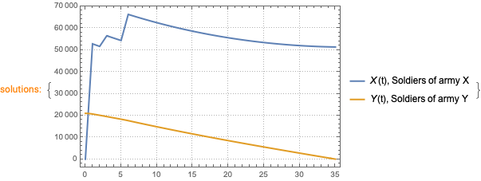
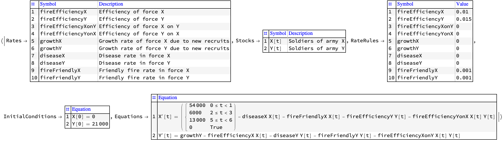
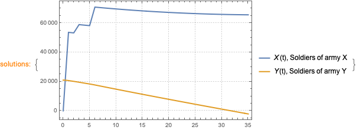

# Обобщенные боевые модели Ланчестера

**Версия 1.0**

Антон Антонов   
[MathematicaForPrediction на WordPress](https://mathematicaforprediction.wordpress.com)   
[SystemModeling на GitHub,](https://github.com/antononcube/SystemModeling)   
октябрь 2023 г.

## Введение

В этом блокноте мы расмотрим обобщенные 
[боевые модели Ланчестера](https://en.wikipedia.org/wiki/Lanchester%27s_laws) и
используем одну из них для моделирования, а также в качестве примера 
откалибруем модель с использованием данными 
[битвы за Иводзиму](https://en.wikipedia.org/wiki/Battle_of_Iwo_Jima) .

**Примечание:** Содержание этого блокнота намеренно носит больше 
теоретически-фундаментальный формат, но оно достаточно кратко и просто как с математической 
точки зрения, так и с точки зрения кода. Цель автора состоит в том, чтобы разработать
аналогичные вычислительные рабочие процессы для (1) боевых действий,
таких как [высадка в Нормандии](https://en.wikipedia.org/wiki/Operation_Overlord) во время
Второй мировой войны в 1944 году, или (2) городских войн, таких как
[Вторая битва за Фаллуджу](https://en.wikipedia.org/wiki/Second_Battle_of_Fallujah), 
Ирак, 2009 год, или [Битва за Бахмут](https://en.wikipedia.org/wiki/Battle_of_Bakhmut), Украина, 2023 год.

Основные вычислительния выполняются с помощью программной
монады [System Dynamics (SD)](https://en.wikipedia.org/wiki/System_dynamics), реализованной в
пакете [«MonadicSystemDynamics»](https://resources.wolframcloud.com/PacletRepository/resources/AntonAntonov/MonadicSystemDynamics/) для Wolfram Language, \[AAp2\]. 
Этот пакет основан на реализации монады, представленной в работе 
[«Монада для эпидемиологического компартментального моделирования»](https://mathematicaforprediction.wordpress.com/2021/01/02/epidemiology-compartmental-modeling-monad/), \[AA1\]. 
Функции предоставляемые пакетом \[AAp2\], имеют префикс «SDMon», что означает «**S**ystem **D**ynamics **Mon**ad».

### Зачем использовать в примерах битву за Иводзиму?

В приведенных ниже примерах используется битва за Иводзиму, так как
это удобно как с точки зрения данных, так и с точки зрения математики.
Вот список причин:

-   Битва важна для вооруженных сил США, поэтому она хорошо
    задокументирована и используется в различных контекстах.

    -   См., например, математические статьи, такие как \[JE1\] и \[RS1\].

-   Можно найти (относительно) хорошо подобранные данные. Такие как:

    -   Размеры вооруженных сил

    -   Продолжительность боя

-   Нам не потребуется:

    -   Думать об отрицательных запасах

    -   Учитывать «волю к победе» и «боевой дух» солдат - 
    японские солдаты сражались до последнего

        -   Все японские содаты попали в плен военнопленными только потому, что их нашли без сознания..

Вот карта вторжения в Иводзиму, подготовленная в феврале 1945 года, \[DR1\]:


### Структура блокнота

-   **Обобщенная модель и ее варианты** - основная теория.

-   Версия программатора **моделей SDMon .**

-   **Прямое моделирование модели** с использованием данных битвы за
    Иводзиму и соответствующих заранее рассчитанных показателей.

-   **Калибровка** - мы должны подтвердить теоретически рассчитанные значения
    расхода ресурсов, используя численные расчеты!

-   **Планы на будущее** - создавайте модели, а не воюйте.

------

## Обобщенные модели

В этом разделе представлен перевод на английский вводных параграфов \[NM1\]. 
(Та же общая модель и структура представлены в \[AS1\].)

В самом общем виде модели Ланчестера можно описать уравнением:

$$\begin{matrix}
\frac{\partial x}{\partial t} & = ax + bxy + cy + d, \\
\frac{\partial y}{\partial t} & = ey + fxy + gx + h
\end{matrix}$$

где:

-   $x$ и $y$ - численность армий противоборствующих сторон

-   $a$ и $e$ определяют норму небоевых потерь

-   $b$ и $f$ определяют норму потерь во время атак по площади

-   $c$ и $g$ являются потерями из-за прямого воздействия противника

-   $d$ и $h$ размер подкрепления или отступающих в резерв войск

Для определения потерь в войнах, реальных или потенциальных, наибольшее
значение имеют следующие четыре модели.

#### **1. Собственно модель _Ланчестера_ ( доступны только коэффициенты $b$ и $f$)**

В этом случае:

-   Число жертв пропорционально количеству встреч между противниками, 
    т.е. количеству сражений между армиями.

-   Количество столкновений между противоборствующими сторонами
    пропорционально числу жертв.

-   Число жертв пропорционально количеству встреч между самими отдельными солдатами
    противоборствующих сторон, что в свою очередь зависит от численности армий:

    -   Произведение численностей противоборствующих сторон: $x \times y$.

-   Данное взаимодействие наиболее актуально, когда обе стороны расположены на общей территории:

    -   Т.е. это может быть партизанская война, репрессии, 
        вражда между двумя народами и т.д.

#### **2. Модель ${\textit {\textbf a}}$ _Осипова_ (коэффициенты $a$ и $e$)**

-   Число жертв пропорционально численности противостоящих сторон.

-   Это может быть классическое военное столкновение, в котором две стороны сталкиваются
    только на линии фронта.

#### **3. Модель ${\textit {\textbf a}}$ _Петерсона_ (коэффициенты $a$ и $e$)**

-   Число жертв определяется размером своей армии.

-   Это может быть модель холодной войны, 
    когда чем больше подводных лодок находится в боевой готовности, тем больше их гибнет.

#### **4. Модель _Брекни_ (коэффициенты $a$ и $f$ или $b$ и $e$)**

-   Потери одной стороны пропорциональны количеству столкновений, 
    а другой - пропорциональны размеру армии противника.

-   Модель была вдохновлена вьетнамской войной и описывает ее вполне удовлетворительно.

    -   Т.е. эта модель хорошо описывает конфликт, 
        в котором одна сторона ведет классическую войну, а другая - партизанскую.

-----

## Модель «жесткость»

Простейшая модель, использующая только термины Осипова, 
обобщенная модель Ланчестера для нее записывается в виде системы уравнений:

$$\begin{matrix}
x\prime(t) = - by(t), \\
y\prime(t) = - ax(t).
\end{matrix}$$

Эта модель является «жесткой моделью», допускающей точное решение. (См.
книгу Арнольда «Жесткие» и «мягкие» математические модели», \[ВА1\].)

Вот решение:

$$\frac{dx}{dy} = \frac{by(t)}{ax(t)},$$

$$ax(t)dx = by(t)dy,$$

$$ax(t)^{2} - by(t)^{2}\text{==}\text{const.}$$

Зависимость численности солдат армий $x$ от численности солдат армии $y$
ложиться на гиперболу, заданную уравнением 
$ax(t)^{2} - by(t)^{2}\text{ == }\text{const}$. 
Война развивается по этой гиперболе, следовательно, она зависит только от начальной точки.

Соответствующее многообразие гипербол отделяется прямой $ax = by$. Если
начальная точка лежит выше этой линии, то гипербола заканчивается на оси
$y$. Это означает, что в ходе войны армия $x$ уменьшается до нуля и
армия $y$ побеждает.

**Примечание.** Обратите внимание: если коэффициенты эффективности $a$ и $b$ не постоянны, 
уравнение $ax = by$ описывает другую кривую в фазовом пространстве.

Вот интерактивный интерфейс, иллюстрирующий свойства простейшей модели:

```mathematica
Manipulate[
 ContourPlot[fX[a, x] x - fY[b, y] y, {x, 0, 10}, {y, 0, 10},
  PlotLegends -> Automatic,
  Contours -> Evaluate[Join[{{0, {Red, Thick}}}, DeleteCases[Table[{i, Blue}, {i, -100, 100, 0.25}], {0 | 0., _}]]],
  ContourShading -> False,
  FrameLabel -> {"x", "y"}],
 {{a, 0.1, "a, efficiency constant X:"}, 0, 1, 0.001, Appearance -> "Open"},
 {{b, 0.2, "b, efficiency constant Y:"}, 0, 1, 0.001, Appearance -> "Open"},
 {{fX, Sqrt[#1 Sqrt[#2]] &, "efficiency function X:"}, 
   {(Sqrt[#1] &) -> "\!\(\*SqrtBox[\(a\)]\)", 
     (Sqrt[#1 Sqrt[#2]] &) -> "\!\(\*SqrtBox[\(a \*SqrtBox[\(x\)]\)]\)"}, 
  ControlType -> SetterBar},
 {{fY, Sqrt[#1] &, "efficiency function Y:"}, 
   {(Sqrt[#1] &) -> "\!\(\*SqrtBox[\(b\)]\)", 
     (Sqrt[#1 Sqrt[#2]] &) -> "\!\(\*SqrtBox[\(b \*SqrtBox[\(y\)]\)]\)"}, 
  ControlType -> SetterBar}]
```


-------

## Модель SDMon

В этом разделе мы рассмотрим общую модель в *простой программной форме.*
Мы *сформируем* ее с помощью пакета 
[«MonadicSystemDynamics»](https://resources.wolframcloud.com/PacletRepository/resources/AntonAntonov/MonadicSystemDynamics/)
, \[AAp2\].

**Примечание.** Лучшей программной формой было бы наличие элементов
уравнения, которые не позволяют запасам (армии) становиться
отрицательными.

**Примечание.** По сравнению с предыдущим разделом, ниже мы
придерживаемся более многословных, но понятных обозначений, которые
помогают моделировать понимание, оценку и улучшения.

Вот численности армий:

```mathematica
aStocks = <|
    X[t] -> "Soldiers of army X", 
    Y[t] -> "Soldiers of army Y" 
   |>;
```

Параметры:

```mathematica
aRates = <|
    fireEfficiencyX -> "Efficiency of force X ", 
    fireEfficiencyY -> "Efficiency of force Y", 
    fireEfficiencyXonY -> "Efficiency of force X on Y", 
    fireEfficiencyYonX -> "Efficiency of force Y on X", 
    growthX -> "Growth rate of force X due to new recruits", 
    growthY -> "Growth rate of force Y due to new recruits", 
    diseaseX -> "Disease rate in force X", 
    diseaseY -> "Disease rate in force Y", 
    fireFriendlyX -> "Friendly fire rate in force X", 
    fireFriendlyY -> "Friendly fire rate in force Y" 
   |>;
```

Кокретные значения для параметров сторон:

```mathematica
aRateRules = <|
     fireEfficiencyX -> 0.01, 
     fireEfficiencyY -> 0.015, 
     fireEfficiencyXonY -> 0.05, 
     fireEfficiencyYonX -> 0.03, 
     growthX -> 0, 
     growthY -> 0, 
     diseaseX -> 0.01, 
     diseaseY -> 0.01, 
     fireFriendlyX -> 0.001, 
     fireFriendlyY -> 0.001 
   |>;
```

Начальные условия (количество солдат):

```mathematica
lsInitConds = {X[0] == 100000, Y[0] == 100000};
```

Взаимодействия Ланчестера (или Лотки-Вольтерры):

```mathematica
lotkaVolterraX = fireEfficiencyYonX*X[t]*Y[t];
lotkaVolterraY = fireEfficiencyXonY*X[t]*Y[t];
```

Взаимодействия Осипова:

```mathematica
osipovX = fireEfficiencyY*Y[t];
osipovY = fireEfficiencyX*X[t];
```

Уравнения:

```mathematica
lsEquations = {
     X'[t] == growthX - diseaseX*X[t] - fireFriendlyX*X[t] - lotkaVolterraX - osipovX, 
     Y'[t] == growthY - diseaseY*Y[t] - fireFriendlyY*Y[t] - lotkaVolterraY - osipovY 
   };
```


Создание модели в виде структуры данных:

```mathematica
model1 = <|
    "Rates" -> aRates, 
    "Stocks" -> aStocks, 
    "RateRules" -> aRateRules, 
    "InitialConditions" -> lsInitConds, 
    "Equations" -> lsEquations 
   |>;
```


Вот так можно отобразить модель в табличном формате:

```mathematica
ModelGridTableForm[model1]
```


------

## Прямая симуляция модели

Здесь мы будем использовать параметры уравнений и данные из статьи \[JE1\].

**Примечание.** Данные в \[JE1\] позже пересматриваются, и новые
вычисления были сделаны почти с теми же результатами. См. \[RS1\].

```mathematica
Clear[growthIwoJimaX];
growthIwoJimaX[t_] := Piecewise[{{54000, 0 <= t < 1}, {6000, 2 <= t < 3}, {13000, 5 <= t < 6}}, 0]
```

Заменим постоянное значение одного из коэффециентов из первого уравнения обобщенной модели 
на функцию, которая отвечает рост численности армии X `GrowthIwoJimaX` 
в зависимости от времени.

```mathematica
model1a = model1 /. growthX -> growthIwoJimaX[t];
```

А теперь ниже мы создадим монадический конвейер. Добавим показатели эффективности огня, 
найденные в \[JE1\], смоделируем систему для определенного количества дней и сражений. 
А затем построим график, показывающий итоговый результа:

```mathematica
sdObj =
  SDMonUnit[]⟹
   SDMonSetSingleSiteModel[model1a]⟹
   SDMonAssignRateRules[<|
     growthY -> 0,
     diseaseX -> 0, diseaseY -> 0,
     fireEfficiencyYonX -> 0, fireEfficiencyXonY -> 0,
     fireEfficiencyX -> 0.0106, fireEfficiencyY -> 0.0544
     |>]⟹
   SDMonAssignInitialConditions[<|X[0] -> 0, Y[0] -> 21000|>]⟹
   SDMonEcho[Style["Model's tabular form:", Bold, Purple, FontSize -> 18, FontFamily -> "Times"]]⟹
   SDMonEchoModelGridTableForm⟹
   SDMonSimulate[35]⟹
   SDMonEcho[Style["Plot simulated stocks evolution:", Bold, Purple, FontSize -> 18, FontFamily -> "Times"]]⟹
   SDMonPlotSolutions[];
```




------

## Калибровка

В этом разделе мы покажем, что, используя такой метод оптимизации, как калибровка, 
мы можем получить те же показатели эффективности, которые можно вывести в 
теоретических рассчетах в \[JE1\] с использованием тех же самых данных.

**Примечание.** Это должно добавить уверенности в использовании `SDMon`, а
поскольку процесс калибровки легко реализовать, то он должен стимулировать
использование `SDMon` для других моделей SD.

Рассмотрим следующие ***объекты калибровки***, которые представляют собой
временные ряды, каждый из которых получен посредством линейной
интерполяции из двух точек данных - начального и конечного значений
количества солдат для каждой армии:

```mathematica
aTargets2 = N@
    <|
     X -> Map[Interpolation[{{0, Total@Map[growthIwoJimaX, Range[0, 36]]}, {35, 51300}}, InterpolationOrder -> 1], Range[0, 35]], 
     Y -> Interpolation[{{0, 21000}, {35, 0}}, InterpolationOrder -> 1] /@ Range[0, 35] 
    |>;
```

```mathematica
ListLinePlot[aTargets2, PlotTheme -> "Detailed"]
```


Вот первая точка численности армии $X$ (солдаты США):

```mathematica
Total@Map[growthIwoJimaX, Range[0, 35]]

(*73000*)
```

```mathematica
sdObj2 = 
   SDMonUnit[]⟹
    SDMonSetSingleSiteModel[model1a]⟹
    SDMonAssignRateRules[<|
      growthY -> 0, 
      diseaseX -> 0, diseaseY -> 0, 
      fireEfficiencyYonX -> 0, fireEfficiencyXonY -> 0 
     |>]⟹
    SDMonAssignInitialConditions[<|X[0] -> 0, Y[0] -> 21000|>]⟹
    SDMonEchoModelGridTableForm;
```




Вот калибровочный конвейер, который определяет:

1.  Целевой временной ряд численности

2.  Параметры для калибровки

3.  Диапазоны параметров, в которых осуществляется поиск калибровочных
    значений

4.  Функция расстояния от вычисленного временного ряда до целевого
    временного ряда

5.  Параметры для
    [NMinimize](https://reference.wolfram.com/language/ref/NMinimize.html)

```mathematica
resCalibration = 
  sdObj2⟹
   SDMonCalibrate[
    "Target" -> KeyTake[aTargets2, {X, Y}], 
    "Parameters" -> <|fireEfficiencyX -> {0, 0.1}, fireEfficiencyY -> {0, 0.1}|>, 
    DistanceFunction -> EuclideanDistance, 
    Method -> {"NelderMead", "PostProcess" -> False}, 
    MaxIterations -> 1000]⟹
   SDMonTakeValue

(*{83614.5, {fireEfficiencyX -> 0.00990159, fireEfficiencyY -> 0.0399577}}*)
```

Отобразим смоделированные размеры армии с использованием калиброванных значений:

```mathematica
sdObj2⟹
  SDMonSimulate[35]⟹
  SDMonAssignRateRules[
   Association@resCalibration[[2]]]⟹
  SDMonEcho[
   Style["Plot simulated stocks evolution with calibrated values:", 
    Bold, Purple, FontSize -> 18, 
    FontFamily -> "Times"]]⟹
  SDMonPlotSolutions[];
```




А теперь используем более «сложную» функцию расстояния, 
которая принимает только известные точки временного ряда:

```mathematica
resCalibration2 = 
  sdObj2⟹
   SDMonCalibrate[
    "Target" -> KeyTake[aTargets2, {X, Y}], 
    "Parameters" -> <|fireEfficiencyX -> {0, 0.1}, fireEfficiencyY -> {0, 0.1}|>, 
    DistanceFunction -> (EuclideanDistance[#1[[{1, -1}]], #2[[{1, -1}]]] &), 
    Method -> {"NelderMead", "PostProcess" -> False}, MaxIterations -> 1000]⟹
   SDMonTakeValue

(*{73000., {fireEfficiencyX -> 0.0106351, fireEfficiencyY -> 0.0547895}}*)
```

**Примечание.** Обратите внимание, что с помощью этой новой функции
калибровочного расстояния мы получаем почти те же результаты, что и
теоретически рассчитанные показатели эффективности в \[JE1\]:

```mathematica
<|fireEfficiencyX -> 0,0106, fireEfficiencyY -> 0,0544|>
```

**Примечание.** Правильные временные ряды калибровки для численности солдат
США $X$ можно получить на веб-странице 
[«Иводзима, взгляд в прошлое»](https://www.recordsofwar.com/iwojimahistory/) 
(Соответствующий блокнот получени данных будет опубликован в ближайшее время).

## Планы на будущее

Вот несколько направлений, в которых можно расширить эту работу:

-   Учет различных типов вооружений и армий

-   Моделирование «воли к победе» и «боевого духа»

    -   Это легко добавить при решении с помощью `NDSolve` и, следовательно, с `SDMon`.

-   Учет запасов оружия, боеприпасов и соответствующих объемов
    поставок

    -   Например, как в \[АА2\].

-   Моделирование влияния войны на экономику и население стран.

-   Моделирование роли пропаганды

-   Создание интерактивных интерфейсов с UI для изменения параметров.

    -   С возможностью выбора сценариев на основе известных сражений.

## Предварительная загрузка

```mathematica
PacletInstall["AntonAntonov/EpidemiologicalModeling"];
PacletInstall["AntonAntonov/MonadicSystemDynamics"];
```

```mathematica
Needs["AntonAntonov`EpidemiologicalModeling`"]
Needs["AntonAntonov`MonadicSystemDynamics`"]
```


## Ссылки

### Статьи

\[AA1\] Антон Антонов, [«Монада для рабочих процессов эпидемиологического компартментального моделирования»](https://mathematicaforprediction.wordpress.com/2021/01/02/epidemiology-compartmental-modeling-monad/), 
(2021), [MathematicaForPrediction на WordPress](https://mathematicaforprediction.wordpress.com/2021/01/02/epidemiology-compartmental-modeling-monad/).

\[AS1\] Андрей Шатырко, Бедрик Пужа, Вероника Новотна, «Сравнительный
анализ и новая область применения боевых моделей Ланчестера», (2018),
Сборник материалов избранных докладов, расширенная версия. Конференция
MITAV-2018, Брно, Чехия, 2018. С.118-133. ISBN 978-80-7582-065-5.

\[JE1\] Дж. Х. Энгель, «Проверка закона Ланчестера», (1953), Журнал Американского общества исследования операций, Vol. 2, № 2. (май 1954 г.), стр. 163--171. ( [ссылка на JSTOR](https://www.jstor.org/stable/166602) .)

\[DR1\] Дж. Дэвид Роджерс, [«Иводзима: самая дорогостоящая битва в американской истории»](https://web.mst.edu/~rogersda/american&military_history/BATTLE-OF-IWO-JIMA.pdf), Missouri S&T. ( [jdavidrogers.net](https://www.jdavidrogers.net/) .)

\[NM1\] Митюков Николай Владимирович. Определение жертв войн с помощью моделей Ланчестера (2009), [Историческая психология и социология истории](https://www.socionauki.ru/journal/ipisi/) .

\[NM1ru\] Н. В. МИТЮКОВ, [ОПРЕДЕЛЕНИЕ ЖЕРТВ ВОЙН ЧЕРЕЗ ЛАНЧЕСТЕРСКИЕ МОДЕЛИ](https://www.socionauki.ru/journal/articles/130365/?sphrase_id=562105),
[Историческая психология и социология истории](https://www.socionauki.ru/journal/ipisi/) 2/2009 122--140.

\[RS1\] Robert W. Samz, ⎡Some Comments on Engel's "A Verification of Lanchester's Law"⎦, (1972), Operations Research, Vol. 20, No. 1 (Jan. - Feb., 1972), pp. 49-52 (4 pages) ([JSTOR link](https://www.jstor.org/stable/169337).)

\[Wk1\] [Lanchester's laws, Wikipedia](https://en.wikipedia.org/wiki/Lanchester%27s_laws).

\[Wk2\] [Battle of Iwo Jima, Wikipedia](https://en.wikipedia.org/wiki/Battle_of_Iwo_Jima).

### Books

\[VA1\] Vladimir I. Arnold, Rigid and soft mathematical models, 2nd ed. (2008), Moscow Center of Continuous Mathematical Education. 
In Russian: Владимир И. Арнольд, "«Жесткие» и «мягкие» математические модели", (2008), М.: МЦНМО, 2014, 32 с. ISBN 978-5-94057-427-9.

### Packages, paclets

\[AAp1\] Anton Antonov,
[EpidemiologicalModeling](https://resources.wolframcloud.com/PacletRepository/resources/AntonAntonov/EpidemiologicalModeling/),
WL paclet, (2023), [Wolfram Language Paclet Repository](https://resources.wolframcloud.com/PacletRepository/).

\[AAp2\] Anton Antonov,
[MonadicSystemDynamics](https://resources.wolframcloud.com/PacletRepository/resources/AntonAntonov/MonadicSystemDynamics/),
WL paclet, (2023), [Wolfram Language Paclet Repository](https://resources.wolframcloud.com/PacletRepository/).

### Repositories

\[AAr1\] Антон Антонов, [Системное моделирование](https://github.com/antononcube/SystemModeling),
(2020-2023), [GitHub/antononcube](https://github.com/antononcube).
